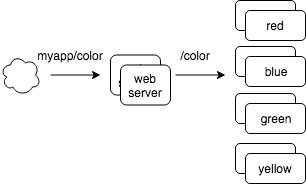
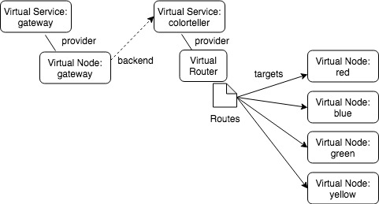

# Routing using HTTP headers and configuring route priority with AWS App Mesh
Author: Shan Kiyani and Shubha Rao

## Intro

AWS App Mesh now supports [header based routing](https://docs.aws.amazon.com/app-mesh/latest/userguide/route-http-headers.html) to manage traffic between services. This is in addition to [path prefix based](https://docs.aws.amazon.com/app-mesh/latest/userguide/route-path.html) and host based routing. You can now create rules and route traffic based on standard and custom HTTP headers and methods, which includes cookie data.  You can also now use [route priorities](https://docs.aws.amazon.com/app-mesh/latest/userguide/routes.html) to control the order of matching rules.

Header-based routing pattern enables using HTTP header information as a basis to determine how to route a request. This might be a standard header, like Accept or Cookie, or it might be a custom header, like *my-own-header-key-value*. Using this, you can create patterns such as session persistence (sticky sessions) or an enhanced experience using "state". Other common use cases to use header based routing includes: 
- A/B testing (e.g.: custom headers using any string)
- Perform canary or blue/green deployments.
- Deliver different pages or user experiences based on categories of devices. (e.g.: using regex in header)
- Handle traffic from different browsers differently (e.g. using user-agent)
- Access restrictions based on IP address or CDN. (e.g. using X-Forwarded-for)

## Using Header based routing

Here is a simple demo application that we will use to showcase some example routing rules. This example is available on [Github AWS App Mesh examples](https://github.com/aws/aws-app-mesh-examples/tree/master/walkthroughs/http-headers-and-priority).  This is the same example used in the demo video below.

### Service view: 



### App Mesh view:

You will need to AWS App Mesh APIs to represent your application’s services and its connection graph. Then, configure a mesh, virtual services (an abstraction of a real service, typically its service discovery name), virtual nodes (logical pointer to a task group or deployment), virtual routers (to handle traffic for one or more virtual services) and routes (to match requests and distribute traffic to its associated virtual nodes).



In a mesh, routing decisions are on client proxies, unlike in load balancers, where it is on the server side. App Mesh configures proxies with required routing rules to handle egress HTTP connections. Route matching happens at the client side proxies associated with virtual nodes. Proxies get route configuration from all their backends. If a backend virtual service is mapped to a virtual router as its provider, the client proxies gets the routes specified at the router. If the backend virtual service is mapped to a virtual node, client proxies get service discovery endpoints of the service. 

## Using Routes

 In this mesh there is a virtual router defined as “color-router.” This virtual router is associated to 4 routes named “color-route-red”, “color-route-blue”, “color-route-green”, and “color-route-yellow”. All routes in this example are based on the same path prefix of “/”.

### Route to match on a range

**color-route-blue** is matching on a range value between [100, 150) - “)” in the range notation means exclusive. Its spec looks like the following: 

```
"spec": {
    "priority": 1000,
    "httpRoute": {
      "match": {
        "prefix": "/",
        "headers": [
          {
            "name": "color_header",
            "match" : {
              "range" : {
                "start": 100,
                "end": 150
              }
            }
          }
        ]
      },
      "action": {
        "weightedTargets": [
          {
            "virtualNode": "blue-node",
            "weight": 1
          }
        ]
      }
    }
  }
```

 For instance, a header value of 100 would match this route while a header value of 150 would not match this route. This route specifies a priority value of 1000 which is the lowest priority value in our set. So this route would only be matched if no other prioritized routes’ headers matched (routes that don't specify a priority can be thought of as having a priority value of 1000 + 1).

### Route with default present match

 color-route-yellow is using the default match of “present.“ Its spec looks like the following:

```
"spec": {
    "httpRoute": {
      "match": {
        "prefix": "/",
        "headers": [
          {
            "name": "color_header"
          }
        ]
      },
      "action": {
        "weightedTargets": [
          {
            "virtualNode": "yellow-node",
            "weight": 1
          }
        ]
      }
    }
  }
```

 color-route-yellow could also specify “present” match explicitly. If this header is present then it will match this route. No priority is specified, which means that it will not take precedence over the lowest priority route in this mesh. In other words think of its priority as 1000 + 1. Currently there is no ordering on match types. This highlights an edge case where multiple unprioritized routes with the same prefix can result in an unspecified behavior. 

For example, looking at blue-route and yellow-route, HTTP requests with a header "color_header: 125" could match either route. Without a priority set on these routes, there is no guarantee on which route this traffic will take, and no guarantee that the choice is consistent over time. By adding explicit route priorities, App Mesh ensures that Envoy will route traffic consistently with your specified priorities.

### Route with a regex match

color-route-green is matching on a regex match. Its spec looks like the following:

```
"spec": {
    "priority": 2,
    "httpRoute": {
      "match": {
        "prefix": "/",
        "headers": [
          {
            "name": "color_header",
            "match" : {
              "regex" : "redor.*"
            }
          }
        ]
      },
      "action": {
        "weightedTargets": [
          {
            "virtualNode": "green-node",
            "weight": 1
          }
        ]
      }
    }
  }
```

 color-route-green matches on the regex string "redor.*". This route has a priority of 2. We’ve selected this regex pattern to provide a case where leveraging a route priority can be useful.

### Route with a prefix match

 color-route-red is matching on a prefix match. Its spec looks like the following:

```
"spec": {
    "priority": 5,
    "httpRoute": {
      "match": {
        "prefix": "/",
        "headers": [
          {
            "name": "color_header",
            "match" : {
              "prefix" : "redorgreen"
            }
          }
        ]
      },
      "action": {
        "weightedTargets": [
          {
            "virtualNode": "red-node",
            "weight": 1
          }
        ]
      }
    }
  }
```

 color-route-red is matching on a prefix value of “redorgreen”. This route has a priority of 1, so it is the route with highest priority (we will adjust this in the demo video and clarify when in the steps below). If the header has a value that is prefixed with this string, then this route will be matched.

## Demo

[](https://www.youtube.com/watch?v=BR3YT7WsGGI)

[Video is also here](https://youtu.be/BR3YT7WsGGI)


1. Send header value of 100, result is blue
2. Send header value of 150, result is yellow (fails the match on blue [100, 150) so it falls back to present match defined in the yellow route)
3. Send header value of 149, result is blue
4. Send header value of “thisvalueisnotinanyroute”, result is yellow. This is because the header name is present which matches the constraint of color-route-yellow which defaults to present match.
5. Send header value of “redorgreen”, result is red. Notice even though this header matches the header constraints of both color-route-green and color-route-red, the priority of color-route-red is 1 which takes precedence over color-route-green which has a priority of 2
6. Update color-route-red to have a lower priority, here we update color-route-red to 5
7. Send header value of “redorgreen”, result is now green. This is because color-route-green has the highest priority value of 2

 This feature is available now in the [AWS App Mesh Preview Channel](https://docs.aws.amazon.com/app-mesh/latest/userguide/preview.html)
 
 If you have any questions or feedback please open an [Issue](https://github.com/aws/aws-app-mesh-roadmap/issues) or email us at aws-appmesh-feedback@amazon.com