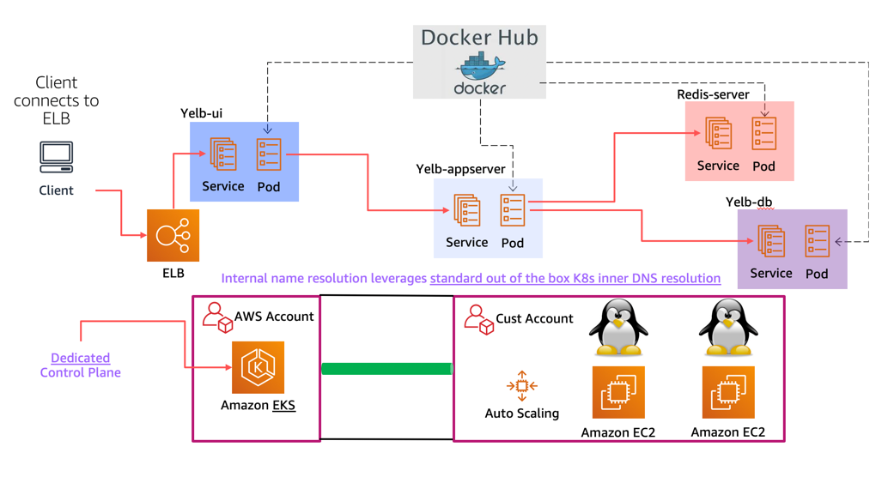

These configurations had been tested Amazon EKS but should in theory work on any Kubernetes deployment. 

Some of these configurations (e.g. *alb*) is AWS specific in that it requires an ALB ingress controller.  

Ideally they should / could be broken into independent configurations for any given module of the app and composed properly at deployment time. 

The picture below shows the layout of the Kubernetes deployment (with a load balancer) on top of EKS:

 

