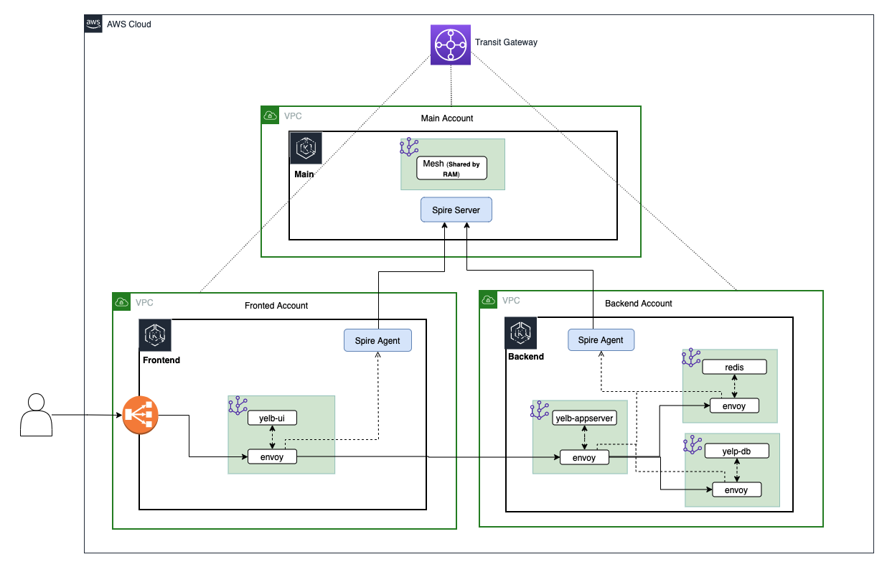
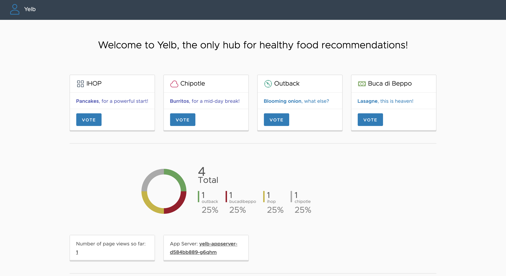

# eks-multi-account-spire

This repo contains all of the necessary artifacts to set up a single SPIRE trust domain across three distinct AWS accounts for mTLS communications using AWS Transit Gateway and AWS App Mesh.  The following architecture diagram illustrates the multi-account structure. 



Three EKS clusters are used in this multi-account environment, the main cluster (eks-cluster-shared) which hosts the SPIRE server, the frontend cluster (eks-cluster-frontend), and the backend cluster (eks-cluster-backend), both of which host the SPIRE agent.  

---

## Prerequisites:

This tutorial assumes that you are using a bash shell. Accordingly, you will need to ensure the following tools are installed:
- The [AWS CLI](https://docs.aws.amazon.com/cli/latest/userguide/cli-chap-install.html)
- The [eksctl](https://docs.aws.amazon.com/eks/latest/userguide/eksctl.html) utility used for creating and managing Kubernetes clusters on Amazon EKS 
- The [kubectl](https://docs.aws.amazon.com/eks/latest/userguide/install-kubectl.html) utility used for communicating with the Kubernetes cluster API server
- The [jq](https://stedolan.github.io/jq/) JSON processor
- The [Helm CLI](https://helm.sh/docs/intro/install/) used for installing [Helm Charts](https://helm.sh/docs/topics/charts/)
---
## Configuring the AWS CLI 
Three [named profiles](https://docs.aws.amazon.com/cli/latest/userguide/cli-configure-profiles.html) are used with the AWS CLI throughout this tutorial to target command executions at different accounts. After you have identified the three account you will use, ensure that you configure the following named profiles with [administrator access](https://docs.aws.amazon.com/IAM/latest/UserGuide/access_policies_job-functions.html#jf_administrator):
- a **shared** profile for the main account that will host the SPIRE server
- a **frontend** profile for the account that will host the frontend resources
- a **backend** profile for the account that will host the backend resources

These profiles are referenced in various commands and helper script throughout this tutorial, so ensure they are named exactly as specified, otherwise certain commands will fail. 

Your AWS CLI credentials and configurations should looks similar to the following example snippet: 

```bash
cat ~/.aws/credentials

[shared]
aws_access_key_id = ...
aws_secret_access_key = ...

[frontend]
aws_access_key_id =  ...
aws_secret_access_key = ...

[backend]
aws_access_key_id = ...
aws_secret_access_key = ...

cat ~/.aws/config

[profile shared]
region = us-east-2
output = json

[profile frontend]
region = us-east-2
output = json

[profile backend]
region = us-east-2
output = json
```
You can alternatively [configure the AWS CLI to use IAM roles](https://docs.aws.amazon.com/cli/latest/userguide/cli-configure-role.html) as well. 

---
## Deploying the CloudFormation Stacks

Start by deploying the shared services CloudFormation stack in the main account using the **shared** profile:

```bash
aws --profile shared cloudformation deploy \
 --template-file eks-multi-account-spire/cf-templates/shared-services-template.json \
 --stack-name eks-cluster-shared-services-stack \
 --capabilities CAPABILITY_NAMED_IAM \
 --parameter-overrides \
   FrontendAccountId=$(aws --profile frontend sts get-caller-identity | jq -r '.Account') \
   BackendAccountId=$(aws --profile backend sts get-caller-identity | jq -r '.Account')

aws --profile shared cloudformation wait stack-create-complete \
 --stack-name ks-cluster-shared-services-stack
```
This CloudFormation stack will create the following resources: 
- a new EKS cluster named **eks-cluster-shared** 
- a managed node group in a new VPC 
- a Transit Gateway named **tgw-shared**
- a Transit Gateway attachment associated with managed node group VPC
- an AWS RAM resource share for the transit gateway named **multi-account-tgw-share**
- a node instance role that has permission to assume cross-account roles **eks-cluster-frontend-access-role** and **eks-cluster-backend-access-role**

Now accept the RAM resource share for the frontend and backend accounts:

```bash 
aws --profile frontend ram accept-resource-share-invitation \
 --resource-share-invitation-arn $(aws --profile frontend ram get-resource-share-invitations \
 | jq -r '.resourceShareInvitations[] | select(.resourceShareName=="multi-account-tgw-share") | .resourceShareInvitationArn')

 aws --profile backend ram accept-resource-share-invitation \
 --resource-share-invitation-arn $(aws --profile backend ram get-resource-share-invitations \
 | jq -r '.resourceShareInvitations[] | select(.resourceShareName=="multi-account-tgw-share") | .resourceShareInvitationArn')
```

**Note:** If you are using accounts that belong to the same AWS Organization and you have [resource sharing](https://docs.aws.amazon.com/ram/latest/userguide/getting-started-sharing.html) enabled, this step is not necessary as principals in your organization get access to shared resources without exchanging invitations.

Next, deploy the frontend CloudFormation stack in the account you have designated to host your frontend resources using the **frontend** profile: 

```bash
aws --profile frontend cloudformation deploy \
 --template-file eks-multi-account-spire/cf-templates/frontend-template.json \
 --stack-name eks-cluster-frontend-stack \
 --capabilities CAPABILITY_NAMED_IAM \
 --parameter-overrides \
   TransitGatewayId=$(aws --profile shared ec2 describe-transit-gateways \
   | jq -r '.TransitGateways[] | select(.Tags[].Value=="tgw-shared").TransitGatewayId') \
   NodeInstanceRoleArn=$(aws --profile shared iam list-roles \
   | jq -r '.Roles[] | select(.RoleName | contains("eks-cluster-shared-services-stack-NodeInstanceRole")).Arn')
```
This CloudFormation stack will create the following resources: 
- a new EKS cluster named **eks-cluster-frontend** 
- a managed node group in a new VPC 
- a Transit Gateway attachment associated with the managed node group VPC
- a role named **eks-cluster-frontend-access-role** with a permission policy that allows it to be assumed by the node instance role from the main account 

Finally, deploy the backend CloudFormation stack in the account you have designated to host your backend resources using the **backend** profile: 

```bash
aws --profile backend cloudformation deploy \
 --template-file eks-multi-account-spire/cf-templates/backend-template.json \
 --stack-name eks-cluster-backend-stack \
 --capabilities CAPABILITY_NAMED_IAM \
 --parameter-overrides \
   TransitGatewayId=$(aws --profile shared ec2 describe-transit-gateways \
   | jq -r '.TransitGateways[] | select(.Tags[].Value=="tgw-shared").TransitGatewayId') \
   NodeInstanceRoleArn=$(aws --profile shared iam list-roles \
   | jq -r '.Roles[] | select(.RoleName | contains("eks-cluster-shared-services-stack-NodeInstanceRole")).Arn')
```
This CloudFormation stack will create the following resources: 
- a new EKS cluster named **eks-cluster-backend** 
- a managed node group in a new VPC 
- a Transit Gateway attachment associated with the managed node group VPC
- a role named **eks-cluster-backend-access-role** with a permission policy that allows it to be assumed by the node instance role from the main account 

---
## Update the kubectl Contexts
Now that the three EKS clusters are created, you will need to update your local **~/.kube/config** file to allow kubectl to communicate with the different API servers. For this, eksctl provides a utility command which allows you to obtain cluster credentials: 

```bash
eksctl --profile shared utils write-kubeconfig --cluster=eks-cluster-shared

eksctl --profile frontend utils write-kubeconfig --cluster=eks-cluster-frontend

eksctl --profile backend utils write-kubeconfig --cluster=eks-cluster-backend
```
By default, this command writes cluster credentials to your local **~/.kube/config** file.

For convenience, make a series of aliases to reference the different cluster [contexts](https://kubernetes.io/docs/concepts/configuration/organize-cluster-access-kubeconfig/#context): 

```bash 
echo export SHARED_CXT=$(kubectl config view -o json \
 | jq -r '.contexts[] | select(.name | contains("eks-cluster-shared")).name') >> ~/.bash_profile

echo export FRONT_CXT=$(kubectl config view -o json \
 | jq -r '.contexts[] | select(.name | contains("eks-cluster-frontend")).name') >> ~/.bash_profile
 
echo export BACK_CXT=$(kubectl config view -o json \
 | jq -r '.contexts[] | select(.name | contains("eks-cluster-backend")).name') >> ~/.bash_profile
 
 . ~/.bash_profile
```
As with the AWS CLI named profiles, these aliases are also referenced in various commands and helper script throughout this tutorial, so ensure they are named exactly as specified, otherwise certain commands will fail. 

---
## Modify the aws-auth ConfigMaps
The [aws-auth ConfigMap](https://docs.aws.amazon.com/eks/latest/userguide/add-user-role.html) allows your nodes to join your cluster and is also used to add [RBAC access](https://kubernetes.io/docs/reference/access-authn-authz/rbac/) to IAM users and roles. For this tutorial, the SPIRE server hosted in the main EKS cluster (**eks-cluster-shared**) requires authorization to get an authentication token for the frontend (**eks-cluster-frontend**) and backend (**eks-cluster-backend**) EKS clusters in order to verify the identities of the hosted SPIRE agents during [node attestation](https://spiffe.io/docs/latest/spire-about/spire-concepts/#node-attestation). To accomplish this, the SPIRE server will assume cross-account IAM roles, and these roles should be added to the aws-auth ConfigMap of the frontend and backend EKS clusters. 

Execute the following commands to edit the frontend aws-auth ConfigMap:
```bash 
kubectl config use-context $FRONT_CXT

kubectl edit cm -n kube-system aws-auth 
```
Add the following to the aws-auth ConfigMap under mapRoles, replacing \<account-id> with the frontend account ID:
```bash 
- groups: 
    - system:masters
  rolearn: arn:aws:iam::<account-id>:role/eks-cluster-frontend-access-role
  username: eks-cluster-frontend-access-role
```

Execute the following commands to edit the backend aws-auth ConfigMap: 
```bash
kubectl config use-context $BACK_CXT

kubectl edit cm -n kube-system aws-auth
```
Add the following to the aws-auth ConfigMap under mapRoles, replacing \<account-id> with the backend account ID:
```bash
- groups: 
    - system:masters
  rolearn: arn:aws:iam::<account-id>:role/eks-cluster-backend-access-role
  username: eks-cluster-backend-access-role
```
**Note:** Press the “i” key to enter insert mode, the “esc” key to exit insert mode, and “:wq!” to save your changes. Also remember to use spaces instead of tabs to implement the appropriate indentation as YAML does not support tabs. 

You can verify the updates by executing the following command: 
```bash
kubectl describe cm -n kube-system aws-auth
```
---
## Create the App Mesh Service Mesh and Cloud Map Namespace
Run the following helper script to install the appmesh-controller in each EKS cluster, create an AWS App Mesh service mesh (**am-multi-account-mesh**) in the main account, share the service mesh with the frontend and backend accounts, and create an AWS Cloud Map namespace (**am-multi-account.local**) in the backend account: 
```bash 
./eks-multi-account-spire/helper-scripts/app_mesh_setup.sh
```
This helper script also creates a **yelb** namespace in each EKS cluster and labels it with the following annotations: 
- mesh=am-multi-account-mesh 
- "appmesh.k8s.aws/sidecarInjectorWebhook"=enabled

These annotations allow the App Mesh sidecar proxy (Envoy) to be automatically injected into pods that are created in the **yelb** namespace. 

The AWS Cloud Map namespace in the backend account is used for service discovery between the **yelb-ui** virtual node that will be created in the frontend account and the **yelb-appserver** virtual service that will be created in the backend account. 

---
## Deploy the SPIRE Server
Earlier, we modified the aws-auth ConfigMap to allow the The SPIRE server in the main EKS cluster (**eks-cluster-shared**) to verify the identities of the SPIRE agents during node attestation. We also need to create copies of the [kubeconfig](https://kubernetes.io/docs/concepts/configuration/organize-cluster-access-kubeconfig/) files for the frontend (**eks-cluster-frontend**) and backend (**eks-cluster-backend**) EKS clusters and make them available to the SPIRE server through ConfigMaps mounted as volumes.  Executing the following helper script will expedite this process: 
```bash
./eks-multi-account-spire/helper-scripts/kubeconfig.sh
```
This script creates a spire namespace within the main EKS cluster and launches two new ConfigMaps in that namespace (**front-kubeconfig** and **back-kubeconfig**) that store copies of the kubeconfig data for the frontend and backend EKS clusters respectively.  Since the SPIRE server will be conducting cross-account cluster authentication, the kubeconfig data also specifies the ARN of the corresponding cross-account IAM role (**eks-cluster-frontend-access-role** and **eks-cluster-backend-access-role**). 

Next, install the SPIRE server using a helm chart:
```bash
helm install appmesh-spire-server eks-multi-account-spire/appmesh-spire-server \
 --namespace spire \
 --set config.trustDomain=am-multi-account-mesh
 ```
 This creates a [StatefulSet](https://kubernetes.io/docs/concepts/workloads/controllers/statefulset/) in the spire namespace of the main EKS cluster and mounts the previously created ConfigMaps (**front-kubeconfig** and **back-kubeconfig**) as volumes. Note that the trust domain is set to the AWS App Mesh service mesh that was created in the main account and shared earlier (**am-multi-account-mesh**).  The SPIRE server container image has also been rebuilt to include the AWS CLI so that it can execute the [eks get-token](https://awscli.amazonaws.com/v2/documentation/api/latest/reference/eks/get-token.html) command for authentication with the frontend and backend EKS clusters. 

Inspect the resources in the spire namespace to verify that the SPIRE server is up and running:
```bash
kubectl get all -n spire 
```
Verify that the trust domain has been properly set:
```bash
kubectl config use-context $SHARED_CXT 

kubectl describe configmap/spire-server -n spire | grep trust_domain
```
Verify that the kubeconfig ConfigMap volumes have been properly mounted: 
```bash
kubectl exec -it spire-server-0 -n spire -- /bin/sh

cat /etc/kubeconfig/frontend/frontend.conf

cat /etc/kubeconfig/backend/backend.conf

exit 
```
By inspecting the spire-server ConfigMap, you’ll also see that the SPIRE server is configured to use the [k8s_psat](https://github.com/spiffe/spire/blob/main/doc/plugin_server_nodeattestor_k8s_psat.md) plugin for node attestation, where the agent reads and provides the signed projected service account token ([PSAT](https://spiffe.io/docs/latest/deploying/configuring/#projected-service-account-tokens)) to the server.
```bash
kubectl describe cm spire-server -n spire

...

NodeAttestor "k8s_psat" {
    plugin_data {
      clusters = {
        "frontend-k8s-cluster" = {
          service_account_whitelist = ["spire:spire-agent-front"]
          kube_config_file = "/etc/kubeconfig/frontend/frontend.conf"
        },
        "backend-k8s-cluster" = {
          service_account_whitelist = ["spire:spire-agent-back"]
          kube_config_file = "/etc/kubeconfig/backend/backend.conf"
        }
      }
    }
  }

...
```
Finally, before moving on to installing the SPIRE agents, make a copy of the spire-bundle ConfigMap, which contains the certificates necessary for the agents to verify the identity of the server when establishing a connection.
```bash
kubectl describe cm spire-bundle -n spire 

kubectl get cm spire-bundle -n spire -o yaml > spire-bundle.yaml 
```

---
## Deploy the SPIRE Agents
Create the spire namespace in the frontend EKS cluster and then create a copy of the spire-bundle ConfigMap:
```bash
kubectl config use-context $FRONT_CXT

kubectl create ns spire 

kubectl apply -f spire-bundle.yaml

kubectl describe cm spire-bundle -n spire 
```
Next, install the spire agent using the provided Helm chart: 
```bash
helm install appmesh-spire-agent eks-multi-account-spire/appmesh-spire-agent \
 --namespace spire \
 --set serviceAccount.name=spire-agent-front \
 --set config.clusterName=frontend-k8s-cluster \
 --set config.trustDomain=am-multi-account-mesh \
 --set config.serverAddress=$(kubectl get pod/spire-server-0 -n spire -o json \
 --context $SHARED_CXT | jq -r '.status.podIP')
 ```
 This creates a [DaemonSet](https://kubernetes.io/docs/concepts/workloads/controllers/daemonset/) in the spire namespace of the frontend EKS cluster and mounts the spire-bundle ConfigMap as a volume to be used for establishing a connection with the SPIRE server. The SPIRE agent is also using the [k8s_psat](https://github.com/spiffe/spire/blob/main/doc/plugin_agent_nodeattestor_k8s_psat.md) plugin for node attestation. Note that the cluster name (**frontend-k8s-cluster**) is arbitrary, but must match the cluster name specified in the SPIRE server configuration for the [k8s_psat](https://github.com/spiffe/spire/blob/main/doc/plugin_server_nodeattestor_k8s_psat.md) plugin, and this same cluster name will also be referenced during [workload registration](https://spiffe.io/docs/latest/deploying/registering/).  The SPIRE server address is being pulled from the Pod (**spire-server-0**) running in the main EKS cluster. 

Inspect the resources in the spire namespace to verify that the SPIRE server is up and running:
```bash
kubectl get all -n spire 
```
Repeat the same process for the backend EKS cluster: 
```bash
kubectl config use-context $BACK_CXT

kubectl create ns spire

kubectl apply -f spire-bundle.yaml 

kubectl describe cm spire-bundle -n spire 

helm install appmesh-spire-agent eks-multi-account-spire/appmesh-spire-agent \
 --namespace spire \
 --set serviceAccount.name=spire-agent-back \
 --set config.clusterName=backend-k8s-cluster \
 --set config.trustDomain=am-multi-account-mesh \
 --set config.serverAddress=$(kubectl get pod/spire-server-0 -n spire -o json \
 --context $SHARED_CXT | jq -r '.status.podIP')

kubectl get all -n spire 
```
---
## Register Nodes and Workloads with the SPIRE Server:
At this point you are ready to register node and workload entries with the SPIRE server:  
```bash
kubectl config use-context $SHARED_CXT 

./eks-multi-account-spire/helper-scripts/register_server_entries.sh
```
Inspect the registered entries by executing the following command: 
```bash
kubectl exec -n spire spire-server-0 -- /opt/spire/bin/spire-server entry show
```
You’ll notice that there are two entries associated with the SPIRE agent DaemonSets running in the frontend and backend EKS clusters:
```bash
...

Entry ID      : a8335da4-a99b-4f28-acbf-cdc4ac916c66
SPIFFE ID     : spiffe://am-multi-account-mesh/ns/spire/sa/spire-agent-back
Parent ID     : spiffe://am-multi-account-mesh/spire/server
TTL           : 3600
Selector      : k8s_psat:agent_ns:spire
Selector      : k8s_psat:agent_sa:spire-agent-back
Selector      : k8s_psat:cluster:backend-k8s-cluster

Entry ID      : 53b4a20c-9174-4f7b-a3c7-153643fb91b3
SPIFFE ID     : spiffe://am-multi-account-mesh/ns/spire/sa/spire-agent-front
Parent ID     : spiffe://am-multi-account-mesh/spire/server
TTL           : 3600
Selector      : k8s_psat:agent_ns:spire
Selector      : k8s_psat:agent_sa:spire-agent-front
Selector  

...
```
The other entries for the frontend and backend workloads (the **yelb-ui**, **yelb-appserver**, **yelb-db**, and **redis-server**) reference the [SPIFFE ID](https://spiffe.io/docs/latest/spiffe-about/spiffe-concepts/#spiffe-id) of the corresponding SPIRE agent as the value of their Parent ID.  The SPIRE server will share the list of registered entries with the SPIRE agents, who will then use it to determine what SPIFFE Verifiable Identity Document ([SVID](http://spiffe%20verifiable%20identity%20document%20%28svid%29/)) it needs to issue to a particular workload, assuming there’s a match with the specified namespace, service account, pod label, and container name combination. 

**Note:** an SVID is not a new type of public key certificate, rather it defines a standard in which an X.509 certificates are used. for more information, see the [SVID specification](https://github.com/spiffe/spiffe/blob/master/standards/X509-SVID.md). 

---
## Deploy the mesh resources and the Yelb Application:

You can now deploy the AWS App Mesh [virtual nodes](https://docs.aws.amazon.com/app-mesh/latest/userguide/virtual_nodes.html) and [virtual services](https://docs.aws.amazon.com/app-mesh/latest/userguide/virtual_services.html) into the backend EKS cluster: 
```bash
kubectl config use-context $BACK_CXT

kubectl apply -f eks-multi-account-spire/mesh/yelb-redis.yaml 

kubectl apply -f eks-multi-account-spire/mesh/yelb-db.yaml 

kubectl apply -f eks-multi-account-spire/mesh/yelb-appserver.yaml
```
Using the yelb-appserver virtual node as an example, notice that it has a tls section defined for both its inbound listeners and its outbound backends.  
```bash
...

listeners:
    - portMapping:
        port: 4567
        protocol: http
      tls:
        mode: STRICT
        certificate:
          sds:
            secretName: spiffe://am-multi-account-mesh/yelbapp
        validation:
          trust:
            sds:
              secretName: spiffe://am-multi-account-mesh
          subjectAlternativeNames:
            match:
              exact:
              - spiffe://am-multi-account-mesh/frontend          
...

backends:
    - virtualService:
       virtualServiceRef:
          name: yelb-db
    - virtualService:
       virtualServiceRef:
          name: redis-server
  backendDefaults:
    clientPolicy:
      tls:
        enforce: true
        mode: STRICT
        certificate:
          sds:
            secretName: spiffe://am-multi-account-mesh/yelbapp
        validation:
          trust:
            sds:
              secretName: spiffe://am-multi-account-mesh
          subjectAlternativeNames:
            match:
              exact:
              - spiffe://am-multi-account-mesh/yelbdb
              - spiffe://am-multi-account-mesh/redis

...
```
The certificate section under tls specifies the Envoy Secret Discovery Service ([SDS](https://www.envoyproxy.io/docs/envoy/latest/configuration/security/secret)) secret name, which in this case is the SPIFFE ID that was assigned to the workload. The validation section includes the SPIFFE ID of the trust domain, which is the AWS App Mesh service mesh created earlier (**am-multi-account-mesh**), and a list of  SPIFFE IDs associated with trusted services that are used as subject alternative name matchers for verifying presented certificates. 

Now deploy the backend Kubernetes resources that the virtual nodes point to:  
```bash
kubectl apply -f eks-multi-account-spire/yelb/resources_backend.yaml
```
Before deploying the frontend virtual node and virtual service for the yelb-ui service, run the following helper script to retrieve the ARN of the yelb-appserver virtual service from the backend EKS cluster and create an updated version of the yelb-ui virtual node spec file (**yelb-ui-final.yaml**) containing that ARN as a reference.
```bash
kubectl config use-context $FRONT_CXT

cd eks-multi-account-spire
./helper-scripts/replace_vs_arn.sh
```
Now deploy the AWS App Mesh components and the Kubernetes resources for the yelb-ui frontend: 
```bash
kubectl apply -f mesh/yelb-ui-final.yaml

kubectl apply -f yelb/resources_frontend.yaml
```
To test out the yelb-ui service, retrieve the load balancer DNS name and navigate to it in your browser:
```bash
kubectl get service yelb-ui -n yelb -o json \
 | jq -r '.status.loadBalancer.ingress[].hostname'
```
You should see the following page load and be able to vote on the different restaurant options, verifying that the yelb-ui service is communicating with the yelb-appserver: 



---
## Verify the mTLS Authentication:

After executing a few voting transactions via the yelb-ui, you can now move on to validating the mTLS authentication that take place between each of the Envoy proxies for the underlying services. For this, will query the [administrative interface](https://www.envoyproxy.io/docs/envoy/latest/operations/admin) that Envoy exposes. 

Start by switching to the frontend context and setting an environment variable to hold the name of the yelb_ui pod:
```bash
kubectl config use-context $FRONT_CXT

FRONT_POD=$(kubectl get pod -l "app=yelb-ui" -n yelb \
 --output=jsonpath={.items..metadata.name}) 
 
echo $FRONT_POD
```
Check that the Secret Discovery Service (SDS) is active and healthy:
```bash
kubectl exec -it $FRONT_POD -n yelb -c envoy \
 -- curl http://localhost:9901/clusters | grep -E \
 '(static_cluster_sds.*cx_active|static_cluster_sds.*healthy)'
 ```
You should see one active connection, indicating that the SPIRE agent is correctly configured as an SDS provider for the Envoy proxy, along with a healthy status.
```bash
static_cluster_sds_unix_socket::/run/spire/sockets/agent.sock::cx_active::1
static_cluster_sds_unix_socket::/run/spire/sockets/agent.sock::health_flags::healthy
```
Next, check the loaded TLS certificate:
```bash
kubectl exec -it $FRONT_POD -n yelb -c envoy \
 -- curl http://localhost:9901/certs
```
This certificate is the X509-SVID issued to the yelb-ui service. You should see two SPIFFE IDs listed, that of the trust domain in the ca_cert section, and that of the yelb-ui service listed in the cert_chain section. 

**Note:** App Mesh doesn't store the certificates or private keys that are used for mutual TLS authentication. Instead, Envoy stores them in memory.

Now check the SSL handshakes:
```bash
kubectl exec -it $FRONT_POD -n yelb -c envoy \
 -- curl http://localhost:9901/stats | grep ssl.handshake
```
An SSL handshake is executed between the yelb-ui ** and the ** yelb-appserver ** (via the Envoy proxies) for every API request triggered. For example, when the Yelb webpage is loaded, two GET requests (**/getvotes** and **/getstats**) trigger the execution of two corresponding SSL handshakes.  

You can repeat the same process using the backend context to examine mTLS authentication for the other services. For example, you can also check the SSL handshakes for the yelb-appserver: 
```bash
kubectl config use-context $BACK_CXT
 
BE_POD_APP=$(kubectl get pod -l "app=yelb-appserver" -n yelb \
 --output=jsonpath={.items..metadata.name})
 
kubectl exec -it $BE_POD_APP -n yelb -c envoy \
 -- curl http://localhost:9901/stats | grep ssl.handshake
 ```
 In this case, you’ll notice that additional SSL handshakes are being executed with the yelb-db and yelb-redis services as well.
 ```bash
cluster.cds_egress_am-multi-account-mesh_redis-server_yelb_tcp_6379.ssl.handshake: 3
cluster.cds_egress_am-multi-account-mesh_yelb-db_yelb_tcp_5432.ssl.handshake: 58
listener.0.0.0.0_15000.ssl.handshake: 13
```
---
## Cleanup:
Run the following helper script to delete all resources in the yelb and spire namespaces, the Cloud Map am-multi-account.local namespace, the App Mesh am-multi-account-mesh service mesh, the appmesh-controller, and the appmesh-system namespace. 
```bash
./eks-multi-account-spire/helper-scripts/cleanup.sh
```
Now delete the CloudFormation stacks, starting with the frontend account: 
```bash
aws --profile frontend cloudformation delete-stack \
  --stack-name eks-cluster-frontend-stack

aws --profile frontend cloudformation wait stack-delete-complete \
 --stack-name eks-cluster-frontend-stack
```
Delete the backend CloudFormation stack:
```bash
aws --profile backend cloudformation delete-stack \
  --stack-name eks-cluster-backend-stack

aws --profile backend cloudformation wait stack-delete-complete \
 --stack-name eks-cluster-backend-stack
```
Finally, delete the shared services CloudFormation stack:
```bash
aws --profile shared cloudformation delete-stack \
  --stack-name eks-cluster-shared-services-stack 
```
---