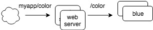
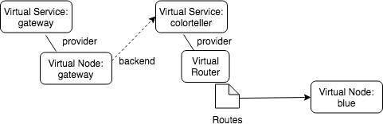
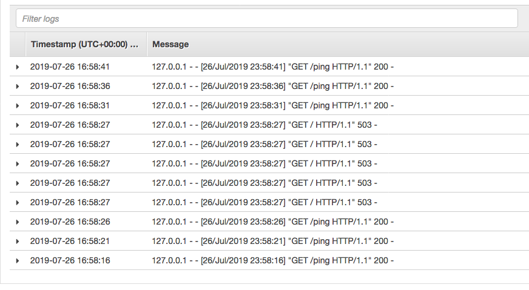

# Customers can configure HTTP Retry Policy using AWS App Mesh
Author: Karim Zaytoun and Shubha Rao

## Intro

Today, we are adding the ability to retry connections between services using AWS App Mesh based on HTTP error codes. 

Your application often requires making network calls to other services. 

In this architecture, planning to handling transient faults is a common practice. Retry of a request can help overcome short lived network blips or short term interruptions on the server services due to redeployments, like Service Unavailable (HTTP Error code 503), Gateway Timeout (HTTP Error code 504). 

In this blog, we will demonstrate how to configure this using AWS App Mesh, using a sample application.

## Using Retry policy

Here is a simple demo application that we will use to showcase an example of retry policies. This example is available on [Github AWS App Mesh examples](https://github.com/aws/aws-app-mesh-examples/tree/master/walkthroughs/howto-http-retries).

### Service view: 



### App Mesh view:

You will need AWS App Mesh APIs to represent your application’s services and its connection graph. Then, configure a mesh, virtual services (an abstraction of a real service, typically its service discovery name), virtual nodes (logical pointer to a task group or deployment), virtual routers (to handle traffic for one or more virtual services) and routes (to match requests and distribute traffic to its associated virtual nodes).

 

## Configuring a retry policy

 In this mesh there is a virtual router defined as “color-router.” This virtual router is associated to one route named “color-route-blue”.

**color-route-blue** defines a retry policy that attempts to retry and route traffic 4 times when it receives an http server error. Each retry attempt has a timeout of 2 seconds to complete. Its spec looks like the following: 

```
"spec": {
    "priority": 1000,
    "httpRoute": {
      "match": {
        "prefix": "/",
      },
      "action": {
        "weightedTargets": [
          {
            "virtualNode": "blue-node",
            "weight": 100
          }
        ]
      },
      "retryPolicy": {
         "maxRetries": 4,
         "perRetryTimeout": {
           "unit": "s",
           "value": 2
         },
         "httpRetryEvents": [
           "server-error"
         ]
       }
    }
  }
```

 For instance, if a request to blue-node resulted in any server error status codes as “500 or 503”, a retry attempt would be made with a max limit of 4 retries.

### Validating the retry policy

 To test the retry policy, you can use curl and send a request to your frontend service url as follow:

```
curl <frontend Service URL> -H "statuscode-header: 503" -v
```

 Frontend service will receive a status code "503" from blue node and retries the request 4 times based on the retry policy.
 
 Check the logs for blue node to verify that it received 4 requests showing the retry:
 
 
 
 For more information on this feature, refer AWS App Mesh Documentation [AWS App Mesh Documentation](https://docs.aws.amazon.com/app-mesh/latest/userguide/route-retry-policy.html)
 
 If you have any questions or feedback please open an [Issue](https://github.com/aws/aws-app-mesh-roadmap/issues) or email us at aws-appmesh-feedback@amazon.com
