**Contents**

- [App Mesh Walkthrough: Deploy the Color App on ECS](#app-mesh-walkthrough-deploy-the-color-app-on-ecs)
  - [Overview](#overview)
  - [Prerequisites](#prerequisites)
  - [Deploy infrastructure for the application](#deploy-infrastructure-for-the-application)
    - [Create the VPC and other core Infrastructure](#create-the-vpc-and-other-core-infrastructure)
    - [Create an App Mesh](#create-an-app-mesh)
    - [Create compute resources](#create-compute-resources)
    - [Review](#review)
  - [Deploy the application](#deploy-the-application)
    - [Configure App Mesh resources](#configure-app-mesh-resources)
    - [Deploy services to ECS](#deploy-services-to-ecs)
      - [Deploy images to ECR for your account](#deploy-images-to-ecr-for-your-account)
      - [Deploy gateway and colorteller services](#deploy-gateway-and-colorteller-services)
      - [Test the application](#test-the-application)
  - [Shape traffic](#shape-traffic)
    - [Apply traffic rules](#apply-traffic-rules)
    - [Monitor with AWS X-Ray](#monitor-with-aws-x-ray)
  - [Review](#review)
  - [Summary](#summary)
  - [Resources](#resources)

# App Mesh Walkthrough: Deploy the Color App on ECS

> Note: this walkthrough is also available as a [Medium article](https://medium.com/containers-on-aws/aws-app-mesh-walkthrough-deploy-the-color-app-on-amazon-ecs-de3452846e9d).

This is a walkthrough for deploying the [Color App] that was demonstrated at the AWS App Mesh launch. The following diagram shows the programming model of this simple application. This is literally the programmer's perspective of the application:

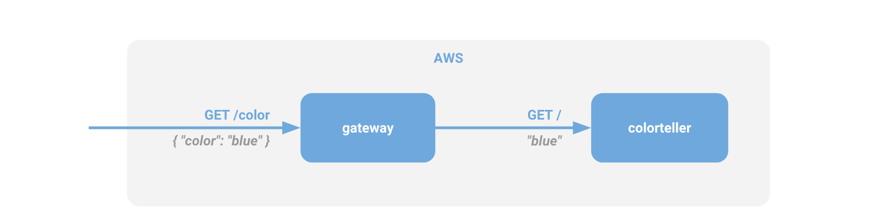
<p align="center"><b><i>Figure 1.</i></b> Programmer perspective of the Color App.</p>

In this post, we'll walk through creating specific abstract resources for [AWS App Mesh] that will be used to drive a physical mapping to compute resources to stitch our application together, providing us with fine-grained control over traffic routing and end-to-end visibility of application request traffic and performance. The following diagram represents the abstract view in terms of App Mesh resources:

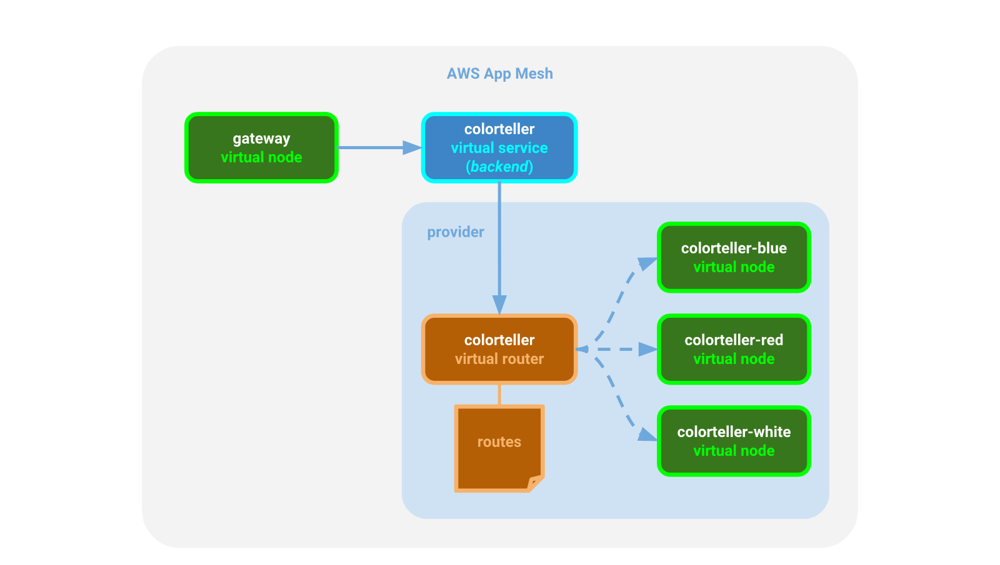
<p align="center"><b><i>Figure 2.</i></b> App Mesh perspective of the Color App.</p>

Finally, we deploy the services that will comprise our application to ECS along with proxy sidecars for each service task; these proxies will be governed by App Mesh to ensure our application traffic behaves according to our specifications.

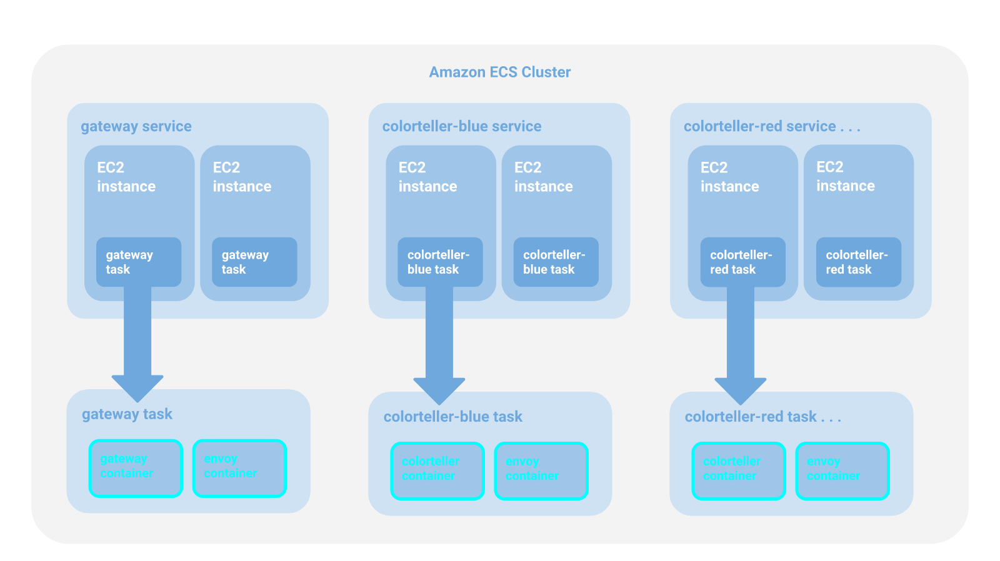
<p align="center"><b><i>Figure 3.</i></b> Amazon ECS perspective of the Color App.</p>

The key thing to note about this is that actual routing configuration is completely transparent to the application code. The code deployed to the `gateway` containers will send requests to the DNS name `colorteller.demo.local`, which we configure as a virtual service in App Mesh. App Mesh will push updates to all of the `envoy` sidecar containers to ensure traffic is sent directly to colorteller tasks running on EC2 instances according to the routing rules we specify through App Mesh configuration. There are no physical routers at runtime since App Mesh route rules are transformed to Envoy configuration and pushed directly to the `envoy` sidecars within the dependent tasks.


## Overview

This brief guide will walk you through deploying the Color App on ECS. The process has been automated using shell scripts and [AWS CloudFormation] templates to make deployment straightforward and repeatable.

Core networking and compute infrastructure doesn't need to be recreated each time the Color App is redeployed. Since this can be time-consuming, resource provisioning is divided among a layered set of CloudFormation stack templates.

The App Mesh deployment is also partitioned into different stages as well, but this is for for performance reasons, since App Mesh operations are very fast. The reason for the separation is simply so that you can tear down the Color App without tearing down the demo mesh in case you also have other sample apps running in it for experimentation.

**Infrastructure templates:**

* `examples/infrastructure/vpc.yaml` - creates the VPC and other core networking resources needed for the application that are independent of the specific compute environment (e.g., ECS) provisioned for the cluster.
* `examples/infrastructure/ecs-cluster.yaml` - creates the compute instances and other resources needed for the cluster.
* `examples/infrastructure/appmesh-mesh.yaml` - creates an App Mesh mesh.

**Application resource templates:**

* `examples/apps/colorapp/ecs/ecs-colorapp.yaml` - deploys application services and related resources for the Color App.
* `examples/apps/colorapp/ecs/servicemesh/appmesh-colorapp.yaml` - creates mesh resources for the Color App.

Each template has a corresponding shell script with a `.sh` extension that you run to create the CloudFormation stack. These scripts rely on the following environment variable values that must be exported before running:

* `AWS_PROFILE` - your AWS CLI profile (set to `default` or a named profile).
* `AWS_DEFAULT_REGION` - set to one of the [Currently available AWS Regions for App Mesh].
* `ENVIRONMENT_NAME` - will be applied as a prefix to deployed CloudFormation stack names.
* `MESH_NAME` - name to use to identify the mesh you create.
* `SERVICES_DOMAIN` - the base namespace to use for service discovery (e.g., `cluster.local`).
* `KEY_PAIR_NAME` - your [Amazon EC2 Key Pair].
* `ENVOY_IMAGE` - see [Envoy Image] for latest recommended Docker image.
* `COLOR_GATEWAY_IMAGE` - Docker image for the Color App gateway microservice in ECR.
* `COLOR_TELLER_IMAGE` - Docker image for the Color App colorteller microservice in ECR.

See below for more detail and to see where these environment variables are used.

## Prerequisites

1. You have version `1.16.124` or higher of the [AWS CLI] installed.

2. Your [AWS CLI configuration] has a `default` or named profile and valid credentials.

3. You have an [Amazon EC2 Key Pair] that you can use to log into your EC2 instances.

4. You have cloned the [github.com/aws/aws-app-mesh-examples] repo and changed directory to the project root.

5. You have [jq] installed.

6. You have Docker installed.

## Deploy infrastructure for the application

### Create the VPC and other core Infrastructure

An [Amazon Virtual Private Cloud] (VPC) is a virtual network that provides isolation from other applications in other networks running on AWS. The following CloudFormation template will be used to create a VPC for our mesh sample applications:

`examples/infrastructure/vpc.yaml`

Set the following environment variables:

* `AWS_PROFILE` - your AWS CLI profile (set to `default` or a named profile)
* `AWS_DEFAULT_REGION` - set to one of the [Currently available AWS Regions for App Mesh]
* `ENVIRONMENT_NAME` - will be applied as a prefix to deployed CloudFormation stack names

Run the `vpc.sh` script to create a VPC for the application in the Region that you specify. It will be configured for two availability zones (AZs); each AZ will be configured with a public and a private subnet. You can choose from one of the [Currently available AWS Regions for App Mesh]. The deployment will include an [Internet Gateway] and a pair of [NAT Gateways] (one in each AZ) with default routes for them in the private subnets.

***Create the VPC***

`examples/infrastructure/vpc.sh`

```
$ export AWS_PROFILE=default
$ export AWS_DEFAULT_REGION=us-west-2
$ export ENVIRONMENT_NAME=DEMO
$ ./examples/infrastructure/vpc.sh
...
+ aws --profile default --region us-west-2 cloudformation deploy --stack-name DEMO-vpc --capabilities CAPABILITY_IAM --template-file examples/infrastructure/vpc.yaml --parameter-overrides EnvironmentName=DEMO 
Waiting for changeset to be created..
Waiting for stack create/update to complete
...
Successfully created/updated stack - DEMO-vpc
$
```

### Create an App Mesh

A service mesh is a logical boundary for network traffic between services that reside in it. [AWS App Mesh] is a managed service mesh control plane. It provides application-level networking support, standardizing how you control and monitor your services across multiple types of compute infrastructure. The following CloudFormation template will be used to create an App Mesh mesh for our application:

`examples/infrastructure/appmesh-mesh.yaml`

We will use the same environment variables from the previous step, plus one additional one (`MESH_NAME`), to deploy the stack.

* `MESH_NAME` - name to use to identify the mesh you create (we'll use `appmesh-mesh`)

***Create the mesh***

`examples/infrastructure/appmesh-mesh.sh`

```
$ export AWS_PROFILE=default
$ export AWS_DEFAULT_REGION=us-west-2
$ export ENVIRONMENT_NAME=DEMO
$ export MESH_NAME=appmesh-mesh
$ ./examples/infrastructure/appmesh-mesh.sh
...
+ aws --profile default --region us-west-2 cloudformation deploy --stack-name DEMO-appmesh-mesh --capabilities CAPABILITY_IAM --template-file /home/ec2-user/projects/aws/aws-app-mesh-examples/examples/infrastructure/appmesh-mesh.yaml --parameter-overrides EnvironmentName=DEMO AppMeshMeshName=appmesh-mesh

Waiting for changeset to be created..
Waiting for stack create/update to complete
...
Successfully created/updated stack - DEMO-appmesh-mesh
$
```

At this point we have now created our networking resources (VPC and App Mesh), but we have not yet deployed:

* compute resources to run our services on
* mesh configuration for our services
* actual services

### Create compute resources

Our infrastructure requires compute resources to run our services on. The following CloudFormation template will be used to create these resources for our application:

`examples/infrastructure/ecs-cluster.yaml`

In addition to the previously defined environment variables, you will also need to export the following:

* `SERVICES_DOMAIN` - the base namespace to use for service discovery (e.g., `cluster.local`). For this demo, we will use `demo.local`. This means that the gateway virtual service will send requests to the colorteller virtual service at `colorteller.demo.local`.
* `KEY_PAIR_NAME` - your [Amazon EC2 Key Pair] to log into your EC2 instances.

***Create the ECS cluster***

`examples/infrastructure/ecs-cluster.sh`

```
$ export AWS_PROFILE=default
$ export AWS_DEFAULT_REGION=us-west-2
$ export ENVIRONMENT_NAME=DEMO
$ export SERVICES_DOMAIN=demo.local
$ export KEY_PAIR_NAME=tony_devbox2
$ ./examples/infrastructure/ecs-cluster.sh
...
+ aws --profile default --region us-west-2 cloudformation deploy --stack-name DEMO-ecs-cluster --capabilities CAPABILITY_IAM --template-file /home/ec2-user/projects/aws/aws-app-mesh-examples/examples/infrastructure/ecs-cluster.yaml --parameter-overrides EnvironmentName=DEMO KeyName=tony_devbox2 ECSServicesDomain=demo.local ClusterSize=5

Waiting for changeset to be created..
Waiting for stack create/update to complete
...
Successfully created/updated stack - DEMO-ecs-cluster
$
```

### Review

You have provisioned the infrastructure you need. You can confirm in the AWS Console that all of your CloudFormation stacks have been successfully deployed. You should see something like this:

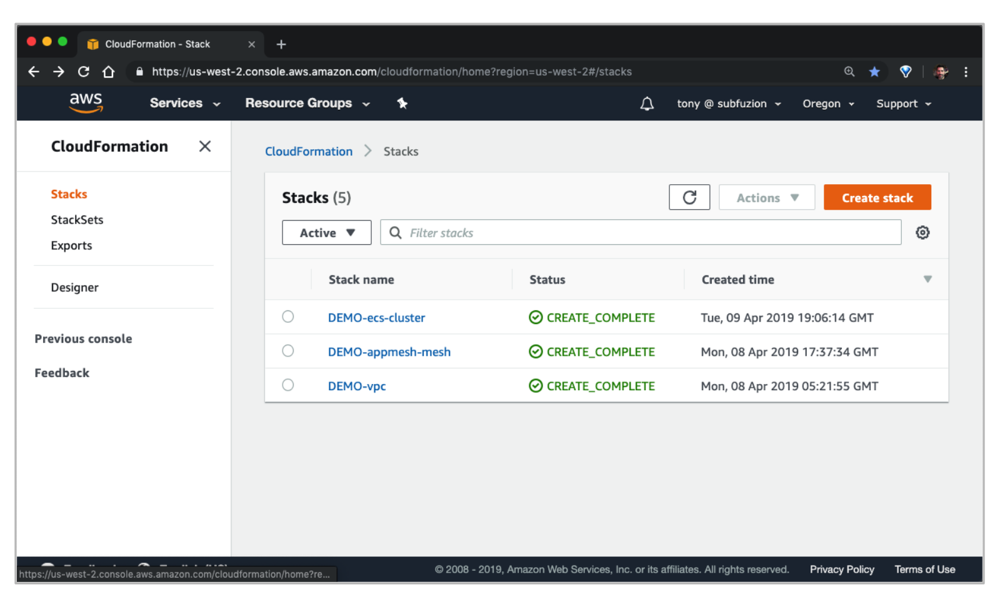
<p align="center"><b><i>Figure 4.</i></b> AWS Cloudformation stack deployments.</p>

You can also confirm status with the AWS CLI:

```
$ aws cloudformation describe-stacks --stack-name DEMO-vpc --query 'Stacks[0].StackStatus'
"CREATE_COMPLETE"

$ aws cloudformation describe-stacks --stack-name DEMO-appmesh-mesh --query 'Stacks[0].StackStatus'
"CREATE_COMPLETE"

$ aws cloudformation describe-stacks --stack-name DEMO-ecs-cluster --query 'Stacks[0].StackStatus'
"CREATE_COMPLETE"
```

## Deploy the application

Now that we've deployed our infrastructure resources for testing, let's configure our mesh and finally deploy the Color App.

### Configure App Mesh resources

We will now add our mesh resource definitions so that when we finally deploy our services, the mesh will be able to push computed configuration down to each Envoy proxy running as a sidecar for each ECS task. The following CloudFormation template will be used to create these resources for our application:

`examples/apps/colorapp/servicemesh/appmesh-colorapp.yaml`

We will use the same exported environment variables created previously. No new environment variables are needed.

***Create mesh resources***

`examples/apps/colorapp/servicemesh/appmesh-colorapp.sh`

```
$ export AWS_PROFILE=default
$ export AWS_DEFAULT_REGION=us-west-2
$ export ENVIRONMENT_NAME=DEMO
$ export SERVICES_DOMAIN=demo.local
$ export MESH_NAME=appmesh-mesh
$ ./examples/apps/colorapp/servicemesh/appmesh-colorapp.sh
...
+ aws --profile default --region us-west-2 cloudformation deploy --stack-name DEMO-appmesh-colorapp --capabilities CAPABILITY_IAM --template-file /home/ec2-user/projects/aws/aws-app-mesh-examples/examples/apps/colorapp/servicemesh/appmesh-colorapp.yaml --parameter-overrides EnvironmentName=DEMO ServicesDomain=demo.local AppMeshMeshName=appmesh-mesh

Waiting for changeset to be created..
Waiting for stack create/update to complete
...
Successfully created/updated stack - DEMO-appmesh-colorapp
$
```

> Note: The App Mesh resources for the Color App are created before the app itself is deployed in the final step. This is so Envoy, which is deployed as a task sidecar, is able to communicate with the Envoy Management Service. If the mesh itself isn't configured first, the sidecar will remain unhealthy and eventually the task will fail.

### Deploy services to ECS

#### Deploy images to ECR for your account

Before you can deploy the services, you will need to deploy the images that ECS will use for `gateway` and `colorteller` to ECR image repositories for your account. You can build these images from source under the `examples/apps/colorteller/src` and push them using the provided deploy scripts after you create repositories for them on ECR, as shown below.

In addition to the previously defined environment variables, you will also need to export the following:

* `AWS_ACCOUNT_ID` - Your AWS account ID.

Deploy the `gateway` image:

```
# from the colorapp repo root...
$ cd examples/apps/colorapp/src/gateway
$ aws ecr create-repository --repository-name=gateway
$ export COLOR_GATEWAY_IMAGE=$(aws ecr describe-repositories --repository-names=gateway --query 'repositories[0].repositoryUri' --output text)
$ export AWS_ACCOUNT_ID=<replace-with-your-account-id>
$ ./deploy.sh
+ '[' -z 226767807331.dkr.ecr.us-west-2.amazonaws.com/gateway ']'
+ docker build -t 226767807331.dkr.ecr.us-west-2.amazonaws.com/gateway .
Sending build context to Docker daemon      1MB
Step 1/11 : FROM golang:1.10 AS builder
...
+ docker push 226767807331.dkr.ecr.us-west-2.amazonaws.com/gateway
The push refers to repository [226767807331.dkr.ecr.us-west-2.amazonaws.com/gateway]
latest: digest: sha256:ce597511c0230af89b81763eb51c808303e9ef8e1fbe677af02109d1f73a868c size: 528
$
```

Deploy the `colorteller` image:

```
# from the colorapp repo root....
$ cd examples/apps/colorapp/src/colorteller
$ aws ecr create-repository --repository-name=colorteller
$ export COLOR_TELLER_IMAGE=$(aws ecr describe-repositories --repository-names=colorteller --query 'repositories[0].repositoryUri' --output text)
$ ./deploy.sh
+ '[' -z 226767807331.dkr.ecr.us-west-2.amazonaws.com/colorteller:latest ']'
+ docker build -t 226767807331.dkr.ecr.us-west-2.amazonaws.com/colorteller:latest .
Sending build context to Docker daemon  996.4kB
Step 1/11 : FROM golang:1.10 AS builder
...
+ docker push 226767807331.dkr.ecr.us-west-2.amazonaws.com/colorteller:latest
The push refers to repository [226767807331.dkr.ecr.us-west-2.amazonaws.com/colorteller]
69856c2b3fc6: Layer already exists
latest: digest: sha256:ca16f12268907c32140586e2568e2032f04b95d70b373c00fcee7e776e2d29da size: 528
$
```
NOTE: If you run into issues with certificate because GO PROXY server is not reachable, you can turn it off by setting the environment variable `GO_PROXY` as below and then build the gateway and colorteller images
```
export GO_PROXY=direct
```


#### Deploy gateway and colorteller services

We will now deploy our services on ECS. The following CloudFormation template will be used to create these resources for our application:

`examples/apps/colorapp/ecs/ecs-colorapp.yaml`

In addition to the previously defined environment variables, you will also need to export the following:

* `ENVOY_IMAGE` - see [Envoy Image] for latest recommended Docker image.
* `COLOR_GATEWAY_IMAGE` - Docker image for the Color App gateway microservice (see example below).
* `COLOR_TELLER_IMAGE` - Docker image for the Color App colorteller microservice (see example below).
  
***Deploy services to ECS***

> Note: Make sure you install [jq] prior to running the ecs-colorapp.sh script

`examples/apps/colorapp/ecs/ecs-colorapp.sh`

```
$ export AWS_PROFILE=default
$ export AWS_DEFAULT_REGION=us-west-2
$ export ENVIRONMENT_NAME=DEMO
$ export SERVICES_DOMAIN=demo.local
$ export KEY_PAIR_NAME=tony_devbox2
$ export ENVOY_IMAGE=12345689012.dkr.ecr.us-west-2.amazonzaws.com/appmesh-envoy:version
$ export COLOR_GATEWAY_IMAGE=$(aws ecr describe-repositories --repository-names=gateway --query 'repositories[0].repositoryUri' --output text)
$ export COLOR_TELLER_IMAGE=$(aws ecr describe-repositories --repository-names=colorteller --query 'repositories[0].repositoryUri' --output text)
$ ./examples/apps/colorapp/ecs/ecs-colorapp.sh
...
Waiting for changeset to be created..
Waiting for stack create/update to complete
...
Successfully created/updated stack - DEMO-ecs-colorapp
$
```

#### Test the application

Once we have deployed the app, we can curl the frontend service (`gateway`). To get the endpoint, run the following code:

```
$ colorapp=$(aws cloudformation describe-stacks --stack-name=$ENVIRONMENT_NAME-ecs-colorapp --query="Stacks[0
].Outputs[?OutputKey=='ColorAppEndpoint'].OutputValue" --output=text); echo $colorapp
http://DEMO-Publi-M7WJ5RU13M0T-553915040.us-west-2.elb.amazonaws.com

$ curl $colorapp/color
{"color":"red", "stats": {"red":1}}
```

> TIP: If you don't see a new line after curl responses, you might want to use `curl -w "\n"` or add `-w "\n"` to `$HOME/.curlrc`.

## Shape traffic

Currently, the app equally distributes traffic among blue, red, and white colorteller virtual nodes through the default virtual router configuration. If you run the curl command a few times, you might see something similar to this: 

```
$ curl $colorapp/color
{"color":"red", "stats": {"blue":0.33,"red":0.36,"white":0.31}}
```

In the following section, we'll walk through how to modify traffic according to the rules we set.

### Apply traffic rules

Open up `examples/apps/colorapp/servicemesh/appmesh-colorapp.yaml` in an editor. In the definition for `ColorTellerRoute`, you will see the spec for an HttpRoute (around line 123):

```
  ColorTellerRoute:
    Type: AWS::AppMesh::Route
    DependsOn:
      - ColorTellerVirtualRouter
      - ColorTellerWhiteVirtualNode
      - ColorTellerRedVirtualNode
      - ColorTellerBlueVirtualNode
    Properties:
      MeshName: !Ref AppMeshMeshName
      VirtualRouterName: colorteller-vr
      RouteName: colorteller-route
      Spec:
        HttpRoute:
          Action:
            WeightedTargets:
              - VirtualNode: colorteller-white-vn
                Weight: 1
              - VirtualNode: colorteller-blue-vn
                Weight: 1
              - VirtualNode: colorteller-red-vn
                Weight: 1
          Match:
            Prefix: "/"
```

Modify the `HttpRoute` block of code to look like this:

```
        HttpRoute:
          Action:
            WeightedTargets:
              - VirtualNode: colorteller-black-vn
                Weight: 1
          Match:
            Prefix: "/"
```

Apply the update:

```
./examples/apps/colorapp/servicemesh/appmesh-colorapp.sh
...
+ aws --profile default --region us-west-2 cloudformation deploy --stack-name DEMO-appmesh-colorapp
--capabilities CAPABILITY_IAM --template-file /ho me/ec2-user/projects/aws/aws-app-mesh-examples/examples/apps/colorapp/servicemesh/appmesh-colorapp.yaml --parameter-overrides EnvironmentName=DEMO Se
rvicesDomain=demo.local AppMeshMeshName=appmesh-mesh
...
Waiting for changeset to be created..
Waiting for stack create/update to complete
Successfully created/updated stack - DEMO-appmesh-colorapp
```

Now, when you curl the app, you will see a response like the following:

```
$ curl $colorapp/color
{"color":"black", "stats": {"black":0.19,"blue":0.28,"red":0.27,"white":0.26}}

...
# repeated calls will increase the stats for black since it's the only color response now
{"color":"black", "stats": {"black":0.21,"blue":0.28,"red":0.26,"white":0.25}}
```

The following query will clear the stats history:

```
$ curl $colorapp/color/clear
cleared

# now requery
$ curl $colorapp/color
{"color":"black", "stats": {"black":1}}
```

Since there are no other colors for the histogram, that's all you will see, no matter how many times you repeat the query.

Simulate A/B tests with a 50/50 split between red and blue:

Edit `examples/apps/colorapp/servicemesh/appmesh-colorapp.yaml`

```
            WeightedTargets:
              - VirtualNode: colorteller-red-vn
                Weight: 1
              - VirtualNode: colorteller-blue-vn
                Weight: 1
```

Any integer proportion will work for the weights (as long as the sum doesn't exceed 100), so you could have used `1` or `5` or `50` for each to reflect the `1:1` ratio that distributes traffic equally between the two colortellers. App Mesh will use the ratio to compute the actual percentage of traffic to distribute along each route. You can see this in the App Mesh console when you inspect the route:

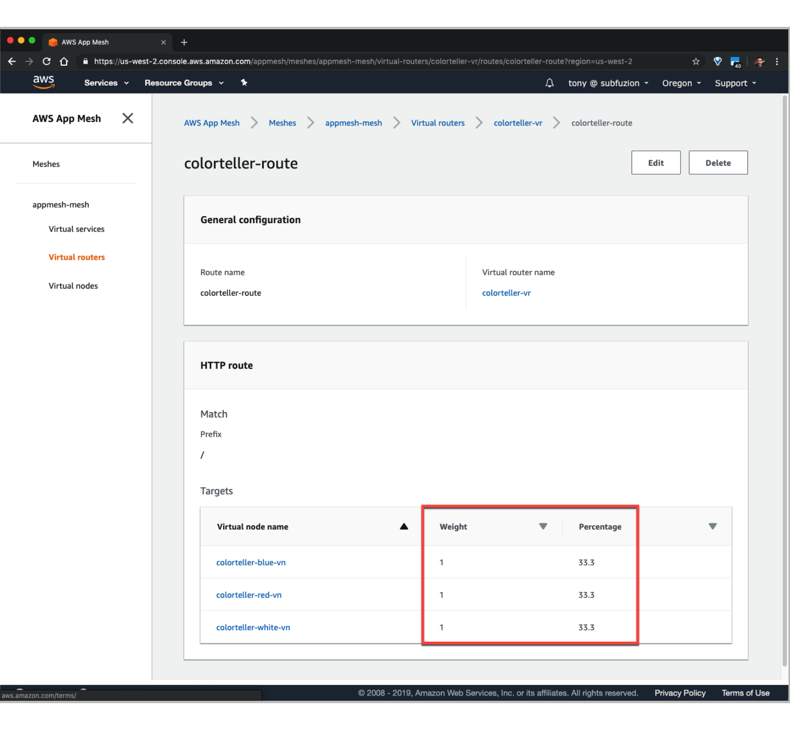
<p align="center"><b><i>Figure 5.</i></b> Route weighted targets.</p>

In a similar manner, you can perform canary tests or automate rolling updates based on healthchecks or other criteria using weighted targets to have fine-grained control over how you shape traffic for your application.

To prepare for the next section, go ahead and update the HttpRoute to send all traffic to the blue colorteller.

`examples/apps/colorapp/servicemesh/appmesh-colorapp.yaml`
```
            WeightedTargets:
              - VirtualNode: colorteller-blue-vn
                Weight: 1
```

Deploy the update and then clear the color history for fresh histograms:

```
$ ./examples/apps/colorapp/servicemesh/appmesh-colorapp.sh
...
$ curl $colorapp/color/clear
cleared
```

In the next section we'll experiment with updating the route using the App Mesh console and analyze results visually with AWS X-Ray.

### Monitor with AWS X-Ray

[AWS X-Ray] helps us to monitor and analyze distributed microservice applications through request tracing, providing an end-to-end view of requests traveling through the application so we can identify the root cause of errors and performance issues. We'll use X-Ray to provide a visual map of how App Mesh is distributing traffic and inspect traffic latency through our routes.

When you open the AWS X-Ray console the view might appear busier than you expected due to traffic from automated healthchecks. We'll create a filter to focus on the traffic we're sending to the application frontend (colorgateway) when we request a color on the `/color` route.

The Color App has already been instrumented for X-Ray support and has created a [Segment] called "Default" to provide X-Ray with request context as it flows through the gateway service. Click on the "Default" button (shown in the figure below) to create a group to filter the visual map:

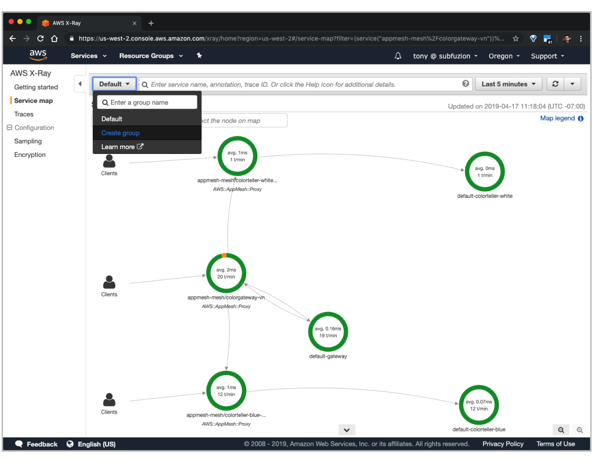
<p align="center"><b><i>Figure 6.</i></b> Creating a group for the X-Ray service map.</p>

Choose "Create group", name the group "color", and enter an expression that filters on requests to the `/color` route going through the `colorgateway-vn` node:

```
(service("appmesh-mesh/colorgateway-vn")) AND http.url ENDSWITH "/color"
```

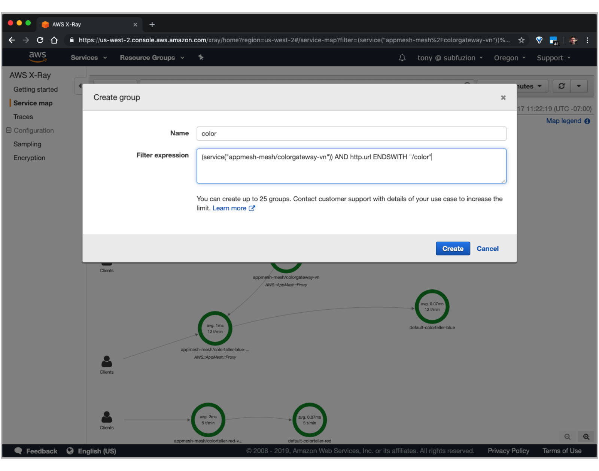
<p align="center"><b><i>Figure 6.</i></b> Adding a group filter expression.</p>

After creating the group, make sure to select it from the dropdown to apply it as the active filter. You should see something similar to the following:


<p align="center"><b><i>Figure 7.</i></b> Analyzing the X-Ray service map.</p>

What the map reveals is that:

1. Our color request first flows through an Envoy proxy for ingress to the gateway service.
2. Envoy passes the request to the gateway service, which makes a request to a colorteller.
3. The gateway service makes a request to a colorteller service to fetch a color. Egress traffic also flows through the Envoy proxy, which has been configured by App Mesh to route 100% of traffic for the colorteller to colorteller-blue.
4. Traffic flows through another Envoy proxy for ingress to the colorteller-blue service.
5. Envoy passes the request to the colorteller-blue service.

Click on the `colorgateway-vn` node to display Service details:

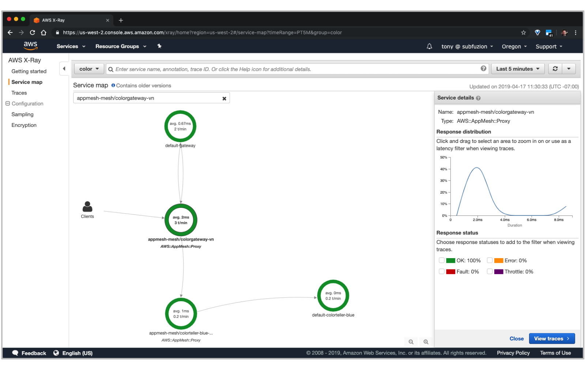
<p align="center"><b><i>Figure 8.</i></b> Tracing the colorgateway virtual node.</p>

We can see an overview on latency and that 100% of the requests are "OK".

Click on the "View traces" button, then click on an ID under "Trace list":

This provides us with a detailed view about how traffic flowed for the request.

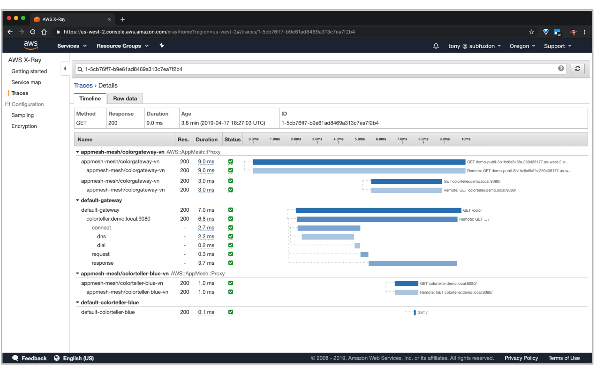
<p align="center"><b><i>Figure 9.</i></b> Analyzing a request trace.</p>

If we log into the console for AWS App Mesh and drill down into "Virtual routers" for our mesh, we'll see that currently the HTTP route is configured to send 100% of traffic to the `colorteller-blue` virtual node.

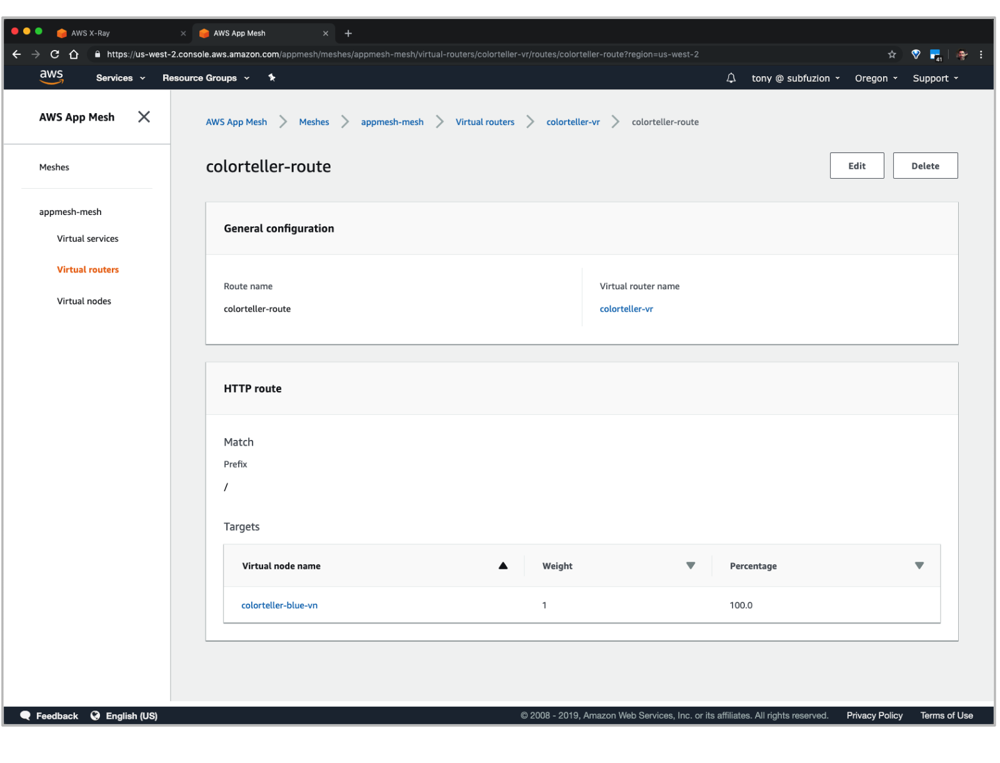
<p align="center"><b><i>Figure 10.</i></b> Routes in the App Mesh console.</p>

Click the "Edit" button to modify the route configuration:

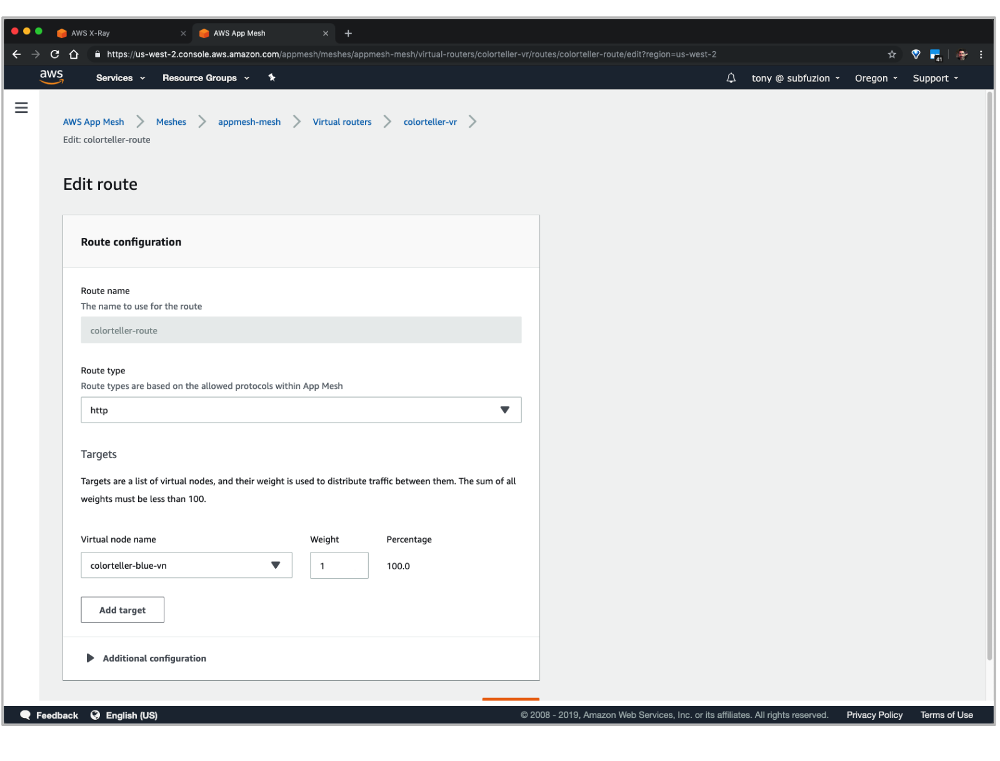
<p align="center"><b><i>Figure 11.</i></b> Editing a route.</p>

Click the "Add target" button, choose "colorteller-red-vn", and set the weight to `1`.

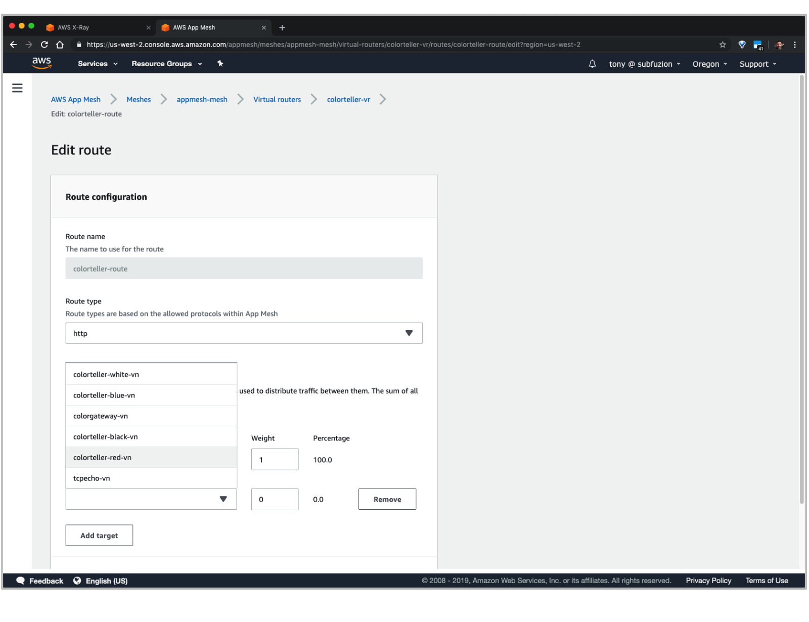
<p align="center"><b><i>Figure 12.</i></b> Adding another virtual node to a route.</p>

After saving the updated route configuration, you should see:


<p align="center"><b><i>Figure 13.</i></b> The updated route for splitting traffic across two virtual nodes.</p>

Now when you fetch a color, you should start to see "red" responses. Over time, the histogram (`stats`) field will show the distribution approaching 50% for each:

```
$ curl $colorapp/color
{"color":"red", "stats": {"blue":0.75,"red":0.25}}
```

And if you refresh the X-Ray Service map, you should see something like this:


<p align="center"><b><i>Figure 14.</i></b> The updated service map with split traffic.</p>

AWS X-Ray is a valuable tool for providing insight into your application request traffic. See the [AWS X-Ray docs] to learn more about instrumenting your own microservice applications to analyze their performance and the effects of traffic shaping with App Mesh.


## Review

The following is the condensed version of all the steps we performed to run the Color App.

1. Export the following environment variables needed by our deployment scripts. You can use most of the example values below for your own demo, but you will need to modify the last four using your own EC2 key pair and ECR URLs for the color images (see [Deploy gateway and colorteller services]) and Envoy (see [Envoy Image]).

`.env`
```
export AWS_PROFILE=default
export AWS_ACCOUNT_ID=your-account-ID
export AWS_DEFAULT_REGION=us-west-2
export ENVIRONMENT_NAME=DEMO
export MESH_NAME=appmesh-mesh
export SERVICES_DOMAIN=demo.local
export ENVOY_IMAGE=12345689012.dkr.ecr.us-west-2.amazonzaws.com/appmesh-envoy:version
export KEY_PAIR_NAME=tony_devbox2
export COLOR_GATEWAY_IMAGE=226767807331.dkr.ecr.$AWS_DEFAULT_REGION.amazonaws.com/gateway
export COLOR_TELLER_IMAGE=226767807331.dkr.ecr.$AWS_DEFAULT_REGION.amazonaws.com/colorteller:latest
```

```
# source environment variables into the current bash shell
$ source .env
```

2. Run the following scripts in order to provision the resources we need for the application.

```
$ ./examples/infrastructure/vpc.sh
$ ./examples/infrastructure/appmesh-mesh.sh
$ ./examples/infrastructure/ecs-cluster.sh
$ ./examples/apps/colorapp/servicemesh/appmesh-colorapp.sh
$ ./examples/apps/colorapp/ecs/ecs-colorapp.sh
```

3. After the application is deployed, fetch the Color Gateway endpoint

```
$ colorapp=$(aws cloudformation describe-stacks --stack-name=$ENVIRONMENT_NAME-ecs-colorapp --query="Stacks[0
].Outputs[?OutputKey=='ColorAppEndpoint'].OutputValue" --output=text); echo $colorapp
http://DEMO-Publi-M7WJ5RU13M0T-553915040.us-west-2.elb.amazonaws.com
```

4. Query the Color App to fetch a color

```
$ curl $colorapp/color
{"color":"red", "stats": {"red":1}}
```

## Summary

In this walkthrough, we stepped through the process of deploying the Color App example with App Mesh. We saw how easy it was to update routes to distribute traffic between different versions of a backend service and to access logs and distributed traces for the app in the AWS Console.

One of the key takeaways is that our control of traffic routing is transparent to the application. The application code for the gateway service that was deployed as an ECS task used the DNS name associated with the virtual service for the colorteller configured in App Mesh (`colorteller.demo.local`). App Mesh propagated the configuration updates throughout the mesh that ensured traffic from dependent services to their backends was routed according to the policies we specified using App Mesh configuration, not application configuration.

In this demo, our services ran only on ECS. In the next post in this series, we'll update the demo and deploy some of the services across different compute environments, including EC2, and see how App Mesh lets us control and monitor our running application managed within the same mesh.

## Resources

[AWS App Mesh Documentation]

[AWS CLI]

[Color App]

[Currently available AWS Regions for App Mesh]

[Envoy Image]

[Envoy documentation]

[A/B testing]: https://en.wikipedia.org/wiki/A/B_testing
[Amazon CloudWatch]: https://aws.amazon.com/cloudwatch/
[Amazon EC2 Key Pair]: https://docs.aws.amazon.com/AWSEC2/latest/UserGuide/ec2-key-pairs.html
[Amazon Virtual Private Cloud]: https://docs.aws.amazon.com/vpc/latest/userguide/what-is-amazon-vpc.html
[AWS App Mesh]: https://aws.amazon.com/app-mesh/
[AWS App Mesh Documentation]: https://aws.amazon.com/app-mesh/getting-started/
[AWS CLI]: https://docs.aws.amazon.com/cli/latest/userguide/cli-chap-install.html
[AWS CLI configuration]: https://docs.aws.amazon.com/cli/latest/userguide/cli-chap-configure.html
[AWS CloudFormation]: https://aws.amazon.com/cloudformation/
[AWS X-Ray]: https://aws.amazon.com/xray/
[AWS X-Ray docs]: https://docs.aws.amazon.com/xray/latest/devguide/xray-gettingstarted.html
[Blue-Green deployments]: https://martinfowler.com/bliki/BlueGreenDeployment.html
[Canary releases]: https://martinfowler.com/bliki/CanaryRelease.html
[Color App]: https://github.com/aws/aws-app-mesh-examples/tree/master/examples/apps/colorapp
[Currently available AWS Regions for App Mesh]: https://docs.aws.amazon.com/general/latest/gr/rande.html#appmesh_region
[Elastic Load Balancing]: https://docs.aws.amazon.com/elasticloadbalancing/latest/userguide/what-is-load-balancing.html
[Envoy]: https://www.envoyproxy.io/ 
[Envoy documentation]: https://www.envoyproxy.io/docs/envoy/latest/
[Envoy Image]: https://docs.aws.amazon.com/app-mesh/latest/userguide/envoy.html
[github.com/aws/aws-app-mesh-examples]: https://github.com/aws/aws-app-mesh-examples
[Internet Gateway]: https://docs.aws.amazon.com/vpc/latest/userguide/VPC_Internet_Gateway.html
[jq]: https://stedolan.github.io/jq/
[NAT Gateways]: https://docs.aws.amazon.com/vpc/latest/userguide/vpc-nat-gateway.html
[Segment]: https://docs.aws.amazon.com/xray/latest/devguide/xray-concepts.html#xray-concepts-segments
