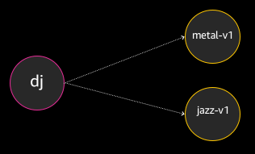
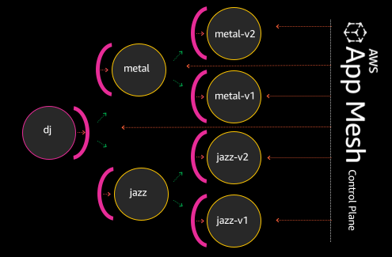

# DJ App

The DJ App demo uses a simple application called DJ to demonstrate some popular AWS App Mesh use cases.

## Overview
This application is composed of three microservices:

* dj
* metal-v1 and
* jazz-v1

The dj service makes requests to either the jazz or metal backends for artist lists. If the dj service requests from the jazz backend, musical artists such as Miles Davis or Astrud Gilberto will be returned. Requests made to the metal backend may return artists such as Judas Priest or Megadeth.

Today, dj is hardwired to make requests to metal-v1 for metal requests, and hardwired to jazz-v1 for jazz requests. Each time there is a new metal or jazz release, we also need to release a new version of dj as to point to its new upstream endpoints. It works, but it’s not an optimal configuration to maintain for the long term.

We’re going to demonstrate how App Mesh can be used to simplify this architecture; by virtualizing the metal and jazz service, we can dynamically make them route to the endpoints and versions of our choosing, minimizing the need for complete re-deployment of the DJ app each time there is a new metal or jazz service release.

When we’re done, our app will look more like the following:

Seven total services with App Mesh sidecars proxying traffic, and the App Mesh control plane managing the sidecars’ configuration rulesets.

## What We'll Cover

This tutorial will walk through the following steps:

1. [Create the k8s DJ App](https://eksworkshop.com/servicemesh_with_appmesh/)
1. [Create the App Mesh components](https://eksworkshop.com/servicemesh_with_appmesh/create_app_mesh_components/)
1. [Port the DJ App to run on App mesh](https://eksworkshop.com/servicemesh_with_appmesh/port_to_app_mesh/)

## Prerequisites

As a prerequisite, you need only complete the [Start the Workshop](https://eksworkshop.com/prerequisites/) section.

Once your EKS cluster is running, begin the step-by-step DJ App walkthrough at  [eksworkshop.com](https://eksworkshop.com/servicemesh_with_appmesh/) to setup an EKS environment.
