# Graphic AWS App Mesh Demo

In this demo we will deploy AWS App Mesh with the X-Ray daemon using tools like IAM Service Accounts with kubectl -k (kustomize) to demonstrate some of the AWS App Mesh features.

The tools needed for this demo are:
- eksctl
- kubectl (> 1.13)

## Setup

### Deploy a cluster
Create a cluster using eksctl
```bash
eksctl create cluster --name=meshdemo --region=eu-west-1 --nodes 1 --appmesh-access --version 1.14
```

### OIDC Provider for IAM Service Accounts
We will associate our IAM OIDC provider, so we can use service accounts. 
```bash
eksctl utils associate-iam-oidc-provider --name meshdemo --approve
```

### Clone
Clone this repository
```
git clone git@github.com:aws/aws-app-mesh-examples.git
cd aws-app-mesh-examples/examples/apps/meshdemo
```

Deploy the [AWS App Mesh Controller](https://github.com/aws/aws-app-mesh-controller-for-k8s).
```bash
kubectl apply -k kubernetes/mesh/kustomize/mesh-controller
```
This also creates a namespace "meshdemo" for the below service account, and creates a mesh called "meshdemo".

## Create a Service Account
We create a service account so the X-Ray daemon can push to the X-Ray endpoint. 
```bash
eksctl create iamserviceaccount --name xray-access --namespace meshdemo --cluster meshdemo \
--attach-policy-arn arn:aws:iam::aws:policy/AWSXRayDaemonWriteAccess --approve --override-existing-serviceaccounts
```

## The Demo

The demo consists of a few services designed specifically to demonstrate AWS App Mesh features.

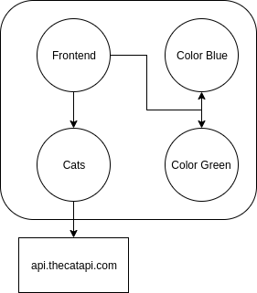

- Frontend: constantly polls the backends for values.
- Colors: Blue and green service are both pods running in the namespace currently only blue is being routed
- Cats: is a service that requests a random cat gif image everytime the frontend polls it.  When it is first started
it cannot reach the external service.

All the code for the applications can be found in the cat, colors and frontend folders of this folder.

### Running the services
First we will start the base of the services.  This deploys the services, with an AWS X-Ray sidecar and an App Mesh sidecar.

```bash
kubectl apply -k kubernetes/app/kustomize/base
```

To view the frontend we can port-forward the service using kubectl.
```bash
k port-forward -n meshdemo svc/frontend 8080:8000
```

Then open your browser to [localhost:8080](http://localhost:8080/)

You should see the following screen.
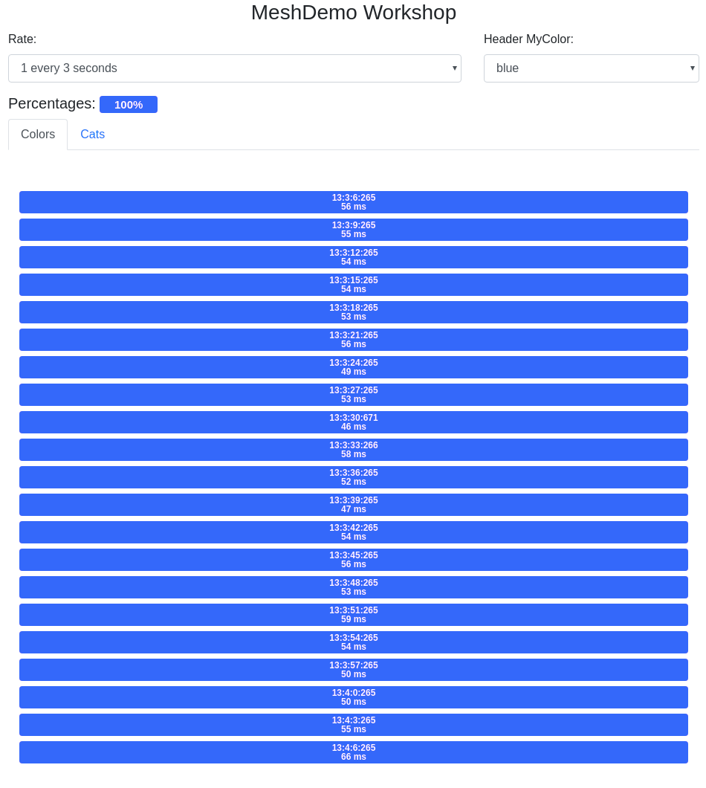

#### Frontend Interactions
You have 3 actions you can perform with this screen.
- Rate: change the rate of requests
- Header MyColor: every request sends a header value "MyColor", this drop down sets the color in that header.
- Cats: changes to the cats tab, which is also sending requests according to the rate
##### Colors
The Colors tab is showing you all the requests to the colors services.

##### Cats
The Cats tabs is reloading the image in the screen with whatever the cats service returns.  If the cats service returns an error you will get this image:
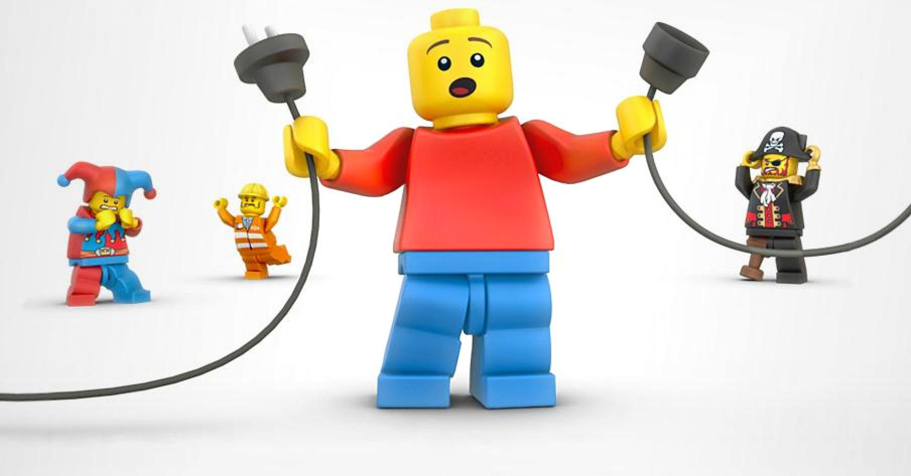
When you start this will be the first problem to solve.

### X-Ray
If you open your [X-Ray Console](https://eu-west-1.console.aws.amazon.com/xray/home?#/service-map) on the service map you should see the following graphic.
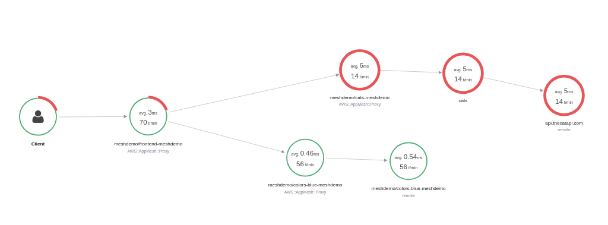

## AWS App Mesh Features
### External services
First open the "Cats" tab.

You will see the error image.
To resolve this error we need to create a new virtual node and a new virtual service.
```yaml
---
apiVersion: appmesh.k8s.aws/v1beta1
kind: VirtualNode
metadata:
  name: api.thecatapi.com
  namespace: meshdemo
spec:
  meshName: meshdemo
  listeners:
    - portMapping:
        port: 80
        protocol: http
  serviceDiscovery:
    dns:
      hostName: api.thecatapi.com
---
apiVersion: appmesh.k8s.aws/v1beta1
kind: VirtualService
metadata:
  name: api.thecatapi.com
  namespace: meshdemo
spec:
  meshName: meshdemo
  virtualRouter:
    listeners:
      - portMapping:
          port: 80
          protocol: http
  routes:
    - name: catsapi-route
      http:
        match:
          prefix: /
        action:
          weightedTargets:
            - virtualNodeName: api.thecatapi.com
              weight: 1
```
This will allow the cats service to connect to the external service running on the internet.

You can run this to apply these changes:
```bash
k apply -k kubernetes/app/kustomize/cats-virtual-service
```
After a few seconds you will see a constant stream of new cat gifs.  This means the cats pod can reach the external url.

In X-Ray after a few minutes of sampling you should see the following.

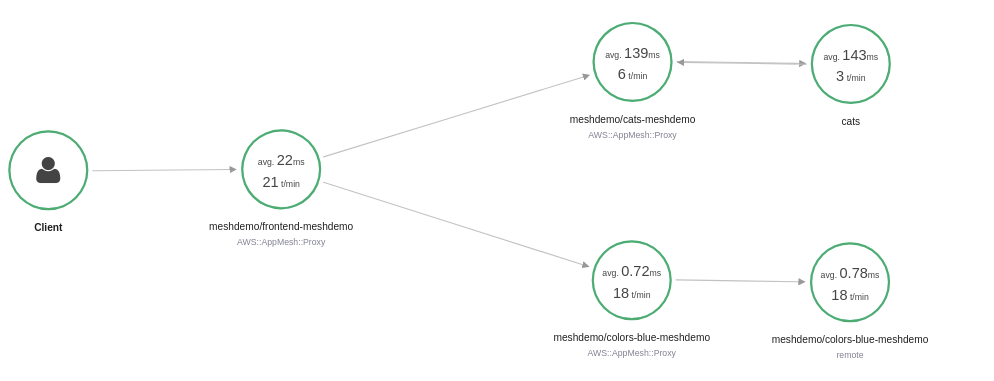

If we drill down into the X-Ray traces we will see this:

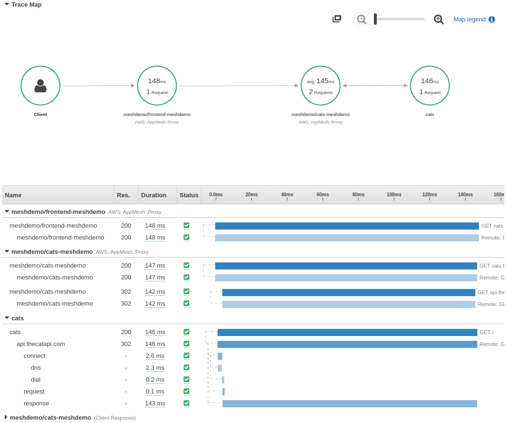

Cats is the only service that has X-Ray instrumentation for the external API.  All other services are being traced with the built in App Mesh capabilities.


### Weighted routing.

Currently all requests for "/colors" are being routed to blue but there is a green pod running as well.

If we want to split the traffic we would want to change the route in App Mesh.  We can do this by applying a patch with kustomize.

```bash
k apply -k kubernetes/app/kustomize/blue-50
```

Which applies the following patch to the color-route

```yaml
apiVersion: appmesh.k8s.aws/v1beta1
kind: VirtualService
metadata:
  name: colors
  namespace: meshdemo
spec:
  routes:
    - name: color-route
      http:
        match:
          prefix: /
        action:
          weightedTargets:
            - virtualNodeName: colors-green
              weight: 1
            - virtualNodeName: colors-blue
              weight: 1
```

Your Colors tab should now generally have split the traffic.

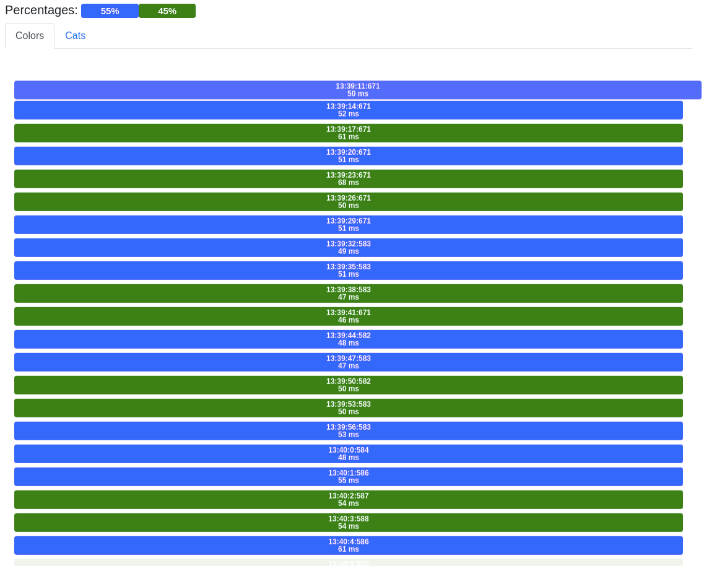

Alternatively you could change it to 90/10 traffic.

```bash
k apply -k kubernetes/app/kustomize/blue-90
```

Which applies the following patch to the color-route

```yaml
apiVersion: appmesh.k8s.aws/v1beta1
kind: VirtualService
metadata:
  name: colors
  namespace: meshdemo
spec:
  routes:
    - name: color-route
      http:
        match:
          prefix: /
        action:
          weightedTargets:
            - virtualNodeName: colors-green
              weight: 1
            - virtualNodeName: colors-blue
              weight: 9
```

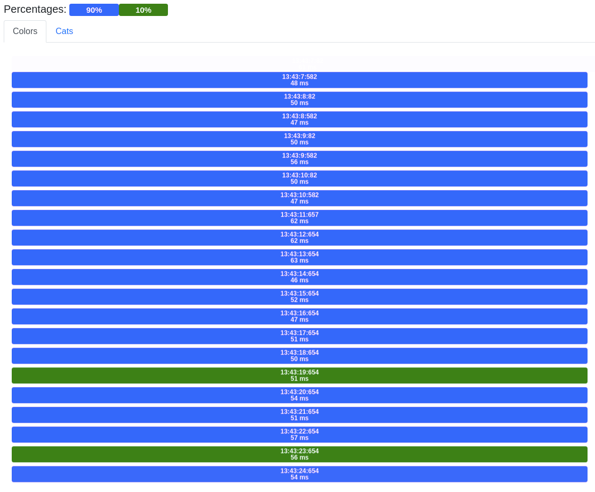

We can also see the green pod in X-Ray now as well.

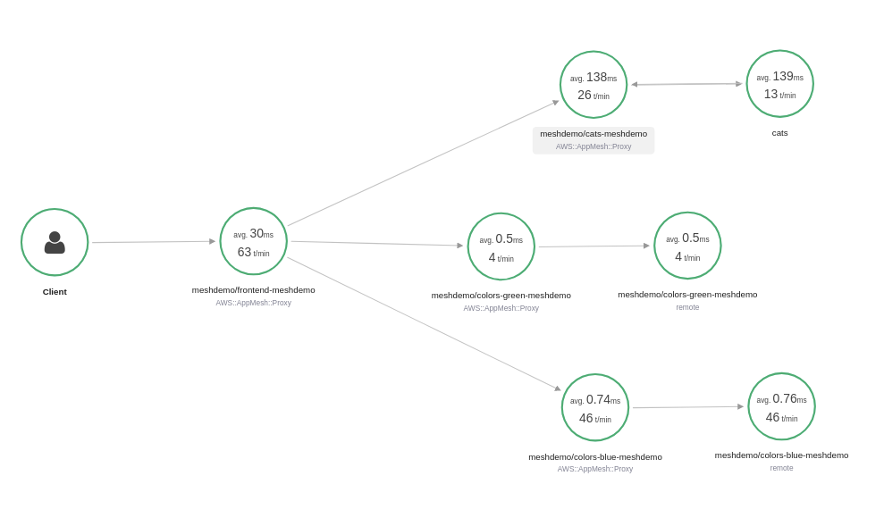

### Header Routing

Currently color-route is not targetting my personal requests.

If we wanted to route based on the header values we could apply a route rule like the following.

```yaml
apiVersion: appmesh.k8s.aws/v1beta1
kind: VirtualService
metadata:
  name: colors
  namespace: meshdemo
spec:
  routes:
    - name: color-route
      http:
        match:
          prefix: /
          headers:
            - name: MyColor
              invert: true
              match:
                exact: blue
        action:
          weightedTargets:
            - virtualNodeName: colors-green
              weight: 1
    - name: blue-headers-route
      http:
        match:
          prefix: /
          headers:
            - name: MyColor
              match:
                exact: blue
        action:
          weightedTargets:
            - virtualNodeName: colors-blue
              weight: 1
```
This rule makes every request go to blue unless there is a MyColor header in the request that says green, then you get green responses.

You can apply that by running
```bash
k apply -k kubernetes/app/kustomize/headers
```

Now if you change the "Header MyColor" drop down to green, your requests will be green, all other choices return blue.

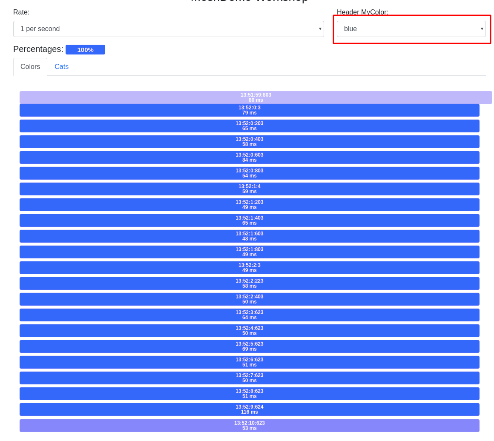

### Retries

App Mesh has the ability to handle errors for us.  To see how this works we can inject errors into one of our services.

```yaml
---
apiVersion: extensions/v1beta1
kind: Deployment
metadata:
  name: colors-blue
  namespace: meshdemo
spec:
  template:
    spec:
      containers:
      - name: colors-blue
        args: ["--randomErrors", "--color", "blue"]
```
When random errors is turned on for the colors container what will happen is, the container will return an error except for the 5th response.

We can see this by running.
```bash
k apply -k kubernetes/app/kustomize/errors
```

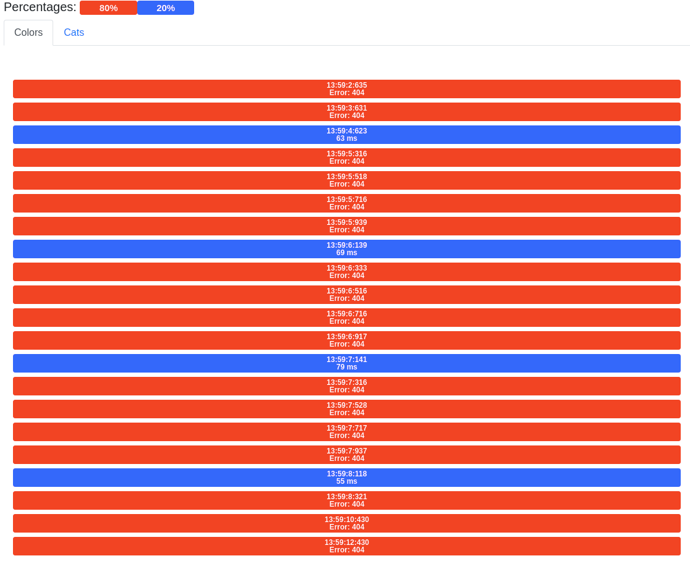

In X-Ray you will see these errors like this

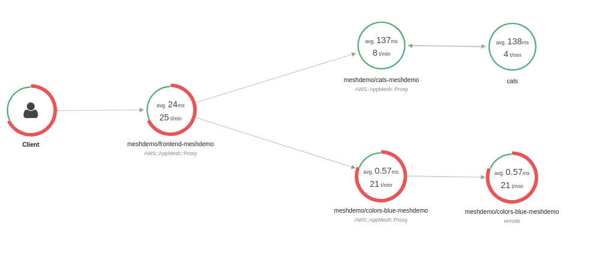

To mitigate this issue we can apply retries for the route.
```yaml
apiVersion: appmesh.k8s.aws/v1beta1
kind: VirtualService
metadata:
  name: colors
  namespace: meshdemo
spec:
  routes:
    - name: color-route
      http:
        match:
          prefix: /
        retryPolicy:
          perRetryTimeoutMillis: 500
          maxRetries: 8
          httpRetryEvents:
            - "server-error"
        action:
          weightedTargets:
            - virtualNodeName: colors-blue
              weight: 1
```

You can apply this by running
```bash
k apply -k kubernetes/app/kustomize/retry
```

Now if we visit our page again we will see the requests are turning blue again but the milliseconds
 (indicated in each bar by "ms") is a little longer.

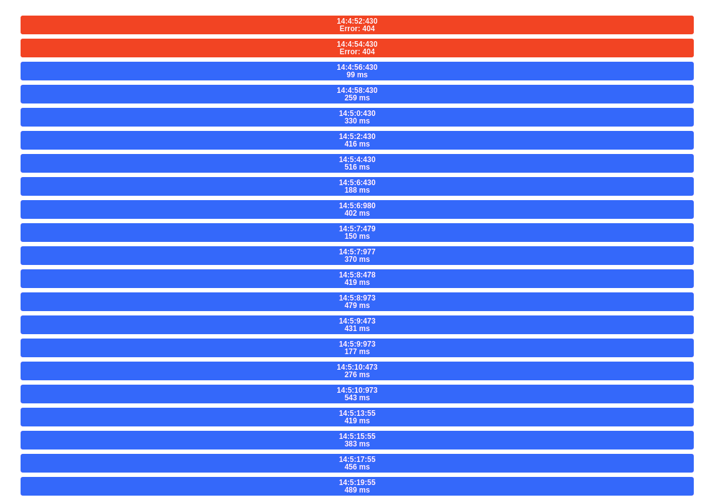

This is because App Mesh is retrying the requests on our behalf.

If we see this in X-Ray we can see there are still errors but they are confined to the colors service.

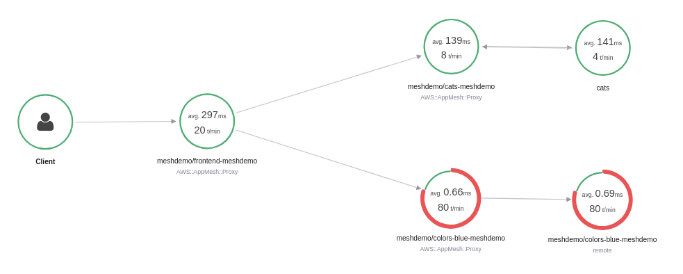


## Teardown

Prior to tearing down the cluster we will want to destroy all the objects created through the AWs App Mesh Controller.

```bash
kubectl delete -k kubernetes/app/kustomize/delete
```
This directory will delete all the objects created as part of the app.

Then we can delete the namespace, mesh and the controller.

```bash
kubectl delete -k kubernetes/mesh/kustomize/mesh-controller
```

Delete the service account and role
```bash
eksctl delete iamserviceaccount --name xray-access --namespace meshdemo --cluster meshdemo
```

Finally you can delete the cluster

```bash
eksctl delete cluster --name=meshdemo --region=eu-west-1
```
