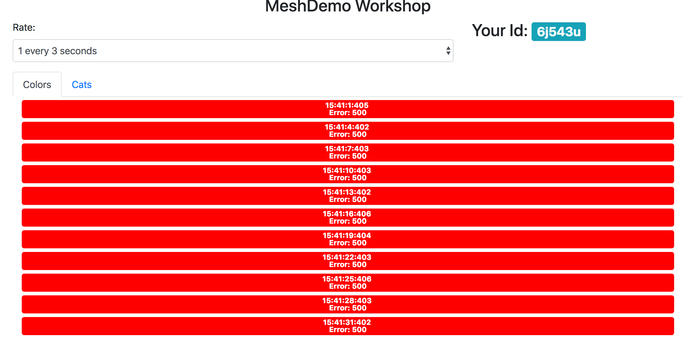
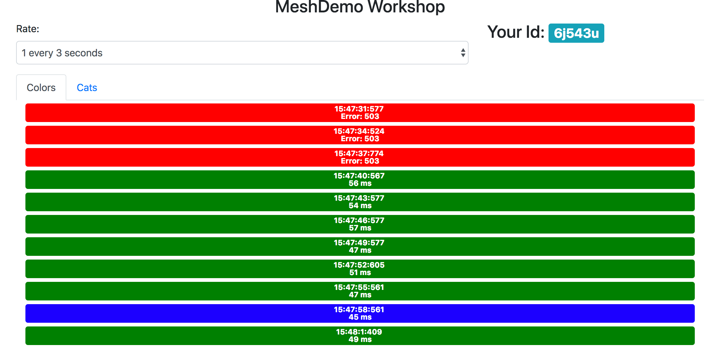

# Graphical Demo

This demo demonstrates how the sidecar injector works in EKS and how to shift traffic using routes in
[AWS App Mesh] (https://aws.amazon.com/app-mesh/)

It also provides a frontend to visualize the shifting traffic.

## Running this demo

### Prerequisites

- [make](http://man7.org/linux/man-pages/man1/make.1.html)
- [awscli](https://docs.aws.amazon.com/cli/latest/userguide/cli-chap-install.html)
- A running [EKS](https://docs.aws.amazon.com/eks/latest/userguide/getting-started.html) cluster
- [aws-app-mesh-inject](https://github.com/aws/aws-app-mesh-inject#app-mesh-inject) side car injector running in your cluster
- [kubectl](https://docs.aws.amazon.com/eks/latest/userguide/install-kubectl.html) configured with the [aws_iam_authenticator](https://docs.aws.amazon.com/eks/latest/userguide/install-aws-iam-authenticator.html)

### Install
 
**Note: this example will create a new mesh titled**
```
appmesh-demo
```

You can install the demo app by running
```
$ make k8sdemo
```

The sidecar injector should have injected sidecars into the deployments, so you should see something like this
Pods may be initiating.

```
$ kubectl get pods -n appmesh-demo
appmesh-demo     blue-866f865cc7-gbb7z             0/2       Init:0/1   0          3s
appmesh-demo     color-green-6b9db9948-lbbbn       0/2       Init:0/1   0          3s
appmesh-demo     color-orange-f78bfd8ff-snf5q      0/2       Init:0/1   0          3s
appmesh-demo     front-end-54f69dfd7b-zjgss        0/2       Init:0/1   0          4s
```
or init completed
```
$ kubectl get pods -n appmesh-demo
NAME                           READY     STATUS    RESTARTS   AGE
blue-866f865cc7-tkfkv          2/2       Running   0          5s
color-green-6b9db9948-c4qx8    2/2       Running   0          5s
color-orange-f78bfd8ff-chh56   2/2       Running   0          5s
front-end-54f69dfd7b-7qtbh     2/2       Running   0          5s
```

To view the demo webpage run
```
$ kubectl port-forward -n appmesh-demo svc/front-end 8000:80
```
and visit http://localhost:8000/

You should see a lot of red requests



The mesh need to be made aware of your pods and how to route them, so you need to run

```
$ make appmeshdemo
```

After a few minutes the demo front-end should switch from all red to around 80% orange and 20% blue.



This routing is based on demo/appmesh/colors.r.json
```
$ cat demo/appmesh/colors.r.json
{
    "routeName": "colors-route",
    "spec": {
        "httpRoute": {
            "action": {
                "weightedTargets": [
                    {
                        "virtualNode": "orange",
                        "weight": 8
                    },
                    {
                        "virtualNode": "blue",
                        "weight": 2
                    },
                    {
                        "virtualNode": "green",
                        "weight": 0
                    }
                ]
            },
            "match": {
                "prefix": "/"
            }
        }
    },
    "virtualRouterName": "colors"
}
```

You can adjust the weights in the file demo/appmesh/colors.r.2.json and then run
```
$ make updatecolors
```

And you should see the traffic distributed evenly across the values you set in the router.

If you did not edit the file you should see 80% green and 20% orange.

You can clean up the entire demo by running
```
$ make clean
```
