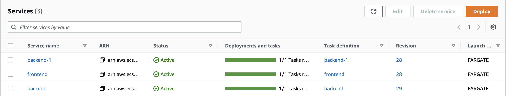
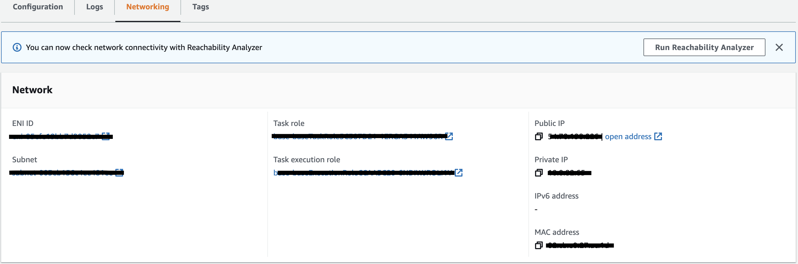
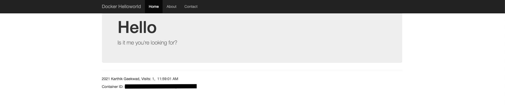
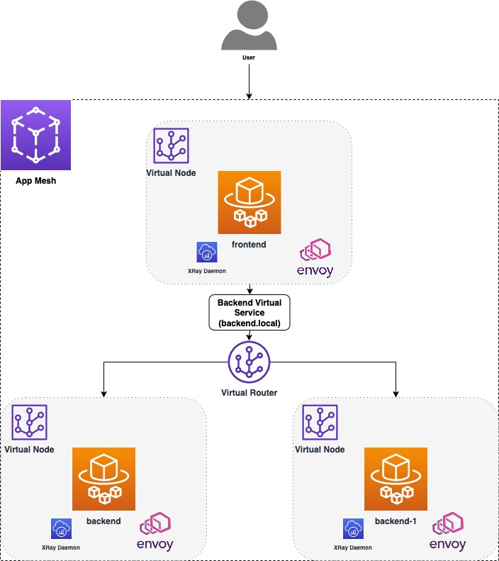
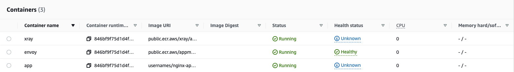
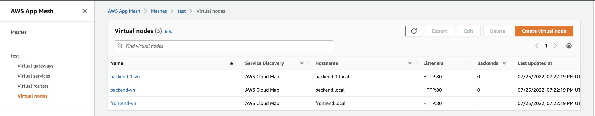
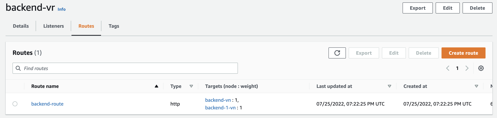
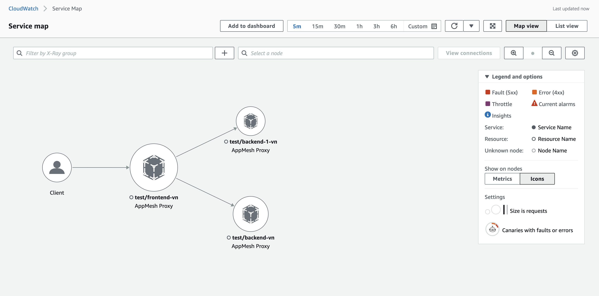
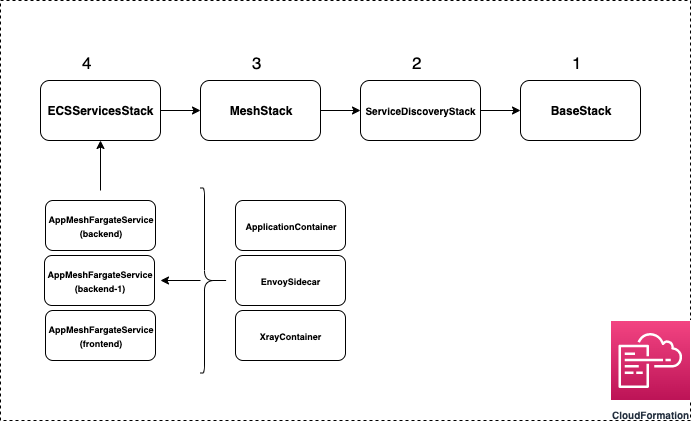

# About

This example shows how App Mesh can be used to route traffic in an ECS cluster consisting of 1 frontend service and 2 backend services.

# Prerequisites

- An active AWS account
- [`node`](https://nodejs.org/en/download/)
- [`npm`](https://docs.npmjs.com/downloading-and-installing-node-js-and-npm)
- [AWS CLI](https://docs.aws.amazon.com/cli/latest/userguide/getting-started-install.html)
- [AWS CDK (V2)](https://docs.aws.amazon.com/cdk/v2/guide/cli.html)
- [TypeScript](https://www.typescriptlang.org/download)
- [`aws-cdk-lib`](https://www.npmjs.com/package/aws-cdk-lib)
- [Docker](https://docs.docker.com/get-docker/)

_Note - CDK uses default AWS credentials `~/.aws/credentials` and configuration `~/.aws/config` unless specified explicitly in the Stack. To learn more about this, click [here](https://docs.aws.amazon.com/cdk/v2/guide/environments.html)._

# Setup & Deployment

**_Note - Standard AWS costs may apply when provisioning infrastructure._**

## Deployment without App Mesh

- Open your terminal
- Clone the repository `git clone https://github.com/aws/aws-app-mesh-examples.git`
- Navigate to `aws-app-mesh-examples/walkthroughs/cdk-examples/app-mesh-hands-on/`
- Run `cdk bootstrap`
- Run `cdk deploy --all --require-approval never --context meshify=false`

Once the entire infrastructure has been provisioned, you will see the following message on your terminal.

```c
BaseStack/ServiceDiscoveryStack/MeshStack/ECSServicesStack (ecs-services)
BaseStack/ServiceDiscoveryStack/MeshStack/ECSServicesStack (ecs-services): deploying...
[0%] start: Publishing 8b9a2e5ebe5009cac839c1eaf354be99fe96301e4d71deaabf1cd505adbe1302:current_account-current_region
[100%] success: Published 8b9a2e5ebe5009cac839c1eaf354be99fe96301e4d71deaabf1cd505adbe1302:current_account-current_region
ecs-services: creating CloudFormation changeset...

 ✅  BaseStack/ServiceDiscoveryStack/MeshStack/ECSServicesStack (ecs-services)

✨  Deployment time: 12.86s

Stack ARN:
arn:aws:cloudformation:us-west-2:xxxxxxxxxx:stack/ecs-services/4f0007c0-09eb-11ed-b6a2-xxxxxxxxxx
```

After the deployment is complete, navigate to _Elastic Container Service_ (ECS) on your AWS console and click on the cluster `test`. You should be able to see 3 AWS Fargate Services.

<p align="center">
  
</p>

1. `backend` - This service runs an ECS task with the image [`karthequian/helloworld:latest`](https://hub.docker.com/r/karthequian/helloworld) that runs in the `app` container and spins up a simple nginx application. It is registered as a CloudMap service with the name `backend.local`.
2. `backend-1` - This service runs an ECS task with the image [`tutum/hello-world:latest`](https://hub.docker.com/r/tutum/hello-world) that runs in the `app` container and spins up a simple Apache server. It is registered as a CloudMap service with the name `backend-1.local`.
3. `frontend` - The service runs an ECS task with the image [`usernames/nginx-appmesh:latest`](https://hub.docker.com/r/usernames/nginx-appmesh). It is registered as a CloudMap service with the name `frontend.local`, and it routes all incoming traffic to the URL `backend.local`. **In this case all traffic will be routed to the `backend` Fargate service, since it is associated with CloudMap service `backend.local`.**

### To view any application

- Click on the Service name (e.g. `backend-1`)
- Navigate to the `Configuration and tasks` tab and click on the Task hyperlink.
- Navigate to the `Networking` tab and copy the `Public IP` or click on `open address`.

<p align="center">
  
</p>

On performing the steps mentioned above for `backend` and `frontend`, you should see the webpage in the image below. This is because `frontend` is routing all the traffic to `backend.local` as mentioned before.

<p align="center">
  
</p>

Meanwhile, `backend-1` should display the following webpage.

<p align="center">
  
</p>

## Deployment with App Mesh

Now, we will use App Mesh to route traffic to both `backend-1` and `backend` using `frontend`.

In your terminal, run
`cdk deploy --all --require-approval never --context meshify=true`.

Adding `meshify=true` in the context will update the `test` cluster by deleting the previous services and creating 3 new services.

1. `meshified-backend` - Along with the `app` container from `backend`, we add an `envoy` sidecar container which also acts as a proxy and an `xray` container for request tracing. Morover `meshified-backend` is now exposed as an App Mesh **virtual node** called `backend-vn`.
2. `meshified-backend-1` - Along with the `app` container from `backend-1`, we add an `envoy` sidecar container which also acts as a proxy and an `xray` container for request tracing. Morover `meshified-backend-1` is now exposed as an App Mesh **virtual node** called `backend-1-vn`.
3. `meshified-frontend` - Along with the `app` container from `frontend`, we add an `envoy` sidecar container which also acts as a proxy and an `xray` container for request tracing.
   Morover `meshified-frontend` is now exposed as an App Mesh **virtual node** called `frontend-vn` that routes traffic to the `backend.local` , which now acts as a **virtual service**. This virtual service is provided by a **virtual router** that has weighted routes to propagate traffic to the virtual nodes `backend-vn` and `backend-1-vn`.

<p align="center">
  
</p>

### Let us see the traffic routing in action

- Navigate to ECS on the AWS Console and click on cluster `test`.
- Click on the `meshified-frontend` service.
- Navigate to `Configuration and tasks` and click on the Task hyperlink.
- Click on the `Configuration` tab (default)

You should be able to see the set of containers in the `Containers` pane.

<p align="center">
  
</p>

- In the same window, Navigate to the Networking tab and copy the `Public IP` or click on `open address`.

On refreshing the page multiple times, you will see that `meshified-frontend` now routes traffic to both `meshified-backend` and `meshified-backend-1` equally.

To view the virtual nodes:

- Navigate to App Mesh on the AWS Console.
- Click on the mesh `test`
- On the left hand pane, click on the `Virtual nodes`

<p align="center">
  
</p>

To view the routing details:

- On the left hand pane, click on the `Virtual routers`.
- Click on router `backend-vr`

<p align="center">
  
</p>

Adding the X-Ray Daemon allows us to view the Service map and traces generated by the traffic routing. To view these metrics:

- Navigate to CloudWatch on the AWS Console
- On the left hand side pane, click on `Service map` under the `X-Ray traces` dropdown. You should see the following graph demonstrating the network.

<p align="center">
  
</p>

# Cleanup

- Navigate to your project directory
- Run `cdk destroy --all` and hit `y` when the prompt appears.

```c
cdk destroy --all
Are you sure you want to delete: BaseStack/ServiceDiscoveryStack/MeshStack/ECSServicesStack, BaseStack/ServiceDiscoveryStack/MeshStack, BaseStack/ServiceDiscoveryStack, BaseStack (y/n)? y
BaseStack/ServiceDiscoveryStack/MeshStack/ECSServicesStack (ecs-services): destroying...

 ✅  BaseStack/ServiceDiscoveryStack/MeshStack/ECSServicesStack (ecs-services): destroyed
BaseStack/ServiceDiscoveryStack/MeshStack (mesh-components): destroying...

 ✅  BaseStack/ServiceDiscoveryStack/MeshStack (mesh-components): destroyed
BaseStack/ServiceDiscoveryStack (service-discovery): destroying...

 ✅  BaseStack/ServiceDiscoveryStack (service-discovery): destroyed
BaseStack (base): destroying...

 ✅  BaseStack (base): destroyed
```

# CDK Code

<details>
<summary><b>Expand this section to learn more about provisioning App Mesh resources using custom CDK constructs</b></summary>

## Stacks and Constructs

There are a total of 4 Stacks that provision all the infrastructure for the example.

_Note - The `cdk bootstrap` command provisions a `CDKToolkit` Stack to deploy AWS CDK apps into your cloud enviroment._

1. `BaseStack` - provisions the network infrastructure like the VPC, ECS cluster and IAM roles.
2. `ServiceDiscoveryStack` - provisions 3 CloudMap service records for service discovery.
3. `MeshStack` - provisions the different mesh components like the frontend and backend virtual nodes, virtual router and the backend virtual service.
4. `EcsServicesStack` - this stack provisions the 3 Fargate services using a custom construct `AppMeshFargateService` which encapsulates the application container, Envoy sidecar/proxy and the Xray container into a single construct allowing us to easily spin up different 'meshified' Fargate Services.

Three more constructs - `EnvoySidecar`, `XrayContainer` and `ApplicationContainer` bundle the common container options used by these Fargate services.

<p align="center">
  
</p>

The order mentioned above also represents the dependency these Stacks have on eachother. For the purposes of this example, the mesh components provisioned by the `MeshStack` are deployed regardless of the value of the context `meshify`. When the 'meshified' services are deployed, the Envoy sidecar identifies App Mesh resources via the `APPMESH_RESOURCE_ARN` environment variable.

These dependencies are propagated by passing the Stack objects in the `constructor` of their referencing Stack.

```c
const baseStack = new BaseStack(app, "BaseStack", {
  stackName: "base",
  description: "Defines the network infrastructure, container images and ECS Cluster.",
});
// Pass baseStack as a constructor arg
const serviceDiscoveryStack = new ServiceDiscoveryStack(baseStack, "ServiceDiscoveryStack", {
  stackName: "service-discovery",
  description: "Defines the application load balancers and the CloudMap service.",
});
```

## App Mesh CDK Constructs

To easily define Fargate services with Envoy proxies, we make use of the `AppMeshFargateService` construct mentioned above. The main purpose of this construct is to bundle the application containers with the Envoy sidecar and proxy. To do so, we define a set of custom props in `lib/utils.ts` called `AppMeshFargateServiceProps`.

```c
// utils.ts
export interface EnvoyConfiguration {
  container: EnvoySidecar;
  proxyConfiguration?: ecs.ProxyConfiguration;
}

export interface AppMeshFargateServiceProps {
  serviceName: string;
  taskDefinitionFamily: string;
  serviceDiscoveryType?: ServiceDiscoveryType;
  applicationContainer: ApplicationContainer;
  envoyConfiguration?: EnvoyConfiguration;
  xrayContainer?: XrayContainer;
}

```

Note that the `proxyConfiguration` prop in `EnvoyConfiguration` is separate because the Envoy sidecar container can exist own its own without acting as a proxy, but for it to act as a proxy there must be a running container with the name mentioned in the proxy configuration.

We can then instantiate an `AppMeshFargateService` construct using `AppMeshFargateServiceProps`. Since the `envoyConfiguration` and `xrayContainer` are optional, they are only provisioned when we pass `--context meshify=true` in the `cdk deploy` command.

```c
// ecs-services.ts

// backend
const meshify = this.node.tryGetContext("meshify") === "true";

const backend = new AppMeshFargateService(ms, `${this.stackName}BackendV1AppMeshFargateService`, {
  serviceName: ms.sd.base.SERVICE_BACKEND,
  taskDefinitionFamily: ms.sd.base.SERVICE_BACKEND,
  envoyConfiguration: meshify
    ? {
        container: new EnvoySidecar(ms, `${this.stackName}BackendV1EnvoySidecar`, {
          logStreamPrefix: `${ms.sd.base.SERVICE_BACKEND}-envoy`,
          appMeshResourceArn: ms.backendV1VirtualNode.virtualNodeArn,
          enableXrayTracing: true,
        }),
        proxyConfiguration: EnvoySidecar.buildAppMeshProxy(ms.sd.base.PORT),
      }
    : undefined,

  xrayContainer: meshify
    ? new XrayContainer(ms, `${this.stackName}BackendV1XrayOpts`, {
        logStreamPrefix: `${ms.sd.base.SERVICE_BACKEND}-xray`,
      })
    : undefined,

  applicationContainer: new ApplicationContainer(ms, `${this.stackName}BackendV1AppOpts`, {
    image: ecs.ContainerImage.fromRegistry(this.node.tryGetContext("IMAGE_BACKEND")),
    logStreamPrefix: `${ms.sd.base.SERVICE_BACKEND}-app`,
    portMappings: [
      {
        containerPort: ms.sd.base.PORT,
        protocol: ecs.Protocol.TCP,
      },
    ],
  }),
});

```

The crux of the mesh infrastructure lies in the `MeshStack`. For example, in the code snippet below, we create a new `aws-appmesh.VirtualNode` for `backend`.

```c
// mesh-components.ts
this.backendV1VirtualNode = new appmesh.VirtualNode(
      this,
      `${this.stackName}BackendV1VirtualNode`,
      this.buildVirtualNodeProps(this.sd.base.SERVICE_BACKEND)
    );
```

Once we define the virtual nodes, the routing logic of the mesh can be defined using the `aws-appmesh.RouteSpec` and `aws-appmesh.Route` constructs. The `aws-appmesh.RouteSpec` registers virtual nodes as weighted targets to route traffic to.

```c
// mesh-components.ts
const routeSpec = appmesh.RouteSpec.http({
    match: { path: appmesh.HttpRoutePathMatch.startsWith("/") },
    weightedTargets: [
      {
        virtualNode: this.backendV1VirtualNode,
        weight: 1,
      },
      {
        virtualNode: this.backendV2VirtualNode,
        weight: 1,
      },
    ],
  });

this.backendRoute = new appmesh.Route(this, `${this.stackName}BackendRoute`, {
  mesh: this.mesh,
  virtualRouter: this.backendVirtualRouter,
  routeName: `backend-route`,
  routeSpec: routeSpec,
});
```

## Project Structure and Context

The skeleton of the project is generated using the `cdk init app --language typescript` command. By default, your main `node` app sits in the `bin` folder and the cloud infrastructure is provisioned in the `lib` folder.

Any global configuration can be added in the `cdk.json` under the `context` key. This is equivalent to passing `--context key=value` during runtime. In this case, properties like the container images and ports are added for ease of reference and updates.

```c
// envoy-sidecar.ts
image: ecs.ContainerImage.fromRegistry(this.node.tryGetContext("IMAGE_ENVOY"))
```

```c
// base.ts
this.PROJECT_NAME = this.node.tryGetContext("PROJECT_NAME");
this.PORT = parseInt(this.node.tryGetContext("CONTAINER_PORT"), 10);
```

</details>

# Learn more about App Mesh

- [Product Page](https://aws.amazon.com/app-mesh/?nc2=h_ql_prod_nt_appm&aws-app-mesh-blogs.sort-by=item.additionalFields.createdDate&aws-app-mesh-blogs.sort-order=desc&whats-new-cards.sort-by=item.additionalFields.postDateTime&whats-new-cards.sort-order=desc)
- [App Mesh under the hood](https://www.youtube.com/watch?v=h3syq1vbplE)
- [App Mesh CDK API Reference](https://docs.aws.amazon.com/cdk/api/v2/docs/aws-cdk-lib.aws_appmesh-readme.html)
