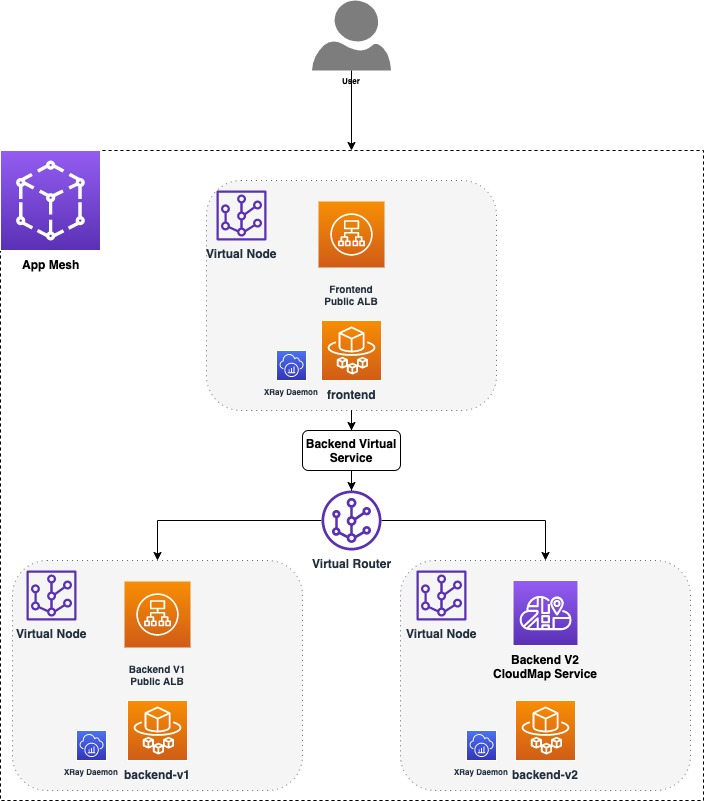
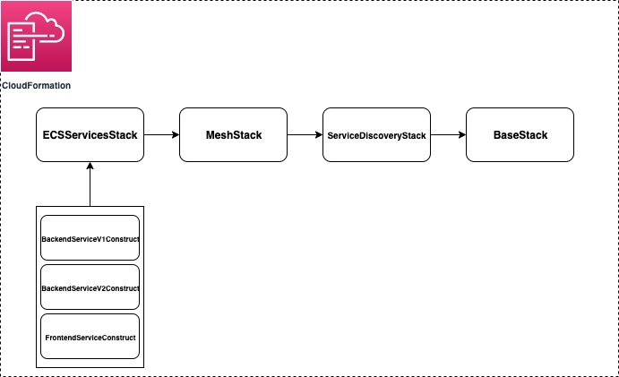

# About

This example shows how services behind an Application Load Balancer (ALB) can be accessed by clients with the help of the Envoy Proxy provisioned using AWS App Mesh. Each service also contains an AWS XRay Daemon that allows us to view the request traces and other metrics. 
The entire infrastructure is provisioned using the AWS Cloud Development Kit (CDK) V2, a non CDK version of this example is available [here](https://github.com/aws/aws-app-mesh-examples/tree/main/walkthroughs/howto-alb).

# Prerequisites
- An active AWS account
- `node`
- `npm`
- [AWS CLI](https://docs.aws.amazon.com/cli/latest/userguide/getting-started-install.html)
- [AWS CDK (V2)](https://docs.aws.amazon.com/cdk/v2/guide/home.html)
- TypeScript
- [Docker](https://docs.docker.com/get-docker/)

# Setup & Deployment

- Open your terminal
- Clone the repository `git clone https://github.com/aws/aws-app-mesh-examples.git`
- Navigate to `aws-app-mesh-examples/walkthroughs/cdk-examples/howto-alb/`
- Run  `cdk boostrap`
- Run `cdk deploy --all --require-approval never`


### _Note - Standard AWS costs may apply when provisioning infrastructure._


- Once the entire infrastructure has been provisioned, you will see the following message on your terminal.
```c
  ✅  BaseStack/ServiceDiscoveryStack/MeshStack/ECSServicesStack (ECSServicesStack)

✨  Deployment time: 24.01s

Outputs:
BaseStackServiceDiscoveryStackMeshStackECSServicesStack8E43077C.PublicEndpoint = frontend-xxxxxxxxxx.us-east-1.elb.amazonaws.com
Stack ARN:
arn:aws:cloudformation:us-east-1:xxxxxxxxxx:stack/ECSServicesStack/xxxxxxxxxx-xxxx-xxxx-xxxx-xxxxxxxxxxxx

✨  Total time: 26.74s
```
- Copy the `PublicEndpoint` URL and `curl`  the `/color` endpoint it to get the response.
```c
➜  howto-alb git:(feature-cdk) ✗ curl frontend-xxxxxxxxxx.us-east-1.elb.amazonaws.com/color
BLUE 🔵%
➜  howto-alb git:(feature-cdk) ✗ curl frontend-xxxxxxxxxx.us-east-1.elb.amazonaws.com/color
GREEN 🟢%
```
- To cleanup the resources run `cdk destroy --all` and hit `y` when the prompt appears.

```c
➜  howto-alb git:(feature-cdk) cdk destroy --all
Are you sure you want to delete: BaseStack/ServiceDiscoveryStack/MeshStack/ECSServicesStack, BaseStack/ServiceDiscoveryStack/MeshStack, BaseStack/ServiceDiscoveryStack, BaseStack (y/n)? y
BaseStack/ServiceDiscoveryStack/MeshStack/ECSServicesStack (ECSServicesStack): destroying...
```

# Application Architecture

## Services
#### There are three AWS Fargate services
 1. `frontend` - which is registered behind public ALB and has an Envoy Proxy sidecar attached to it. This service is discoverable  via the `PublicEndpoint` mentioned above, which uses the ALB's DNS. `frontend` is also an App Mesh **virtual node** that routes data to the two backend services.
 2. `backend-v1` - which is registered behind an internal ALB. This service is registered as a **virtual node** that is discoverable to `frontend` using the ALB's DNS (configured as a AWS Route53 hosted zone).
 3. `backend-v2` - which uses AWS CloudMap service discovery and represents another **virtual node** .

## Traffic routing using AWS App Mesh
Both `backend-v1` and `backend-v2` are exposed in App Mesh as a single **virtual service** `backend.howto-alb.hosted.local`. A **virtual router** which sits behind `frontend` is responsible for routing traffic to the **virtual service**. This router can be configured with weights that determine what % of the traffic should be split between `backend-v1` and `backend-v2`. For this example the weights are split equally (50/50).

The frontend and backend services are simple Flask applications bundled in the `feapp` and `colorapp` directories respectively. `backend-v1` returns the response 'BLUE 🔵' and `backend-v2` returns 'GREEN 🟢'. You can change the route weights on the AWS console and see the difference in the responses.


<p align="center">
  
</p>

# CDK Architecture
<details open>

## Stacks and Constructs
There are a total of 4 Stacks that provision all the infrastructure for the example. 

_Note - The CDK provisions a `CDKToolkit` Stack automatically to deploy AWS CDK apps into your cloud enviroment._

1. `BaseStack` - provisions the network infrastructure like the VPC, ECS Cluster and DNS Hosted Zone, along with the Docker images that are pushed to the ECR Repository.
2. `ServiceDiscoveryStack` - provisions the 2 ALBs used by `frontend` and `backend-v1` and the CloudMap service used by `backend-v2`.
3. `MeshStack` - provisions the different mesh components like the frontend and backend virtual nodes, virtual router and the backend virtual service.
4. `ECSServicesStack` - defines 3 Constructs that contain resources to provision the Task Definitions and Fargate services for `backend-v1`, `backend-v2` and `frontend`.

<p align="center">
  
</p>

These dependencies are propagated by passing the Stack objects in the `constructor` of their referencing Stack.


```c
const baseStack = new BaseStack(app, 'BaseStack',{
    stackName: 'BaseStack',
    description: "Provisions the network infrastructure and container images."
});
// Pass baseStack as a constructor argument
const serviceDiscoveryStack = new ServiceDiscoveryStack(baseStack, 'ServiceDiscoveryStack', {
    stackName: 'ServiceDiscoveryStack',
    description: "Provisions the application load balancers and the CloudMap service."
});
```

The order mentioned above also represents the dependency these Stacks have on eachother. In this case, since we are deploying the Envoy sidecar containers along with our application code, it is necessary for the mesh components to be provisioned before the services are running, so the Envoy proxy can locate them using the `APPMESH_VIRTUAL_NODE_NAME` environment variable.

```c
// The BackendV1Constructor fetches the container port from the BaseStack and the virtual node name from the MeshStack
const envoyContainer = this.taskDefinition.addContainer(
      `${this.constructIdentifier}_EnvoyContainer`,
      {
        image: ms.sd.base.envoyImage,
        containerName: "envoy",
        environment: {
          ENVOY_LOG_LEVEL: "debug",
          ENABLE_ENVOY_XRAY_TRACING: "1",
          ENABLE_ENVOY_STATS_TAGS: "1",
          APPMESH_VIRTUAL_NODE_NAME: `mesh/${ms.sd.base.projectName}/virtualNode/${ms.backendV2VirtualNode.virtualNodeName}`,
        },
```

The frontend Envoy sidecar also acts as a proxy, this can be configured easily using the `AppMeshProxyConfiguration` construct and then adding it to the `proxyConfiguration` prop of the Fargate Task Definition.

```c
// Define the envoy proxy configuration
const appMeshProxyConfig = new ecs.AppMeshProxyConfiguration({
      containerName: "envoy",
      properties: {
        proxyIngressPort: 15000,
        proxyEgressPort: 15001,
        appPorts: [ms.sd.base.containerPort],
        ignoredUID: 1337,
        egressIgnoredIPs: ["169.254.170.2", "169.254.169.254"],
      },
    });
// Assign it to the task definiton
this.taskDefinition = new ecs.FargateTaskDefinition(
  this,
  `${this.constructIdentifier}_TaskDefinition`,
  {
    cpu: 256,
    memoryLimitMiB: 512,
    proxyConfiguration: appMeshProxyConfig,
    executionRole: ms.sd.base.executionRole,
    taskRole: ms.sd.base.taskRole,
    family: "front",
  }
);
```

The crux of the mesh infrastrcute lies in the `MeshStack`. As with other constructs, defining mesh components in the CDK is really easy. Since we deploy the `appmesh.Mesh` construct in the `BaseStack`, we can reference it in the `MeshStack` through parent Stacks and add virtual nodes and routers. 

For example, in the code snippet below, we create a new `VirtualNode` and assign it the `mesh` from the `BaseStack`, and set it's service discovery to the internal ALB defined in the `ServiceDiscoveryStack`.

```c
// Virtual node with DNS service discovery
this.backendV1VirtualNode = new appmesh.VirtualNode(
      this,
      `${this.stackIdentifier}_BackendV1VirtualNode`,
      {
        mesh: this.sd.base.mesh,
        virtualNodeName: `${this.sd.base.projectName}-backend-v1-node`,
        listeners: [this.virtualNodeListender],
        serviceDiscovery: appmesh.ServiceDiscovery.dns(
          sd.backendV1LoadBalancer.loadBalancerDnsName
        ),
      }
    );
```


## Project Structure
The skeleton of the project is generated using the `cdk init sample-app --language typescript` command. By default, your main `node` app sits in the `bin` folder and the cloud infrastructure is provisioned in the `lib` folder. 

In the `cdk.json` file, we define two enviroment variables: `PROJECT_NAME` and `CONTAINER_PORT` that refer to the name of this project and the ports at which the Flask applications (`feapp` and `colorapp`) are exposed in the containers. These variables can be fetched within the application using a Construct's `node.tryGetContext` method. 

```c
this.projectName = this.node.tryGetContext("PROJECT_NAME");
this.containerPort = this.node.tryGetContext("CONTAINER_PORT");
```

Using the `DockerImageAsset` construct, you can push your application image to an ECR repository when the infrastucture is being provisioned by simply pointing it to the directory of your application's `Dockerfile`.

```c
this.frontendAppImageAsset = new assets.DockerImageAsset(this, `${this.stackIdentifier}_FrontendAppImageAsset`, {
      directory: ".././howto-alb/feapp",
      platform: assets.Platform.LINUX_AMD64,
    });
```
</details>
