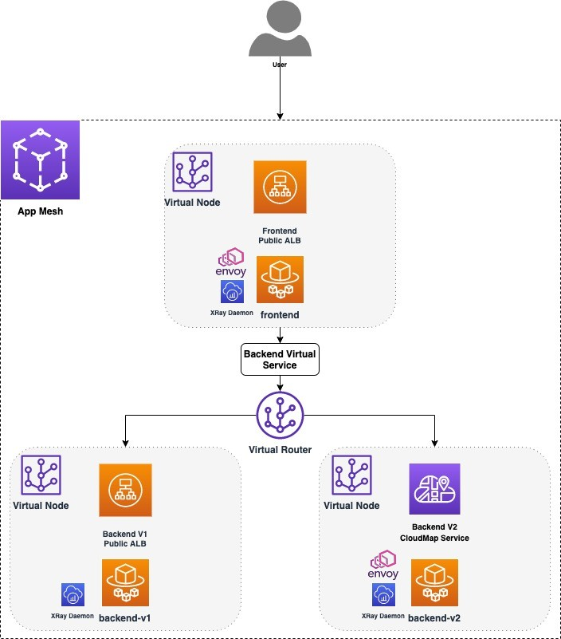
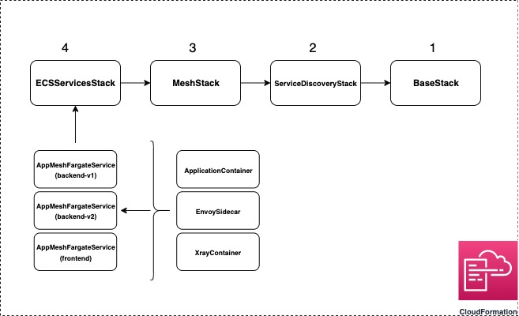

# About

This example shows how services behind an Application Load Balancer (ALB) can be accessed by clients with the help of the Envoy Proxy provisioned using AWS App Mesh. Each service also contains an AWS XRay Daemon that allows us to view the request traces and other metrics.
The entire infrastructure is provisioned using the AWS Cloud Development Kit (CDK) V2, a non CDK version of this example is available [here](https://github.com/aws/aws-app-mesh-examples/tree/main/walkthroughs/howto-alb).

# Prerequisites

- An active AWS account
- [`node`](https://nodejs.org/en/download/)
- [`npm`](https://docs.npmjs.com/downloading-and-installing-node-js-and-npm)
- [AWS CLI](https://docs.aws.amazon.com/cli/latest/userguide/getting-started-install.html)
- [AWS CDK (V2)](https://docs.aws.amazon.com/cdk/v2/guide/cli.html)
- [TypeScript](https://www.typescriptlang.org/download)
- [`aws-cdk-lib`](https://www.npmjs.com/package/aws-cdk-lib)
- [Docker](https://docs.docker.com/get-docker/)

_Note - CDK uses default AWS credentials `~/.aws/credentials` and configuration `~/.aws/config` unless specified explicitly in the Stack. To learn more about this, click [here](https://docs.aws.amazon.com/cdk/v2/guide/environments.html)._

# Setup & Deployment

### _Note - Standard AWS costs may apply when provisioning infrastructure._

- Open your terminal
- Clone the repository `git clone https://github.com/aws/aws-app-mesh-examples.git`
- Navigate to `aws-app-mesh-examples/walkthroughs/cdk-examples/howto-alb/`
- Run `cdk bootstrap`
- Run `cdk deploy --all --require-approval never`

- Once the entire infrastructure has been provisioned, you will see the following message on your terminal.

```c
  ✅  BaseStack/ServiceDiscoveryStack/MeshStack/ECSServicesStack (ECSServicesStack)

✨  Deployment time: 24.01s

Outputs:
BaseStackServiceDiscoveryStackMeshStackECSServicesStack8E43077C.URL = frontend-xxxxxxxxxx.us-east-1.elb.amazonaws.com
Stack ARN:
arn:aws:cloudformation:us-east-1:xxxxxxxxxx:stack/ECSServicesStack/xxxxxxxxxx-xxxx-xxxx-xxxx-xxxxxxxxxxxx

✨  Total time: 26.74s
```

- Copy the `URL` URL and `curl` the `/color` endpoint it to get the response.

```c
➜  howto-alb git:(feature-cdk) ✗ curl frontend-xxxxxxxxxx.us-east-1.elb.amazonaws.com/color
BLUE 🔵%
➜  howto-alb git:(feature-cdk) ✗ curl frontend-xxxxxxxxxx.us-east-1.elb.amazonaws.com/color
GREEN 🟢%
```

# Cleanup

- Navigate to your project directory
- Run `cdk destroy --all` and hit `y` when the prompt appears.

```c
➜  howto-alb git:(feature-cdk) cdk destroy --all
Are you sure you want to delete: BaseStack/ServiceDiscoveryStack/MeshStack/ECSServicesStack, BaseStack/ServiceDiscoveryStack/MeshStack, BaseStack/ServiceDiscoveryStack, BaseStack (y/n)? y
BaseStack/ServiceDiscoveryStack/MeshStack/ECSServicesStack (ECSServicesStack): destroying...
```

# Application Architecture

## Services

#### There are three AWS Fargate services

1.  `frontend` - which is registered behind public ALB and has an Envoy proxy sidecar attached to it. This service is discoverable via the `URL` mentioned above, which uses the ALB's DNS. `frontend` is also an App Mesh **virtual node** that routes data to the two backend services.
2.  `backend-v1` - which is registered behind an internal ALB. This service is registered as a **virtual node** that is discoverable to `frontend` using the ALB's DNS `backend.howto-alb.hosted.local` (configured as a AWS Route53 hosted zone).
3.  `backend-v2` - which uses AWS CloudMap service discovery using a private DNS namespace `backend-v2.howto-alb.pvt.local` and represents another **virtual node** .

## Traffic routing using AWS App Mesh

Both `backend-v1` and `backend-v2` are exposed in App Mesh as a single **virtual service** `backend.howto-alb.hosted.local` which is registered as a backend to the `frontend` virtual node. This virtual service is provided by a **virtual router** that splits the traffic between the two backend virtual nodes based on configurable weights (for this example, the weights are split equally - 50/50). The frontend and backend services are simple Flask applications bundled in the `feapp` and `colorapp` directories respectively. When queried by `frontend`, `backend-v1` returns the response 'BLUE 🔵' and `backend-v2` returns 'GREEN 🟢'.

<p align="center">
  
</p>

# CDK Code

<details>
<summary><b>Expand this section to learn more about provisioning App Mesh resources using custom CDK constructs</b></summary>

## Stacks and Constructs

There are a total of 4 Stacks that provision all the infrastructure for the example.

_Note - The `cdk bootstrap` command provisions a `CDKToolkit` Stack to deploy AWS CDK apps into your cloud enviroment._

1. `BaseStack` - provisions the network infrastructure like the VPC, ECS Cluster and DNS Hosted Zone, along with the Docker images that are pushed to the ECR Repository.
2. `ServiceDiscoveryStack` - provisions the 2 ALBs used by `frontend` and `backend-v1` and the CloudMap service used by `backend-v2`.
3. `MeshStack` - provisions the different mesh components like the frontend and backend virtual nodes, virtual router and the backend virtual service.
4. `ECSServicesStack` - this stack provisions the 3 Fargate services using a custom construct `AppMeshFargateService` which encapsulates the application container, Envoy sidecar/proxy and the Xray container into a single construct allowing us to easily spin up different 'meshified' Fargate Services.

Three more constructs - `EnvoySidecar`, `XrayContainer` and `ApplicationContainer` bundle the common container options used by these Fargate services.

<p align="center">
  
</p>

The order mentioned above also represents the dependency these Stacks have on eachother. In this case, since we are deploying the `EnvoySidecar` containers along with our application code, it is necessary for the mesh components to be provisioned before the services are running, so the Envoy proxy can locate them using the `APPMESH_RESOURCE_ARN` environment variable.

These dependencies are propagated by passing the Stack objects in the `constructor` of their referencing Stack.

```c
const baseStack = new BaseStack(app, 'BaseStack',{
    stackName: 'base',
    description: "Provisions the network infrastructure and container images."
});
// Pass baseStack as a constructor argument
const serviceDiscoveryStack = new ServiceDiscoveryStack(baseStack, 'ServiceDiscoveryStack', {
    stackName: 'service-discovery',
    description: "Provisions the application load balancers and the CloudMap service."
});
```

## App Mesh CDK Constructs

To easily define Fargate services with Envoy proxies, we make use of the `AppMeshFargateService` construct mentioned above. The main purpose of this construct is to bundle the application containers with the Envoy sidecar and proxy. To do so, we define a set of custom props in `lib/utils.ts` called `AppMeshFargateServiceProps`.

```c
// utils.ts
export interface EnvoyConfiguration {
  container: EnvoySidecar;
  proxyConfiguration?: ecs.ProxyConfiguration;
}

export interface AppMeshFargateServiceProps {
  serviceName: string;
  taskDefinitionFamily: string;
  serviceDiscoveryType?: ServiceDiscoveryType;
  applicationContainer: ApplicationContainer;
  envoyConfiguration?: EnvoyConfiguration;
  xrayContainer?: XrayContainer;
}

```

Note that the `proxyConfiguration` prop in `EnvoyConfiguration` is separate because the Envoy sidecar container can exist own its own without acting as a proxy, but for it to act as a proxy there must be a running container with the name mentioned in the proxy configuration.

These props are passed to instantiate Fargate Services in the ECSServicesStack. Note that `backend-v1` only defines the `xrayContainer` and `applicationContainer` whereas `backend-v2` and `frontend` define all attributes.

Once the attributes are passed to the construct, simple conditional checks can be used to add container dependencies and appropriate service discovery mechanisms for the different services.

```c
if (props.serviceDiscoveryType == ServiceDiscoveryType.DNS) {
      const loadBalancer = ms.sd.getAlbForService(props.serviceName);
      // Provision DNS service discovery using Application Load Balancers...
    } else if (props.serviceDiscoveryType == ServiceDiscoveryType.CLOUDMAP) {
      // Provision CloudMap service discovery
    }
  }
```

The crux of the mesh infrastructure lies in the `MeshStack`. For example, in the code snippet below, we create a new `aws-appmesh.VirtualNode` for `backend-v1`, assign it to the mesh and set the service discovery to the internal ALB's DNS defined in the `ServiceDiscoveryStack`.

```c
// Virtual node with DNS service discovery
this.backendV1VirtualNode = new appmesh.VirtualNode(
      this,
      `${this.stackName}BackendV1VirtualNode`,
      this.buildVirtualNodeProps(this.sd.base.SERVICE_BACKEND_V1)
    );
```

Once we define the virtual nodes, the routing logic of the mesh can be defined using the `aws-appmesh.RouteSpec` and `aws-appmesh.Route` constructs. The `aws-appmesh.RouteSpec` registers virtual nodes as weighted targets to route traffic to.

```c
const routeSpec = appmesh.RouteSpec.http({
      match: { path: appmesh.HttpRoutePathMatch.startsWith("/") },
      weightedTargets: [
        {
          virtualNode: this.backendV1VirtualNode,
          weight: 50,
        },
        {
          virtualNode: this.backendV2VirtualNode,
          weight: 50,
        },
      ],
    });

this.backendRoute = new appmesh.Route(this, `${this.stackIdentifier}_BackendRoute`, {
  mesh: this.mesh,
  virtualRouter: this.backendVirtualRouter,
  routeName: `${this.sd.base.projectName}-backend-route`,
  routeSpec: routeSpec,
});
```

## Project Structure

The skeleton of the project is generated using the `cdk init app --language typescript` command. By default, your main `node` app sits in the `bin` folder and the cloud infrastructure is provisioned in the `lib` folder.

The CloudFormation templates generated by the `cdk synth` command are present in the `templates` directory, these are not necessary for deployment but added for reference.

```c
cdk synth BaseStack/ServiceDiscoveryStack > templates/service-discovery-stack.yaml
```

In the `cdk.json` file, we define enviroment variables: For example: `PROJECT_NAME` and `CONTAINER_PORT` refer to the name of this project and the ports at which the Flask applications (`feapp` and `colorapp`) are exposed in the containers. These variables can be fetched within the application using a Construct's `node.tryGetContext` method.

```c
// BaseStack
this.PROJECT_NAME = this.node.tryGetContext("PROJECT_NAME");
this.PORT = this.node.tryGetContext("CONTAINER_PORT");
```

Using the `aws-ecr-assets.DockerImageAsset` construct, you can push your application image to an ECR repository when the infrastucture is being provisioned by simply pointing it to the directory of your application's `Dockerfile`.

```c
// BaseStack
this.frontendAppImageAsset = new assets.DockerImageAsset(this, `${this.stackName}FrontendAppImageAsset`, {
      directory: ".././howto-alb/feapp",
      platform: assets.Platform.LINUX_AMD64,
    });
```

Similarly, container images for Envoy and Xray can also be specified here. These are fetched by the `EnvoySidecar` and `XrayContainer` constructs respectively.

```c
// EnvoySidecar
image: ecs.ContainerImage.fromRegistry(this.node.tryGetContext("IMAGE_ENVOY")),

```

</details>

# Learn more about App Mesh

- [Product Page](https://aws.amazon.com/app-mesh/?nc2=h_ql_prod_nt_appm&aws-app-mesh-blogs.sort-by=item.additionalFields.createdDate&aws-app-mesh-blogs.sort-order=desc&whats-new-cards.sort-by=item.additionalFields.postDateTime&whats-new-cards.sort-order=desc)
- [App Mesh under the hood](https://www.youtube.com/watch?v=h3syq1vbplE)
- [App Mesh CDK API Reference](https://docs.aws.amazon.com/cdk/api/v2/docs/aws-cdk-lib.aws_appmesh-readme.html)
