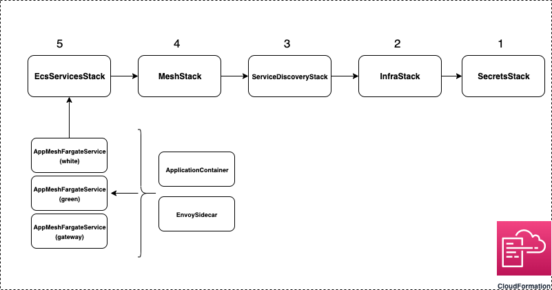

# About

In this walkthrough we'll enable TLS encryption between two services in App Mesh using X.509 certificates packaged with your Envoy container. This example demonstrates how AWS CDK (v2) can be used to provision App Mesh infrastructure.
A non CDK version of this walkthrough is available [here](https://github.com/aws/aws-app-mesh-examples/tree/main/walkthroughs/howto-tls-file-provided).

In App Mesh, traffic encryption works between virtual nodes and virtual gateways, and thus between Envoys in your service mesh. This means your application code is not responsible for negotiating a TLS-encrypted session, instead allowing the local proxy to negotiate and terminate TLS on your application's behalf.

In this guide, we will be configuring App Mesh to use the file based strategy of providing TLS certificates to Envoy.

# Prerequisites

- An active AWS account
- [`node`](https://nodejs.org/en/download/)
- [`npm`](https://docs.npmjs.com/downloading-and-installing-node-js-and-npm)
- [AWS CLI](https://docs.aws.amazon.com/cli/latest/userguide/getting-started-install.html)
- [AWS CDK (V2)](https://docs.aws.amazon.com/cdk/v2/guide/cli.html)
- [TypeScript](https://www.typescriptlang.org/download)
- [`aws-cdk-lib`](https://www.npmjs.com/package/aws-cdk-lib)
- [Docker](https://docs.docker.com/get-docker/)
- [`jq`](https://stedolan.github.io/jq/)

_Note - CDK uses default AWS credentials `~/.aws/credentials` and configuration `~/.aws/config` unless specified explicitly in the Stack. To learn more about this, click [here](https://docs.aws.amazon.com/cdk/v2/guide/environments.html)._

# Setup & Deployment

_Note - Standard AWS costs may apply when provisioning infrastructure._

- Open your terminal
- Clone the repository `git clone https://github.com/aws/aws-app-mesh-examples.git`
- Navigate to `aws-app-mesh-examples/walkthroughs/cdk-examples/howto-tls-file-provided/`

Let us start by exporting a key-pair name, that will be used to `ssh` into a Bastion host we will provision later.

```bash
export KEY_PAIR_NAME=<name of the key pair to use>
```

Optional: If you want to create a new key-pair, run these commands:

```bash
aws ec2 create-key-pair --key-name $KEY_PAIR_NAME | jq -r .KeyMaterial > ~/.ssh/$KEY_PAIR_NAME.pem
```

```bash
chmod 400 ~/.ssh/$KEY_PAIR_NAME.pem
```

Optional: Note that the example apps use Go modules. By default `"GO_PROXY": "direct"` in `cdk.json`. You can change this to `"GO_PROXY": "https://proxy.golang.org"`.

We can now provision our infrastructure through CDK.

```bash
cdk bootstrap
```

```bash
cdk deploy --all --require-approval never --context make-certs=true
```

Once the entire infrastructure has been provisioned, you will see the following message on your terminal.

```c
infra/svc-dscvry/mesh/ecs-services (ecs-services)
infra/svc-dscvry/mesh/ecs-services (ecs-services): deploying...
[0%] start: Publishing 159a00f0e099adcb2e62fed7a5a5587841d20f99327cb01ed8e22b9ad003442f:current_account-current_region
[100%] success: Published 159a00f0e099adcb2e62fed7a5a5587841d20f99327cb01ed8e22b9ad003442f:current_account-current_region
ecs-services: creating CloudFormation changeset...

 ✅  infra/svc-dscvry/mesh/ecs-services (ecs-services)

✨  Deployment time: 19.43s

Outputs:
infrasvcdscvrymeshecsservicesDCAA690C.BastionIP = export BASTION_IP=XXX.XXX.XXX.XXX
infrasvcdscvrymeshecsservicesDCAA690C.URL = export URL=gateway-XXXXXXXXXX.us-west-1.elb.amazonaws.com
Stack ARN:
arn:aws:cloudformation:us-west-1:XXXXXXXXXX:stack/ecs-services/XXXXXXXXXX-XXXX-XXXX-XXXX-XXXXXXXXXX

✨  Total time: 22.52s
```

We can see that the deployment produces two outputs:

- `URL` - which is the DNS name of the public Application Load Balancer (ALB).
- `BastionIP` - which is the public IP address of the Bastion Host.

Let's copy the ourputs and set them in our environment.

```bash
export BASTION_IP=<BastionIP>
export URL=<URL>
```

## Certficate Generation

To encrypt traffic between our services, we generate certficates using the `SecretsStack` (`lib/stacks/secrets.ts`).

Adding `--context make-certs=true` in the `cdk deploy` command runs the `./src/tlsCertificates/certs.sh` script as a `node` child process.

This `certs.sh` script generates a few different files:

- \*\_cert.pem: These files are the public side of the certificates
- \*\_key.pem: These files are the private key for the certificates
- \*\_cert_chain: These files are an ordered list of the public certificates used to sign a private key
- ca_1_ca_2_bundle.pem: This file contains the public certificates for both CAs.

Once generated, these are deployed to AWS Secrets Manager. For this demo, we are going to set up two separate Certificate Authorities, CA 1 and CA 2. The first one will be used to sign the certificate for the White Color Teller, the second will be used to sign the certificate for the Green Color Teller.

You can verify that the White Color Teller certificate was signed by CA 1 using this command.

```bash
openssl verify -verbose -CAfile src/tlsCertificates/ca_1_cert.pem  src/tlsCertificates/colorteller_white_cert.pem
```

You should see a response saying `OK`

```bash
src/tlsCertificates/colorteller_white_cert.pem: OK
```

To store these certficates in Envoy, we build a custom Docker Image `src/customEnvoyImage/Dockerfile` and deploy it to Amazon Elastic Container Registry (ECR). To do this, we make use of the [`aws-ecr-assets.DockerImageAsset`](https://docs.aws.amazon.com/cdk/api/v2/docs/aws-cdk-lib.aws_ecr_assets.DockerImageAsset.html) construct in the `InfraStack` (`lib/stacks/infra.ts`).

This image stores certfiicates in the `/keys` directory, which will be referenced by the virtual nodes for TLS encryption.

## Step 1: Testing the SSL Handshake

- Run the following command.

```bash
ssh -i ~/.ssh/$KEY_PAIR_NAME.pem ec2-user@$BASTION_IP
```

- After following the prompts, run the following command in the Bastion Host to get the SSL Handshake status from the White Color Teller Envoy proxy.

```bash
curl -s http://colorteller.default.svc.cluster.local:9901/stats | grep ssl.handshake
listener.0.0.0.0_15000.ssl.handshake: 1
```

- You should see an output similar to `listener.0.0.0.0_15000.ssl.handshake: 1` indicating a successful handshake.

- To exit from the Bastion Host, type `exit` and hit Enter.

## Step 2: White Color Teller Response

- Let's query the gateway load balancer.

```bash
curl $URL/color
WHITE%
```

- We can see that the White Color Teller returns a response.

## Step 3: Client TLS Validation

Enabling TLS communication from your virtual node is the first step to securing your traffic. In a zero trust system, the Color Gateway should also be responsible for defining what certificate authorities are trusted.

App Mesh allows you to configure Envoy with information on what CAs you trust to vend certificates. We will demonstrate this by adding a new color teller to our service that has a TLS certificate vended from a different CA than the first.

- To update the mesh such that traffic is routed to the Green Color Teller node, we need to perform another deployment. Since we have already generated the certficates, we don't need to deploy them again.

```bash
cdk deploy --all --require-approval never --context make-certs=false --context mesh-update=add-green-vn
```

- Once the deployment is done, we can verify that traffic is also being routed to the Green Color Teller Node. You may have to run the command below multiple times a response from both virtual nodes.

```bash
curl $URL/color
GREEN%
curl $URL/color
WHITE%
```

## Step 4: Adding TLS Validation to the Virtual Gateway

As you just saw, we were able to add a new Virtual Node with TLS to our mesh and the Virtual Gateway was able to communicate with it no problem.

In the client/server relationship, if the server decides to turn on TLS, App Mesh configures the client Envoys to accept the certificate offered. However, clients should also validate that the certificate offered by the server is from a certificate authority they trust. App Mesh allows you to define a client policy for TLS validation to ensure that the certificate is valid and issued from a trustworthy source.

If you recall, the Green Color Teller certificates were signed by a different CA than the White Color Teller certificates. Perhaps this is not the intended behavior and we want to reject certificates from any CA that is not CA 1.

- To update the mesh such that the virtual gateway only trusts CA 1, we will provision another deployment.

```bash
cdk deploy --all --require-approval never --context make-certs=false --context mesh-update=trust-only-ca1
```

- Once the deployment is done, lets try getting the response from the two virtual nodes. You may have to run the command below multiple times a response from both nodes.

```bash
curl $URL/color
WHITE%
curl $URL/color
upstream connect error or disconnect/reset before headers. reset reason: connection failure, transport failure reason: TLS error: 268435581:SSL routines:OPENSSL_internal:CERTIFICATE_VERIFY_FAILED%
```

- Since the client only trusts CA 1, we can see that we are not able to trust the Green Color Teller node since it is signed by CA 2. This results in a TLS error.

## Step 5: Restoring Communication with the Green Color Teller

We can restore communication by changing the certificate chain in the backend group to be `ca_1_ca_2_bundle.pem`. This contains both the public certificates for CA 1 and CA 2, which will instruct Envoy to accept certificates signed by both CA 1 and CA 2.

- To update the mesh such that the virtual gateway trusts CA 1 and CA 2, we will provision another deployment.

```bash
cdk deploy --all --require-approval never --context make-certs=false --context mesh-update=trust-ca1-ca2
```

- Once the deployment is complete, lets try getting the response from the two virtual nodes. You may have to run the command below multiple times a response from both nodes.

```bash
curl $URL/color
WHITE%
curl $URL/color
GREEN%
```

# Cleanup

- Navigate to your project directory
- Run `cdk destroy --all` and hit `y` when the prompt appears. The cleanup process might take a few minutes.

```bash
cdk destroy --all
Are you sure you want to delete: infra/svc-dscvry/mesh/ecs-services, infra/svc-dscvry/mesh, infra/svc-dscvry, infra, secrets (y/n)? y
```

# CDK Code

<details>
<summary><b>Expand this section to learn more about provisioning App Mesh resources using custom CDK constructs</b></summary>

## Stacks and Constructs

There are a total of 5 Stacks that provision all the infrastructure for the example.

_Note - The `cdk bootstrap` command provisions a `CDKToolkit` Stack to deploy AWS CDK apps into your cloud enviroment._

1. `SecretsStack` - provisions the generated certficates as plaintext secrets in AWS Secrets Manager.
1. `InfraStack` - provisions the network infrastructure like the VPC, ECS Cluster, IAM Roles and the Docker images that are pushed to the ECR Repository.
1. `ServiceDiscoveryStack` - provisions 3 CloudMap services that are used for service discovery by App Mesh.
1. `MeshStack` - provisions the different mesh components like the frontend and backend virtual nodes, virtual router and the backend virtual gateway.
1. `EcsServicesStack` - this stack provisions the 3 Fargate services using a custom construct `AppMeshFargateService` which encapsulates the application container and Envoy sidecar/proxy into a single construct allowing us to easily spin up different 'meshified' Fargate Services.

Two more constructs - `EnvoySidecar` and `ApplicationContainer` bundle the common container options used by these Fargate service task definitions.

<p align="center">
  
</p>

The order mentioned above also represents the dependency these Stacks have on eachother. In this case, since we are deploying the `EnvoySidecar` containers along with our application code, it is necessary for the mesh components to be provisioned before the services are running, so the Envoy proxy can locate them using the `APPMESH_RESOURCE_ARN` environment variable.

These dependencies are propagated by passing the Stack objects in the `constructor` of their referencing Stack.

```c
// howto-tls-file-provided.ts
const infra = new InfraStack(app, "infra", { stackName: "infra" });
const serviceDiscovery = new ServiceDiscoveryStack(infra, "svc-dscvry", { stackName: "svc-dscvry" });
```

## App Mesh CDK Constructs

To easily define Fargate services with Envoy proxies, we make use of the `AppMeshFargateService` construct mentioned above. The main purpose of this construct is to bundle the application containers with the Envoy sidecar and proxy. To do so, we define a set of custom props in `lib/utils.ts` called `AppMeshFargateServiceProps`.

```c
// utils.ts
export interface EnvoyConfiguration {
  container: EnvoySidecar;
  proxyConfiguration?: ecs.ProxyConfiguration;
}

export interface AppMeshFargateServiceProps {
  serviceName: string;
  taskDefinitionFamily: string;
  serviceDiscoveryType?: ServiceDiscoveryType;
  applicationContainer: ApplicationContainer;
  envoyConfiguration?: EnvoyConfiguration;
  xrayContainer?: XrayContainer;
}

```

Note that the `proxyConfiguration` prop in `EnvoyConfiguration` is separate because the Envoy sidecar container can exist own its own without acting as a proxy, but for it to act as a proxy there must be a running container with the name mentioned in the proxy configuration. These props are passed to instantiate Fargate Services in the `EcsServicesStack`. Once the attributes are passed to the construct, simple conditional checks can be used to add container dependencies and appropriate service discovery mechanisms for the different services.

The crux of the mesh infrastructure lies in the `MeshStack`. We can create resources like virtual nodes using appropriate CDK constructs. In this case, since we are building 2 TLS enabled virtual nodes, we can define a common method to instantiate them.

```c
// mesh-components.ts
this.virtualNodeWhite = this.buildTlsEnabledVirtualNode(
      "ColorTellerWhite",
      this.serviceDiscovery.infra.serviceWhite,
      this.whiteCertChainPath,
      this.whitePrivateKeyPath
    );


// private method in MeshStack
private buildTlsEnabledVirtualNode = (
    virtualNodeName: string,
    serviceName: string,
    certChainPath: string,
    privateKeyPath: string
  ): appmesh.VirtualNode => {
    return new appmesh.VirtualNode(this, `${this.stackName}${virtualNodeName}`, {
      mesh: this.mesh,
      virtualNodeName: virtualNodeName,
      serviceDiscovery: this.serviceDiscovery.getAppMeshServiceDiscovery(serviceName),
      listeners: [
        appmesh.VirtualNodeListener.http({
          port: 80,
          healthCheck: appmesh.HealthCheck.http({
            healthyThreshold: 2,
            unhealthyThreshold: 3,
            path: "/ping",
          }),
          tls: {
            mode: appmesh.TlsMode.STRICT,
            certificate: appmesh.TlsCertificate.file(certChainPath, privateKeyPath),
          },
        }),
      ],
    });
  };
}
```

Once we define the virtual nodes, the routing logic of the mesh can be defined using the `aws-appmesh.RouteSpec` and `aws-appmesh.Route` constructs. The `aws-appmesh.RouteSpec` registers virtual nodes as weighted targets to route traffic to.

```c
// mesh-components.ts
this.route = new appmesh.Route(this, `${this.stackName}BackendRoute`, {
      mesh: this.mesh,
      virtualRouter: this.virtualRouter,
      routeName: "ColorTellerRoute",
      routeSpec: appmesh.RouteSpec.http({
        weightedTargets: [
          {
            virtualNode: this.virtualNodeWhite,
            weight: whiteVnWeight,
          },
          {
            virtualNode: this.virtualNodeGreen,
            weight: greenVnWeight,
          },
        ],
      }),
    });
```

## Project Structure & Context

The skeleton of the project is generated using the `cdk init app --language typescript` command. By default, your main `node` app sits in the `bin` folder and the cloud infrastructure is provisioned in the `lib` folder.

The `cdk.json` file allows us to populate configuration variables in the `context`. In this example, you can see the `ENVOY_IMAGE` variable is defined here and then fetched in the `InfraStack` using the `tryGetContext` method.

```c
//infra.ts
this.customEnvoyImageAsset = this.buildImageAsset(
      path.join(__dirname, this.appDir, "customEnvoyImage"),
      "CustomEnvoyImage",
      {
        AWS_DEFAULT_REGION: process.env.CDK_DEFAULT_REGION!,
        ENVOY_IMAGE: this.node.tryGetContext("ENVOY_IMAGE"),
      }
    );
```

The `context` can also be used to pass in runtime parameters like `--context mesh-update=add-ca1` that can allow us to provision infrastructure dynamically. We also make use of this in the `SecretsStack` to generate new certificates.

</details>

# Learn more about App Mesh

- [TLS in App Mesh](https://docs.aws.amazon.com/app-mesh/latest/userguide/tls.html)
- [Product Page](https://aws.amazon.com/app-mesh/?nc2=h_ql_prod_nt_appm&aws-app-mesh-blogs.sort-by=item.additionalFields.createdDate&aws-app-mesh-blogs.sort-order=desc&whats-new-cards.sort-by=item.additionalFields.postDateTime&whats-new-cards.sort-order=desc)
- [App Mesh under the hood](https://www.youtube.com/watch?v=h3syq1vbplE)
- [App Mesh CDK API Reference](https://docs.aws.amazon.com/cdk/api/v2/docs/aws-cdk-lib.aws_appmesh-readme.html)
