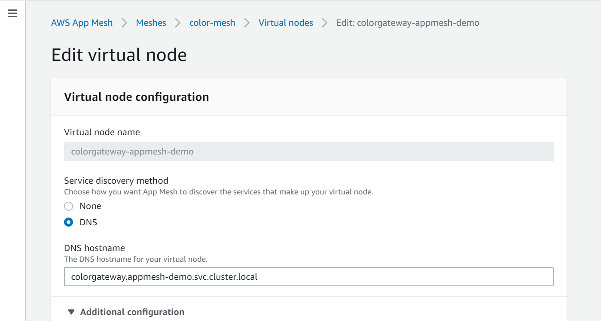
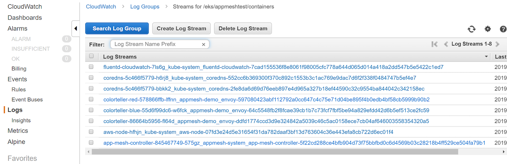

# App Mesh with EKS—Observability: CloudWatch

NOTE: Before you start with this part, make sure you've gone through the [base deployment](base.md) of App Mesh with EKS. In other words, the following assumes that an EKS cluster with App Mesh configured is available and the prerequisites (`aws`, `kubectl`, `jq`, etc. installed) are met.

## Prometheus Metrics

See [App Mesh Observability: Statistics](https://docs.aws.amazon.com/app-mesh/latest/userguide/observability.html) in the App Mesh User Guide for more information on Envoy statistics and Prometheus metrics.

You can install the CloudWatch Agent to your cluster and configure it to collect a subset of metrics from your proxies. To set the appropriate IAM permissions for your cluster and install the agent, follow the steps in [Install the CloudWatch Agent with Prometheus Metrics Collection](https://docs.aws.amazon.com/AmazonCloudWatch/latest/monitoring/ContainerInsights-Prometheus-Setup.html). The default installation contains a Prometheus scrape configuration which pulls a useful subset of Envoy stats. For more information, see [Prometheus Metrics for App Mesh](https://docs.aws.amazon.com/AmazonCloudWatch/latest/monitoring/ContainerInsights-Prometheus-metrics.html#ContainerInsights-Prometheus-metrics-appmesh).

To create an App Mesh custom CloudWatch dashboard configured to display the metrics that the agent is collecting, follow the steps in the [Viewing Your Prometheus Metrics](https://docs.aws.amazon.com/AmazonCloudWatch/latest/monitoring/ContainerInsights-Prometheus-viewmetrics.html) tutorial. Your graphs will begin to populate with the corresponding metrics as traffic enters the App Mesh application.

## Logs via Fluentd

In this section, we'll install Fluentd to your cluster and use it to forward access logs from Envoy to CloudWatch.

First, create an IAM policy as defined in [logs-policy.json](logs-policy.json) and attach it to the EC2 auto-scaling group of your EKS cluster. To attach the IAM logs policy via the command line, use:

```
$ INSTANCE_PROFILE_PREFIX=$(aws cloudformation describe-stacks | jq -r '.Stacks[].StackName' | grep eksctl-appmeshtest-nodegroup-ng)
$ INSTANCE_PROFILE_NAME=$(aws iam list-instance-profiles | jq -r '.InstanceProfiles[].InstanceProfileName' | grep $INSTANCE_PROFILE_PREFIX)
$ ROLE_NAME=$(aws iam get-instance-profile --instance-profile-name $INSTANCE_PROFILE_NAME | jq -r '.InstanceProfile.Roles[] | .RoleName')
$ aws iam put-role-policy \
      --role-name $ROLE_NAME \
      --policy-name Worker-Logs-Policy \
      --policy-document file://./logs-policy.json
```

Next, deploy Fluentd as a log forwarder using a `DaemonSet` as defined in the [fluentd.yaml](fluentd.yaml) manifest:

```
$ kubectl apply -f fluentd.yaml

# validate that the Fluentd pods are up and running:
$ kubectl -n kube-system get po -l=k8s-app=fluentd-cloudwatch
NAME                       READY   STATUS    RESTARTS   AGE
fluentd-cloudwatch-7ls6g   1/1     Running   0          13m
fluentd-cloudwatch-mdf9z   1/1     Running   0          13m
```

Now it's time to configure the virtual node `colorgateway-appmesh-demo` so it outputs its logs to `stdout`, which is in turn forwarded by Fluentd to CloudWatch. In order to configure the virtual node, use the console to set the log output on virtual node `colorgateway-appmesh-demo`.

First, locate the virtual node `colorgateway-appmesh-demo` in the AppMesh console:



Now, expand the 'Additional configuration' section and enter `/dev/stdout` in the 'HTTP access logs path' as shown in the following:


When you now go to the CloudWatch console you should see something like this:



