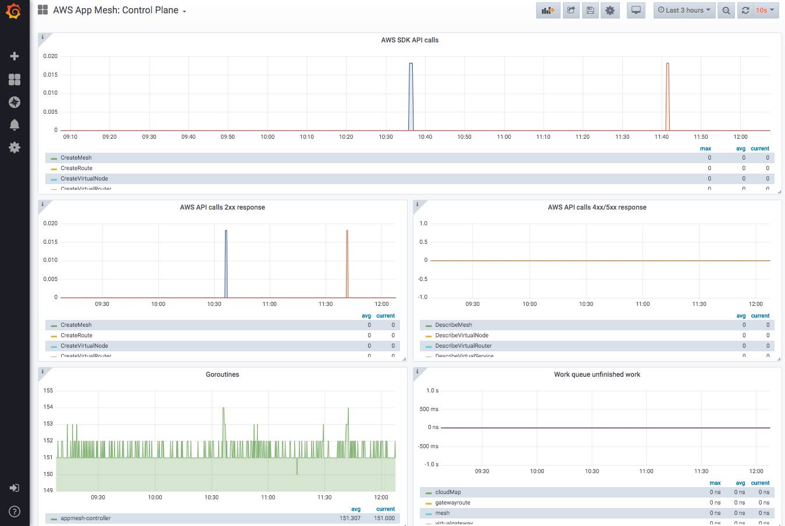
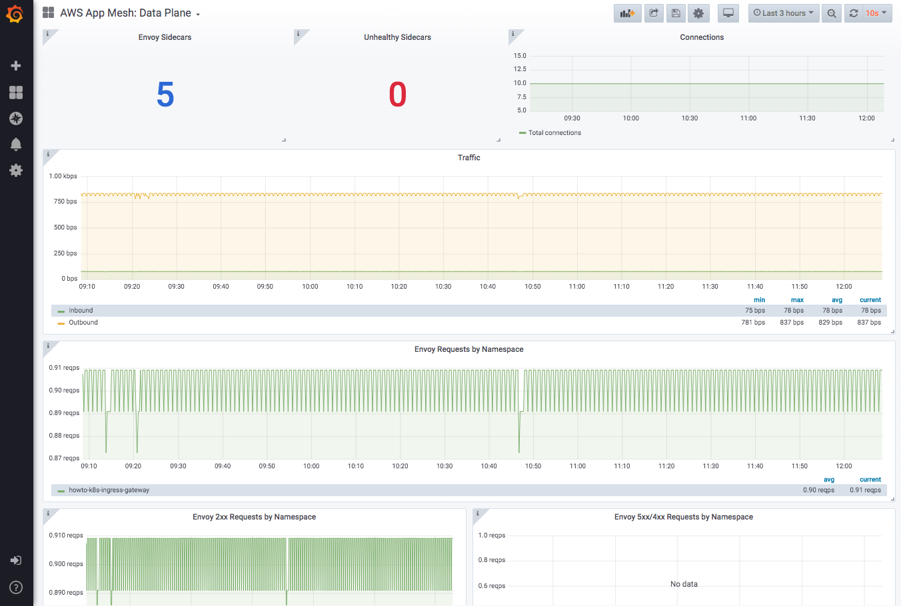

# App Mesh with EKS—Observability: Grafana
 
NOTE: Before you start with this part, make sure you've gone through the [base deployment](base.md) of App Mesh with EKS. In other words, the following assumes that an EKS cluster with App Mesh configured is available and the prerequisites (aws, kubectl, jq, etc. installed) are met.

[Grafana](https://grafana.com/) is open source visualization and analytics software. It allows you to query, visualize, alert on, and explore your metrics exported via Prometheus or other monitoring systems.

## Installation

### Option 1: Quick setup

Prequisities:
  * AWS App Mesh [Prometheus](https://github.com/aws/eks-charts/tree/master/stable/appmesh-prometheus)

App Mesh provides a basic installation to setup Grafana quickly using Helm. To install the Grafana pre-configured to work with App Mesh, follow the instructions in [appmesh-Grafana](https://github.com/aws/eks-charts/blob/master/stable/appmesh-grafana/README.md) Helm charts.


### Option 2: Existing Grafana deployment

If you already have a Grafana setup and you're interested in using the Grafana dashboards provided by App Mesh, you can find the dashboards [here](https://github.com/aws/eks-charts/tree/master/stable/appmesh-grafana/dashboards)

## Dashboards

You can use Grafana to build your own dashboards using the available Prometheus metrics. App Mesh offers pre-configured dashboards for App Mesh Kubernetes Controller and mesh data plane.

**Control Plane Dashboard**: provides overview of health of the App Mesh Kubernetes Controller

**Data Plane Dashboard**: provides overview of Envoy metrics and health

## Usage

For the testing/demo (Option 1 installation), you may use port-forwarding to the Grafana endpoint:

```
kubectl -n appmesh-system port-forward svc/appmesh-grafana 3000:3000
```

Here’s a view of a sample control plane dashboard:



Here’s a view of a sample data plane dashboard:



## Cleanup

```
helm delete appmesh-grafana -n appmesh-system
```
