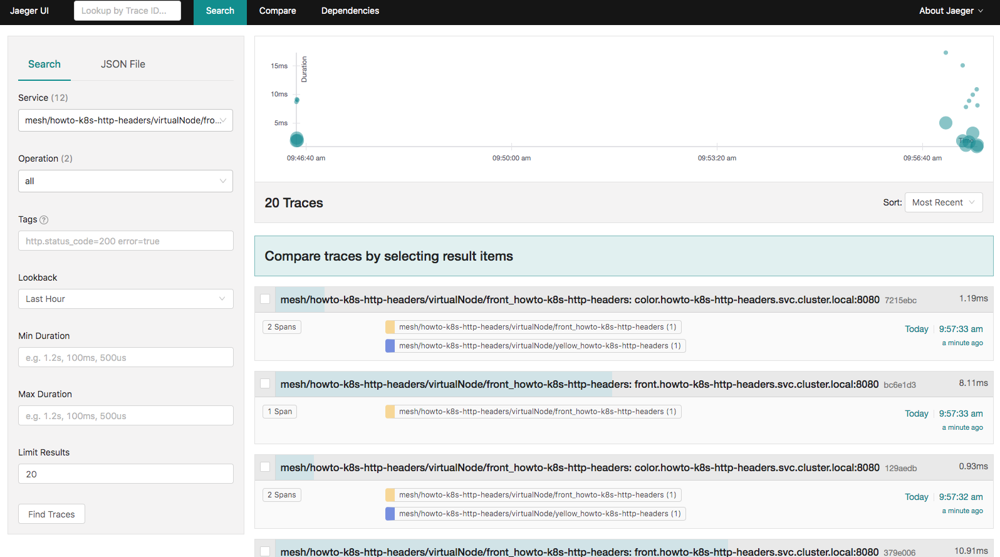
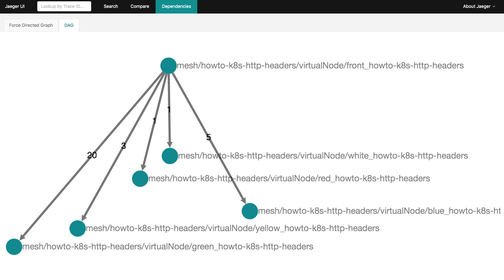

# App Mesh with EKS—Observability: Jaeger
 
NOTE: Before you start with this part, make sure you've gone through the [base deployment](base.md) of App Mesh with EKS. In other words, the following assumes that an EKS cluster with App Mesh configured is available and the prerequisites (aws, kubectl, jq, etc. installed) are met.

Jaeger is an end to end distributed tracing system, that allows users to monitor and troubleshoot transactions in complex distributed systems. 

This guide uses [Colorteller example application with HTTP header bases routing](https://github.com/aws/aws-app-mesh-examples/tree/main/walkthroughs/howto-k8s-http-headers) to showcase distributed tracing using Jaeger.


### Installation

#### Option 1: Quick setup

App Mesh provides a basic installation to setup Jaeger quickly using Helm. To install the Jaeger pre-configured to work with App Mesh, follow the instructions in [appmesh-jaeger](https://github.com/aws/eks-charts/blob/master/stable/appmesh-jaeger/README.md) Helm charts.

Note: you will need to _restart_ all the running pods inside the mesh after enabling tracing so the Envoy sidecar can pick up the tracing config

#### Option 2: Existing Jaeger deployment

If you already have a Jaeger setup, you can simply configure App Mesh Kubernetes controller to send traces to the existing Jaeger endpoint using:

```
helm upgrade -i appmesh-controller eks/appmesh-controller \
    --namespace appmesh-system \
    --set tracing.enabled=true \
    --set tracing.provider=jaeger \
    --set tracing.address=<JAEGER_ENDPOINT_ADDR / JAEGER_SERVICE_NAME> \
    --set tracing.port=<JAEGER_ENDPOINT_PORT>
```

App Mesh configures Envoy sidecars to produce traces in [Zipkin HTTP JSON v2 format](https://www.jaegertracing.io/docs/1.16/apis/#zipkin-formats-stable). The exact tracing config used is:

```
tracing:
 http:
  name: envoy.tracers.zipkin
  typed_config:
   "@type": type.googleapis.com/envoy.config.trace.v2.ZipkinConfig
   collector_cluster: jaeger
   collector_endpoint: "/api/v2/spans"
   collector_endpoint_version: HTTP_JSON
   shared_span_context: false
```


### Usage

For the testing/demo (Option 1 installation), you may use port-forwarding to Jaeger endpoint:

```
kubectl -n appmesh-system port-forward svc/appmesh-jaeger 16686:16686
```

Access the Jaeger UI using the URL: http://localhost:16686/

You can see the list of services in the dropdown on the top left and see their corresponding traces:



You can see the dependency graph under “Dependencies” tab:




### Cleanup

```
helm delete appmesh-jaeger -n appmesh-system
```

