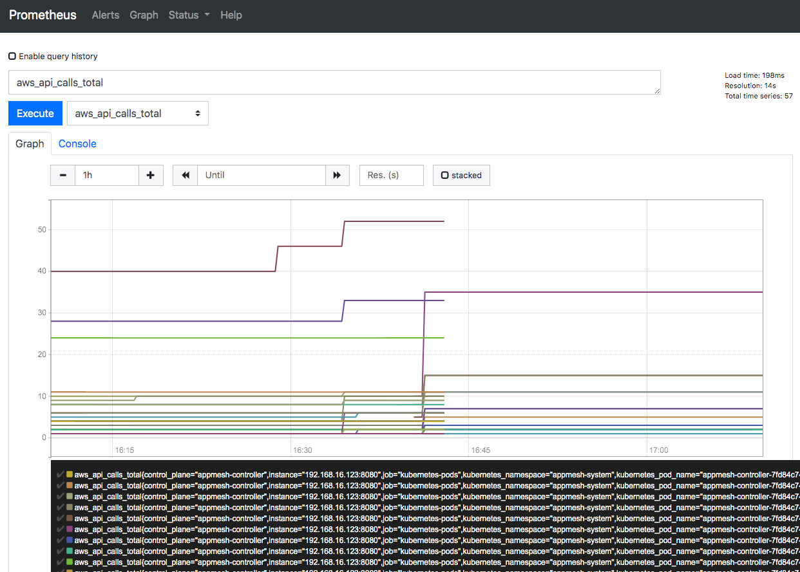

# App Mesh with EKS—Observability: Prometheus
 
NOTE: Before you start with this part, make sure you've gone through the [base deployment](base.md) of App Mesh with EKS. In other words, the following assumes that an EKS cluster with App Mesh configured is available and the prerequisites (aws, kubectl, jq, etc. installed) are met.

Prometheus is a systems and service monitoring system. It collects metrics from configured targets at given intervals, evaluates rule expressions, and displays the results. You can use Prometheus with AWS App Mesh to track metrics of applications within the meshes. You can also track metrics for the App Mesh Kubernetes Controller.

## Installation

### Option 1: Quick setup
 
App Mesh provides a basic installation to setup Prometheus quickly using Helm. To install the Prometheus pre-configured to work with App Mesh, follow the instructions in [appmesh-prometheus](https://github.com/aws/eks-charts/blob/master/stable/appmesh-prometheus/README.md) Helm charts.

### Option 2: Existing Prometheus deployment

If you already have a Prometheus setup and you’re interested in the details of Prometheus scrape config, you can find it [here](https://github.com/aws/eks-charts/blob/master/stable/appmesh-prometheus/templates/config.yaml). Specifically, the scrape config for Envoy sidecars:

```
    - job_name: 'appmesh-envoy'
      metrics_path: /stats/prometheus
      kubernetes_sd_configs:
      - role: pod
      relabel_configs:
      - source_labels: [__meta_kubernetes_pod_container_name]
        action: keep
        regex: '^envoy$'
      - source_labels: [__address__, __meta_kubernetes_pod_annotation_prometheus_io_port]
        action: replace
        regex: ([^:]+)(?::\d+)?;(\d+)
        replacement: ${1}:9901
        target_label: __address__
      - action: labelmap
        regex: __meta_kubernetes_pod_label_(.+)
      - source_labels: [__meta_kubernetes_namespace]
        action: replace
        target_label: kubernetes_namespace
      - source_labels: [__meta_kubernetes_pod_name]
        action: replace
        target_label: kubernetes_pod_name
```

## Usage

For the testing/demo (Option 1 installation), you may use port-forwarding to Prometheus endpoint:

```
kubectl -n appmesh-system port-forward svc/appmesh-prometheus 9090:9090
```

Access the Prometheus UI using the URL: http://localhost:9090/

To see the AWS API calls the App Mesh Kubernetes controller makes, search for `aws_api_calls_total`



Similarly, you can see all the scraped metrics (including application health metrics) in the metrics dropdown

## Cleanup

```
helm delete appmesh-prometheus -n appmesh-system
```
