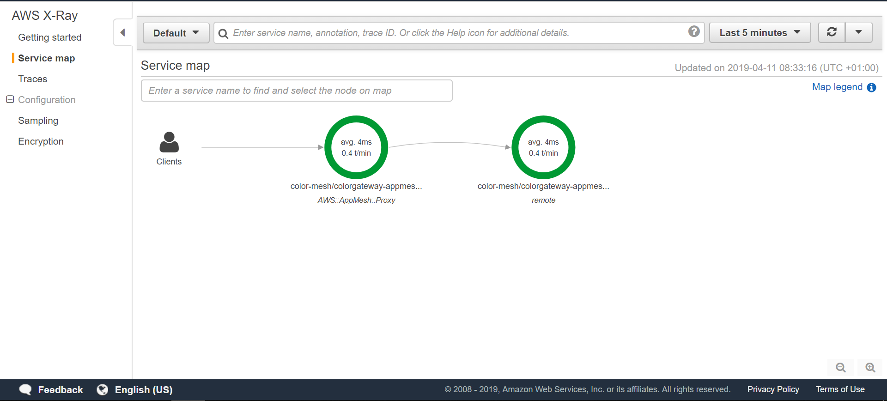
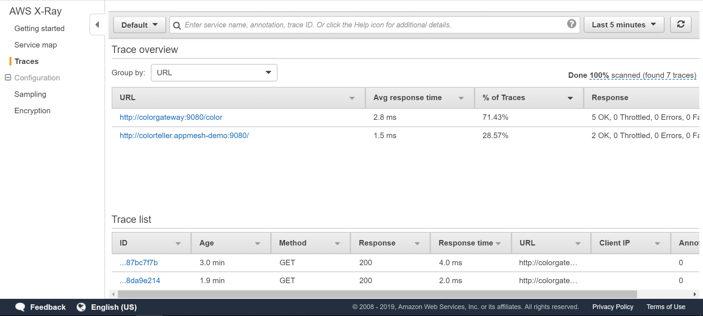
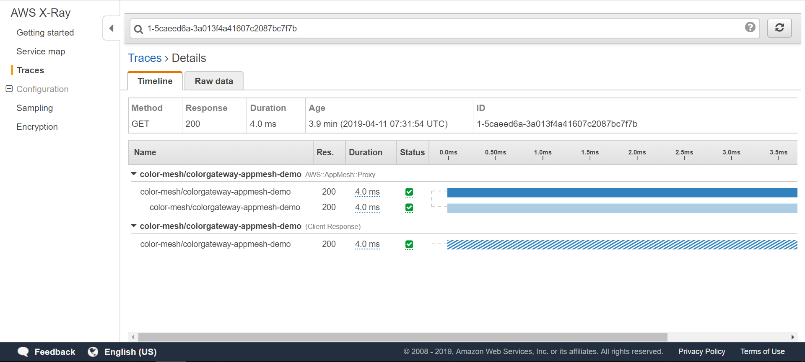

# App Mesh with EKS—Observability: X-Ray

NOTE: Before you start with this part, make sure you've gone through the [base deployment](base.md) of App Mesh with EKS. In other words, the following assumes that an EKS cluster with App Mesh configured is available and the prerequisites (`aws`, `kubectl`, `jq`, etc. installed) are met.

First, attach the IAM policy `arn:aws:iam::aws:policy/AWSXRayDaemonWriteAccess` to the EC2 auto-scaling group of your EKS cluster as. To attach the IAM policy via the command line, use:

```
$ INSTANCE_PROFILE_PREFIX=$(aws cloudformation describe-stacks | jq -r '.Stacks[].StackName' | grep eksctl-appmeshtest-nodegroup-ng)
$ INSTANCE_PROFILE_NAME=$(aws iam list-instance-profiles | jq -r '.InstanceProfiles[].InstanceProfileName' | grep $INSTANCE_PROFILE_PREFIX)
$ ROLE_NAME=$(aws iam get-instance-profile --instance-profile-name $INSTANCE_PROFILE_NAME | jq -r '.InstanceProfile.Roles[] | .RoleName')
$ aws iam attach-role-policy \
      --role-name $ROLE_NAME \
      --policy arn:aws:iam::aws:policy/AWSXRayDaemonWriteAccess
```

Enable X-Ray tracing for the App Mesh data plane

```sh
helm upgrade -i appmesh-controller eks/appmesh-controller \
    --namespace appmesh-system \
    --set tracing.enabled=true \
    --set tracing.provider=x-ray
```

The X-Ray daemon is automatically injected by [App Mesh Controller](https://github.com/aws/aws-app-mesh-controller-for-k8s) into your app containers. Let's verify that with the following command:


```
$ kubectl -n appmesh-demo \
          get pods
NAME                                 READY   STATUS    RESTARTS   AGE
colorgateway-69cd4fc669-p6qhn        3/3     Running   0          11m
colorteller-845959f54-4cj5v          3/3     Running   0          11m
colorteller-black-6cc98458db-pqbv6   3/3     Running   0          11m
colorteller-blue-88bcffddb-6bmlt     3/3     Running   0          11m
colorteller-red-6f55b447db-2ht5k     3/3     Running   0          11m
```

You see the `3` here in the `READY` column? That means there are three containers running in each of the pods: the app container itself, Envoy as part of the App Mesh data plane, and the X-Ray agent feeding the traces to the X-Ray service.

As a result we can now see the overall [service map](https://docs.aws.amazon.com/xray/latest/devguide/xray-console.html#xray-console-servicemap) rendering the wiring of the services: 



And, drilling down deeper, we can see the [traces](https://docs.aws.amazon.com/xray/latest/devguide/xray-concepts.html#xray-concepts-traces), representing service invocations along the request path:



The detailed view of a trace:


