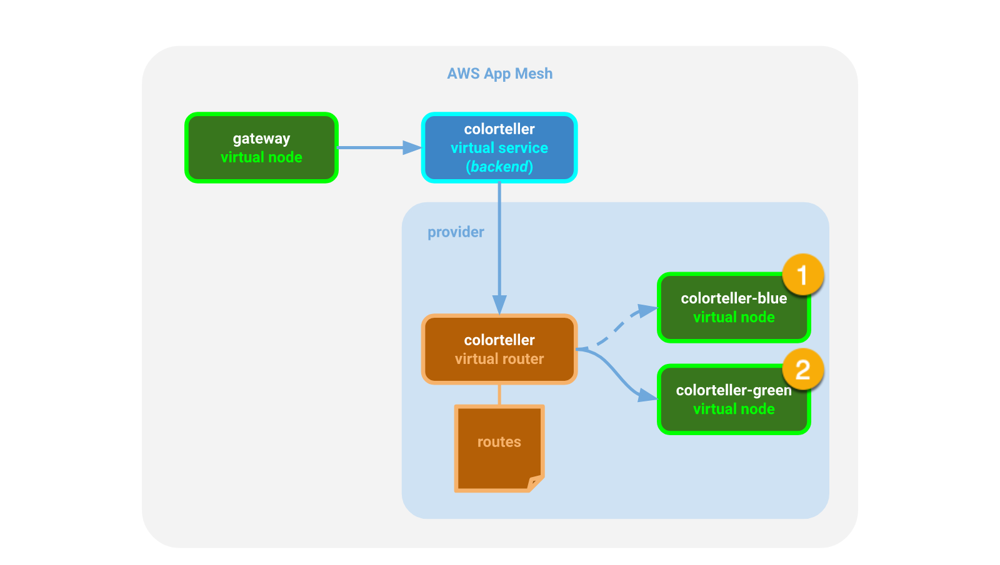

## Access Log Format Feature Background
Today App Mesh supports configuring access log file path (https://docs.aws.amazon.com/app-mesh/latest/userguide/envoy-logs.html) for virtual nodes (https://docs.aws.amazon.com/app-mesh/latest/userguide/virtual_nodes.html) and virtual gateways (https://docs.aws.amazon.com/app-mesh/latest/userguide/virtual_gateways.html). We apply the same configuration for all the listener filter chains in Envoy. If not specified, Envoy will output logs to /dev/stdout by default. 

In this feature, we add support for different logging format like text_format_source or json_format. Following the walkthrough, you will be able to deploy color app with customized logging focusing on things that you really care about. It would also help if you want to export the logging file to other tools which requires a specific format or pattern to do further analysis. 

## Step 1: Prerequisites

1. Make sure you have version 1.18.172 or higher of the [AWS CLI v1](https://docs.aws.amazon.com/cli/latest/userguide/install-cliv1.html) installed or you have version 2.0.62 or higher of the [AWS CLI v2](https://docs.aws.amazon.com/cli/latest/userguide/install-cliv2.html) installed.

2. You'll need a keypair stored in AWS to access a bastion host.
   If you do not already have one, you can create a keypair using the command below if you don't have one. See [Amazon EC2 Key Pairs](https://docs.aws.amazon.com/AWSEC2/latest/UserGuide/ec2-key-pairs.html).

    ```bash
    aws ec2 create-key-pair --key-name color-app | jq -r .KeyMaterial > ~/.ssh/color-app.pem
    chmod 400 ~/.ssh/color-app.pem
    ```

    This command creates an Amazon EC2 Key Pair with name `color-app` and saves the private key at `~/.ssh/color-app.pem`.

4. Additionally, this walkthrough makes use of the unix command line utility `jq`. If you don't already have it, you can install it from [here](https://stedolan.github.io/jq/).
5. Install Docker. It is needed to build the demo application images.


## Step 2: Set Environment Variables and deploy color app
We need to set a few environment variables before provisioning the infrastructure.
Please set the value for `AWS_ACCOUNT_ID`, `KEY_PAIR_NAME`,'AWS_DEFAULT_REGION' and `ENVOY_IMAGE` below.

```bash
export AWS_ACCOUNT_ID=<your account id>
export KEY_PAIR_NAME=<color-app or your SSH key pair stored in AWS>
export AWS_DEFAULT_REGION=<your region here>
export ENVOY_IMAGE=840364872350.dkr.ecr.<region-code>.amazonaws.com/aws-appmesh-envoy:latest
export AWS_PROFILE=default
export ENVIRONMENT_NAME=LOGGING
export MESH_NAME=appmesh-mesh-logging
export SERVICES_DOMAIN=logging.local
export GOPROXY=direct
export GO_PROXY=direct
```
This example is based on color app with Virtual Node on both EC2 and Fargate instance. Follow the color app example in aws-app-mesh-examples/examples/apps/colorapp/
then follow walkthrough in aws-app-mesh-examples/walkthroughs/fargate/ to the step where you have 2 active virtual nodes blue (on EC2) and green (on fargate).

Or you can follow the following steps:

We'll start by setting up the basic infrastructure for our services.

1. create the VPC.

```bash
./infrastructure/vpc.sh
```
2. Create the Mesh

```bash
./infrastructure/appmesh-mesh.sh
```
3. create the ECS cluster

```bash
./infrastructure/ecs-cluster.sh
```
4. create mesh resources

```bash
./colorapp-ecs/appmesh-colorapp.sh
```
5. Deploy service to ECS

```bash
aws ecr create-repository --repository-name=gateway
export COLOR_GATEWAY_IMAGE=$(aws ecr describe-repositories --repository-names=gateway --query 'repositories[0].repositoryUri' --output text)
./colorapp-ecs/gateway/deploy.sh
```

```bash
aws ecr create-repository --repository-name=colorteller
export COLOR_TELLER_IMAGE=$(aws ecr describe-repositories --repository-names=colorteller --query 'repositories[0].repositoryUri' --output text)
./colorapp-ecs/colorteller/deploy.sh
```

```bash
./colorapp-ecs/ecs-colorapp.sh
```

To test:

```bash
colorapp=$(aws cloudformation describe-stacks --region=$AWS_DEFAULT_REGION --stack-name=$ENVIRONMENT_NAME-ecs-colorapp --query="Stacks[0].Outputs[?OutputKey=='ColorAppEndpoint'].OutputValue" --output=text)
curl $colorapp/color
```
6. deploy new virtual node on fargat instance

```bash
./colorapp-ecs/fargate/appmesh-colorapp.sh
./colorapp-ecs/fargate/fargate-colorteller.sh
```

To test:

```bash
colorapp=$(aws cloudformation --region=$AWS_DEFAULT_REGION describe-stacks --stack-name=$ENVIRONMENT_NAME-ecs-colorapp --query="Stacks[0].Outputs[?OutputKey=='ColorAppEndpoint'].OutputValue" --output=text)
curl $colorapp/color
```

## Step 3: Update logging format and Verify

Our next step is to update the logging format and test it out.

1. check meshes is deployed

```bash
aws --endpoint-url https://frontend.$AWS_DEFAULT_REGION.prod.lattice.aws.a2z.com --region $AWS_DEFAULT_REGION appmesh-internal list-meshes
```
2. check virtual node green (on fargate)

```bash
aws --endpoint-url https://frontend.$AWS_DEFAULT_REGION.prod.lattice.aws.a2z.com --region $AWS_DEFAULT_REGION appmesh-internal describe-virtual-node --virtual-node-name colorteller-green-vn --mesh-name $MESH_NAME
```

3. update virtual node with text logging format in it

```bash
aws --endpoint-url https://frontend.$AWS_DEFAULT_REGION.prod.lattice.aws.a2z.com --region $AWS_DEFAULT_REGION appmesh-internal update-virtual-node --virtual-node-name colorteller-blue-vn --mesh-name $MESH_NAME --cli-input-json file://src/blue-text-format.json
aws --endpoint-url https://frontend.$AWS_DEFAULT_REGION.prod.lattice.aws.a2z.com --region $AWS_DEFAULT_REGION appmesh-internal update-virtual-node --virtual-node-name colorteller-green-vn --mesh-name $MESH_NAME --cli-input-json file://src/green-text-format.json
```
If you go to ECS -> Green/Blue backend task -> log -> envoy and search for Green/Blue
You should see logs like this:

```
BlueTestLog::200:path=/ping
```

4. update virtual node with json logging format in it

```bash
aws --endpoint-url https://frontend.$AWS_DEFAULT_REGION.prod.lattice.aws.a2z.com --region $AWS_DEFAULT_REGION appmesh-internal update-virtual-node --virtual-node-name colorteller-blue-vn --mesh-name $MESH_NAME --cli-input-json file://src/blue-json-format.json
aws --endpoint-url https://frontend.$AWS_DEFAULT_REGION.prod.lattice.aws.a2z.com --region $AWS_DEFAULT_REGION appmesh-internal update-virtual-node --virtual-node-name colorteller-green-vn --mesh-name $MESH_NAME --cli-input-json file://src/green-json-format.json
```

If you go to ECS -> Green/Blue backend task -> log -> envoy and search for Green/Blue
You should see logs like this:

```
{"BlueTestLog":200,"protocol":"HTTP/1.1"}
```

5. update virtual node with no logging format in it

```bash
aws --endpoint-url https://frontend.$AWS_DEFAULT_REGION.prod.lattice.aws.a2z.com --region $AWS_DEFAULT_REGION appmesh-internal update-virtual-node --virtual-node-name colorteller-blue-vn --mesh-name $MESH_NAME --cli-input-json file://src/blue-no-format.json
aws --endpoint-url https://frontend.$AWS_DEFAULT_REGION.prod.lattice.aws.a2z.com --region $AWS_DEFAULT_REGION appmesh-internal update-virtual-node --virtual-node-name colorteller-green-vn --mesh-name $MESH_NAME --cli-input-json file://src/green-no-format.json
```
Search for `colorteller-blue.logging.local` in console you and should see the default format like following
```
[2022-08-04T23:00:29.383Z] "GET /ping HTTP/1.1" 200 - 0 0 1 0 "-" "Envoy/HC" "05ba7454-fce2-9360-92e3-a4da997d4f44" "colorteller-blue.logging.local:9080" "127.0.0.1:9080"
```
6. change between different formats or change the pattern to find bugs!

## Step 4: Clean Up


If you want to keep the application running, you can do so, but this is the end of this walkthrough.
Run the following commands to clean up and tear down the resources that we’ve created.

Delete the CloudFormation stacks:

```bash
aws cloudformation delete-stack --stack-name $ENVIRONMENT_NAME-ecs-service
aws cloudformation delete-stack --stack-name $ENVIRONMENT_NAME-ecs-cluster
aws ecr delete-repository --force --repository-name $COLOR_TELLER_IMAGE_NAME
aws ecr delete-repository --force --repository-name $WRK_TOOL_IMAGE_NAME
aws cloudformation delete-stack --stack-name $ENVIRONMENT_NAME-ecr-repositories
aws cloudformation delete-stack --stack-name $ENVIRONMENT_NAME-vpc
```
