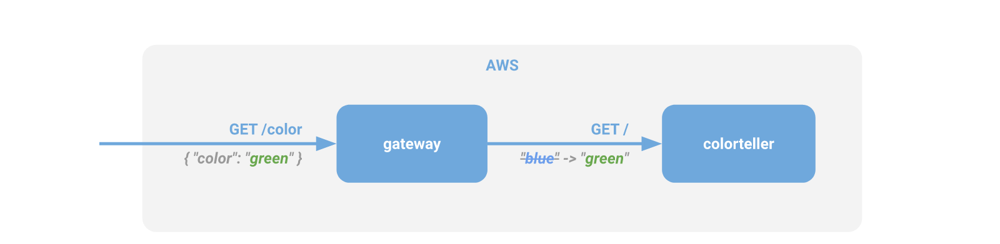
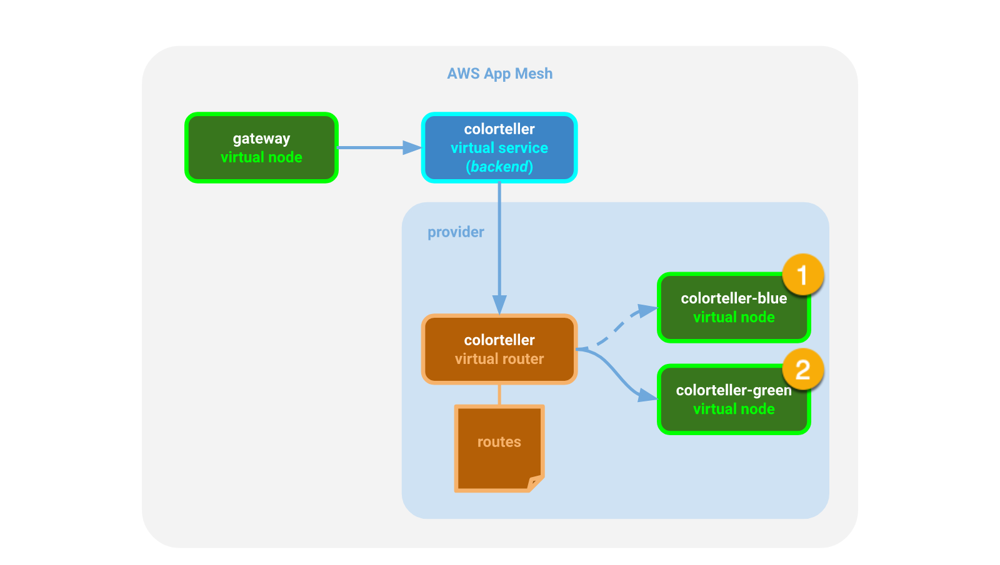
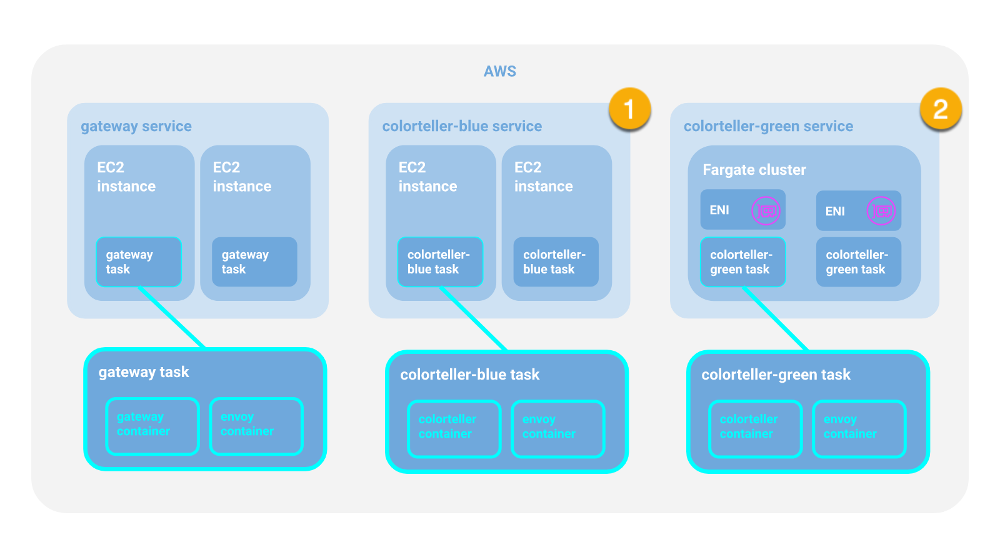
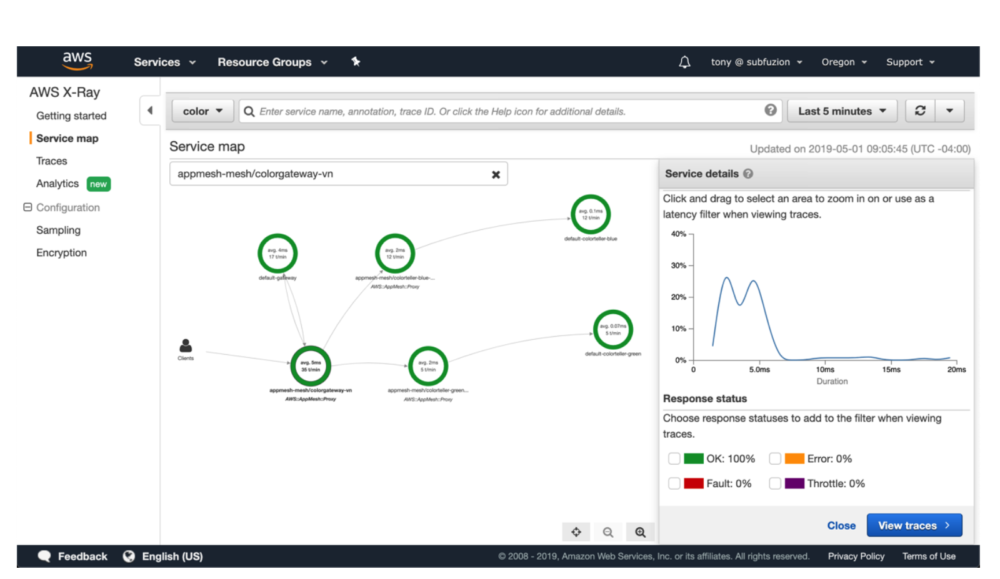
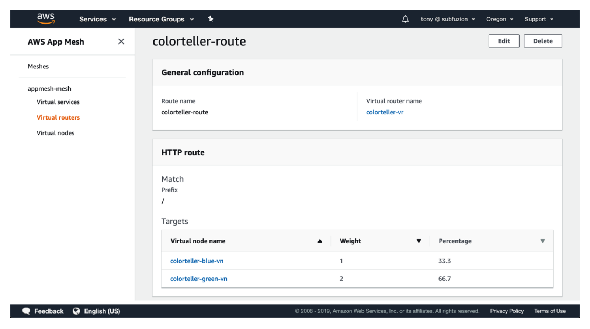

# Using AWS App Mesh with Fargate

## Overview

I gave a walkthrough in my [previous article] on how to deploy a simple microservice application to ECS and configure [AWS App Mesh] to provide traffic control and observability for it. In this article, we are going to start to explore what it means when we say that App Mesh is a service mesh that lets you control and monitor services spanning multiple AWS compute environments. We'll start with using Fargate as an ECS launch type to deploy a specific version of our `colorteller` service before we move on and explore distributing traffic across other environments, such as EC2 and EKS.

This is intentionally meant to be a simple example for clarity, but in the real world there are many use cases where creating a service mesh that can bridge different compute environments becomes very useful. Fargate is a compute service for AWS that helps you run containerized tasks using the primitives (tasks and services) of an ECS application without the need to directly configure and manage EC2 instances. Our contrived example in this article demonstrates a scenario in which you already have a containerized application running on ECS, but want to shift your workloads to use [Fargate] so that you can evolve your application without the need to manage compute infrastructure directly. 

Our strategy will be to deploy a new version of our `colorteller` service with Fargate and begin shifting traffic to it. If all goes well, then we will continue to shift more traffic to the new version until it is serving 100% of all requests. For this demo, we'll use "blue" to represent the original version and "green" to represent the new version.

As a refresher, this is what the programming model for the Color App looks like:


<p align="center"><b><i>Figure 1.</i></b> Programmer perspective of the Color App.</p>

In terms of App Mesh configuration, we will want to begin shifting traffic over from version 1 (represented by `colorteller-blue` in the following diagram) over to version 2 (represented by `colorteller-green`). Remember, in App Mesh, every version of a service is ultimately backed by actual running code somewhere (in this case ECS/Fargate tasks), so each service will have it's own *virtual node* representation in the mesh that provides this conduit.


<p align="center"><b><i>Figure 2.</i></b> App Mesh configuration of the Color App.</p>

Finally, there is the physical deployment of the application itself to a compute environment. In this demo, `colorteller-blue` runs on ECS using the EC2 launch type and `colorteller-green` will run on ECS using the Fargate launch type. Our goal is to test with a portion of traffic going to `colorteller-green`, ultimately increasing to 100% of traffic going to the new green version.


<p align="center"><b><i>Figure 3.</i></b> AWS deployment perspective of the Color App.</p>

## Prerequisites

1. You have successfully set up the prerequisites and deployed the Color App as described in the previous [walkthrough].

## Deploy

### Initial configuration

Once you have deployed the Color App (see #prerequisites), configure the app so that 100% of traffic goes to `colorteller-blue` for now. The blue color will represent version 1 of our colorteller service.

Log into the App Mesh console and drill down into "Virtual routers" for the mesh. Configure the HTTP route to send 100% of traffic to the `colorteller-blue` virtual node.


<p align="center"><b><i>Figure 4.</i></b> Routes in the App Mesh console.</p>

Test the service and confirm in X-Ray that the traffic flows through the `colorteller-blue` as expected with no errors.


<p align="center"><b><i>Figure 5.</i></b> Tracing the colorgateway virtual node.</p>

### Deploy the new colorteller to Fargate

For this configuration, we will deploy `colorteller-green`, which represents version 2 of our colorteller service. Initally, we will only send 30% of our traffic over to it. If our monitoring indicates that the service is healthy, we'll increase it to 60%, then finally to 100%. In the real world, you might choose more granular increases with automated rollout (and rollback if issues are indicated), but we're keeping things simple for the demo.

As part of the original [walkthrough] we pushed the `gateway` and `colorteller` images to ECR (see [Deploy Images]) and then launched ECS tasks with these images. We will now launch an ECS task using the Fargate launch type with the same `colorteller` and `envoy` images. When the task is deployed, the running `envoy` container will be a sidecar for the `colorteller` container. Even with the Fargate launch type where we don't manually configure EC2 instances, a sidecar container will always be co-located on the same physical instance and its lifecycle coupled to the lifecycle of the primary application container (see [Sidecar Pattern]).

#### 1. Update the mesh configuration

Our updated CloudFormation templates are located in the [repo] under `walkthroughs/fargate`.

This updated mesh configuration adds a new virtual node (`colorteller-green-vn`) and updates the virtual router (`colorteller-vr`) for the `colorteller` virtual service, so that traffic will be distributed between the blue and green virtual nodes at a 2:1 ratio (i.e., the green node will receive one third of the traffic).

```
$ ./appmesh-colorapp.sh
...
Waiting for changeset to be created..
Waiting for stack create/update to complete
...
Successfully created/updated stack - DEMO-appmesh-colorapp
$
```

#### 2. Deploy the green task to Fargate

The `fargate-colorteller.sh` script creates parameterized template definitions before deploying the `fargate-colorteller.yaml` CloudFormation template. The change to launch a colorteller task as a Fargate task is in `fargate-colorteller-task-def.json`. 

```
$ ./fargate-colorteller.sh
...

Waiting for changeset to be created..
Waiting for stack create/update to complete
Successfully created/updated stack - DEMO-fargate-colorteller
$
```

### Verify the Fargate deployment

The endpoint for the ColorApp is one of the CloudFormation template's outputs. You can view it in the stack output in the CloudFormation console, or fetch it with the AWS CLI:

```
$ colorapp=$(aws cloudformation describe-stacks --stack-name=$ENVIRONMENT_NAME-ecs-colorapp --query="Stacks[0
].Outputs[?OutputKey=='ColorAppEndpoint'].OutputValue" --output=text); echo $colorapp> ].Outputs[?OutputKey=='ColorAppEndpoint'].OutputValue" --output=text); echo $colorapp
http://DEMO-Publi-YGZIJQXL5U7S-471987363.us-west-2.elb.amazonaws.com
```

We assigned the endpoint to the `colorapp` environment variable so we can use it for a few curl requests:

```
$ curl $colorapp/color
{"color":"blue", "stats": {"blue":1}}
$
```

Since the weight of blue to green is 2:1, the result is not unsurprising. Let's clear the histogram and run it a few times until we get a green result:

```
$ curl $colorapp/color/clear
cleared

$ for ((n=0;n<200;n++)); do echo "$n: $(curl -s $colorapp/color)"; done

0: {"color":"blue", "stats": {"blue":1}}
1: {"color":"green", "stats": {"blue":0.5,"green":0.5}}
2: {"color":"blue", "stats": {"blue":0.67,"green":0.33}}
3: {"color":"green", "stats": {"blue":0.5,"green":0.5}}
4: {"color":"blue", "stats": {"blue":0.6,"green":0.4}}
5: {"color":"gre
en", "stats": {"blue":0.5,"green":0.5}}
6: {"color":"blue", "stats": {"blue":0.57,"green":0.43}}
7: {"color":"blue", "stats": {"blue":0.63,"green":0.38}}
8: {"color":"green", "stats": {"blue":0.56,"green":0.44}}
...
199: {"color":"blue", "stats": {"blue":0.66,"green":0.34}}
```

So far so good: this looks like what we expected for a 2:1 ratio.

Let's take a look at our X-Ray console:


<p align="center"><b><i>Figure 5.</i></b> X-Ray console map after initial testing.</p>

The results look good: 100% success, no errors.

We can now increase the rollout of the new (green) version of our service running on Fargate.

Since we're using CloudFormation to manage our stacks, which lets us keep our configuration under version control and simplifies the process of undeploying resources, we could update the virtual route in `appmesh-colorapp.yaml` and deploy the updated mesh configuration by running `appmesh-colorapp.sh`.

For this demo, however, let's just use the App Mesh console to make the change. Navigate to "Virtual routers" for  "appmesh-mesh", and edit the "colorteller-route". Change it so that the weighted ratio looks like this:


<p align="center"><b><i>Figure 6.</i></b> Modifying route weights with the App Mesh console.</p>

Let's run our simple verification test again:

```
$ curl $colorapp/color/clear
cleared
fargate $ for ((n=0;n<200;n++)); do echo "$n: $(curl -s $colorapp/color)"; done
0: {"color":"green", "stats": {"green":1}}
1: {"color":"blue", "stats": {"blue":0.5,"green":0.5}}
2: {"color":"green", "stats": {"blue":0.33,"green":0.67}}
3: {"color":"green", "stats": {"blue":0.25,"green":0.75}}
4: {"color":"green", "stats": {"blue":0.2,"green":0.8}}
5: {"color":"green", "stats": {"blue":0.17,"green":0.83}}
6: {"color":"blue", "stats": {"blue":0.29,"green":0.71}}
7: {"color":"green", "stats": {"blue":0.25,"green":0.75}}
...
199: {"color":"green", "stats": {"blue":0.32,"green":0.68}}
$
```

The results look good and we can confirm in the X-Ray console that we see no errors.

Finally, we can shift 100% of our traffic over to the new colorteller version. This time, we'll modify the mesh configuration template and redeploy it:

`appmesh-colorteller.yaml`
```
  ColorTellerRoute:
    Type: AWS::AppMesh::Route
    DependsOn:
      - ColorTellerVirtualRouter
      - ColorTellerGreenVirtualNode
    Properties:
      MeshName: !Ref AppMeshMeshName
      VirtualRouterName: colorteller-vr
      RouteName: colorteller-route
      Spec:
        HttpRoute:
          Action:
            WeightedTargets:
              - VirtualNode: colorteller-green-vn
                Weight: 1
          Match:
            Prefix: "/"
```


```
$ ./appmesh-colorapp.sh
...
Waiting for changeset to be created..
Waiting for stack create/update to complete
...
Successfully created/updated stack - DEMO-appmesh-colorapp
$
```

Again, we will want to repeat our verification process to confirm that the new version of our service is running successfully.

## Summary

In this walkthrough, we rolled out an update from version 1 (blue) of our colorteller service to version 2 (green). We demonstrated that App Mesh supports a mesh spanning ECS services that we ran as EC2 tasks and as Fargate tasks. In our next walkthrough, we will demonstrate that App Mesh handles even uncontainerized services launched directly on EC2 instances, providing a uniform and powerful way to control and monitor our distributed microservice applications on AWS.
 
## Resources

[AWS App Mesh Documentation]

[AWS CLI]

[Color App]

[Currently available AWS regions for App Mesh]

[Envoy Image]

[Envoy documentation]


[A/B testing]: https://en.wikipedia.org/wiki/A/B_testing
[previous article]: ../../examples/apps/colorapp/README.md
[AWS App Mesh Documentation]: https://aws.amazon.com/app-mesh/getting-started/
[AWS App Mesh]: https://aws.amazon.com/app-mesh/
[AWS CLI]: https://docs.aws.amazon.com/cli/latest/userguide/cli-chap-install.html
[Color App]: https://github.com/aws/aws-app-mesh-examples/tree/main/examples/apps/colorap
[Currently available AWS regions for App Mesh]: https://docs.aws.amazon.com/general/latest/gr/rande.html#appmesh_region
[Deploy Images]: https://medium.com/p/de3452846e9d#0d56
[Envoy documentation]: https://www.envoyproxy.io/docs/envoy/latest
[Envoy Image]: https://docs.aws.amazon.com/app-mesh/latest/userguide/envoy.html
[Fargate]: https://aws.amazon.com/fargate/
[repo]: https://github.com/aws/aws-app-mesh-examples
[Sidecar Pattern]: https://www.oreilly.com/library/view/designing-distributed-systems/9781491983638/ch02.html
[walkthrough]: ../../examples/apps/colorapp/README.md
[walkthrough prerequisites]: https://medium.com/containers-on-aws/aws-app-mesh-walkthrough-deploy-the-color-app-on-amazon-ecs-de3452846e9d#42cf
