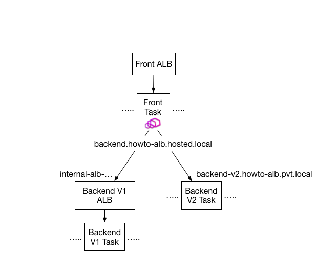

## Overview
This example shows how services that are behind ALB can be accessed by clients using Envoy with the help of App Mesh.



### Backend
There are two versions of Backend, V1 that is registered behind internal ALB and V2 that is registered under a CloudMap service (backend-v2.howto-alb.pvt.local). Additionally, there is a Route53 hosted zone (howto-alb.hosted.local) with a alias target to V1 ALB's DNS name (backend.howto-alb.hosted.local).

V1 is registered as a virtual-node with service-discovery set to DNS (ALB's DNS). V2 on the otherhand is registered as a virtual-node with CloudMap service-discovery. Backend is registered as a virtual-service (name: backend.howto-alb.hosted.local) with router that routes to V1 and V2.

### Frontend
Frontend app is ECS service that runs in private subnet behind internet-facing ALB. Frontend is registered with App Mesh as virtual-node with backends set to Backend's virtual-service. Frontend is deployed with Envoy sidecar that communicates with Backend.

## Prerequisites
1. Install Docker. It is needed to build the demo application images.

## Setup

1. Clone this repository and navigate to the walkthrough/howto-alb folder, all commands will be ran from this location
2. **Your** account id:
    ```
    export AWS_ACCOUNT_ID=<your_account_id>
    ```
3. **Region** e.g. us-west-2
    ```
    export AWS_DEFAULT_REGION=us-west-2
    ```
4. **ENVOY_IMAGE** environment variable is not set to App Mesh Envoy, see https://docs.aws.amazon.com/app-mesh/latest/userguide/envoy.html
    ```
    export ENVOY_IMAGE=...
    ```
5. Setup using cloudformation
    ```
    ./deploy.sh
    ```
