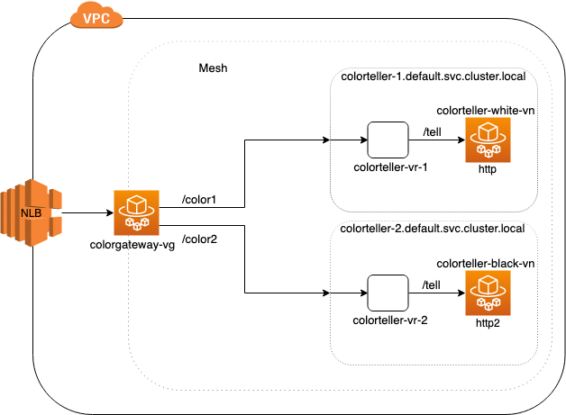

## ColorApp Setup
For the Color App setup, an NLB is used to forward traffic to the Virtual Gateway (running a set of Envoys). We configure 2 Gateway Routes - color1 and color2 pointing to 2 Virtual Services (backed by a Virtual Node each). Virtual Service `colorteller-1.default.svc.cluster.local` points to `colorteller-white-vn` which listens on http port 9080. The Virtual Service `colorteller-2.default.svc.cluster.local` points to `colorteller-black-vn` which listens on http2 port 9080.

We go through the exercise of setting up connection pool settings at the Virtual Gateway and Virtual Node.



## Step 1: Prerequisites

1. Clone this repository and navigate to the `walkthroughs/howto-circuit-breakers` folder, all the commands henceforth are assumed to be run from the same directory as this README.

2. Make sure you have version 1.18.172 or higher of the [AWS CLI v1](https://docs.aws.amazon.com/cli/latest/userguide/install-cliv1.html) installed or you have version 2.0.62 or higher of the [AWS CLI v2](https://docs.aws.amazon.com/cli/latest/userguide/install-cliv2.html) installed.

3. You'll need a keypair stored in AWS to access a bastion host.
   If you do not already have one, you can create a keypair using the command below if you don't have one. See [Amazon EC2 Key Pairs](https://docs.aws.amazon.com/AWSEC2/latest/UserGuide/ec2-key-pairs.html).

    ```bash
    aws ec2 create-key-pair --key-name color-app | jq -r .KeyMaterial > ~/.ssh/color-app.pem
    chmod go-r ~/.ssh/color-app.pem
    ```

    This command creates an Amazon EC2 Key Pair with name `color-app` and saves the private key at `~/.ssh/color-app.pem`.

4. Additionally, this walkthrough makes use of the unix command line utility `jq`. If you don't already have it, you can install it from [here](https://stedolan.github.io/jq/).
5. Install Docker. It is needed to build the demo application images.

## Step 2: Set Environment Variables
We need to set a few environment variables before provisioning the infrastructure.
Please change the value for `AWS_ACCOUNT_ID`, `KEY_PAIR_NAME`, and `ENVOY_IMAGE` below.

```bash
export AWS_ACCOUNT_ID=<your account id>
export KEY_PAIR_NAME=<color-app or your SSH key pair stored in AWS>
export AWS_DEFAULT_REGION=us-west-2
export ENVIRONMENT_NAME=CircuitBreakers
export MESH_NAME=circuit-breaker-mesh
export ENVOY_IMAGE=<get the latest from https://docs.aws.amazon.com/app-mesh/latest/userguide/envoy.html>
export SERVICES_DOMAIN="default.svc.cluster.local"
export COLOR_TELLER_IMAGE_NAME="howto-circuit-breakers/colorteller"
export WRK_TOOL_IMAGE_NAME="howto-circuit-breakers/wrktool"
```

You can change these ENV variables in `vars.env` file and then apply it using: 
`source ./vars.env`


## Step 3: Deploy Color App Infrastructure

We'll start by setting up the basic infrastructure for our services.

First, create the VPC.

```bash
./infrastructure/vpc.sh
```

Next, create the ECS cluster and ECR repositories.

```bash
./infrastructure/ecs-cluster.sh
./infrastructure/ecr-repositories.sh
```

Next, build and deploy the colorteller and wrktool images.

```bash
./src/colorteller/deploy.sh
```
and 

```bash
./src/wrktool/deploy.sh
```

**_Note_** that the example app uses go modules. If you have trouble accessing https://proxy.golang.org during the deployment you can override the GOPROXY by setting `GO_PROXY=direct`

```bash
GO_PROXY=direct ./src/colorteller/deploy.sh
```

Finally, let's create the mesh.

```bash
./mesh/mesh.sh up
```


## Step 4: Deploy services and Verify

Our next step is to deploy the service in ECS and test it out.

```bash
./infrastructure/ecs-service.sh
```

1. After a few minutes, the applications should be deployed and you will see an output such as:

	```bash
	Successfully created/updated stack - ${ENVIRONMENT_NAME}-ecs-service
	Bastion endpoint:
	123.45.67.89
	ColorApp endpoint:
	http://howto-Publi-55555555.us-west-2.elb.amazonaws.com
	```

	Export the public endpoint to access the gateway

	```bash
	export COLORAPP_ENDPOINT=<your_https_colorApp_endpoint e.g. https://howto-Publi-55555555.us-west-2.elb.amazonaws.com>
	```
	And export the bastion endpoint for later use.

	```bash
	export BASTION_IP=<your_bastion_endpoint e.g. 12.245.6.189>
	```

2. Let's issue a request to the color gateway with gatewayRoute prefix as `/color1` and backend service route prefix as `/tell`.

	```bash
	curl "${COLORAPP_ENDPOINT}/color1/tell"
	```
	If you run the above command, you should see a successful `white` response back.

	Similarly, let's issue a request to the gateway with gatewayRoute prefix as `/color2` and backend service route prefix as `/tell`.

	```bash
	curl "${COLORAPP_ENDPOINT}/color2/tell"
	```
	In this case, you should receive a successful `black` response back.

## Step 5: Testing Connection Pool settings
1. Now let's log into the bastion host and verify that our `wrk` tool is setup

	```bash
	ssh -i <key_pair_location> -l ec2-user ${BASTION_IP}
	```

    We'll curl `wrk` tool's endpoint and verify that it's up and running
    ```bash
	curl -s http://wrk-tool.default.svc.cluster.local/wrk
	```
	You should receive an `Alive!` response back.

2. Now let's test the default circuit breaking in Envoy (Currently Envoy defaults are 1024, which will soon change to AppMesh defaults of 2147483647)
    *You'll need multiple bastion host terminals to test this*
    *Note*: You might want to change the `default.svc.cluster.local` in the following commands based on your SERVICES_DOMAIN env variable.

    ```bash
	ssh -i <key_pair_location> -l ec2-user ${BASTION_IP}
	```

    Let's `watch` the Virtual Gateway stats:
    ```bash
    watch -n 0.2 "curl -s colorgateway.default.svc.cluster.local:9901/stats | grep -E '(circuit_breakers.default|cx_active|rq_active|rq_pending_active|overflow|5xx)'"
    ```

    In another bastion window, we are going to use the `wrk` tool we've setup to send more than 1024 connections:
    ```bash
    curl -i -X POST \
        -H "Content-Type:application/json" \
        -d '{"connections":"1050", "rate": "10000", "duration": "120", "url":"http://colorgateway.default.svc.cluster.local:9080/color1/tell"}' \
        http://wrk-tool.default.svc.cluster.local/wrk
    ```

    In the window that you're watching for stats, look for the following counters and gauges:

    **_Note:_** The following stats are also pushed to CloudWatch using the cwagent container.

    Incoming requests:
    ```
    http.ingress.downstream_cx_active: 1050
    ```

    Connection limit:
    ```
    cluster.cds_ingress_cb-mesh_colorgateway-vg_self_redirect_http_15001.upstream_cx_active: 1024
    cluster.cds_ingress_cb-mesh_colorgateway-vg_self_redirect_http_15001.circuit_breakers.default.cx_open: 1
    ```

    Requests limit:
    ```
    cluster.cds_egress_cb-mesh_colorteller-white-vn_http_9080.upstream_rq_active: 1024
    cluster.cds_egress_cb-mesh_colorteller-white-vn_http_9080.circuit_breakers.default.rq_open: 1
    ```

    In case you missed any of the stats, you can send the requests to `wrk` tool with a higher duration `"duration": "300"` (Unit is in seconds).

3. Now let's set the HTTP connection pool settings on Virtual Gateway to the following:
    ```bash
    "connectionPool": {
        "http": {
            "maxConnections": 100,
            "maxPendingRequests": 10000
        }
    }
    ```

    Update the Virtual Gateway (using the file `./mesh/colorgateway-vg-update.json`):
    ```bash
    ./mesh/mesh.sh update vgateway colorgateway
    ```

    Let's `watch` the Virtual Gateway stats:
    ```bash
    watch -n 0.2 "curl -s colorgateway.default.svc.cluster.local:9901/stats | grep -E '(circuit_breakers.default|cx_active|rq_active|rq_pending_active|overflow|5xx)'"
    ```

    In another bastion window, we are going to use the `wrk` tool to send more than 100 connections:
    ```bash
    curl -i -X POST \
        -H "Content-Type:application/json" \
        -d '{"connections":"101", "rate": "5000", "duration": "60", "url":"http://colorgateway.default.svc.cluster.local:9080/color1/tell"}' \
        http://wrk-tool.default.svc.cluster.local/wrk
    ```

    In the window that you're watching for stats, look for the following counters and gauges (notice when the `cx_open` gauge flips):
    ```
    http.ingress.downstream_cx_active: 101
    cluster.cds_ingress_cb-mesh_colorgateway-vg_self_redirect_http_15001.upstream_cx_active: 100
    cluster.cds_ingress_cb-mesh_colorgateway-vg_self_redirect_http_15001.circuit_breakers.default.cx_open: 1
    ```

4. Now let's set the HTTP connection pool settings on `colorteller-white` Virtual Node to the following value:
    ```bash
    "connectionPool": {
        "http": {
            "maxConnections": 10,
            "maxPendingRequests": 5
        }
    }
    ```

    Update the Virtual Node (using the file `./mesh/colorteller-white-vn-update.json`):
    ```bash
    ./mesh/mesh.sh update vnode colorteller-white
    ```

    Let's `watch` the `colorteller-white` Virtual Node stats:
    ```bash
    watch -n 0.2 "curl -s colorteller-white.default.svc.cluster.local:9901/stats | grep -E '(circuit_breakers.default|cx_active|rq_active|rq_pending_active|overflow|5xx)'"
    ```

    In another bastion window, we are going to use the `wrk` tool to send 50 connections:
    ```bash
    curl -i -X POST \
        -H "Content-Type:application/json" \
        -d '{"connections":"50", "rate": "5000", "duration": "60", "url":"http://colorgateway.default.svc.cluster.local:9080/color1/tell"}' \
        http://wrk-tool.default.svc.cluster.local/wrk
    ```

    In the window that you're watching for stats, look for the following counters and gauges:

    Connection limit:
    ```
    http.ingress.downstream_cx_active: 50
    cluster.cds_ingress_cb-mesh_colorteller-white-vn_http_9080.upstream_cx_active: 11
    cluster.cds_ingress_cb-mesh_colorteller-white-vn_http_9080.circuit_breakers.default.cx_open: 1
    ```

    Pending requests limit:
    ```
    cluster.cds_ingress_cb-mesh_colorteller-white-vn_http_9080.upstream_rq_pending_active: 5
    cluster.cds_ingress_cb-mesh_colorteller-white-vn_http_9080.circuit_breakers.default.rq_pending_open: 1
    ```

5. Now let's set the HTTP2 connection pool settings on `colorteller-black` Virtual Node to the following value:
    ```bash
    "connectionPool": {
        "http2": {
            "maxRequests": 10
        }
    }
    ```

    Update the Virtual Node (using the file `./mesh/colorteller-black-vn-update.json`):
    ```bash
    ./mesh/mesh.sh update vnode colorteller-black
    ```

    Let's `watch` the `colorteller-black` Virtual Node stats:
    ```bash
    watch -n 0.2 "curl -s colorteller-black.default.svc.cluster.local:9901/stats | grep -E '(circuit_breakers.default|cx_active|rq_active|rq_pending_active|overflow|5xx)'"
    ```

    In another bastion window, we are going to use the `wrk` tool to send 50 connections and a request rate of 5000:
    ```bash
    curl -i -X POST \
        -H "Content-Type:application/json" \
        -d '{"connections":"50", "rate": "5000", "duration": "60", "url":"http://colorgateway.default.svc.cluster.local:9080/color2/tell"}' \
        http://wrk-tool.default.svc.cluster.local/wrk
    ```

    In the window that you're watching for stats, look for the following counters and gauges:
    ```bash
    http.ingress.downstream_rq_active: 10
    cluster.cds_ingress_cb-mesh_colorteller-black-vn_http2_9080.upstream_rq_active: 10
    cluster.cds_ingress_cb-mesh_colorteller-black-vn_http2_9080.circuit_breakers.default.rq_open: 1
    ```

## Step 6: Clean Up

If you want to keep the application running, you can do so, but this is the end of this walkthrough.
Run the following commands to clean up and tear down the resources that we’ve created.

Delete the CloudFormation stacks:

```bash
aws cloudformation delete-stack --stack-name $ENVIRONMENT_NAME-ecs-service
aws cloudformation delete-stack --stack-name $ENVIRONMENT_NAME-ecs-cluster
aws ecr delete-repository --force --repository-name $COLOR_TELLER_IMAGE_NAME
aws ecr delete-repository --force --repository-name $WRK_TOOL_IMAGE_NAME
aws cloudformation delete-stack --stack-name $ENVIRONMENT_NAME-ecr-repositories
aws cloudformation delete-stack --stack-name $ENVIRONMENT_NAME-vpc
```

Delete the Mesh:

```bash
./mesh/mesh.sh down
```
