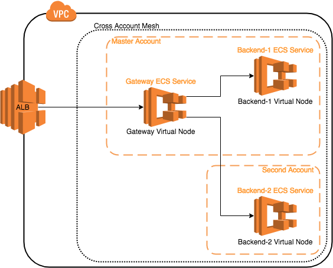

## Overview

This example shows how to enable App Mesh between multiple accounts for cross account communication. In this example, we will create a VPC and Mesh in one account (the primary account) and share those resources with another account (the secondary account). We will then deploy applications into the mesh that show they are communicating on a single network, configured by App Mesh.



### Gatway

The gateway image is an NGINX proxy which listens on a given port and forwards requests to the backend service on a given port. It also responds to NLB HealthChecks.

### Backend

The two backends are "Hello World!" applications that each listen on port 80.

* The first backend is dockercloud/hello-world 
* The secondary backend is karthequian/helloworld

These backends will be configured in distinct accounts and made accessible through the gateway. We will manipulate routes that show that we are able to migrate traffic from one destination to another using the App Mesh APIs.

## Setup

1. Clone this repository and navigate to the walkthroughs/howto-cross-account folder, all commands will be ran from this location.
    ```
    cd walkthroughs/howto-cross-account
    ```
2. Edit the `vars.env` file to add your account and profile settings:
    
    1. **Project Name** used to isolate resources created in this demo from other's in your account. e.g. howto-cross-account
        ```
        export PROJECT_NAME=howto-cross-account
        ```
    2. **Account IDs**:
        This demo needs two accounts to which are in the same AWS Organization.
        ```
        export AWS_PRIMARY_ACCOUNT_ID=<your_first_account_id>
        export AWS_SECONDARY_ACCOUNT_ID=<your_secondary_account_id>
        ```
        The first account need not be the primary account in the AWS Organization. If it is not the primary account, 
        please make sure to run the following command from the primary account:
        `aws ram enable-sharing-with-aws-organization` 
    3. **AWS Profiles**:
        Unset the following env variables so that the credentials are not overridden:
        ```
        unset AWS_ACCESS_KEY_ID
        unset AWS_SECRET_ACCESS_KEY
        ```
        Set the profile name for each of the accounts mentioned above, each profile should have credentials set:
        ```
        export AWS_PRIMARY_PROFILE=...
        export AWS_SECONDARY_PROFILE=...
        ```
        Eg.:
        ```
        cat ~/.aws/credentials
        [default]
        aws_secret_access_key = ...
        aws_access_key_id =  ...
        [primary]
        aws_secret_access_key = ...
        aws_access_key_id =  ...
        [secondary]
        aws_access_key_id = ...
        aws_secret_access_key = ...
        ```
    4. **Region** e.g. us-west-2
        ```
        export AWS_DEFAULT_REGION=us-west-2
        ```
    5. **ENVOY_IMAGE** set to the location of the App Mesh Envoy container image, see https://docs.aws.amazon.com/app-mesh/latest/userguide/envoy.html
        ```
        export ENVOY_IMAGE=840364872350.dkr.ecr.${AWS_DEFAULT_REGION}.amazonaws.com/aws-appmesh-envoy:v1.12.1.1-prod
        ```
    6. **Backend Images**
        ```
        export BACKEND_1_IMAGE=dockercloud/hello-world
        export BACKEND_2_IMAGE=karthequian/helloworld 
        ```     
    7. **KEY_PAIR** set to the name of an EC2 key pair. We will use this key pair to access a bastion host in the generated VPC to look at the stats collected by the Envoy proxy. See https://docs.aws.amazon.com/AWSEC2/latest/UserGuide/ec2-key-pairs.html
        ```
        export KEY_PAIR=...
        ```
10. Source the `env.vars` file using `source env.vars`
11. Setup base cloudformation stack by running
    ```
    ./deploy.sh
    ```

## Cross account mesh in action

1. After a few minutes, the applications should be deployed and you will see an output such as:
    ```
    Successfully created/updated stack - howto-cross-account
    Bastion endpoint:
    123.45.67.89
    DNS endpoint:
    http://howto-Publi-55555555.us-west-2.elb.amazonaws.com
    ```
    Export the public endpoint to access the Color Client APIs.
    ```
    export DNS_ENDPOINT=<your_public_endpoint e.g. http://howto-Publi-55555555.us-west-2.elb.amazonaws.com>
    ```
    And export the bastion endpoint for use later.
    ```
    export BASTION_ENDPOINT=<your_bastion_endpoint e.g. 123.45.67.89>
    ```
2. Try curling the web page or open the address in a browser:
    ```
    curl $DNS_ENDPOINT
    ```
   You should see a web page with Hello World web page.

4. Update the route to [updated-route.json](./updated-route.json):
    ```
    aws --profile ${AWS_PRIMARY_PROFILE} appmesh-preview update-route --mesh-name ${PROJECT_NAME}-mesh --virtual-router-name backend-vr --route-name backend-route --cli-input-json file://`pwd`/updated-route.json
    ```
5. Now try curling the web page again:
    ```
    curl $DNS_ENDPOINT
    ```
   If you run that a few times, you should start to see traffic hitting the application deployed into the secondary account!

## Teardown

When you are done with the example you can delete everything we created by running:
```
./deploy.sh delete
```
