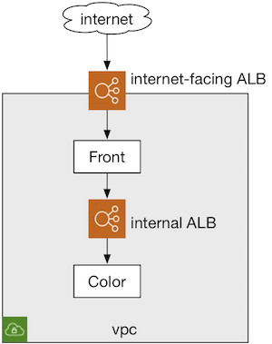
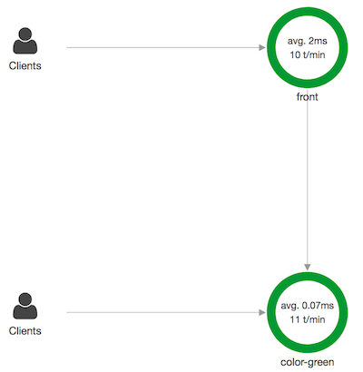
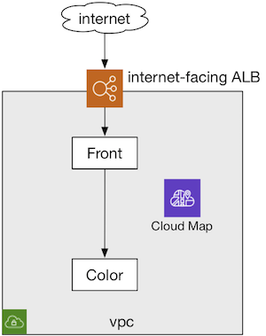
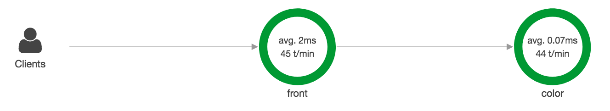
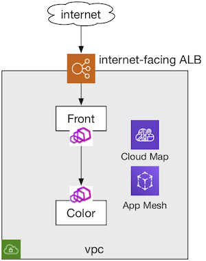
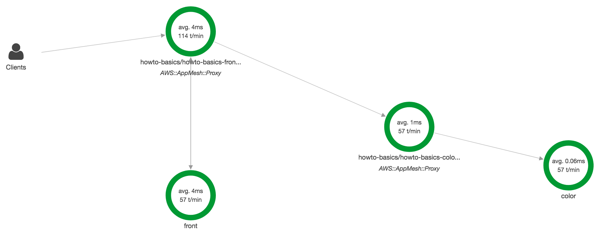
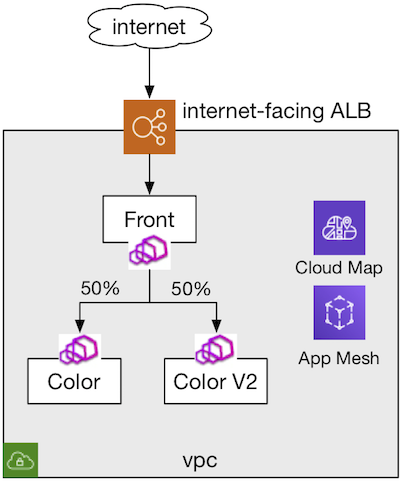
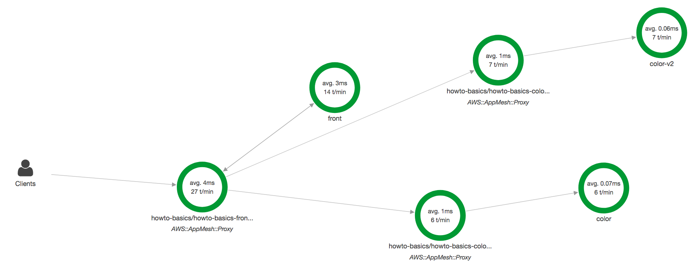

## Overview
This tutorial provides a walkthrough of the basics of App Mesh service. This interactive tutorial will let you progress from an existing simple microservices application running in ECS with Fargate using ALB to adopting Envoy service mesh powered by App Mesh. Using this tutorial you can learn to:

1. Migrate an existing backend service sitting behind an internal ALB to Cloud Map service discovery. Along the way you will learn about Cloud Map's HttpNamespace, and how ECS service integrates with Cloud Map service discovery.
2. Adopt App Mesh for service to service communication via Envoy proxy. This will build on Cloud Map service discovery integration.

## Bootstrap

1. Clone this repository and navigate to the walkthrough/howto-basics folder, all commands will be ran from this location
2. **Your** account id:
    ```
    export AWS_ACCOUNT_ID=<your_account_id>
    ```
3. **Region** e.g. us-west-2
    ```
    export AWS_DEFAULT_REGION=us-west-2
    ```
4. **ENVOY_IMAGE** environment variable is not set to App Mesh Envoy, see https://docs.aws.amazon.com/app-mesh/latest/userguide/envoy.html
    ```
    export ENVOY_IMAGE=...
    ```

## Prelude
Before we begin, we need to setup a sample microservices application. To keep it simple lets assume a trivial application with two services 'front' and 'color'. 'front' exposes `/color` endpoint externally and calls 'color' app to get the color. So we start with following architecture.



To setup this, run the following command.

```
$ ./deploy.sh deploy 0-prelude
...
...
Waiting for changeset to be created..
Waiting for stack create/update to complete
Successfully created/updated stack - appmesh-howto-basics
Public endpoint:
http://appme-.....us-west-2.elb.amazonaws.com/color
```
- **What happened?**
  - Create ECS Cluster to run ECS services
  - Create VPC with two public subnets and two private subnets
  - Create Internal ALB for 'color' app
  - Create ECS service for 'color' app that registers targets behind above ALB.
  - Create Internet facing ALB for 'front' app
  - Create ECS service for 'front' app that registers targets behind above ALB.
  - To help us understand the flow, we add X-Ray daemon as sidecar container to collect tracing data.

Now verify the above setup:

- In a terminal run the following
```
$ FRONT_ENDPOINT=<from-above-deploy, e.g. http://appme-.....us-west-2.elb.amazonaws.com/color>
$ while true; do
    curl $FRONT_ENDPOINT;
    sleep 0.5;
    echo;
done
```
- Now go to AWS X-Ray Console and navigate to 'Service Map'. You should see a service map like below.



In the above picture, traffic to 'front' includes `/ping` from ALB health-check and `/color` from curl command above. Similarly traffic to 'color' includes `/ping` from ALB health-check and `/` from 'front'.

## Chapter 1: Service Discovery with AWS Cloud Map
AWS Cloud Map is a cloud resource discovery service. With Cloud Map, you can define custom names for your application resources, and it maintains the updated location of these dynamically changing resources. This increases your application availability because your web service always discovers the most up-to-date locations of its resources.

In our example, we can configure 'front' app to use Cloud Map DNS to discover 'color' app endpoints and directly connect to those endpoints. With this setup, 'front' app can use client-side load-balancing instead of ALB and using popular frameworks like [go-micro](https://github.com/micro/go-micro), [Netflix Eureka](https://github.com/Netflix/eureka), etc. In the next chapter, we will leverage this setup to use Envoy as client-side proxy that can handle routing and load-balancing.



Run the following:

```
$ ./deploy.sh deploy 1-servicediscovery
...
...
Waiting for changeset to be created..
Waiting for stack create/update to complete
Successfully created/updated stack - appmesh-howto-basics
Public endpoint:
http://appme-.....us-west-2.elb.amazonaws.com/color
```
- **What happened?**
  - Create Cloud Map PrivateDnsNamespace to support service-discovery
  - Create Cloud Map service for 'color' app under above namespace
  - Update 'color' ECS service to use Cloud Map service discovery instead of ALB.
    - _Note that, this will remove the old 'color' service and create a new one. This is expected behavior because ECS does not allow updating a service with service-registry information._
  - Update 'front' ECS service to point to 'color' app's Cloud Map DNS name instead of ALB DNS name.
  - Cleanup
    - _Delete old 'color' ECS service and corresponding ALB_

Now verify the above setup:

- In a terminal run the following
```
$ FRONT_ENDPOINT=<from-above-deploy, e.g. http://appme-.....us-west-2.elb.amazonaws.com/color>
$ while true; do
    curl $FRONT_ENDPOINT;
    sleep 0.5;
    echo;
done
```
- Now go to AWS X-Ray Console and navigate to 'Service Map'. You should see a service map like below.



In the above picture, traffic to 'front' includes `/ping` from ALB health-check and `/color` from curl command above, similar to the way in Prelude. However, 'color' app has no ALB in front of it, so traffic is directly coming from 'front' and there is no `/ping` call.

## Chapter 2: Meshify!
AWS App Mesh is a service mesh that provides application-level networking to make it easy for your services to communicate with each other across multiple types of compute infrastructure. App Mesh standardizes how your services communicate, giving you end-to-end visibility and ensuring high-availability for your applications.

In our example, we intend to connect 'front' to 'color'. For this reason we have started out journey with ALB in front of 'color' to allow 'front' app to reliably connect to 'color'. This connectivity requires routing, load-balancing, health-checking and discovery. In order to avoid ALB as a middle-box in this communication, we switched to handling connectivity at client-side, i.e. 'front' app, using libraries and frameworks. Managing client-side libraries is hard esp. when you have services using different protocols and languages. App Mesh eases dealing with client-side aspects with the help of Envoy proxy running as a sidecar to the application instance. With App Mesh you can configure Envoy to manage connections on client-side, perform routing and load-balancing, and collect advanced telemetry all without writing any additional application code. So we continue our journey by setting up a mesh of Envoy and configuring them via App Mesh APIs.



Run the following:

```
$ ./deploy.sh deploy 2-meshify
...
...
Waiting for changeset to be created..
Waiting for stack create/update to complete
Successfully created/updated stack - appmesh-howto-basics
Public endpoint:
http://appme-.....us-west-2.elb.amazonaws.com/color
```
- **What happened?**
  - Create Mesh to define the configuration domain for our application
  - Create virtual-node and virtual-service for 'color' app.
  - Create a new task-definition for 'color' app that includes Envoy proxy sidecar container. This Envoy is configured to use virtual-node created above as node-id.
  - Update 'color' app ECS service with new task-definition

Now verify the above setup:

- In a terminal run the following
```
$ FRONT_ENDPOINT=<from-above-deploy, e.g. http://appme-.....us-west-2.elb.amazonaws.com/color>
$ while true; do
    curl $FRONT_ENDPOINT;
    sleep 0.5;
    echo;
done
```
- Now go to AWS X-Ray Console and navigate to 'Service Map'. You should see a service map like below.



In the above picture, traffic to 'front' includes `/ping` from ALB health-check and `/color` from curl command above. However, this traffic is intercepted by App Mesh proxy (Envoy) and forwarded to 'front' app. Now when 'front' app opens a connection to 'color' app which is again intercepted by Envoy and routed appropriately to discovered 'color' endpoint. On the 'color' app side, Envoy handles the traffic in the same way. Now all the communication between applications is happening via Envoy proxies and with App Mesh API you can control how the communication happens, i.e. configure timeouts, retries, traffic shaping, and health-checking without making any code changes.

Additionaly, you can generate a simple AWS Cloud Watch dashboard using the following. Note that this dashboard is not complete and requires further tuning to fit the custom use-case.

```
$ ./deploy-cw-dashboards.sh
```

## Chapter 3: Routing
Now that we have mesh already setup, lets learn how App Mesh can help us with weighted routing, e.g. canary, blue-green, etc. For this exercise we will introduce a new version of 'color' app and lets call it 'color-v2'. Lets say we want clients calling 'color' service to get 50% of responses from 'color' (v1) and 50% from 'color-v2'.



Run the following:

```
$ ./deploy.sh deploy 3-routing
...
...
Waiting for changeset to be created..
Waiting for stack create/update to complete
Successfully created/updated stack - appmesh-howto-basics
Public endpoint:
http://appme-.....us-west-2.elb.amazonaws.com/color
```
- **What happened?**
  - Create virtual-router and route for 'color' app.
  - Update 'color' virtual-service to use virtual-router as provider.

Now verify the above setup:

- In a terminal run the following
```
$ FRONT_ENDPOINT=<from-above-deploy, e.g. http://appme-.....us-west-2.elb.amazonaws.com/color>
$ while true; do
    curl $FRONT_ENDPOINT;
    sleep 0.5;
    echo;
done
```
- Now go to AWS X-Ray Console and navigate to 'Service Map'. You should see a service map like below.



In the above picture, traffic from 'front' app is now routed to 'color' and 'color-v2' with the help of Envoy that is configured using above configuration.

## Teardown
When you are done with the example you can delete everything we created by running:

```
./deploy.sh delete
```
