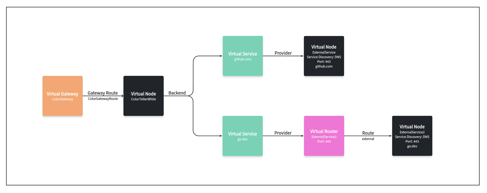

# Configuring a mesh to connect to external service/API

In this walkthrough we'll show you how to allow your application to connect to external service/API outside of your mesh. This walkthrough will be a simplified version of the [Color App Example](https://github.com/aws/aws-app-mesh-examples/tree/main/examples/apps/colorapp).

## Introduction

When using a service mesh, some services within the mesh might need to connect to external or open services/APIs.

In App Mesh, we have two ways of doing that.

### 1. Set egress filter to ``ALLOW_ALL``

The first option is to set the [egress filter](https://docs.aws.amazon.com/app-mesh/latest/APIReference/API_EgressFilter.html) on the mesh resource to ``ALLOW_ALL``. This setting will allow any service within the mesh to communicate with any destination IP address inside or outside of the mesh.

### 2. Model the external service as a virtual service backed up by a virtual node with egress filter set to ``DROP_ALL``

We can keep the egree filter as ``DROP_ALL`` which is default for a mesh and we need to model the external service as a virtual service backed up by a virtual node. Then virtual node itself needs to set its service discovery method to dns with the hostname as the actual hostname of the external service. Note that if the external service's hostname can be resolved as an IPv6 address while your set up, e.g. VPC, doesn't support that, you need to set IP preference to ``IPv4_ONLY`` to stop envoy from trying to make IPv6 requests. For more detail, please refer to the virtual node spec in step 2 section. Also note that if the application itself needs to make HTTPS requests, i.e. TLS connections are not handled by Envoy sidecar, the listener protocol should be set to ``tcp`` instead of ``http``.

The spec for the mesh looks like this:
```yaml
Mesh:
  Type: AWS::AppMesh::Mesh
  Properties:
    MeshName: !Ref MeshName
    Spec:
      EgressFilter:
        Type: DROP_ALL
```

Let's jump into a brief example of App Mesh external traffic in action. Note that the following example is bsaed on an assumption that you set the mesh's egress tiler to ``DROP_ALL``. If you set it to ``ALLOW_ALL`` you don't need to model any of the external services to AppMesh resources.

## Prerequisites

1. Install Docker. It is needed to build the demo application images.

## Step 1: Create Color App Infrastructure

We'll start by setting up the basic infrastructure for our services. All commands will be provided as if run from the same directory as this README.

You'll need a keypair stored in AWS to access a bastion host. You can create a keypair using the command below if you don't have one. See [Amazon EC2 Key Pairs](https://docs.aws.amazon.com/AWSEC2/latest/UserGuide/ec2-key-pairs.html).

```bash
aws ec2 create-key-pair --key-name color-app | jq -r .KeyMaterial > ~/.ssh/color-app.pem
chmod 400 ~/.ssh/color-app.pem
```

This command creates an Amazon EC2 Key Pair with name `color-app` and saves the private key at
`~/.ssh/color-app.pem`.

Next, we need to set a few environment variables before provisioning the
infrastructure. Please change the value for `AWS_ACCOUNT_ID`, `KEY_PAIR_NAME`, and `ENVOY_IMAGE` below.

```bash
export AWS_ACCOUNT_ID=<your account id>
export KEY_PAIR_NAME=<color-app or your SSH key pair stored in AWS>
export AWS_DEFAULT_REGION=us-west-2
export ENVIRONMENT_NAME=AppMeshExternalExample
export MESH_NAME=ColorApp-External-Traffic
export ENVOY_IMAGE=<get the latest from https://docs.aws.amazon.com/app-mesh/latest/userguide/envoy.html>
export SERVICES_DOMAIN="default.svc.cluster.local"
export COLOR_TELLER_IMAGE_NAME="colorteller"
```

First, create the VPC.

```bash
./infrastructure/vpc.sh
```

Next, create the ECS cluster and ECR repositories.

```bash
./infrastructure/ecs-cluster.sh
./infrastructure/ecr-repositories.sh
```

Finally, build and deploy the color app images.

```bash
./src/colorteller_with_external_traffic/deploy.sh
```

Note that the example apps use go modules. If you have trouble accessing <https://proxy.golang.org> during the deployment you can override the GOPROXY by setting `GO_PROXY=direct`

```bash
GO_PROXY=direct ./src/colorteller_with_external_traffic/deploy.sh
```

## Step 2: Create a Mesh with external traffic support

This mesh will be a simplified version of the original Color App Example, so we'll only be deploying the gateway and one color teller service (white).

This mesh includes two parts. One is the normal solution we use, i.e. modeling the external service as a virtual services backed up by a virtaul node. Another is a workaround
to model multiple TCP external services with the same port. For detail for the workaround please see [here](#2-can-i-configure-multiple-external-services-for-the-same-mesh).



The external service can be modelled by a virtual service with virtual node as provider. The spec for virtual service looks like this:

```yaml
ExternalServiceVirtualService:
    Type: AWS::AppMesh::VirtualService
    Properties:
      MeshName: !GetAtt Mesh.MeshName
      VirtualServiceName: github.com
      Spec:
        Provider:
          VirtualNode:
            VirtualNodeName: !GetAtt ExternalServiceVirtualNode.VirtualNodeName
```

The spec for virtual node looks like this:
```yaml
ExternalServiceVirtualNode:
    Type: AWS::AppMesh::VirtualNode
    Properties:
      MeshName: !GetAtt Mesh.MeshName
      VirtualNodeName: ExternalService
      Spec:
        Listeners:
          - PortMapping:
              Port: 443
              Protocol: tcp
        ServiceDiscovery:
          DNS:
            Hostname: github.com
            IpPreference: IPv4_ONLY
```

Additionally, the virtual nodes associated with the application that will make the external requests should use the newly created virtual service, in this example it is ``ExternalServiceVirtualService``, as a backend. The spec for the virtual node associated with the application looks like this:

```yaml
ColorTellerVirtualNode:
    Type: AWS::AppMesh::VirtualNode
    Properties:
      MeshName: !GetAtt Mesh.MeshName
      VirtualNodeName: ColorTellerWhite
      Spec:
        Listeners:
          - PortMapping:
              Port: 80
              Protocol: http
            HealthCheck:
              Protocol: http
              Path: /ping
              HealthyThreshold: 2
              UnhealthyThreshold: 3
              TimeoutMillis: 2000
              IntervalMillis: 5000
        Backends:
          - VirtualService:
              VirtualServiceName: !GetAtt ExternalServiceVirtualService.VirtualServiceName
        ServiceDiscovery:
          DNS:
            Hostname: !Sub "colorteller.${ServicesDomain}"
```

Let's create the mesh.

```bash
./mesh/mesh.sh up
```

## Step 3: Deploy and Verify

Our final step is to deploy the service and test it out.

```bash
./infrastructure/ecs-service.sh
```

Let's issue a request to the color gateway.

```bash
COLORAPP_ENDPOINT=$(aws cloudformation describe-stacks \
    --stack-name $ENVIRONMENT_NAME-ecs-service \
    | jq -r '.Stacks[0].Outputs[] | select(.OutputKey=="ColorAppEndpoint") | .OutputValue')
curl "${COLORAPP_ENDPOINT}/external_github"
```

You should see a successful response with homepage of GitHub. You can also access the link through your browser.

This walkthrough also includes a workaround when you want to access multiple TCP external services with the same port, for more detail please refer to
[question 2 in FAQ](#2-can-i-configure-multiple-external-services-for-the-same-mesh).

You can also send a request to the color gateway regarding the workaround. Feel free to use your browser if you want.

```bash
COLORAPP_ENDPOINT=$(aws cloudformation describe-stacks \
    --stack-name $ENVIRONMENT_NAME-ecs-service \
    | jq -r '.Stacks[0].Outputs[] | select(.OutputKey=="ColorAppEndpoint") | .OutputValue')
curl "${COLORAPP_ENDPOINT}/external_godev"
```

## Step 4: Clean Up

If you want to keep the application running, you can do so, but this is the end of this walkthrough.
Run the following commands to clean up and tear down the resources that we've created.

```bash
aws cloudformation delete-stack --stack-name $ENVIRONMENT_NAME-ecs-service
aws cloudformation delete-stack --stack-name $ENVIRONMENT_NAME-ecs-cluster
aws cloudformation delete-stack --stack-name $ENVIRONMENT_NAME-mesh
aws ecr delete-repository --force --repository-name colorteller
aws cloudformation delete-stack --stack-name $ENVIRONMENT_NAME-ecr-repositories
aws cloudformation delete-stack --stack-name $ENVIRONMENT_NAME-vpc
```

## Frequently Asked Questions
### 1. Can I model the external service as a HTTP backend or a TCP backend?
The external service can be modeled as either HTTP or TCP backend depends on the use cases.

If the external service uses HTTP protocol for communication, then it can be modeled as either HTTP or TCP backend. If the external service uses HTTPS/TCP protocol, you can only model it as a TCP backend.

### 2. Can I configure multiple external services for the same mesh?
With egress filter set to ``ALLOW_ALL``, you don't need to configure any external services because the mesh will allow all outgoing traffic by default.

With egress filter set to ``DROP_ALL``, this depends on the situation. If you are using HTTP virtual nodes, even sharing the same port, you can do that. If you want to model multiple external services as TCP virtual nodes with different ports you can still do that.

If you want to model multiple external services as TCP virtual nodes with the same ports, e.g. 443, then you cannot directly do that. Please refer to [the troubleshooting doc](https://docs.aws.amazon.com/app-mesh/latest/userguide/troubleshooting-connectivity.html#ts-connectivity-virtual-node-router) for more detail. But there is a workaround for this. Create a VirtualRouter for the VirtualService linked to an external service (e.g. example.com). Assign a unique port number (e.g. 444) to the VirtualRouter. On the client (app) side, update the connection to use the VirtualRouter's port (e.g. 444). The request will then be redirected to the actual VirtualNode port of the target service (e.g. 443).

The workaround is also included in this walkthrough. Instead of just having ``github.com`` as an external service, this walkthrough also includes a workaround to model ``go.dev`` into the service mesh, while both websites use HTTPS, i.e. 443, as the listening port. You can send a request to ``${COLORAPP_ENDPOINT}/external_godev`` to see it working.

Note that this workaround might need HTTP header manipulation on client side if the destination side uses strict SNI/vHost configurations. For more detail please see [this Github issue](https://github.com/aws/aws-app-mesh-roadmap/issues/195).