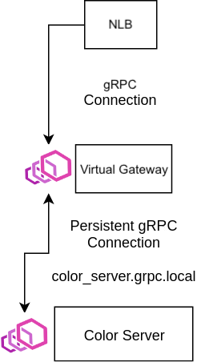

## Overview

This example shows how we can route between gRPC ingress gateway and servers using App Mesh.



### Color Server

The Color Server is a gRPC server that implements `SetColor` and `GetColor` methods from [color.ColorService](./color.proto). Additionally, it implements the [gRPC Health Checking Protocol](https://github.com/grpc/grpc/blob/master/doc/health-checking.md) which we will configure App Mesh to use as the health check for the its virtual-nodes.

### Color Client

The front-end is Virtual Gateway that maintains a persistent gRPC connection to the Color Server. The Virtual Gateway will be connected to an internet-facing NLB. It forwards the gRPC connections to the same methods in [color.ColorService](./color.proto).

## Prerequisites
1. Install Docker. It is needed to build the demo application images.

## Setup

1. Clone this repository and navigate to the walkthroughs/howto-grpc-ingress-gateway folder, all commands will be ran from this location.
    ```
    cd walkthroughs/howto-grpc-ingress-gateway
    ```
2. **Project Name** used to isolate resources created in this demo from other's in your account. e.g. howto-grpc-ingress-gateway
    ```
    export PROJECT_NAME=howto-grpc-ingress-gateway
    ```
3. **Your** account id:
    ```
    export AWS_ACCOUNT_ID=<your_account_id>
    ```
4. **Region** e.g. us-west-2
    ```
    export AWS_DEFAULT_REGION=us-west-2
    ```
5. **ENVOY_IMAGE** set to the location of the App Mesh Envoy container image, see https://docs.aws.amazon.com/app-mesh/latest/userguide/envoy.html
    ```
    export ENVOY_IMAGE=...
    ```
6. **KEY_PAIR** set to the name of an EC2 key pair. We will use this key pair to access a bastion host in the generated VPC to look at the stats collected by the Envoy proxy. See https://docs.aws.amazon.com/AWSEC2/latest/UserGuide/ec2-key-pairs.html
    ```
    export KEY_PAIR=...
    ```
7. Setup using cloudformation
    ```
    ./deploy.sh
    ```
   Note that the example apps use go modules. If you have trouble accessing https://proxy.golang.org during the deployment you can override the GOPROXY by setting `GO_PROXY=direct`
   ```
   GO_PROXY=direct ./deploy.sh
   ```

## gRPC Routing through ingress gateway

1. After a few minutes, the applications should be deployed and you will see an output such as:
    ```
    Successfully created/updated stack - howto-grpc-ingress-gateway-app
    Bastion endpoint:
    12.345.6.789
    Public endpoint:
    howto-Publi-55555555.us-west-2.elb.amazonaws.com:80
    ```
    Export the bastion endpoint for use later.
    ```
    export BASTION_IP=<your_bastion_endpoint e.g. 12.345.6.789>
    ```
    Export the public endpoint to access the Color Server Methods.
    ```
    export NLB_ENDPOINT=<your_public_endpoint e.g. howto-Publi-55555555.us-west-2.elb.amazonaws.com:80>
    ```
2. You'll need to install the gRPC CLI tool:
   **Option 1**: You can install the `grpc_cli` tool by following the link [here](https://github.com/grpc/grpc/blob/master/doc/command_line_tool.md)
   **Option 2**: You can use the [Dockerfile](./Dockerfile) to build an ubuntu image with `grpc_cli` installed:
    ```
    docker build -t grpc_cli .
    docker run -it --rm grpc_cli
    ```
3. Try calling the `SetColor` method:
    ```
    grpc_cli call $NLB_ENDPOINT SetColor 'color: RED' --protofiles=color.proto
    ```
    Note: [color.proto](./color.proto) file must be available in your local directory
    You should see:
    ```
    connecting to howto-Publi-55555555.us-west-2.elb.amazonaws.com:80
    Received initial metadata from server:
    date : Wed, 14 Oct 2020 09:15:25 GMT
    server : envoy
    x-envoy-upstream-service-time : 1
    color: RED
    Rpc succeeded with OK status
    ```
4. Now, try calling the `GetColor` method:
    ```
    grpc_cli call $NLB_ENDPOINT GetColor '' --protofiles=color.proto
    ```
    Note: [color.proto](./color.proto) file must be available in your local directory
    You should see:
    ```
    connecting to howto-Publi-55555555.us-west-2.elb.amazonaws.com:80
    Received initial metadata from server:
    date : Wed, 14 Oct 2020 09:19:46 GMT
    server : envoy
    x-envoy-upstream-service-time : 0
    color: RED
    Rpc succeeded with OK status
    ```

## Teardown

When you are done with the example you can delete everything we created by running:
```
./deploy.sh delete
```
