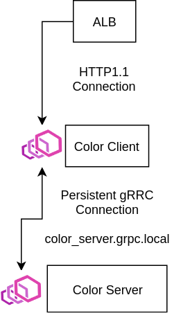

## Overview

This example shows how we can route between gRPC clients and servers using App Mesh.



### Color Server

The Color Server is a gRPC server that implements [color.ColorService](./color.proto). Additionally, it implements the [gRPC Health Checking Protocol](https://github.com/grpc/grpc/blob/master/doc/health-checking.md) which we will configure App Mesh to use as the health check for the its virtual-nodes.

### Color Client

The Color Client is a HTTP/1.1 front-end webserver that maintains a persistent gRPC connection to the Color Server. The HTTP/1.1 webserver will be connected to an internet-facing ALB. It forwards requests to `/getColor` and `/setColor` to the same methods in [color.ColorService](./color.proto). Initially, the Envoy sidecar for the Color Client will be configured to only route the `GetColor` gRPC method, but we will update the route to forward all methods to the Color Server.

## Prerequisites
1. Install Docker. It is needed to build the demo application images.

## Setup

1. Clone this repository and navigate to the walkthroughs/howto-grpc folder, all commands will be ran from this location.
    ```
    cd walkthroughs/howto-grpc
    ```
2. **Project Name** used to isolate resources created in this demo from other's in your account. e.g. howto-grpc
    ```
    export PROJECT_NAME=howto-grpc
    ```
3. **Your** account id:
    ```
    export AWS_ACCOUNT_ID=<your_account_id>
    ```
4. **Region** e.g. us-west-2
    ```
    export AWS_DEFAULT_REGION=us-west-2
    ```
5. **ENVOY_IMAGE** set to the location of the App Mesh Envoy container image, see https://docs.aws.amazon.com/app-mesh/latest/userguide/envoy.html
    ```
    export ENVOY_IMAGE=...
    ```
6. **KEY_PAIR** set to the name of an EC2 key pair. We will use this key pair to access a bastion host in the generated VPC to look at the stats collected by the Envoy proxy. See https://docs.aws.amazon.com/AWSEC2/latest/UserGuide/ec2-key-pairs.html
    ```
    export KEY_PAIR=...
    ```
7. Setup using cloudformation
    ```
    ./deploy.sh
    ```
   Note that the example apps use go modules. If you have trouble accessing https://proxy.golang.org during the deployment you can override the GOPROXY by setting `GO_PROXY=direct`
   ```
   GO_PROXY=direct ./deploy.sh
   ```

## gRPC Routing

1. After a few minutes, the applications should be deployed and you will see an output such as:
    ```
    Successfully created/updated stack - howto-grpc-app
    Bastion endpoint:
    12.345.6.789
    Public endpoint:
    http://howto-Publi-55555555.us-west-2.elb.amazonaws.com
    ```
    Export the public endpoint to access the Color Client APIs.
    ```
    export COLOR_ENDPOINT=<your_public_endpoint e.g. http://howto-Publi-55555555.us-west-2.elb.amazonaws.com>
    ```
    And export the bastion endpoint for use later.
    ```
    export BASTION_ENDPOINT=<your_bastion_endpoint e.g. 12.345.6.789>
    ```
2. Try curling the `/getColor` API
    ```
    curl $COLOR_ENDPOINT/getColor
    ```
   You should see `no_color`. The color returned by the Color Service via the Color Client can be configured using the `/setColor` API.
3. Attempt to change the color by curling the `/setColor` API
    ```
    curl -i -X POST -d "blue" $COLOR_ENDPOINT/setColor
    ```
   We passed the `-i` flag to see any error information in the response. You should see something like:
    ```
    HTTP/1.1 404 Not Found
    Date: Fri, 27 Sep 2019 01:27:42 GMT
    Content-Type: text/plain; charset=utf-8
    Content-Length: 40
    Connection: keep-alive
    x-content-type-options: nosniff
    x-envoy-upstream-service-time: 1
    server: envoy

    rpc error: code = Unimplemented desc =
    ```
   This is because our current mesh is only configured to route the gRPC Method `GetColor`:

   (from [mesh.yaml](./mesh.yaml))
    ```yaml
    Route:
      DependsOn:
       - VirtualRouter
       - ColorServerNode
      Type: AWS::AppMesh::Route
      Properties:
        MeshName: !GetAtt Mesh.MeshName
        VirtualRouterName: virtual-router
        RouteName: route
        Spec:
          GrpcRoute:
            Action:
              WeightedTargets:
              - VirtualNode: color_server
                Weight: 100
            Match:
              ServiceName: color.ColorService
              MethodName: GetColor
    ```
   We'll remove the `methodName` match condition in the gRPC route to match all methods for `color.ColorService`.
4. Update the route to [mesh/route-all-methods.json](./mesh/route-all-methods.json):
    ```
    aws appmesh update-route --mesh-name $PROJECT_NAME-mesh --virtual-router-name virtual-router --route-name route --cli-input-json file://mesh/route-all-methods.json
    ```
5. Now try updating the color again
    ```
    curl -i -X POST -d "blue" $COLOR_ENDPOINT/setColor
    ```
   You'll see that we got a `HTTP/1.1 200 OK` response. You'll also see `no_color` in the response. But this is the previous color being returned after a successful color update.
6. You can verify that the color did, in fact, update
    ```
    curl $COLOR_ENDPOINT/getColor
    ```

## gRPC Retries

The Color Server also exposes APIs to simulate a flaky gRPC service: `SetFlakiness` and `GetFlakiness`. They are accessible through `/setFlakiness` and `/getFlakiness` on the Color Client. These can be used to test gRPC retry policies.

1. First we'll need to add a basic gRPC retry policy to our existing route. It will retry up to 3 times whenever the Color Server returns a gRPC `Internal` [status code](https://github.com/grpc/grpc/blob/master/doc/statuscodes.md). Update our route to [mesh/route-retries.json](./mesh/route-retries.json):
    ```
    aws appmesh update-route --mesh-name $PROJECT_NAME-mesh --virtual-router-name virtual-router --route-name route --cli-input-json file://mesh/route-retries.json
    ```
2. Now we have a retry policy. We'll need to make the Color Server give the Color Client reason to retry requests using the flakiness APIs. Query the current flakiness configuration:
    ```
    curl $COLOR_ENDPOINT/getFlakiness
    ```
   You should see something like `flakiness:<>`. This is an empty configuration.
3. Update the flakiness config to make 50% of requests return the `Internal` status code (13).
    ```
    curl -X POST "$COLOR_ENDPOINT/setFlakiness?code=13&rate=0.5"
    ```
   Here the `rate` query parameter is a percentage of requests to fail, and `code` can be any gRPC status code.
   Like the `/setColor` API, this one returns the previous state of the Color Server. Query the configuration to ensure it applied.
    ```
    curl $COLOR_ENDPOINT/getFlakiness
    ```
   You should see `flakiness:<rate:0.5 code:13 >`.
4. Now before we test our new new flaky API, we should access the Envoy sidecar of the Color Client to verify we are actually applying the retry policy.
    ```
    ssh -i <path/to/your/key/pair.pem> ec2-user@$BASTION_ENDPOINT
    ```
   If you get any errors about file permissions on your key pair. You can make it only readable by you by running.
    ```
    chmod 400 <path/to/your/key/pair.pem>
    ```
5. On the EC2 bastion host we can access the `/stats` endpoint of the Envoy by curling it directly:
    ```
    curl color_client.howto-grpc.local:9901/stats
    ```
   Here is a lot of information. But we can glean some useful stats about our simple mesh. For example we should see that the gRPC health checks from the Color Client to the Color Server are working just fine:
    ```
    curl -s color_client.howto-grpc.local:9901/stats | grep health_check
    ```
   Namely stats similar to this:
    ```
    cluster.cds_egress_howto-grpc-mesh_color_server_grpc_8080.health_check.attempt: 229
    cluster.cds_egress_howto-grpc-mesh_color_server_grpc_8080.health_check.success: 229
    ```
6. Now make some requests to your color client from within your bastion or on your original host
    ```
    curl color_client.howto-grpc.local:8080/getColor # On Bastion host
    ```
   Due to our retry policy the vast majority of requests will succeed. You can run `/getColor` as many times as you like.
7. Now check the retry stats.
    ```
    curl -s color_client.howto-grpc.local:9901/stats | grep upstream_rq_retry
    ```
   You'll see something like:
    ```
    cluster.cds_egress_howto-grpc-mesh_color_server_grpc_8080.upstream_rq_retry: 10
    cluster.cds_egress_howto-grpc-mesh_color_server_grpc_8080.upstream_rq_retry_success: 5
    ```
   The `upstream_rq_retry` stat represents the number of requests that we made when applying a retry policy and the `upstream_rq_retry_success` is the number of retry requests that succeeded.
8. Lastly you can reset the stats of the Envoy by calling the `/reset_counters` API from within the bastion. This can help verify behaivor while you experiment further.
    ```
    curl -X POST -s color_client.howto-grpc.local:9901/reset_counters
    ```
## Teardown

When you are done with the example you can delete everything we created by running:
```
./deploy.sh delete
```
