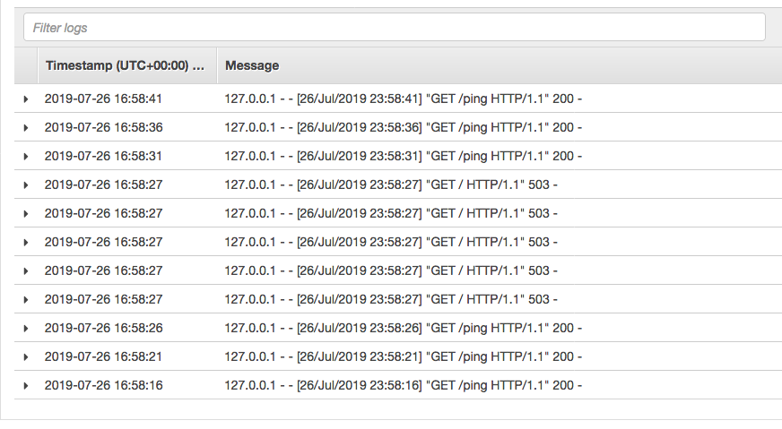

# HTTP Retry Policy example

1. Clone this repository and navigate to the walkthrough/http-retry-policy folder, all commands will be ran from this location


## Setup

1. Your account id:
    ```
    export AWS_ACCOUNT_ID=<your_account_id>
    ```

2. Your region
    ```
    export AWS_DEFAULT_REGION=us-west-2
    
    ```
3. The latest envoy image, see https://docs.aws.amazon.com/app-mesh/latest/userguide/envoy.html
   ```
   export ENVOY_IMAGE=<from_appmesh_user_guide_above>
   ```
    
4. Deploy the resources (this will take about 5-10 minutes to complete):
    ```
    ./deploy.sh
    ```
   
5. Once the script has executed there will be a public endpoint, save this for later.
We will use this endpoint in curl to pass header values to the header "statuscode_header" to observe retry policy in action.

## Update Route

1. Check the current route configuration calling describe-route by name. For instance, to describe the blue route (notice the retry policy in the spec):
    ```
    aws appmesh describe-route --mesh-name howto-http-retries --virtual-router-name color-router --route-name color-route-blue
    ```
    
2. Use curl and send requests to your frontend service while adding headers to see retry policy in place. In the cloudformation template we set the
retry limit to 4 so you should see 5 total failures in your logs. One for the initial request and then 4 retries.  
    ```
    curl -H "statuscode-header: 503" <endpoint> -v    
    ```
    
3. Check the logs for blue node and search for the status code "503". Based on your retry policy, you would see multiple requests with "503" indicating the retries.
    
    
4. Feel free to update the route by updating the json file in this package. For instance you can update it to retry 2 times instead of 4:
    ```
    aws appmesh update-route --mesh-name howto-http-retries --cli-input-json file://blue-route.json
    ```

5. You will see the updated retry policy in the response json from the update-route command above to confirm your updates to the route.

## Clean up 

Run the following command to remove all resources created from this demo (will take 5-10 minutes): 
```
./deploy.sh delete
```

Alternatively, to manually delete resources delete the two stacks this walkthrough created (named _howto-http-retries-app_ and _howto-http-retries-infra_). 
Also go to ECR in the console and remove all images associated to the two repositories created (_named howto-http-retries/colorapp_ and _howto-http-retries/feapp_) 
then you can delete the repositories once their images are removed. Go to the App Mesh console and remove the mesh once all mesh resources are deleted. 
The automatic deletion from the command above will do all of this for you. p and feapp repositories in ECR through the console. Select each one and select delete.