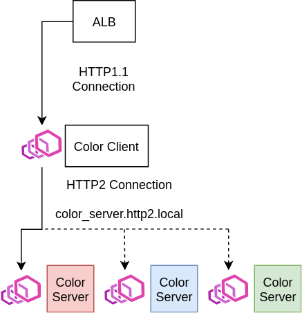

## Overview

This example shows how we can route between HTTP2 clients and servers using App Mesh.



### Color Server

The Color Server is a simple go HTTP2 server returns a color. In this example, we have 3 types of the Color Server running: `red`, `green`, and `blue` each returning a different color. All service instances are registered under the `color_server.howto-http2.local` DNS namespace. But we will be able to route between them by registering their color metadata in [AWS Cloud Map](https://docs.aws.amazon.com/cloud-map/latest/dg/what-is-cloud-map.html) and configuring our virtual-nodes to use AWS Cloud Map [Service Discovery](https://docs.aws.amazon.com/app-mesh/latest/userguide/virtual_nodes.html#create-virtual-node).

### Color Client

The Color Client is a HTTP/1.1 front-end webserver that communicates to the Color Server over HTTP2. The HTTP/1.1 webserver will be connected to an internet-facing ALB. It forwards requests for `/color` to a Color Server backend. Initially, the Envoy sidecar for the Color Client will be configured to only route the `red`-type virtual-nodes, but we will update the route to load-balance across all three types.

## Prerequisites
1. Install Docker. It is needed to build the demo application images.

## Setup

1. Clone this repository and navigate to the walkthroughs/howto-http2 folder, all commands will be ran from this location.
    ```
    cd walkthroughs/howto-http2
    ```
2. **Project Name** used to isolate resources created in this demo from other's in your account. e.g. howto-http2
    ```
    export PROJECT_NAME=howto-http2
    ```
3. **Your** account id:
    ```
    export AWS_ACCOUNT_ID=<your_account_id>
    ```
4. **Region** e.g. us-west-2
    ```
    export AWS_DEFAULT_REGION=us-west-2
    ```
5. **ENVOY_IMAGE** set to the location of the App Mesh Envoy container image, see https://docs.aws.amazon.com/app-mesh/latest/userguide/envoy.html
    ```
    export ENVOY_IMAGE=...
    ```
6. **KEY_PAIR** set to the name of an EC2 key pair. We will use this key pair to access a bastion host in the generated VPC to look at the stats collected by the Envoy proxy. See https://docs.aws.amazon.com/AWSEC2/latest/UserGuide/ec2-key-pairs.html
    ```
    export KEY_PAIR=...
    ```
7. Setup using cloudformation
    ```
    ./deploy.sh
    ```
   Note that the example apps use go modules. If you have trouble accessing https://proxy.golang.org during the deployment you can override the GOPROXY by setting `GO_PROXY=direct`
   ```
   GO_PROXY=direct ./deploy.sh
   ```

## HTTP2 Routing

1. After a few minutes, the applications should be deployed and you will see an output such as:
    ```
    Successfully created/updated stack - howto-http2-app
    Bastion endpoint:
    12.345.6.789
    Public endpoint:
    http://howto-Publi-55555555.us-west-2.elb.amazonaws.com
    ```
    Export the public endpoint to access the Color Client APIs.
    ```
    export COLOR_ENDPOINT=<your_public_endpoint e.g. http://howto-Publi-55555555.us-west-2.elb.amazonaws.com>
    ```
    And export the bastion endpoint for use later.
    ```
    export BASTION_ENDPOINT=<your_bastion_endpoint e.g. 12.345.6.789>
    ```
2. Try curling the `/color` API
    ```
    curl $COLOR_ENDPOINT/color
    ```
   You should see `red`. This is because our current mesh is only configured to route http2 requests to the `color_server-red` virtual-node:

   (from [mesh.yaml](./mesh.yaml))
    ```yaml
    Route:
      DependsOn:
       - VirtualRouter
       - ColorServerRedNode
      Type: AWS::AppMesh::Route
      Properties:
        MeshName: !GetAtt Mesh.MeshName
        VirtualRouterName: virtual-router
        RouteName: route
        Spec:
          Http2Route:
            Action:
              WeightedTargets:
              - VirtualNode: color_server-red
                Weight: 1
            Match:
              Prefix: /
    ```
   We'll first update our route to send traffic equally to the `color_server-red` and `color_server-blue` virtual-nodes
4. Update the route to [mesh/route-red-blue.json](./mesh/route-red-blue.json):
    ```
    aws appmesh update-route --mesh-name $PROJECT_NAME-mesh --virtual-router-name virtual-router --route-name route --cli-input-json file://mesh/route-red-blue.json
    ```
5. Now try curling the color again
    ```
    curl $COLOR_ENDPOINT/color
    ```
   If you run that a few times, you should get an about 50-50 mix of red and blue virtual-nodes
6. Next update the route to remove the red node, and you'll see `blue` from now on
    ```
    aws appmesh update-route --mesh-name $PROJECT_NAME-mesh --virtual-router-name virtual-router --route-name route --cli-input-json file://mesh/route-blue.json
    ```
7. Finally update the routes to balance across all virtual-nodes
    ```
    aws appmesh update-route --mesh-name $PROJECT_NAME-mesh --virtual-router-name virtual-router --route-name route --cli-input-json file://mesh/route-red-blue-green.json
    ```

## HTTP2 Retries

The Color Server also exposes an APIs to simulate a flaky HTTP2 service: `/setFlake`. It is accessible through `/setFlake` on the Color Client. These can be used to test HTTP2 retry policies.

1. First we'll need to add a basic HTTP retry policy to our existing route. It will retry up to 3 times whenever the `red` Color Server returns a server error (5xx). Update our route to [mesh/route-red-retries.json](./mesh/route-red-retries.json):
    ```
    aws appmesh update-route --mesh-name $PROJECT_NAME-mesh --virtual-router-name virtual-router --route-name route --cli-input-json file://mesh/route-red-retries.json
    ```
2. Update the flakiness config to make 50% of requests return a 500 status code.
    ```
    curl -X POST "$COLOR_ENDPOINT/setFlake?code=500&rate=0.5"
    ```
   Here the `rate` query parameter is a percentage of requests to fail, and `code` can be any HTTP status code.
   This API returns the previous state of the Color Server so you'll see the default output of `rate: 0, code: 200`.
3. Now before we test our new new flaky API, we should access the Envoy sidecar of the Color Client to verify we are actually applying the retry policy.
    ```
    ssh -i <path/to/your/key/pair.pem> ec2-user@$BASTION_ENDPOINT
    ```
   If you get any errors about file permissions on your key pair. You can make it only readable by you by running.
    ```
    chmod 400 <path/to/your/key/pair.pem>
    ```
4. On the EC2 bastion host we can access the `/stats` endpoint of the Envoy by curling it directly:
    ```
    curl color_client.howto-http2.local:9901/stats
    ```
   Here is a lot of information. But we can glean some useful stats about our simple mesh. For example we should see that the HTTP2 health checks from the Color Client to the Color Server are working just fine:
    ```
    curl -s color_client.howto-http2.local:9901/stats | grep health_check
    ```
   Namely stats similar to this:
    ```
    cluster.cds_egress_howto-http2-mesh_color_server-red_http2_8080.health_check.attempt: 73
    cluster.cds_egress_howto-http2-mesh_color_server-red_http2_8080.health_check.success: 73
    ```
5. Now make some requests to your color client from within your bastion or on your original host
    ```
    curl color_client.howto-http2.local:8080/color # On Bastion host
    ```
   Due to our retry policy the vast majority of requests will succeed. You can run `/color` as many times as you like.
6. Now check the retry stats.
    ```
    curl -s color_client.howto-http2.local:9901/stats | grep upstream_rq_retry
    ```
   You'll see something like:
    ```
    cluster.cds_egress_howto-http2-mesh_color_server-red_http2_8080.upstream_rq_retry: 52
    cluster.cds_egress_howto-http2-mesh_color_server-red_http2_8080.upstream_rq_retry_success: 29
    ```
   The `upstream_rq_retry` stat represents the number of requests that we made when applying a retry policy and the `upstream_rq_retry_success` is the number of retry requests that succeeded.
8. Lastly you can reset the stats of the Envoy by calling the `/reset_counters` API from within the bastion. This can help verify behaivor while you experiment further.
    ```
    curl -X POST -s color_client.howto-http2.local:9901/reset_counters
    ```

## Teardown

When you are done with the example you can delete everything we created by running:
```
./deploy.sh delete
```
