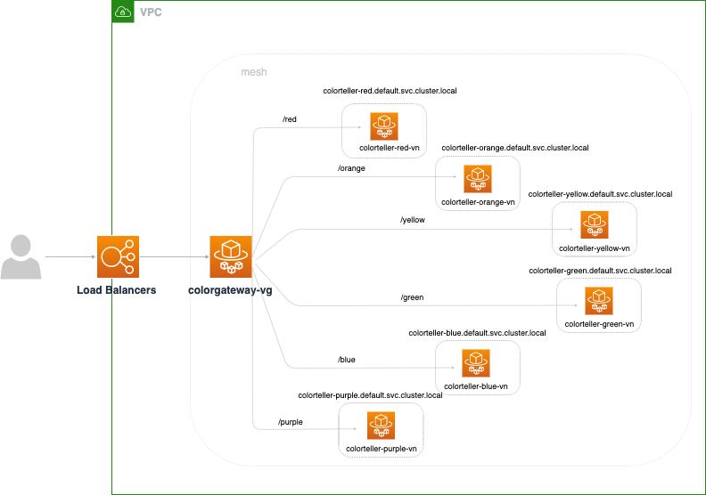

# Walkthrough of IPv6 in App Mesh

## Overview

In this walkthrough we'll be setting up applications with different IP version capabilites and configuring App Mesh resources to see how they impact these applications.

### IP Preferences in Mesh/Virtual Node

With the introduction of IPv6 support in App Mesh a new IP preference field has been added to meshes and virtual nodes. IP preferences will impact how Envoy configuration gets generated. The four possible values for IP preferences in Mesh/Virtual nodes are the following.

  * `IPv4_ONLY`: only use IPv4
  * `IPv4_PREFERRED`:  prefer IPv4 and fall back to IPv6
  * `IPv6_ONLY`: only use IPv6
  * `IPv6_PREFERRED`: prefer IPv6 and fall back to IPv4  

This field is not a required setting for mesh/virtual nodes. Users could have `No Preference` by not specifying the field. The behaviors would be further illustrated below. 

- **Meshes:** Adding an IP preference to a mesh impacts how Envoy configuration will be generated for all virtual nodes and virtual gateways within the mesh. A sample mesh spec that includes an IP preference can be seen below.

    ```json
    "spec": {
        "serviceDiscovery": {
            "ipPreference": "IPv6_PREFERRED"
        }
    }
    ```
	
- **Virtual Nodes**: Adding an IP preference to a virtual node will change how Envoy configuration gets generated for that specific virtual node. Additionally it will change how Envoy configruation for virtual gateways and virtual nodes that are routing traffic to that virtual node. (ex. virtual node backends or gateway routes) A sample virtual node spec that includes an IP preference can be seen below.
    
    ```json
    "spec": {
        "listeners": [
            {
                "healthCheck": {
                    "healthyThreshold": 2,
                    "intervalMillis": 5000,
                    "path": "/ping",
                    "protocol": "http",
                    "timeoutMillis": 2000,
                    "unhealthyThreshold": 2
                },
                "portMapping": {
                    "port": 9080,
                    "protocol": "http"
                }
            }
        ],
        "serviceDiscovery": {
            "dns": {
                "hostname": "colorteller-red.default.svc.cluster.local",
                "ipPreference": "IPv4_ONLY"
            }
        }
    }
    ```
 **Note: If IP preference is set on both Mesh and Virtual Node configurations for the same resource, IP preference setting in Virtual Nodes will override corresponding Mesh configurations for envoy of this specific virtual node.**

### Changes in Related Behaviors

- **Service Discovery**: If a user configures **Service Discovery** on thier virtual node (**DNS** or **AWS Cloud Map**), then the different IP preference settings will affect what IP addresses are returned from AWS Cloud Map or DNS resolution for the different services in this setup.     
- **Envoy Listener Configuration Binding Address**:  Envoy will only accept and handle traffic for the addresses it is told to bind to. If an IP preference is set either on the mesh or virtual node itself, then the resulting listener generated within a virtual node's Envoy configuration will bind to all IPv4 and IPv6 addresses for ingress and egress traffic. Otherwise, without any IP prefernce set the Envoy will only bind to all IPv4 addresses.  
- **Envoy Cluster Configuration Local Application Address**: Envoys that are running as a sidercar to an application are configured to send traffic to the application by defining an endpoint that uses a loopback address as the application’s IP address. Only a single address can be defined for this purpose and it will be either the IPv4 loopback address (127.0.0.1) or IPv6 loopback address (::1).

|	|Service Discovery: DNS |Service Discovery: AWS Cloud Map |Envoy Cluster Configuration: Local Application Address	| Envoy Listener Configuration Binding Address (Ingress/Egress) |
|---	|---	|---	|---	|---  |
|`No Preference` | Envoy's DNS resolver will prefer IPv6 and fall back to IPv4  |We will use the IPv4 address returned by CloudMap if available and fall back to using the IPv6 address |The endpoint created for the local app will use an IPv4 address |The Envoy will bind to all IPv4 addresses |
|`IPv4_PREFERRED` | Envoy's DNS resolver will prefer IPv4 and fall back to IPv6  |We will use the IPv4 address returned by CloudMap if available and fall back to using the IPv6 address |The endpoint created for the local app will use an IPv4 address |The Envoy will bind to all IPv4 and IPv6 addresses |
|`IPv6_PREFERRED` | Envoy's DNS resolver will prefer IPv6 and fall back to IPv4  |We will use the IPv6 address returned by CloudMap if available and fall back to using the IPv4 address |The endpoint created for the local app will use an IPv6 address |The Envoy will bind to all IPv4 and IPv6 addresses |
|`IPv4_ONLY` | Envoy's DNS resolver will only use IPv4  |We will only use the IPv4 address returned by CloudMap |The endpoint created for the local app will use an IPv4 address |The Envoy will bind to all IPv4 and IPv6 addresses |
|`IPv6_ONLY` | Envoy's DNS resolver will only use IPv6  |We will only use the IPv6 address returned by CloudMap |The endpoint created for the local app will use an IPv6 address |The Envoy will bind to all IPv4 and IPv6 addresses |

[Related Envoy Configuration in Appendix](#appendix)

## Setup
For this walkthrough we have use Color App example as the application. An ALB is used to forward traffic to a virtual gateway which then forwards the traffic to virtual nodes in the mesh via gateway routes. Two sets of services have been used and the difference between them is `Service discovery method` for virtual nodes. The first set uses `DNS` and the other uses `AWS Cloud Map`.


Among six virtual nodes, we have different combinations of two variables:
1. **Service Discovery**: whether the service could be discovered by IPv4 only or IPv6 only or both. This helps us test the `Service Discovery` behavior from table above.
2. **Application compatibility**: application only listens for IPv4 only or IPv6 only or both types of traffic. This helps us test `Envoy Cluster Configuration: Local Application Address` behavior from the table above

Based on these two settings, request would fail with following cases:
1. Virtual gateway looks for specific type of IP address of the service depending on the IP preference in Mesh/Virtual nodes, but the service doesn't have that type of IP registered.  
For example, if colorteller-yellow-vn set IP preference as IPv6_ONLY but only has IPv4 address registered for the service, then virtual gateway would fail to connect to this virtual nodes.
2. After the traffic reaches the envoy from the virtual node,  the connection still can fail if envoy sends traffic to the local application by using the type application doesn't listen for.   
For example, if colorteller-green-vn has application only listens for IPv4 but has IP preference set as IPv6_PREFERRED, the request would fail because envoy would use IPv6 address to connect to application but application won't accept it.  
Note that even with IPv6_Preferred is used, it won't fall back to IPv4 automatically when envoy tries to connect to local application so error still occurs.

The following table describes how we set these two variables for all six virtual nodes and expected result after making curl requests.

<table>
    <thead>
        <tr>
            <th>IP Preference Setting</th>
            <th colspan="2">red-vn</th>
            <th colspan="2">orange-vn</th>
            <th colspan="2">yellow-vn</th>
            <th colspan="2">green-vn</th>
            <th colspan="2">blue-vn</th>
            <th colspan="2">purple-vn</th>
        </tr>
    </thead>
    <tbody>
        <tr>
            <td></td>
            <td>Service Discovery</td>
            <td>Application Compatibility</td>
            <td>Service Discovery</td>
            <td>Application Compatibility</td>
            <td>Service Discovery</td>
            <td>Application Compatibility</td>
            <td>Service Discovery</td>
            <td>Application Compatibility</td>
            <td>Service Discovery</td>
            <td>Application Compatibility</td>
            <td>Service Discovery</td>
            <td>Application Compatibility</td>
        </tr>
        <tr>
            <td></td>
            <td>IPv4</td>
            <td>IPv4</td>
            <td>IPv4</td>
            <td>IPv4 / IPv6</td>
            <td>IPv4</td>
            <td>IPv6</td>
            <td>IPv4 / IPv6</td>
            <td>IPv4</td>
            <td>IPv4 / IPv6</td>
            <td>IPv4 / IPv6</td>
            <td>IPv4 / IPv6</td>
            <td>IPv6</td>
        </tr>
        <tr>
            <td>IPv4_ONLY</td>
            <td colspan="2">red</td>
            <td colspan="2">orange</td>
            <td colspan="2">error due to application compatibility</td>
            <td colspan="2">green</td>
            <td colspan="2">blue</td>
            <td colspan="2">error due to application compatibility</td>
        </tr>
        <tr>
            <td>IPv4_PREFERRED</td>
            <td colspan="2">red</td>
            <td colspan="2">orange</td>
            <td colspan="2">error due to application compatibility</td>
            <td colspan="2">green</td>
            <td colspan="2">blue</td>
            <td colspan="2">error due to application compatibility</td>
        </tr>
        <tr>
            <td>IPv6_ONLY</td>
            <td colspan="2">error due to service discovery and application compatibility</td>
            <td colspan="2">error due to service discovery</td>
            <td colspan="2">error due to service discovery</td>
            <td colspan="2">error due to application compatibility</td>
            <td colspan="2">blue</td>
            <td colspan="2">purple</td>
        </tr>
        <tr>
            <td>IPv6_PREFERRED</td>
            <td colspan="2">error due to application compatibility</td>
            <td colspan="2">orange</td>
            <td colspan="2">yellow</td>
            <td colspan="2">error due to application compatibility</td>
            <td colspan="2">blue</td>
            <td colspan="2">purple</td>
        </tr>
    </tbody>
</table>

## Step 1: Prerequisites


1. This walkthrough makes use of the unix command line utility `jq`. If you don't already have it, you can install it from [here](https://stedolan.github.io/jq/).

2. Install Docker. It is needed to build the demo application images.

3. You'll need a keypair stored in AWS to access a bastion host. You can create a keypair using the command below if you don't have one. See [Amazon EC2 Key Pairs](https://docs.aws.amazon.com/AWSEC2/latest/UserGuide/ec2-key-pairs.html).

```bash
aws ec2 create-key-pair --key-name app-mesh-ip | jq -r .KeyMaterial > ~/.ssh/app-mesh-ip.pem
chmod 400 ~/.ssh/app-mesh-ip.pem
```

This command creates an Amazon EC2 Key Pair with name `app-mesh-ip` and saves the private key at
`~/.ssh/app-mesh-ip.pem`.

4. Your AWS account will need to enable dual stack IPv6 tasks for ECS. Without enabling this ECS tasks will not be given IPv6 addresses when they are created. Enabling the setting can be done by running the following command. This command applies to the entire AWS account and only needs to be run once to enable this setting for all regions.

```bash
aws ecs put-account-setting-default --name dualStackIPv6 --value enabled --region us-west-2
```

See [ECS Account Settings](https://docs.aws.amazon.com/AmazonECS/latest/userguide/ecs-account-settings.html) for further information about this setting.

## Step 2: Set Environment Variables
We need to set a few environment variables before provisioning the
infrastructure. Please change the value for `AWS_ACCOUNT_ID`, `KEY_PAIR_NAME`, and `ENVOY_IMAGE` below.

```bash
export AWS_ACCOUNT_ID=<your-account-id>
export ENVOY_IMAGE=<get the latest from https://docs.aws.amazon.com/app-mesh/latest/userguide/envoy.html>
export KEY_PAIR_NAME=<app-mesh-ip or your key pair stored in AWS>
```

Set the following environment variables specific to the walkthrough:

```bash
export AWS_DEFAULT_REGION=us-west-2
export PROJECT_NAME=app-mesh-ipv6
export MESH_NAME=app-mesh-ipv6
export SERVICES_DOMAIN="default.svc.cluster.local"
```

These variables are also stored in `vars.env` and you can easily set them by setting the appropriate values in `vars.env` and then running `source ./vars.env`!

## Step 3: Create Infrastructure

We'll start by setting up the basic infrastructure for our services. All commands will be provided as if run from the same directory as this README.

The following command will create a VPC, ECR repositories and an ECS cluster.

```bash
./deploy.sh infra
```

Note that the example app used in this walkthrough uses go modules. If you have trouble accessing https://proxy.golang.org during the deployment you can override the GOPROXY by setting `GO_PROXY=direct`

```bash
GO_PROXY=direct ./deploy.sh infra
```

Once you the infrastructure has been deployed you should see output like the following.

```bash
Bastion endpoint:
12.345.6.789
```

Save the bastion endpoint for use later.
```bash
export BASTION_IP=<your_bastion_endpoint e.g. 12.245.6.189>
```

## Step 4: Deploy ECS Service
Both setups in this walkthrough create ECS services which utilize the same infrastructure and can be set up alongside each other. You can choose to deploy both setups at the same time or just one at a time. Use the commands given for the setup you are interested in for the following sections. After each of these commands is run, output such as the following will be seen

```bash
Successfully created/updated stack - app-mesh-ipv6-vg-ecs-service
Public endpoint:
http://app-m-Publi-55555555.elb.us-west-2.amazonaws.com
```

We will want to save this endpoint for use later by doing something such as the following.
```bash
export COLORAPP_ENDPOINT=<your_http_colorApp_endpoint e.g. http://app-m-Publi-55555555.elb.us-west-2.amazonaws.com>
```

If you are deploying both setups then you will want to save each endpoint separately. (ex. COLORAPP_CLOUD_ENDPOINT, COLORAPP_DNS_ENDPOINT) You will need to change later commands if you have both deployed as well.

### CloudMap Service Discovery

```bash
./deploy.sh cloud-service
```

### DNS Service Discovery

```bash
./deploy.sh dns-service
```

## Step 5: Test Sending Traffic in the Initial Setup
The initial setup is using a mesh preference of V4_ONLY. This will apply a V4_ONLY preference to all virtual nodes. Let us see how this impacts traffic being sent to applications.

**Note: If you execute the following command after recently deploying then it may not work and time out. The load balancer will need some time to initialize the target group that is pointint to the virtual gateway. While the target group is initializing all requests will fail.**

Try 
```bash
curl "${COLORAPP_ENDPOINT}/red"
```
 and see if the service correctly gives you the color red back. 

**Why did this request succeed?**
The red service is discoverable via IPv4 and the virtual gateway can send it traffic given the current preference is `IPv4_ONLY`. Once the Envoy recieves the request it will send the request to the application via an IPv4 address. This address is compatible with the application because it can recieve IPv4 traffic.

Try 
```bash
curl "${COLORAPP_ENDPOINT}/yellow"
```
 and see if an upstream connection error occurs. (503) 

**Why did this request fail?**
The yellow service is discoverable via IPv4 and the virtual gateway can send it traffic given the current preference is `IPv4_ONLY`. However, once the Envoy recieves the request it will send the request to the application via an IPv4 address. This address is not compatible with the application because it can only recieve IPv6 traffic. This results in a connection error.

You can also try all of the following colors as well and get these results

* orange - get back orange
* green - get back green
* blue - get back blue
* purple - upstream connection error

## Step 6: Test out a Different Mesh IP Preference

Let us now change the IP preference set on the mesh to `IPv6_ONLY`. The IP preference can be changed in the `mesh.json` file in either the `cloud/mesh` or `dns/mesh` folders depending on which setup you are using. After making the change, the `mesh.json` should look like:

```
{
    "spec": {
        "serviceDiscovery": {
            "ipPreference": "IPv6_ONLY"
        },
        "egressFilter": {
            "type": "ALLOW_ALL"
        }
    }
}
```

Then running the mesh update script for the respective setup

CloudMap Service Discovery
```bash
./cloud/mesh/update-mesh.sh mesh
```

DNS Service Discovery
```bash
./dns/mesh/update-mesh.sh mesh
```

Once the update has been made we can send traffic to the services again.

**Note: All updates to your App Mesh resources (mesh and virtual node) will take some time to take effect. You will likely need to wait a little bit before the changes take place. However, this should not take longer than a few minutes.**

Try 
```bash
curl "${COLORAPP_ENDPOINT}/purple"
```
 and see if the service correctly gives you the color purple back. 

**Why did this request succeed?**
The purple service is discoverable via IPv4 and IPv6 and the virtual gateway can send it traffic given the current preference is `IPv6_ONLY`. Once the Envoy recieves the request it will send the request to the application via an IPv6 address. This address is compatible with the application because it can recieve IPv6 traffic.

Try 
```bash
curl "${COLORAPP_ENDPOINT}/green"
```
 and see if an upstream connection error occurs. (503) 

**Why did this request fail?**
The green service is discoverable via IPv4 and IPv6 and the virtual gateway can send it traffic given the current preference is `IPv6_ONLY`. However, once the Envoy recieves the request it will send the request to the application via an IPv6 address. This address is not compatible with the application because it can only recieve IPv4 traffic. This results in a connection error.

Try 
```bash
curl "${COLORAPP_ENDPOINT}/red"
```
 and see if a connection error occur due to no healthy upstreams. 

**Why did this request fail?**
The red service is discoverable via IPv4 and the virtual gateway cannot send it traffic given the current preference is `IPv6_ONLY`. For CloudMap service discovery, there are no IPv6 address that are being registered. For DNS service discovery, there are no AAAA records being registered. As a result the virtual gateway does not have an IP address to route traffic to.

You can also try all of the following colors as well and get these results

* orange - no healthy upstream
* yellow - no healthy upstream
* blue - get back blue

## Step 7: Override Mesh IP Preference
Currently a mesh IP preference of `IPv6_ONLY` had been set causing the red, orange, and yellow services unable to respond to traffic. In order to address this we can override the mesh IP preference by setting an IP preference at the virtual node level.

Let's change the preference to `IPv4_PREFERRED` for the red service first by modifying the `red-vn.json` file in either the `cloud/mesh` or `dns/mesh` folders depending on which setup you are using.

Once this has been done let us execute the change.

CloudMap Service Discovery
```bash
./cloud/mesh/update-mesh.sh red-vn
```

DNS Service Discovery
```bash
./dns/mesh/update-mesh.sh red-vn
```

Now with this change in place let us send traffic to the service.

Try 
```bash
curl "${COLORAPP_ENDPOINT}/red"
```
 and see if the service correctly gives you the color red back.

**Why did this request succeed?**
The red service is discoverable via IPv4 and the virtual gateway can send it traffic given the virtual node preference of `IPv4_ONLY` overrides the mesh prefernce making it this virtual node discoverable. Once the Envoy recieves the request it will send the request to the application via an IPv4 address. This address is compatible with the application because it can recieve IPv4 traffic.

## Step 8: Sending IPv6 Traffic to the Virtual Gateway
Up until this point, IPv4 has been used to communicate between the load balancer and the virtual gateway. This is due to the load balancer target group that has been used when sending traffic with the commands such as below.
```bash
curl "${COLORAPP_ENDPOINT}/red"
```
The target group being used here is an IPv4 target group and an IPv6 target group needs to be used to send IPv6 traffic to the virtual gateway from the load balancer.

An IPv6 target group has been already created on the load balancer which can facilitate using IPv6. However, this will require some additional configuration before this IPv6 target group can be used.

First we will need to get the IPv6 address of the virtual gateway task. This can by following the following steps in the [ECS console](https://console.aws.amazon.com/ecs).

1. Find and click on the ECS cluster named `app-mesh-ipv6` in the list of clusters.
2. Find and click on the virtual gateway service in the list of services. The name of the service will either be `app-mesh-ipv6-cloud-ecs-service-ColorGatewayService-ECS_SERVICE_SUFFIX` or `app-mesh-ipv6-dns-ecs-service-ColorGatewayService-ECS_SERVICE_SUFFIX` depending on which setup you have. 
3. Click on the Tasks tab and click on the single task running for the service.
4. Under the network section find the IPv6 address field and copy that address down. If there is no address present then make sure you have completed step 4 in the prequisites section of this walkthrough. If you redeploy the gateway service and this task still does not have an IPv6 address then there might be other issues. For troubleshooting this you can take a look at the following which outlines the requirements for Fargate tasks to be assigned IPv6 addresses: https://docs.aws.amazon.com/AmazonECS/latest/userguide/fargate-task-networking.html#fargate-task-networking-vpc-dual-stack

Now that we have the IPv6 address of the virtual gateway we can now register this address with the load balancer's IPv6 target group. Navigate to the [EC2 Console](https://us-west-2.console.aws.amazon.com/ec2) and follow these steps.

1. Find and click on Target Groups under the Load Balancing.
2. Find and click on the IPv6 target group. Depending on which setup you are using it will either be named `app-mesh-ipv6-web-cloud-ipv6` or `app-mesh-ipv6-web-dns-ipv6`.
3. There should be no registered targets for this target group. Let us now register a target for the virtual gateway. Click on `Register targets` to do so.
4. Under the Step 2 there will be a field to fill out for `IPv6 address`. Put the IPv6 address saved earlier here. Now change the `Ports` field from `81` to `9080`. Once this is done click on `Including as pending below`. Finally click on `Register pending targets` to complete the target registration.

**Note: This registration process needs to be repeated if you deploy a new ECS task for the virtual gateway because the IP address will change. This will cause the target to be referencing the old IP address which would need to be updated.**

With the target registered we can now send traffic to this target group. This can be done by specifying the port 81 which is being used for the IPv6 target group for this load balancer. 

**Note: It may take some time before you can execute this command. The target group needs to initialize the target that you just registered. It will be in an initializing state some time before it changes state to either `healthy` or `unhealthy`. If the state is healthy then you can execute the following command. Otherwise, if the state is `unhealthy` then either the wrong IPv6 address was registered or there is a problem with the virtual getway task.**

Send traffic to this port using this command
```bash
curl "${COLORAPP_ENDPOINT}:81/red"
```
The response will be the color red assuming that nothing has changed with the mesh and virtual nodes since the previous step.

## Step 9: Experiment with Different Preferences
Now that we have made changes to the mesh and virtual node IP preferences it is time to experiment. Updating the mesh and virtual node preferences you can test and see how the preferences impact the traffic being sent to each service.

Like in previous steps, makes changes to the mesh and virtual node JSON files for the setup you have. Then run the `update-mesh.sh` script.

For the script you can update the mesh, a single virtual node, or all virtual nodes at once with the following commands.

Update Mesh
```bash
# Choose cloud or dns for the directory depending on which setup you are using.
./{cloud or dns}/mesh/update-mesh.sh mesh
```

Update Single Virtual Node
```bash
# Replace COLOR with the virtual node you want to update (red-vn, purple-vn)
./{cloud or dns}/mesh/update-mesh.sh COLOR-vn
```

Update All Virtual Nodes
```bash
./{cloud or dns}/mesh/update-mesh.sh all-vn
```

## Step 10: Clean Up

Run the following commands to clean up and tear down the resources that we’ve created.

Delete the CloudMap service discovery setup if you deployed it:
```bash
./deploy.sh delete-cloud-service
```

Delete the DNS service discovery setup if you deployed it:
```bash
./deploy.sh delete-dns-service
```

Delete the infrastructure after you have torn down your setup(s):
```bash
./deploy.sh delete-infra
```

## Appendix 

Envoy configuration changes based on IP Preference setting

**Service Discovery: DNS**: `dns_lookup_family` value would be changed according to IP preference settings    

|IP preference	|dns_lookup_family	|
|---	|---	|
|`No Preference` | AUTO (prefer IPv6 and fall back to IPv4 )  |
|`IPv4_PREFERRED` | V4_PREFERRED |
|`IPv6_PREFERRED` | AUTO  |
|`IPv4_ONLY` | V4_ONLY  |
|`IPv6_ONLY` | V6_ONLY |


```
# DNS Resolution Preference*      
      
type: LOGICAL_DNS
connect_timeout: 1s
# Determines how the Envoy will perform DNS resolution for this cluster. The default is AUTO which is prefer IPv6 and fall back to IPv4 
dns_lookup_family: V6_ONLY    
load_assignment:
  cluster_name: cds_egress_bookstore_reviews-v1-${scenarioSuffix}_http_8020
  endpoints:
    - lb_endpoints:
      - endpoint:
          address:
            socket_address:
              address: reviews-v1.internal
              port_value: 8020
```
**Service Discovery: AWS Cloud Map**:   
Example: IPv6 address would be preferred to be used if IP preference is set as IPv6_PREFERRED

```
# ClouMap IP Preference*     
     
endpoints:
- lb_endpoints:
  - endpoint:
      address:
        socket_address:
          # The IP address we populate using IPs from CloudMap. Today we prefer IPv4 and fall back to IPv6 for No preference
          address: 2001:0db8:85a3:ab34:12cd:abcd:0001:2345    
          port_value: 8080
```

**Envoy Listener Configuration: Binding Address (Ingress/Egress)**: Envoy listener would accept all IPv4 and IPv6 address if IP preference is set

```
address:
  socket_address:
    # *::* binds for all IPv6 addresses, currently is 0.0.0.0
    address: :: 
    # Configures this listener to also bind to all IPv4 addresses when binding to *::*. This is currently is not set and defaults to false            
    ipv4_compat: true     
    # Port number depends on ingress or egress listener  
    port_value: 15000/15001 
```

**Envoy Cluster Configuration: Local Application Address**: envoy would use 0:0:0:0:0:0:0:1 as the endpoint for local application if IP preference is set as IPv6_ONLY or IPv6_PREFERRED
``````
type: STATIC
connect_timeout: 0.25s
load_assignment:
cluster_name: cds_ingress_bookstore_details-${scenarioSuffix}_http_8030
endpoints:
- lb_endpoints:
- endpoint:
address:
socket_address:
address: 0:0:0:0:0:0:0:1
port_value: 8030
```
