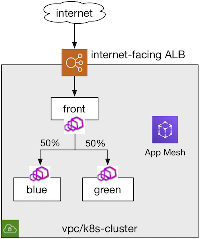

## Overview
This example shows how to use [ALB Ingress Controller](https://github.com/kubernetes-sigs/aws-alb-ingress-controller) with targets registered as virtual-nodes under App Mesh.



## Prerequisites
- [Walkthrough: App Mesh with EKS](../eks/)
- [Walkthrough: ALB Ingress Controller](https://kubernetes-sigs.github.io/aws-alb-ingress-controller/guide/walkthrough/echoserver/)
- Install Docker. It is needed to build the demo application images.

Note: Only [deploy the ALB Ingress Controller](https://kubernetes-sigs.github.io/aws-alb-ingress-controller/guide/walkthrough/echoserver/#deploy-the-alb-ingress-controller) and rest this example service will replace the echoserver in the ALB Ingress Controller link provider

## Setup

1. Clone this repository and navigate to the walkthrough/howto-k8s-alb folder, all commands will be run from this location
2. **Your** account id:
    ```
    export AWS_ACCOUNT_ID=<your_account_id>
    ```
3. **Region** e.g. us-west-2
    ```
    export AWS_DEFAULT_REGION=us-west-2
    ```
4. **(Optional) Specify Envoy Image version** If you'd like to use a different Envoy image version than the [default](https://github.com/aws/eks-charts/tree/master/stable/appmesh-controller#configuration), run `helm upgrade` to override the `sidecar.image.repository` and `sidecar.image.tag` fields.
5. Deploy
    ```.
    ./deploy.sh
    ```

## Usage

Check the events of the ingress to see what has occur.

    ```
    kubectl describe ing -n howto-k8s-alb color
    ```

You should see similar to the following.

    ```
    Name:             color
    Namespace:        howto-k8s-alb
    Address:          80113f18-howtok8salb-color-0f20-319733316.us-west-2.elb.amazonaws.com
    Default backend:  default-http-backend:80 (<none>)
    Rules:
      Host  Path  Backends
      ----  ----  --------
      *
            /color   color:8080 (192.168.16.27:8080,192.168.59.249:8080)
    Annotations:
      kubectl.kubernetes.io/last-applied-configuration:  {"apiVersion":"extensions/v1beta1","kind":"Ingress","metadata":{"annotations":{"alb.ingress.kubernetes.io/healthcheck-path":"/ping","alb.ingress.kubernetes.io/scheme":"internet-facing","alb.ingress.kubernetes.io/target-type":"ip","kubernetes.io/ingress.class":"alb"},"name":"color","namespace":"howto-k8s-alb"},"spec":{"rules":[{"http":{"paths":[{"backend":{"serviceName":"color","servicePort":8080},"path":"/color"}]}}]}}
      kubernetes.io/ingress.class:                 alb
      alb.ingress.kubernetes.io/healthcheck-path:  /ping
      alb.ingress.kubernetes.io/scheme:            internet-facing
      alb.ingress.kubernetes.io/target-type:       ip
    Events:
      Type    Reason  Age    From                    Message
      ----    ------  ----   ----                    -------
      Normal  CREATE  11m    alb-ingress-controller  LoadBalancer 80113f18-howtok8salb-color-0f20 created, ARN: arn:aws:elasticloadbalancing:us-west-2:669977933099:loadbalancer/app/80113f18-howtok8salb-color-0f20/7c45f6fd4eefa871
      Normal  CREATE  11m    alb-ingress-controller  rule 1 created with conditions [{    Field: "path-pattern",    PathPatternConfig: {      Values: ["/"]    }  }]
      Normal  MODIFY  4m12s  alb-ingress-controller  rule 1 modified with conditions [{    Field: "path-pattern",    PathPatternConfig: {      Values: ["/color"]    }  }]
     ```

To check if the application is reachable via ALB Ingress Controller

```
curl -v 80113f18-howtok8salb-color-0f20-319733316.us-west-2.elb.amazonaws.com/color
```

You should see similar to the following.

```
*   Trying 34.208.158.34...
* TCP_NODELAY set
* Connected to 80113f18-howtok8salb-color-0f20-319733316.us-west-2.elb.amazonaws.com (34.208.158.34) port 80 (#0)
> GET /color HTTP/1.1> Host: 80113f18-howtok8salb-color-0f20-319733316.us-west-2.elb.amazonaws.com
> User-Agent: curl/7.61.1
> Accept: */*
>
< HTTP/1.1 200 OK
< Date: Sat, 09 May 2020 01:30:06 GMT
< Transfer-Encoding: chunked
< Connection: keep-alive
< server: envoy
< x-envoy-upstream-service-time: 0
<
* Connection #0 to host 80113f18-howtok8salb-color-0f20-319733316.us-west-2.elb.amazonaws.com left intact
blue
```
