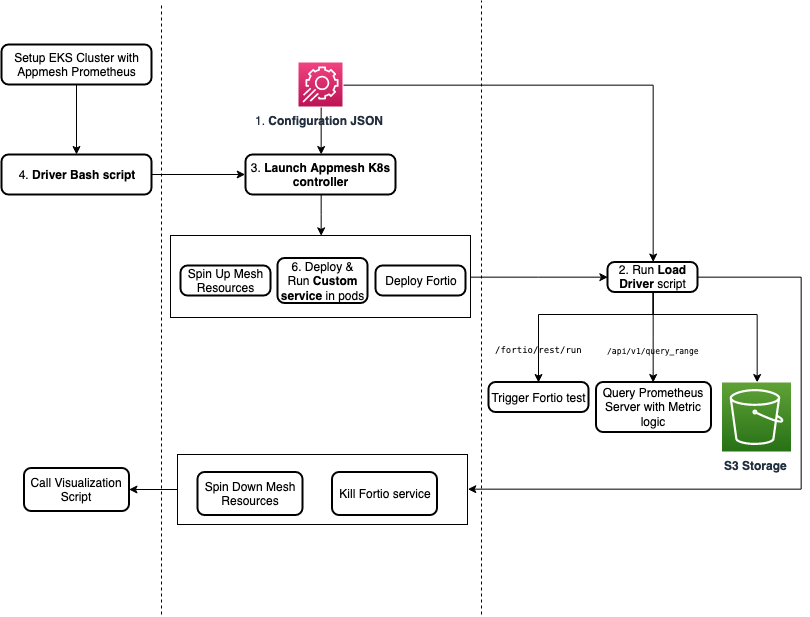

# AppMesh K8s Load Test
This walkthrough demonstrates how to load test AppMesh on EKS. It can be used as a tool for further load testing in different mesh configuration. 
We use [Fortio](https://github.com/fortio/fortio) to generate the load. This load test is for AppMesh on EKS, therefore, we 
need [aws-app-mesh-controller-for-k8s](https://github.com/aws/aws-app-mesh-controller-for-k8s) to run it. Note that, the load test runs as a part of the controller integration test, hence,
we need the controller repo in this walkthorugh. Following are the key components of this load test:


* Configuration JSON: This specifies the details of the mesh, such as Virtual Nodes and their backends, a list of parameters for the load generator e.g., query per seconds (QPS), duration for each experiment to run and a list of metrics (and their corresponding logic) that need to be captured in the load test. 
The details of the `config.json` can be found in [Step 3: Configuring the Load Test](#step-3:-configuring-the-load-test).
* Driver script: This bash script (`scripts/driver.sh`) sets up port-forwarding of the prometheus and starts the load test as part of the AppMesh K8s Controller integration tests.
* AppMesh K8s Controller:  The K8s Controller for AppMesh [integration testing code](https://github.com/aws/aws-app-mesh-controller-for-k8s/tree/master/test/e2e/fishapp/load) is the 
entry point of our load test. It handles creation of a meshified app with Virtual Nodes, Virtual Services, backends etc. It also cleans up resources and spins down the mesh after 
finishing the test. The list of unique values under the adjacency list `backends_map` in `config.json` provides the number of Virtual Nodes that need to be created and the map 
values provide the backend/edge connections of each node’s virtual service. These services corresponding to the backend connections will be configured as environment variables 
at the time of creation of the deployment. The *Custom Service* looks for this environment variable when re-routing incoming HTTP requests.
* Custom service: The custom service `scripts/request_handler.py` script runs on each pod which receives incoming requests and makes calls to its “backend” services according to the `backends_map`
in the `config.json`. This is a simple HTTP server that runs on each pod which handles incoming requests and in turn routes them to its backend services. This backends info is 
initialized as an environment variable at the time of pod creation. The custom service script is mounted onto the deployment using *ConfigMaps* 
(see [createConfigMap](https://github.com/aws/aws-app-mesh-controller-for-k8s/blob/420a437f68e850a32f395f9ecd4917d62845d25a/test/e2e/fishapp/load/dynamic_stack_load_test.go) for 
more details) to reduce development time (avoids creating Docker containers, pushing them to the registry, etc.). If the response from all its backends is SUCCESS/200 OK, then it 
returns a 200. If any one of the responses is a failure, it returns a 500 HTTP error code. If it does not have any backends, it auto returns a 200 OK. 
* Fortio: The [Fortio](https://github.com/fortio/fortio) load generator hits an endpoint in the mesh to simulate traffic by making HTTP requests to the given endpoint at the 
requested QPS for the requested duration. The default endpoint in the mesh is defined in `URL_DEFAULT` under `scripts/constants.py`. Since fortio needs to access an endpoint within
the mesh, we install fortio inside the mesh with its own Virtual Node, K8 service and deployment. See the `fortio.yaml` file for more details. The K8s service is then port-forwarded 
to the local machine so that REST API calls can be sent from local.
* AppMesh-Prometheus: Prometheus scrapes the required Envoy metrics during load test from each pod at specified interval. It has its own query language [*PromQL*]((https://prometheus.io/docs/prometheus/latest/querying/operators/)) which is helpful 
for aggregating metrics at different granularities before exporting them.
* Load Driver: The load driver `scripts/load_driver.py` script reads the list of tests from the `config.json`, triggers the load, fetches the metrics from the Prometheus server using 
its APIs and writes to persistent storage such as S3. This way, we have access to history data even if the Prometheus server spins down for some reason. The API endpoints support 
PromQL queries so that aggregate metrics can be fetched directly instead of collecting raw metrics and writing separate code for aggregating them. The start and end timestamps of the 
test will be noted for each test and the metrics will be queried using this time range.
* S3 storage for metrics: Experiments are uniquely identified by their `test_name` defined in `config.json`. Multiple runs of the same experiment are identified by their run 
*timestamps* (in YYYYMMDDHHMMSS format). Hence, there will be a 1:1 mapping between the `test_name` and the set of config parameters in the JSON. Metrics are stored inside above 
subfolders along with a metadata file specifying the parameter values used in the experiment. A list of metrics can be found in `metrics` defined under `config.json`.


Following is a flow diagram of the load test:



## Step 1: Prerequisites

[//]: # (The following commands can be used to create an ec2 instance to run this load test. Make sure you already created the security-group, subnet, vpc and elasctic IP if you need it.)
[//]: # (Follow this https://docs.aws.amazon.com/cli/latest/userguide/cli-services-ec2-instances.html#launching-instances for more details.)
[//]: # (```shell)
[//]: # (aws ec2 run-instances --image-id ami-0534f435d9dd0ece4 --count 1 --instance-type t2.xlarge --key-name color-app-2 --security-group-ids sg-09581640015241144 --subnet-id subnet-056542d0b479a259a --associate-public-ip-address)
[//]: # (```)
### 1.1 Tools
We need to install the following tools first:
- Make sure you have the latest version of [AWS CLI v2](https://docs.aws.amazon.com/cli/latest/userguide/install-cliv2.html) or [AWS CLI v1](https://docs.aws.amazon.com/cli/latest/userguide/install-cliv1.html) installed (at least version `1.18.82` or above).
- Make sure to have `kubectl` [installed](https://kubernetes.io/docs/tasks/tools/install-kubectl/), at least version `1.13` or above.
- Make sure to have `jq` [installed](https://stedolan.github.io/jq/download/).
- Make sure to have `helm` [installed](https://helm.sh/docs/intro/install/).
- Install [eksctl](https://eksctl.io/). Please make you have version `0.21.0` or above installed
    ```sh
    curl --silent --location "https://github.com/weaveworks/eksctl/releases/latest/download/eksctl_$(uname -s)_amd64.tar.gz" | tar xz -C /tmp
    
    sudo mv -v /tmp/eksctl /usr/local/bin
    ```
    
    ```sh
    eksctl version
    0.127.0
    ```

- Make sure you have [Python 3.9+](https://www.python.org/downloads/) installed. This walkthroguh is tested with Python 3.9.6.
    ```shell
    python3 --version
    Python 3.9.6
    ```
- Make sure [pip3](https://pip.pypa.io/en/stable/installation/) is installed.
    ```shell
    pip3 --version
    pip 21.2.4
    ```
- Make sure [Go](https://go.dev/doc/install) is installed. This walkthorugh is tested with go1.18.
- Make sure [Ginkgo](https://onsi.github.io/ginkgo/) v1.16.5 or later is installed.
   ```shell
   go install github.com/onsi/ginkgo/ginkgo@v1.16.5
  ``` 
  ```shell
  ginkgo version
  Ginkgo Version 1.16.5
   ```


### 1.2 Installing AppMesh Controller for EKS
Follow this [walkthrough: App Mesh with EKS](../eks/) for details about AppMesh Controller for EKS. Don't forget to authenticate with your 
AWS account in case you get `AccessDeniedException` or `GetCallerIdentity STS` error. 

1. Make sure you cloned the [AWS AppMesh controller repo](https://github.com/aws/aws-app-mesh-controller-for-k8s). We will need this controller repo 
path (`CONTROLLER_PATH`) in [step 2](#step-2:-set-environment-variables).
   
   ```
    git clone https://github.com/aws/aws-app-mesh-controller-for-k8s.git
   ```
2. Create an EKS cluster with `eksctl`. Following is an example command to create a cluster with name `appmeshtest`:

    ```sh
    eksctl create cluster \
    --name appmeshtest \
    --nodes-min 2 \
    --nodes-max 3 \
    --nodes 2 \
    --auto-kubeconfig \
    --full-ecr-access \
    --appmesh-access
    # ...
    # [✔]  EKS cluster "appmeshtest" in "us-west-2" region is ready
    ```
   
3. Update the `KUBECONFIG` environment variable according to the output of the above `eksctl` command:

    ```sh
    export KUBECONFIG=~/.kube/eksctl/clusters/appmeshtest
    ```
   If you need to update the `kubeconfig` file, you can follow this [guide](https://docs.aws.amazon.com/eks/latest/userguide/create-kubeconfig.html) and run the following:
    ```shell
    aws eks update-kubeconfig --region $AWS_REGION --name $CLUSTER_NAME # in this example, $AWS_REGION us-west-2 and cluster-name appmeshtest
    ```
   
4. Run the following set of commands to install the App Mesh controller 

    ```sh
    helm repo add eks https://aws.github.io/eks-charts
    helm repo update
    kubectl create ns appmesh-system
    kubectl apply -k "https://github.com/aws/eks-charts/stable/appmesh-controller/crds?ref=master"
    helm upgrade -i appmesh-controller eks/appmesh-controller --namespace appmesh-system
    ```

### 1.3 Load Test Setup
Clone this repository and navigate to the `walkthroughs/howto-k8s-appmesh-load-test` folder. All the commands henceforth are assumed to be run from the same directory as this `README`.
1. Run the following command to install all python dependencies required for this test 
   ```shell
    pip3 install -r requirements.txt
   ```
2. Install "appmesh-prometheus". You may follow this [App Mesh Prometheus](https://github.com/aws/eks-charts/tree/master/stable/appmesh-prometheus) chart for installation support.

    ```sh
    helm upgrade -i appmesh-prometheus eks/appmesh-prometheus --namespace appmesh-system
    ```
3. Load test results will be stored into S3 bucket. So, in `scripts/constants.py` give your `S3_BUCKET` a unique name.

## Step 2: Set Environment Variables
We need to set a few environment variables before starting the load tests.

```bash
export CONTROLLER_PATH=<Path to the controller repo we cloned in step 1, e.g., /home/userName/workplace/appmesh-controller/aws-app-mesh-controller-for-k8s>
export CLUSTER_NAME=<Name of the EKS cluster, e.g., appmeshtest>
export KUBECONFIG=<If eksctl is used to create the cluster, the KUBECONFIG will look like: ~/.kube/eksctl/clusters/cluster-name>
export AWS_REGION=us-west-2
export VPC_ID=<VPC ID of the cluster, can be found using:  aws eks describe-cluster --name $CLUSTER_NAME | grep 'vpcId'>
```
You can change these `env` variables in `vars.env` file and then apply it using: `source ./vars.env`.


## Step 3: Configuring the Load Test
All parameters of the mesh, load tests, metrics can be specified in `config.json`

* `backends_map` -: The mapping from each Virtual Node to its backend Virtual Services. For each unique node name in `backends_map`, 
a VirtualNode, Deployment, Service and VirtualService (with its VirtualNode as its target) are created at runtime. An example `backends_map` is following:
   ```
   "backends_map": {
                       "0": ["1", "2"],
                       "1": ["3"],
                       "2": ["4"]
                   },
   ```
   where the virtual node names are `"0"`, `"1"`, `"2"`, `"3"` and `"4"`.

* `load_tests` -: Array of different test configurations that need to be run on the mesh. 
  * `test_name`: Name of the experiment. This name will be used to store the experimenter results into S3. 
  * `url`: is the service endpoint that Fortio (load generator) will hit. The `url` format is: `http://service-<virtual-node-name>.tls-e2e.svc.cluster.local:9080/`. 
   For example, based on the above `backends_map`, if we want to send the load traffic to the first virtual node `"0"`, then the `ulr` will look like:
   `http://service-0.tls-e2e.svc.cluster.local:9080/`.
  * `qps`: Total Queries Per Seconds fortio sends to the endpoints. 
  * `t`: How long the test will run.
  * `c`: Number of parallel simultaneous connections to the endpoints fortio hits.
  * Optionally, you can add more load generation parameter by following the [Forito documentation](https://github.com/fortio/fortio).  

* `metrics` -: Map of metric_name to the corresponding metric [PromQL logic](https://prometheus.io/docs/prometheus/latest/querying/operators/).

### Description of other files
- `load_driver.py` -: Script which reads `config.json` and triggers load tests, reads metrics from PromQL and writes to S3. Called from within ginkgo.
- `fortio.yaml` -: Spec of the Fortio components which are created during runtime.
- `request_handler.py` and `request_handler_driver.sh` -: The custom service that runs in each of the pods to handle and route incoming requests according 
to the mapping in `backends_map`.
- `configmap.yaml` -: ConfigMap spec to mount above request_handler* files into the cluster instead of creating Docker containers. 
Don't forget to use the absolute path of `request_handler_driver.sh`.
- `cluster.yaml` -: This is optional and an example EKS cluster config file. This `cluster.yaml` can be used to create an EKS cluster by running `eksctl create cluster -f cluster.yaml`.


## Step 4: Running the Load Test
Run the driver script using the below command -:

```sh
/bin/bash scripts/driver.sh
``` 

The driver script will perform the following -:
1. Checks necessary environment variables are set which is required to run this load test.
2. Port-forward the Prometheus service to local.
3. Run the Ginkgo test which is the entrypoint for our load test.
4. Kill the Prometheus port-forwarding after the load Test is done.


## Step 5: Analyze the Results
All the test results are saved into `S3_BUCKET` which was specified in `scripts/constants.py`. Optionally, you can run the `scripts/analyze_load_test_data.py` to visualize the results. 
The `analyze_load_test_data.py` will:
* First download all the load test results from the `S3_BUCKET` into `scripts\data` directory, then 
* Plot a graph against the actual QPS (query per seconds) Fortio sends to the first VirtualNode vs the max memory consumed by the container of that VirtualNode.

## Step 6: Clean-up

After the load test is finished, the mesh (including its dependent resources such as virtual nodes, services etc.) and the corresponding Kubernetes 
namespace (currently this load test uses `tls-e2e` namespace) will be cleaned automatically. However, in case the test is stopped, perhaps because of manual intervention like pressing 
ctrl + c, the automatic cleanup process may not be finished. In that case we have to manually clean up the mesh and the namespace.
- Delete the namespace:
    ```sh
    kubectl delete ns tls-e2e
    ```
- The mesh created in our load test starts with `$CLUSTER_NAME` + 6 character long alphanumeric random string. So search for the exact mesh name by running:
    ```sh
    kubectl get mesh --all-namespaces
    ```
  Then delete the mesh
    ```shell
    kubectl delete mesh $CLUSTER_NAME+6 character long alphanumeric random string
    ```

- Delete the controller and prometheus

    ```shell
    helm delete appmesh-controller -n appmesh-system
    helm delete appmesh-prometheus -n appmesh-system
    kubectl delete ns appmesh-system
    ```
- Finally, get rid of the EKS cluster to free all compute, networking, and storage resources, using:

  ```sh
  eksctl delete cluster --name $CLUSTER_NAME # In our case $CLUSTER_NAME  is appmeshtest
  ```