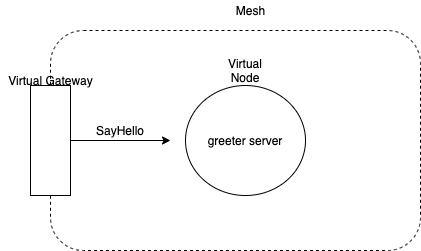

A virtual gateway allows resources outside your mesh to communicate to resources that are inside your mesh. The virtual gateway represents an Envoy proxy running in an Amazon ECS, in a Kubernetes service, or on an Amazon EC2 instance. Unlike a virtual node, which represents a proxy running with an application, a virtual gateway represents the proxy deployed by itself.
This example shows how to manage gRPC routes in App Mesh using Kubernetes deployments.

## Prerequisites
1. [Walkthrough: App Mesh with EKS](../eks/)

2. v1beta2 example manifest requires [aws-app-mesh-controller-for-k8s](https://github.com/aws/aws-app-mesh-controller-for-k8s) version [>=v1.4.0](https://github.com/aws/aws-app-mesh-controller-for-k8s/releases/tag/v1.4.0). Run the following to check the version of controller you are running.
```
$ kubectl get deployment -n appmesh-system appmesh-controller -o json | jq -r ".spec.template.spec.containers[].image" | cut -f2 -d ':'|tail -n1
```

3. Install Docker. It is needed to build the demo application image.

## Setup

1. Clone this repository and navigate to the walkthrough/howto-k8s-grpc-ingress-v2 folder, all commands will be ran from this location
1. **Your** account id:
```
export AWS_ACCOUNT_ID=<your_account_id>
```

2. **Region** e.g. us-west-2
```
export AWS_DEFAULT_REGION=us-west-2
```

3. Deploy
```
./deploy.sh
```

Note that the example apps use go modules. If you have trouble accessing https://proxy.golang.org during the deployment you can override the GOPROXY by setting `GO_PROXY=direct`
```
GO_PROXY=direct ./deploy.sh
```
    
## gRPC Routing


In this basic setup we have a virtual gateway which forwards requests to a grpc greeter service. The request will be routed based on the different matching conditions that we would configure at the gatewayroute

Check if the greeter server is running by viewing its logs. The server listens on port 9111
```
kubectl logs -f deploy/greeter -c app -n howto-k8s-grpc-ingress-v2
```

The basic setup configures gatewayroute (metadata-match) which forwards request if the service name is 'Hello'

You will need the gRPC CLI tool:  
#### Option1: Recommended  
You can use provided Dockerfile in root folder to build an ubuntu image with grpc_cli installed  
```
docker build -t grpc_cli .
docker run -it --rm grpc_cli
```

#### Option2:  
You can install the grpc_cli tool by following the link [here](https://github.com/grpc/grpc/blob/master/doc/command_line_tool.md) 


Get the GW endpoint which is backed by an NLB. Wait till NLB becomes active. You can check the State in aws console  
```
GW_ENDPOINT=$(kubectl get svc ingress-gw -n howto-k8s-grpc-ingress-v2 --output jsonpath='{.status.loadBalancer.ingress[0].hostname}')

echo ${GW_ENDPOINT}
```

### ServiceName Based Match  
The basic setup configures gatewayroute which forwards request based on service name alone  
In other terminal, call the GW_ENDPOINT as below
```
grpc_cli call ${GW_ENDPOINT}:80 SayHello 'user:"Alice"' --protofiles=<relative_path_to_input.proto_file #./greeter/input/input.proto>

Received initial metadata from server:
date : Fri, 04 Jun 2021 07:19:42 GMT
server : envoy
output: "Hello Alice"
Rpc succeeded with OK status
Reflection request not implemented; is the ServerReflection service enabled?
```

Check greeter server logs in other terminal, it should show following output after above request
```
kubectl logs -f deploy/greeter -c app -n howto-k8s-grpc-ingress-v2

Listening on 9111
Received request for: Alice
```

Change the user from Alice to something else
```
grpc_cli call ${GW_ENDPOINT}:80 SayHello 'user:"Bob"' --protofiles=greeter/input/input.proto

connecting to adc49e0976c9b4f17b2b98e4961cea9d-0da74903ec75c02b.elb.us-west-2.amazonaws.com:80
Received initial metadata from server:
date : Fri, 04 Jun 2021 07:19:42 GMT
server : envoy
output: "Hello bob"
Rpc succeeded with OK status
Reflection request not implemented; is the ServerReflection service enabled?
```

Inspect configured gatewayroute spec
```
kubectl describe gatewayroute/metadata-match -n howto-k8s-grpc-ingress-v2

Spec:
  Aws Name:  metadata-match_howto-k8s-grpc-v2
  Grpc Route:
    Action:
      Target:
        Virtual Service:
          Virtual Service Ref:
            Name:  greeter
    Match:
      Service Name:  Hello
```
The gatewayroute forwards all requests which matches the service name Hello for which we call the methd SayHello. The service name is picked from the input.proto file that we specify. 

Edit gatewayroute to match on some other service name and the request should fail. Try few more times for the gatewayroute to apply the updated route, if it still returns the old output. 
```
kubectl edit gatewayroute/metadata-match -n howto-k8s-grpc-ingress-v2

spec:
  awsName: metadata-match_howto-k8s-grpc-v2
  grpcRoute:
    action:
      target:
        virtualService:
          virtualServiceRef:
            name: greeter
    match:
      serviceName: Hello2
```

Sending the same old request again should fail now
```
grpc_cli call ${GW_ENDPOINT}:80 SayHello 'user:"Bob"' --protofiles=greeter/input/input.proto

connecting to adc49e0976c9b4f17b2b98e4961cea9d-0da74903ec75c02b.elb.us-west-2.amazonaws.com:80
Received trailing metadata from server:
date : Fri, 04 Jun 2021 07:30:06 GMT
server : envoy
Rpc failed with status code 12, error message: 
```

### Metadata Based Match
Edit gateweayroute with following spec to match based on following metadata
```
kubectl edit gatewayroute/metadata-match -n howto-k8s-grpc-ingress-v2 

spec:
  awsName: metadata-match_howto-k8s-grpc-v2
  grpcRoute:
    action:
      target:
        virtualService:
          virtualServiceRef:
            name: greeter
    match:
      metadata:
      - match:
          exact: iphone
        name: device
      serviceName: Hello
```

Send request along with the matching metadata
```
grpc_cli call ${GW_ENDPOINT}:80 SayHello 'user:"Bob"' --protofiles=greeter/input/input.proto -metadata "device:iphone"

connecting to adc49e0976c9b4f17b2b98e4961cea9d-0da74903ec75c02b.elb.us-west-2.amazonaws.com:80
Sending client initial metadata:
device : iphone
Received initial metadata from server:
date : Fri, 04 Jun 2021 07:40:51 GMT
server : envoy
output: "Hello Bob"
Rpc succeeded with OK status
Reflection request not implemented; is the ServerReflection service enabled?
```

Send request without the metadata, request should fail
```
grpc_cli call ${GW_ENDPOINT}:80 SayHello 'user:"Bob"' --protofiles=greeter/input/input.proto

connecting to adc49e0976c9b4f17b2b98e4961cea9d-0da74903ec75c02b.elb.us-west-2.amazonaws.com:80
Received trailing metadata from server:
date : Fri, 04 Jun 2021 07:39:20 GMT
server : envoy
Rpc failed with status code 12, error message: 
Reflection request not implemented; is the ServerReflection service enabled?
```
You can also try different matching filters instead of exact, such as suffix, prefix, range, regex, but only 1 is allowed.
You can also have metadata without any matching criteria, in which case it will match based on presence of metadata name.Check below for details 

### Metadata without any match filters
Edit gatewayroute spec without any match criteria for the metadata
```
kubectl edit gatewayroute/metadata-match -n howto-k8s-grpc-ingress-v2

spec:
  awsName: metadata-match_howto-k8s-grpc-v2
  grpcRoute:
    action:
      target:
        virtualService:
          virtualServiceRef:
            name: greeter
    match:
      metadata:
      - name: device
      serviceName: Hello
```

Send request with just metadata key, the value need not be present
```
grpc_cli call ${GW_ENDPOINT}:80 SayHello 'user:"Bob"' --protofiles=greeter/input/input.proto -metadata "device:" 

connecting to adc49e0976c9b4f17b2b98e4961cea9d-0da74903ec75c02b.elb.us-west-2.amazonaws.com:80
Sending client initial metadata:
device : 
Received initial metadata from server:
date : Fri, 04 Jun 2021 07:47:59 GMT
server : envoy
output: "Hello Bob"
Rpc succeeded with OK status
Reflection request not implemented; is the ServerReflection service enabled?
```

Send request with incorrect metadata key, this time the request should fail
```
grpc_cli call ${GW_ENDPOINT}:80 SayHello 'user:"Bob"' --protofiles=greeter/input/input.proto -metadata "test:"

connecting to adc49e0976c9b4f17b2b98e4961cea9d-0da74903ec75c02b.elb.us-west-2.amazonaws.com:80
Sending client initial metadata:
test : 
Received trailing metadata from server:
date : Fri, 04 Jun 2021 07:49:16 GMT
server : envoy
Rpc failed with status code 12, error message: 
Reflection request not implemented; is the ServerReflection service enabled?
```

### Invert Based Match
For the same gatewayroute set Invert to true, this will invert the matching criteria.  
Edit gatewayroute with following spec  
```
kubectl edit gatewayroute/metadata-match -n howto-k8s-grpc-ingress-v2

spec:
  awsName: metadata-match_howto-k8s-grpc-v2
  grpcRoute:
    action:
      target:
        virtualService:
          virtualServiceRef:
            name: greeter
    match:
      metadata:
      - invert: true
        name: device
      serviceName: Hello
```
The above spec will forward all requests which do not have any metadata with key as device. 

Send the previous failed request, this time it should return a valid response
```
grpc_cli call ${GW_ENDPOINT}:80 SayHello 'user:"Bob"' --protofiles=greeter/input/input.proto -metadata "test:"

connecting to adc49e0976c9b4f17b2b98e4961cea9d-0da74903ec75c02b.elb.us-west-2.amazonaws.com:80
Sending client initial metadata:
test : 
Received initial metadata from server:
date : Fri, 04 Jun 2021 07:51:52 GMT
server : envoy
output: "Hello Bob"
Rpc succeeded with OK status
Reflection request not implemented; is the ServerReflection service enabled?
```

Try sending the request with metadata containing one of the key as device. It is possible to send multiple key value pairs for the metadata. The request should fail again
```
grpc_cli call ${GW_ENDPOINT}:80 SayHello 'user:"Bob"' --protofiles=greeter/input/input.proto -metadata "device:iphone:test:"

connecting to adc49e0976c9b4f17b2b98e4961cea9d-0da74903ec75c02b.elb.us-west-2.amazonaws.com:80
Sending client initial metadata:
device : iphone
test : 
Received trailing metadata from server:
date : Fri, 04 Jun 2021 07:56:33 GMT
server : envoy
Rpc failed with status code 12, error message: 
Reflection request not implemented; is the ServerReflection service enabled?
```