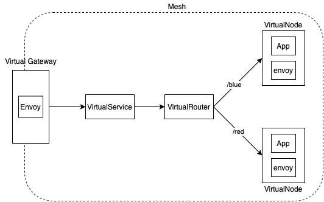

# Configuring Ingress Gateway

In this walkthrough, we will deploy a basic setup and then incrementally add different gatewayroutes to test newly supported features.

## Prerequisites

1. This example requires [aws-app-mesh-controller-for-k8s](https://github.com/aws/aws-app-mesh-controller-for-k8s) version [>=v1.4.0](https://github.com/aws/aws-app-mesh-controller-for-k8s/releases/tag/v1.4.0). Run the following to check the version of controller you are running.
```
kubectl get deployment -n appmesh-system appmesh-controller -o json | jq -r ".spec.template.spec.containers[].image" | cut -f2 -d ':'|tail -n1
```  

2. Install Docker. It is needed to build the demo application images.

## Setup

1. Clone this repository and navigate to the walkthrough/howto-k8s-http-ingress-v2 folder, all commands will be ran from this location
2. **Your** account id:

```
    export AWS_ACCOUNT_ID=<your_account_id>
```

3. **Region** e.g. us-west-2

```
    export AWS_DEFAULT_REGION=us-west-2
```

Basic Setup


4. Deploy the basic setup
```
    ./deploy.sh
```
The basic setup will create an ingress-gw and a gatewayroute that can route traffic based on the following prefix to a virtual service color-paths
```
/paths
```
The virtual service will be targetting 2 virtual nodes blue and red via virtual router and depending on the path it will route traffic to the corresponding node.

In addition to the VirtualRouter, VirtualGateway now supports path, header and query based routing as well. Below series of steps will provide a sample overview of how to make use of these features". We can also control default rewrite behavior of VirtualGateway for prefix, path and hostname  

The basic setup also deploys other services such as green, yellow, white which will be used later as you follow along this guide. 

##### Prefix-based routing ##### 
(already setup)
Get the GWRoute endpoint which is backed by an NLB. Give some time for the NLB to become active before you can continue. You can check Status in aws console
```
GW_ENDPOINT=$(kubectl get svc ingress-gw -n howto-k8s-http-ingress-v2 --output jsonpath='{.status.loadBalancer.ingress[0].hostname}')
```

Check connectivity to virtual node red via GW endpoint
```
curl ${GW_ENDPOINT}/paths/red ; echo;
red
```

Check connectivity to virtual node blue via GW endpoint
```
curl ${GW_ENDPOINT}/paths/blue ; echo;
blue
```

That was the basic setup, you can inspect the gatewayroute which setup the above configuration
```
kubectl get gatewayroute -n howto-k8s-http-ingress-v2
prefix-match   arn:aws:appmesh:us-west-2:567109707621:mesh/howto-k8s-http-ingress-v2/virtualGateway/ingress-gw_howto-k8s-http-ingress-v2/gatewayRoute/prefix-match_howto-k8s-http-ingress-v2

kubectl describe gatewayroute/prefix-match -n howto-k8s-http-ingress-v2

Spec:
  Aws Name:  prefix-match_howto-k8s-http-ingress-v2
  Http Route:
    Action:
      Target:
        Virtual Service:
          Virtual Service Ref:
            Name:  color-paths
    Match:
      Prefix:  /paths
```
As you can see above, the gateway route prefix-match has been configured to do a prefix-based routing to a virtual service which is color-paths in this case.

Now lets add more gateway routes to explore the different types of routing
##### Path based routing #####
Run following command
```
./gwroute_setup.sh path-match
```

This will deploy a gatewayroute which has path based routing. We need to specify a priority higher than the earlier gatewayroute (lower the value higher the priority) so that incoming requests are first matched for exact path and then we check for the prefix based match specified earlier. You can also specify regex pattern instead of exact for path match.
```
kubectl describe gatewayroute/path-match -n howto-k8s-http-ingress-v2

Spec:
  Priority: 0
  Aws Name:  path-match_howto-k8s-http-ingress-v2
  Http Route:
    Action:
      Target:
        Virtual Service:
          Virtual Service Ref:
            Name:  color-green
    Match:
      Path:
        Exact:  /paths/green
```

Check connectivity to green virtual service using above configuration
```
curl ${GW_ENDPOINT}/paths/green ; echo;
green
```

##### Header based routing #####
```
./gwroute_setup.sh header-match
Adding GWRoute for Header based match
gatewayroute.appmesh.k8s.aws/header-match created
```

This will deploy a gatewayroute which has header based routing. You can also specify other header match criteria such as Prefix, Range, Regex and Suffix apart from Exact
```
kubectl describe gatewayroute/header-match -n howto-k8s-http-ingress-v2

Spec:
  Aws Name:  header-match_howto-k8s-http-ingress-v2
  Http Route:
    Action:
      Target:
        Virtual Service:
          Virtual Service Ref:
            Name:  color-yellow
    Match:
      Headers:
        Match:
          Exact:  yellow
        Name:     color_header
      Prefix:     /
```

Check connectivity to yellow virtual service using above configuration
```
curl -H "color_header:yellow" ${GW_ENDPOINT} ; echo;
yellow
```

##### Query based routing #####
```
./gwroute_setup.sh query-match
Adding GWRoute for Query based match
gatewayroute.appmesh.k8s.aws/query-match created
```

This will deploy a gatewayroute which has query based routing
```
kubectl describe gatewayroute/query-match -n howto-k8s-http-ingress-v2

Spec:
  Aws Name:  query-match_howto-k8s-http-ingress-v2
  Http Route:
    Action:
      Target:
        Virtual Service:
          Virtual Service Ref:
            Name:  color-white
    Match:
      Prefix:  /query
      QueryParameters:
        Match:
          Exact:  white
        Name:     color_type
```

Check connectivity to white virtual service based on above configuration (double quotes are required)
```
curl "${GW_ENDPOINT}/query?color_type=white" ; echo;
white
```

##### Routing with Prefix rewrite #####
```
./gwroute_setup.sh prefix-rewrite
Adding GWRoute with Prefix Rewrite
gatewayroute.appmesh.k8s.aws/rewrite-prefix created
```

This will deploy a gatewayroute with prefix rewrite. The trailing '/' is needed to identify end of the prefix when using the Rewrite feature.
```
kubectl describe gatewayroute/rewrite-prefix -n howto-k8s-http-ingress-v2

Spec:
  Aws Name:  rewrite-prefix_howto-k8s-http-ingress-v2
  Http Route:
    Action:
      Rewrite:
        Prefix:
          Value:  /red/
      Target:
        Virtual Service:
          Virtual Service Ref:
            Name:  color-paths
    Match:
      Prefix:  /test/
```

Check whether above configuration works 
```
curl ${GW_ENDPOINT}/test/ ; echo;
red
```

If you get above output means the prefix /test/ got rewritten to /red/ and the target virtual service color-paths which received this request with the new prefix, responded with the correct output (red in this case)

##### Routing with Path rewrite #####
```
./gwroute_setup.sh path-rewrite
Adding GWRoute with Path Rewrite
gatewayroute.appmesh.k8s.aws/rewrite-path created
```

This will deploy a gatewayroute with path rewrite
```
kubectl describe gatewayroute/rewrite-path -n howto-k8s-http-ingress-v2

Spec:
  Aws Name:  rewrite-path_howto-k8s-http-ingress-v2
  Http Route:
    Action:
      Rewrite:
        Path:
          Exact:  /blue
      Target:
        Virtual Service:
          Virtual Service Ref:
            Name:  color-paths
    Match:
      Path:
        Exact:  /rewrite/path/blue
```

Check whether above configuration works
```
curl ${GW_ENDPOINT}/rewrite/path/blue ; echo;
blue
```

If you get above output means the path "/rewrite/path/blue" was succesfully rewritten to /blue and the new URL was sent to the color-paths service. This service already has logic to route to the appropriate virtual node based on the path. In this case the rewritten path was /blue so it sent the request to blue virtual node and got back the response. 

You can also deploy all gatewayroutes all at once 
```
 ./gwroute_setup.sh all
```

To use ./gwroute_setup.sh, you should first have the basic setup done. 

To clean up, delete the namespace
```
kubectl delete ns howto-k8s-http-ingress-v2
```


