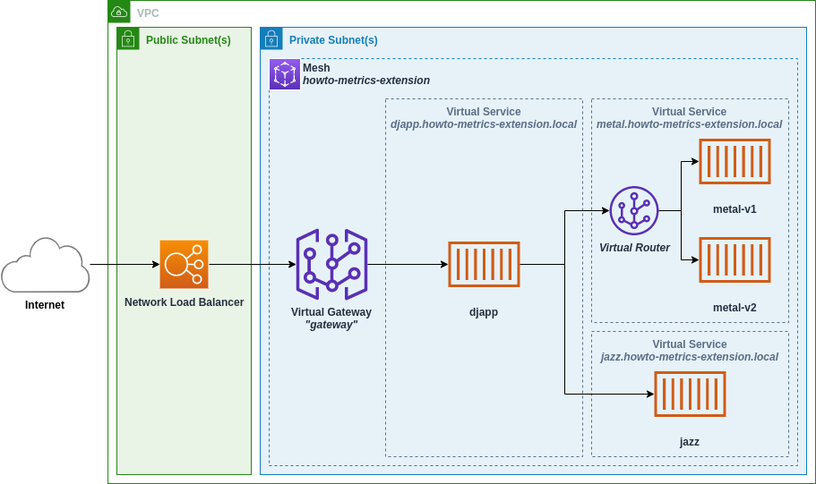
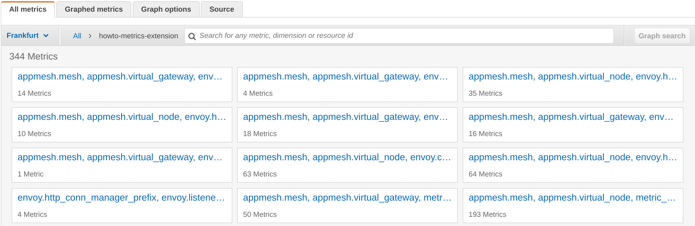
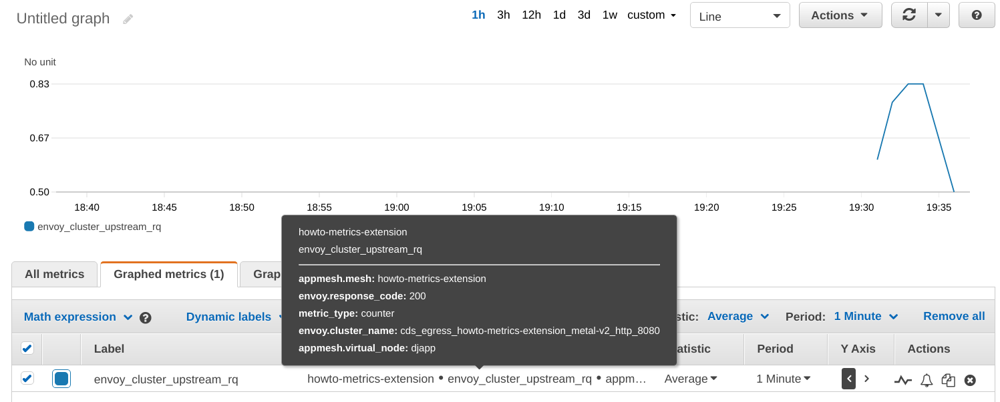
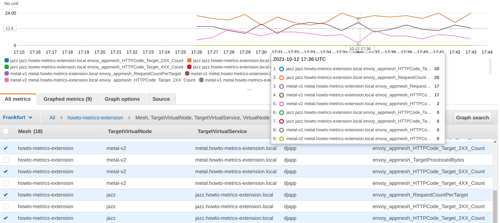

## Overview

This walkthrough provides a demonstration of App Mesh's metrics extension on k8s.
The App Mesh metrics extesion enhances Envoy proxies running in your mesh, allowing them
to emit *additional* metrics that are aware of the resources you define in App Mesh.

Metrics will include new dimensions such as `TargetVirtualService`, allowing you to now aggregate
and filter metrics by the virtual service your virtual nodes communicate with. *More details on
the new metrics and dimensions below.*

By using this walkthrough you will:

1. Deploy an application that leverages all the top-level App Mesh resources (virtual nodes, virtual gateways, virtual routers, etc).
1. Observe in CloudWatch the kinds of metrics provided by Envoy without the metrics extension.
1. Enable the metrics extension add more mesh-aware metrics.
1. See different ways to selectively filter metrics produced by Envoy using the CloudWatch agent or the AWS Distro for OpenTelemetry.
1. Use the metrics extension-provided metrics to easily generate CloudWatch dashboards.

At any time, you can delete everything generated by this walkthrough by following the `Cleaning Up` section
at the bottom of this page.

## Prerequsites

* git (Or a way to download the files in this repository. Only the files in this directory are needed.)
* curl (Or a way to make repeated HTTP requests from your terminal.)
* The [AWS CLI](https://aws.amazon.com/cli/).
* [Docker](https://docs.docker.com/get-docker/). You will use Docker to generate the application images used in this walkthrough.
* [kubectl](https://kubernetes.io/docs/tasks/tools/). To manage your k8s cluster.
* [helm](https://helm.sh/docs/intro/install/). To deploy the [AWS App Mesh controller for k8s](https://github.com/aws/aws-app-mesh-controller-for-k8s) into your cluster.
* [eksctl](https://docs.aws.amazon.com/eks/latest/userguide/eksctl.html) To create your k8s cluster on EKS.

## Initial Configuration

1. Clone this repository and naviate to the `walkthroughs/howto-k8s-metrics-extension` directory.
1. Export your account id:
  ```sh
  export AWS_ACCOUNT_ID=<your AWS account id>
  ```
1. Export the AWS region you will deploy this application in:
  ```sh
  export AWS_DEFAULT_REGION=<an AWS region, e.g. us-west-2>
  ```
1. Export the Envoy proxy image you will use. For the latest image see https://docs.aws.amazon.com/app-mesh/latest/userguide/envoy.html
  ```sh
  export ENVOY_IMAGE=<envoy image>
  ```
  *Note: The metrics extension requires the App Mesh Envoy image with a minimum version of `v1.19.1.1`*

## Application Overview

In this walkthrough you will be deploying a simple EKS-based application called "The DJ App":



The application is composed of a network load balancer, a virtual gateway, and four microservices:

1. `djapp` The frontend service that handles requests from the gateway. It is the only member
   of the `djapp.howto-metrics-extension.svc.cluster.local` virtual service.
1. `metal-v1` A member of the `metal.howto-metrics-extension.svc.cluster.local` virtual service.
1. `metal-v2` The other member of the `metal.howto-metrics-extension.svc.clusterlocal` virtual service.
1. `jazz` The sole member of the `jazz.howto-metrics-extension.svc.cluster.local` virtual service.

Traffic comes into the application via a Network Load Balancer that forwards traffic to the
virtual gateway (named `ingress-gw`). `ingress-gw` acts as an ingress to our mesh and in-turn
forwards traffic to `djapp.howto-metrics-extension.svc.cluster.local`.

The `djapp` requests artist lists randomly from the `metal.howto-metrics-extension.svc.cluster.local` and
`jazz.howto-metrics-extension.svc.cluster.local` virtual services and returns them to its callers.

* `jazz` will return jazz artists such as *Miles Davis* or *Astrud Gilberto*.
* `metal-v1` will return metal artists such as *Judas Priest* or *Megadeth*.
* `metal-v2` will return metal artists as well, but also includes the city where
the artists come from. The two members of the `metal.howto-metrics-extension.svc.cluster.local`
virtual service simulate a canary deployment or A/B test where there are multiple versions
of service deployed at the same time.

> The `metal.howto-metrics-extension.svc.cluster.local` virtual service distributes traffic 60/40 to
  `metal-v1` and `metal-v2` using a virtual router with a single route:
  ```yaml
  apiVersion: appmesh.k8s.aws/v1beta2
  kind: VirtualRouter
  metadata:
    namespace: $NAMESPACE_NAME
    name: metal
  spec:
    listeners:
      - portMapping:
          port: 8080
          protocol: http
    routes:
      - name: route
        httpRoute:
          match:
            prefix: /
          action:
            weightedTargets:
              - virtualNodeRef:
                  name: metal-v1
                weight: 60
              - virtualNodeRef:
                  name: metal-v2
                weight: 40
  ```

Lastly, all metrics generated by the Envoy proxies will be sent to CloudWatch under the
`howto-metrics-extension` (or whatever you named your namespace) namespace.

## Create an IAM Policy for the App Mesh Controller

The k8s cluster you will create will use [IAM Roles for Service Accounts](https://docs.aws.amazon.com/eks/latest/userguide/iam-roles-for-service-accounts.html) (IRSA)
to give seperate, scoped down, permissions for the App Mesh controller pods and the pods that comprise the DJ App.

While the AWS provides managed policies for the DJ App pods to communicate with App Mesh and CloudWatch, there is no managed policy for the App Mesh controller.

Download an example policy from the App Mesh controller repository:
```sh
curl -Lo controller-iam-policy.json https://raw.githubusercontent.com/aws/aws-app-mesh-controller-for-k8s/master/config/iam/controller-iam-policy.json
```

And create the policy using the AWS CLI:
```sh
aws iam create-policy \
    --policy-name AWSAppMeshK8sControllerIAMPolicy \
    --policy-document file://controller-iam-policy.json
```

*Note: You may receive an `EntityAlreadyExists` error if this policy already exists in your account. If so, you likely already created this policy in the past.*

## Create a k8s cluster

Now that you have an IAM policy for the App Mesh controller, you can create your cluster.

Set a couple variables that you'll use throughout this walkthrough, feel free to change them:

```sh
export CLUSTER_NAME=howto-metrics-extension
```

```sh
export NAMESPACE_NAME=howto-metrics-extension
```

Run this to fill in the cluster template with the settings you've declared so far:
```sh
./fill.sh deploy/cluster.yaml.template > deploy/cluster.yaml
```

Now create the cluster with `eksctl` (This can take around 30 minutes):
```sh
eksctl create cluster -f deploy/cluster.yaml
```

Verify that your cluster is healthy:
```sh
kubectl get nodes
```

You should see an output similar to:
```
NAME                                              STATUS   ROLES    AGE     VERSION
ip-192-168-34-234.eu-central-1.compute.internal   Ready    <none>   2m28s   v1.20.10-eks-3bcdcd
ip-192-168-4-207.eu-central-1.compute.internal    Ready    <none>   2m30s   v1.20.10-eks-3bcdcd
ip-192-168-40-107.eu-central-1.compute.internal   Ready    <none>   10m     v1.20.10-eks-3bcdcd
ip-192-168-5-51.eu-central-1.compute.internal     Ready    <none>   10m     v1.20.10-eks-3bcdcd
ip-192-168-87-122.eu-central-1.compute.internal   Ready    <none>   2m23s   v1.20.10-eks-3bcdcd
```

## Install the App Mesh controller

Configure your namespace to automatically add the Envoy proxy to your pods:

```sh
./fill.sh deploy/namespace.yaml.template > deploy/namespace.yaml
```

```sh
kubectl apply -f deploy/namespace.yaml
```

Register the EKS Helm charts repository. This repository contains the scripts required to install the App Mesh controller:
```sh
helm repo add eks https://aws.github.io/eks-charts
```

Install the controller:
```sh
helm upgrade -i appmesh-controller eks/appmesh-controller \ 
    --namespace appmesh-system \
    --set region="$AWS_DEFAULT_REGION" \
    --set serviceAccount.create=false \
    --set serviceAccount.name=appmesh-controller \
    --set sidecar.image.repository="$(echo "$ENVOY_IMAGE" | sed -n "s/\(.*\):\(.*\)/\1/p")" \
    --set sidecar.image.tag="$(echo "$ENVOY_IMAGE" | sed -n "s/\(.*\):\(.*\)/\2/p")" \
    --set sidecar.logLevel=debug \
    --set stats.statsdEnabled=true \
    --set stats.tagsEnabled=true \
    --set stats.statsdAddress=ref:status.hostIP
```

## Deploy the DJ App

The DJ App docker images need to be built and uploaded to ECR. Run the `images.sh` script to build and upload them:
```sh
./images.sh upload
```

Now you are ready to deploy the DJ App into your cluster.

Fill in the template for the k8s deployment:
```sh
./fill.sh deploy/djapp-v1.yaml.template > deploy/djapp-v1.yaml
```

And deploy the application:
```sh
kubectl create -f deploy/djapp-v1.yaml
```

Once the deployment is complete you should be able to retrieve the public address of the NLB:
```sh
export PUBLIC_ENDPOINT="http://$(kubectl get service ingress-gw -n $NAMESPACE_NAME --output jsonpath='{.status.loadBalancer.ingress[0].hostname}')"
```

## Default Envoy Metrics

To see the service metrics generated by Envoy you'll want to drive some traffic to the DJ App.
This loop will make a request to the DJ App every second and print an artist name:
```sh
while true; do
    curl $PUBLIC_ENDPOINT;
    sleep 1;
    echo;
done
```

> If you just deployed the DJ App, it may take a few minutes for the above deployment to fully stabalize.
  During this time, the above loop may not print anything.

After sending traffic to DJ App for a few minutes, you can navigate to the CloudWatch console.



Here you'll see **hundreds** of metrics being generated by Envoy broken down by a few different dimensions,
including a few that give some insight as to which virtual node or virtual gateway generated them:

* `appmesh.mesh`
* `appmesh.virtual_node`
* `appmesh.virtual_gateway`

As an example, you can search for the metric `envoy_cluster_upstream_rq` in CloudWatch to see the number of requests
made by Envoy to each of its upstream *clusters* (upstream clusters usually being other virtual nodes in your mesh).

Alternatively, you can use the `metric.sh` script to get a snapshot of the metric for the last 15 minutes:
```sh
./metric.sh -m envoy_cluster_upstream_rq -x Sum -q "appmesh.mesh=${NAMESPACE_NAME} appmesh.virtual_node=djapp_${NAMESPACE_NAME}"
```

*Note: You can run `./metric.sh -h` for help on using the script.*



In the above CloudWatch screenshot this metric has the dimension `envoy.cluster_name` with a value of
`cds_egress_howto-metrics-extension_metal-v2_http_8080`.

This metric is for the `djapp` virtual node, showing the number of requests from `djapp` to `metal-v2`.
Each backend virtual node will result in a unique metric value being emitted, though none of these metrics
indicate the virtual service the backend represents. App Mesh only includes the source and destination
virtual node names in the metric names it generates.

> To learn more about Envoy metrics and how they are named in App Mesh, see the Envoy metrics topic in
  the App Mesh User Guide: https://docs.aws.amazon.com/app-mesh/latest/userguide/envoy-metrics.html

## Enabling the Metrics Extension

Above, you saw that Envoy generates a large number of metrics with high-cardinality. The metrics are
also not straightforward to relate back to App Mesh resources, and in the case of virtual services, there
is no mechanism to know for sure which virtual service a given virtual node or virtual gateway is communicating with.

The goal of the metrics extension is to provide a small but still useful set of metrics that will give you
insight into the behavior of your mesh in terms of the resources you define in App Mesh.

At the time of writing, App Mesh will have made available the first version (version `1`) of the metrics extension.
Over time, new metrics and features of will be made available. You can opt into these additional metrics by
adding an environment variable to the Envoy container running alongside your pods:

```sh
APPMESH_METRIC_EXTENSION_VERSION=1
```

The existing DJ App deployments look like this:

```yaml
apiVersion: apps/v1
kind: Deployment
metadata:
  name: djapp
  namespace: $NAMESPACE_NAME
spec:
  replicas: 2
  selector:
    matchLabels:
      app: djapp
  template:
    metadata:
      labels:
        app: djapp
    spec:
      # (...)
```

You'll next deploy an update to the DJ App with two changes. First, you'll remove the option `--set stats.tagsEnabled=true`
from the App Mesh controller. And you'll add the annotation `appmesh.k8s.aws/sidecarEnv: "APPMESH_METRIC_EXTENSION_VERSION=1"`
to your application deployments. Enabling the App Mesh metrics extension makes the `stats.tagsEnabled` setting you enabled on the 
App Mesh controller redundant. The metrics extension will implicitly add App Mesh dimensions to Envoy's metrics.

```yaml
apiVersion: apps/v1
kind: Deployment
metadata:
  name: djapp
  namespace: $NAMESPACE_NAME
spec:
  replicas: 2
  selector:
    matchLabels:
      app: djapp
  template:
    metadata:
      labels:
        app: djapp
      annotations:
        appmesh.k8s.aws/sidecarEnv: "APPMESH_METRIC_EXTENSION_VERSION=1"
    spec:
      # (...)
```

Perform the update to the controller:

```sh
helm upgrade -i appmesh-controller eks/appmesh-controller \ 
    --namespace appmesh-system \
    --set region="$AWS_DEFAULT_REGION" \
    --set serviceAccount.create=false \
    --set serviceAccount.name=appmesh-controller \
    --set sidecar.image.repository="$(echo "$ENVOY_IMAGE" | sed -n "s/\(.*\):\(.*\)/\1/p")" \
    --set sidecar.image.tag="$(echo "$ENVOY_IMAGE" | sed -n "s/\(.*\):\(.*\)/\2/p")" \
    --set sidecar.logLevel=debug \
    --set stats.statsdEnabled=true \
    --set stats.statsdAddress=ref:status.hostIP
```

Fill in the template for the k8s deployment:
```sh
./fill.sh deploy/djapp-v2.yaml.template > deploy/djapp-v2.yaml
```

And apply the update:
```sh
kubectl apply -f deploy/djapp-v2.yaml
```

Once the update is complete, you'll want to send traffic to the DJ App again:
```sh
while true; do
    curl $PUBLIC_ENDPOINT;
    sleep 1;
    echo;
done
```

In CloudWatch you should now see new metrics starting to appear. The metrics provided by the metrics extension resemble
those provided by Elastic Load Balancing:

*Note: Metrics exported to CloudWatch will have a prefix of `envoy.appmesh.` (or `envoy_appmesh_` depending on the metrics
format you are using to export to CloudWatch). Sections below will cover ways to configure this.*

### Metrics Related to Inbound/Ingress Traffic

| Metric                | Description                                                   | Dimensions                                 |
| --------------------- | ------------------------------------------------------------- | ------------------------------------------ |
| ActiveConnectionCount | Number of active TCP connections.                             | Mesh, VirtualNode<br/>Mesh, VirtualGateway |
| NewConnectionCount    | Number of TCP connections created.                            | Mesh, VirtualNode<br/>Mesh, VirtualGateway |
| ProcessedBytes        | Total TCP bytes sent to and received from downstream clients. | Mesh, VirtualNode<br/>Mesh, VirtualGateway | 
| RequestCount          | The number of processed HTTP requests.                        | Mesh, VirtualNode<br/>Mesh, VirtualGateway | 
| GrpcRequestCount      | The number of processed gPRC requests.                        | Mesh, VirtualNode<br/>Mesh, VirtualGateway |

### Metrics Related to Outbound/Egress Traffic

| Metric                    | Description                                                                                               | Dimensions                                                                                                                   |
| ------------------------- | --------------------------------------------------------------------------------------------------------- | ---------------------------------------------------------------------------------------------------------------------------- |
| TargetProcessedBytes      | Total TCP bytes sent to and received from upstream targets.                                               | Mesh, VirtualNode, TargetVirtualService, TargetVirtualNode<br/>Mesh, VirtualGateway, TargetVirtualService, TargetVirtualNode |
| HTTPCode_Target_2XX_Count | The number of HTTP requests to an upstream target that resulted in a 2xx HTTP response.                   | Mesh, VirtualNode, TargetVirtualService, TargetVirtualNode<br/>Mesh, VirtualGateway, TargetVirtualService, TargetVirtualNode |
| HTTPCode_Target_3XX_Count | The number of HTTP requests to an upstream target that resulted in a 3xx HTTP response.                   | Mesh, VirtualNode, TargetVirtualService, TargetVirtualNode<br/>Mesh, VirtualGateway, TargetVirtualService, TargetVirtualNode |
| HTTPCode_Target_4XX_Count | The number of HTTP requests to an upstream target that resulted in a 4xx HTTP response.                   | Mesh, VirtualNode, TargetVirtualService, TargetVirtualNode<br/>Mesh, VirtualGateway, TargetVirtualService, TargetVirtualNode |
| HTTPCode_Target_5XX_Count | The number of HTTP requests to an upstream target that resulted in a 5xx HTTP response.                   | Mesh, VirtualNode, TargetVirtualService, TargetVirtualNode<br/>Mesh, VirtualGateway, TargetVirtualService, TargetVirtualNode |
| RequestCountPerTarget     | The number of requests sent to an upstream target.                                                        | Mesh, VirtualNode, TargetVirtualService, TargetVirtualNode<br/>Mesh, VirtualGateway, TargetVirtualService, TargetVirtualNode |
| TargetResponseTime        | The time elapsed from when a request is made to an upstream target to when the full response is received. | Mesh, VirtualNode, TargetVirtualService, TargetVirtualNode<br/>Mesh, VirtualGateway, TargetVirtualService, TargetVirtualNode |



In the above screenshot, metrics for the `djapp` virtual node now include the metrics listed above. All of Envoy's built-in metrics will
also now include the `Mesh`, `VirtualNode`, and `VirtualGateway` dimensions.

You can use the `metric.sh` script included in this walkthough to get snapshot images of the metrics in this mesh.

To see the number of requests handled by the gateway, run:
```sh
./metric.sh -t VirtualGateway -n "ingress-gw_${NAMESPACE_NAME}" -m envoy_appmesh_RequestCount -x Sum -q "metric_type=counter"
```

To see the distribution of requests from the `djapp` to the different virtual nodes of `metal.howto-metrics-extension.local`, run:
```sh
./metric.sh -t VirtualNode -n "djapp_${NAMESPACE_NAME}" -m envoy_appmesh_RequestCountPerTarget -x Sum -q "TargetVirtualService=metal.${NAMESPACE_NAME}.svc.cluster.local metric_type=counter"
```

Or to see the latency betwen `djapp` and the `jazz`, run:
```sh
./metric.sh -t VirtualNode -n "djapp_${NAMESPACE_NAME}" -m envoy_appmesh_TargetResponseTime -x Average -q "TargetVirtualNode=jazz_${NAMESPACE_NAME} metric_type=timing"
```

## Filtering Metrics with the CloudWatch Agent

In the previous section you observed that the App Mesh metrics extension provides a subset of useful
metrics that help you see things such as traffic, latency, and error rates in the DJ App. However, these
new metrics make some of Envoy's default metrics redundant. And many of Envoy's default metrics are likely
not of use to the DJ App. Fortunately, there are ways to filter metrics locally in our services before
sending them to CloudWatch. Here you will see a way of doing metric filtering using the CloudWatch agent.

> Note: Envoy has built-in support for filtering the metrics it emits but this feature can lead to unwanted
  behavior, unfortunately including irrecoverable dead-lock preventing App Mesh from pushing new configuration
  to Envoy. You can track the status of this issue on Envoy's side here: https://github.com/envoyproxy/envoy/issues/8771
  Or you can watch our tracking issue here: https://github.com/aws/aws-app-mesh-roadmap/issues/283 in the mean
  time, metric filtering is best done by a metrics daemon or sidecar.

Most App Mesh users that use the CloudWatch agent leverage the [StatsD](https://github.com/statsd/statsd)
(or DogStatsD) protocol to send metrics from Envoy to the agent and ultimately to CloudWatch.
While this integration is simple, it provides no mechanism today to filter metrics before sending them to CloudWatch.
The CloudWatch agent does however support scraping [Prometheus](https://prometheus.io/) metrics.

Prometheus scrapers can be provided a *scrape configuration* that allows you to select the metrics you want to
pull from Envoy and ultimately send to CloudWatch.

Right now, the DaemonSet running the CloudWatch agent is configured to use StatsD:

```yaml 
apiVersion: apps/v1
kind: DaemonSet
metadata:
  name: cloudwatch-agent
  namespace: $NAMESPACE_NAME
spec:
  template:
    spec:
      serviceAccountName: cloudwatch-agent
      containers:
        - name: cwagent
          image: public.ecr.aws/cloudwatch-agent/cloudwatch-agent:latest 
          ports:
            - containerPort: 8125
              hostPort: 8125
              protocol: UDP
          env:
            - name: CW_CONFIG_CONTENT
              value: >
                {
                  "agent": {
                    "omit_hostname": true
                  },
                  "metrics": {
                    "namespace": "$NAMESPACE_NAME",
                    "metrics_collected": {
                      "statsd": {}
                    }
                  }
                } 
  # (...)
```

The option on the App Mesh controller `--set stats.statsdEnabled=true` tells Envoy to emit StatsD metrics.
And the `metrics_collected: { statsd: {} }` setting on the CloudWatch agent in-turn configures
the agent to consume metrics pushed from Envoy to it.

The next update to the DJ App will instead configure the CloudWatch agent to scrape and filter Prometheus
metrics from all of our services.

This agent will automatically discover pods in our cluster that have Envoy proxies exposing a prometheus endpoint.
To do this, the agent will need a ClusterRole bound to its service account that allows read-only access to resources
in the cluster:

```yaml
kind: ClusterRole
apiVersion: rbac.authorization.k8s.io/v1
metadata:
  name: cwagent-prometheus-role
# (...)
```

```yaml
kind: ClusterRoleBinding
apiVersion: rbac.authorization.k8s.io/v1
metadata:
  name: cwagent-prometheus-role-binding
subjects:
  - kind: ServiceAccount
    name: cloudwatch-agent
    namespace: $NAMESPACE_NAME
roleRef:
  kind: ClusterRole
  name: cwagent-prometheus-role
  apiGroup: rbac.authorization.k8s.io
```

The new configuration for the CloudWatch agent looks like this:

```yaml
apiVersion: apps/v1
kind: DaemonSet
metadata:
  name: cloudwatch-agent
  namespace: $NAMESPACE_NAME
spec:
  template:
    spec:
      serviceAccountName: cloudwatch-agent
      containers:
        - name: cwagent
          image: public.ecr.aws/cloudwatch-agent/cloudwatch-agent:latest 
          env:
            - name: PROMETHEUS_CONFIG_CONTENT
              value: |
                global:
                  scrape_interval: 1m
                  scrape_timeout: 10s
                scrape_configs:
                  - job_name: kubernetes-pod-appmesh-envoy
                    sample_limit: 10000
                    metrics_path: /stats/prometheus
                    kubernetes_sd_configs:
                      - role: pod
                    relabel_configs:
                      - source_labels: [__meta_kubernetes_pod_container_name]
                        action: keep
                        regex: ^envoy$
                      - source_labels: [__meta_kubernetes_pod_container_name]
                        target_label: container_name
                        action: replace
                    metric_relabel_configs:
                      - source_labels: [__name__]
                        regex: ^envoy_appmesh_.+$
                        action: keep
            - name: CW_CONFIG_CONTENT
              value: >
                {
                  "agent": {
                    "omit_hostname": true
                  },
                  "logs": {
                    "force_flush_interval": 5,
                    "metrics_collected": {
                      "prometheus": {
                        "log_group_name": "$NAMESPACE_NAME",
                        "prometheus_config_path": "env:PROMETHEUS_CONFIG_CONTENT",
                        "emf_processor": {
                          "metric_namespace": "$NAMESPACE_NAME",
                          "metric_declaration_dedup": true,
                          "metric_declaration": [
                            {
                              "source_labels": [ "container_name" ],
                              "label_matcher": "^envoy$",
                              "dimensions": [
                                ["Mesh", "VirtualNode"],
                                ["Mesh", "VirtualNode", "TargetVirtualNode"],
                                ["Mesh", "VirtualNode", "TargetVirtualNode", "TargetVirtualService"],
                                ["Mesh", "VirtualGateway"],
                                ["Mesh", "VirtualGateway", "TargetVirtualNode"],
                                ["Mesh", "VirtualGateway", "TargetVirtualNode", "TargetVirtualService"]
                              ],
                              "metric_selectors": [
                                "^.+$"
                              ]
                            }
                          ]
                        }
                      }
                    }
                  }
                } 
```

Under `PROMETHEUS_CONFIG_CONTENT` there will be a [Prometheus configuration file](https://prometheus.io/docs/prometheus/latest/configuration/configuration/).
Prometheus' scrape configuration allows one to filter and manipulate metrics before sending them to CloudWatch in
[Embedded Metrics Format](https://docs.aws.amazon.com/AmazonCloudWatch/latest/monitoring/CloudWatch_Embedded_Metric_Format_Specification.html).

In this example, all metrics that begin with `envoy_appmesh_` are collected from Envoy into the CloudWatch agent.

> It is worth noting that Prometheus automatically replaced all dot (`.`) characters in Envoy metric names and dimensions with
  underscores (`_`). The CloudWatch agent only performs this transformation on metric names.

The `metric_declaration` section in `CW_AGENT_CONFIG` is where you can select which metrics and which dimensions you want
to send to CloudWatch in Embedded Metrics Format. Here, all possible dimension combinations are selected, and all metrics names are
selected under `metrics_selectors` with a wildcard regular expression. You can remove dimensions or further restrict metric names
in this section if you choose.

> To learn more about configuring the CloudWatch agent to scrape Prometheus metrics see:
  https://docs.aws.amazon.com/AmazonCloudWatch/latest/monitoring/ContainerInsights-Prometheus-install-EKS.html  

Fill in the template for the k8s deployment:
```sh
./fill.sh deploy/djapp-v3.yaml.template > deploy/djapp-v3.yaml
```

And apply the update:
```sh
kubectl apply -f deploy/djapp-v3.yaml
```

When complete, generate traffic for a few minutes:
```sh
while true; do
    curl $PUBLIC_ENDPOINT;
    sleep 1;
    echo;
done
```

At this point, all of Envoy's default metrics are no longer being sent to CloudWatch. Additionally, only the metric dimensions we opted into
above are being sent.

You can verify that Envoy's metrics are no longer being sent to CloudWatch by using the `metric.sh` script again:
```sh
./metric.sh -t VirtualNode -n "djapp_${NAMESPACE_NAME}" -m envoy_cluster_upstream_cx_total -x Sum -q "envoy.cluster_name=cds_egress_${NAMESPACE_NAME}_metal-v1_${NAMESPACE_NAME}_http_8080 metric_type=counter"
```

This graph should show the metric `envoy_cluster_upstream_cx_total`. The number of TCP connections from `djapp` to the `metal-v1` virtual node.

## (Optional) Adding Selected Envoy Metrics

The metrics extension metrics are not intended to replace all of the useful metrics provided by Envoy. Using scrape configration, you
can always opt in to sending select Envoy metrics to CloudWatch. In this section you'll configure the CloudWatch agent to send the
metric that counts the number of TCP connections between the `djapp` and its backend virtual nodes (`envoy_cluster_upstream_cx_total`):

```yaml
apiVersion: apps/v1
kind: DaemonSet
metadata:
  name: cloudwatch-agent
  namespace: $NAMESPACE_NAME
spec:
  template:
    spec:
      serviceAccountName: cloudwatch-agent
      containers:
        - name: cwagent
          image: public.ecr.aws/cloudwatch-agent/cloudwatch-agent:latest 
          env:
            - name: PROMETHEUS_CONFIG_CONTENT
              value: |
                global:
                  scrape_interval: 1m
                  scrape_timeout: 10s
                scrape_configs:
                  - job_name: kubernetes-pod-appmesh-envoy
                    sample_limit: 10000
                    metrics_path: /stats/prometheus
                    kubernetes_sd_configs:
                      - role: pod
                    relabel_configs:
                      - source_labels: [__meta_kubernetes_pod_container_name]
                        action: keep
                        regex: ^envoy$
                      - source_labels: [__meta_kubernetes_pod_container_name]
                        target_label: container_name
                        action: replace
                    metric_relabel_configs:
                      - source_labels: [__name__]
                        regex: ^(envoy_appmesh_.+)|(envoy_cluster_upstream_cx_total)$
                        action: keep
                      - source_labels: [envoy_cluster_name]
                        target_label: TargetVirtualNode
                        regex: ^cds_egress_${NAMESPACE_NAME}_(.+_${NAMESPACE_NAME})_(.+)_[0-9]+$
                        replacement: \${1}
            # (...)
```

In addition to keeping the `envoy_cluster_upstream_cx_total` metric, there is an additional configration that 
extracts the `TargetVirtualNode` dimension using Envoy's existing `envoy_cluster_name` dimension. This method
of extracting target virtual node names from `envoy_cluster_name` works for most Envoy metrics.


Fill in the template for the k8s deployment:
```sh
./fill.sh deploy/djapp-v4.yaml.template > deploy/djapp-v4.yaml
```

And apply the update:
```sh
kubectl apply -f deploy/djapp-v4.yaml
```

When complete, generate traffic for a few minutes:
```sh
while true; do
    curl $PUBLIC_ENDPOINT;
    sleep 1;
    echo;
done
```

You can now observe that the Envoy metric has been restored and includes the `TargetVirtualNode` dimension:
```sh
./metric.sh -t VirtualNode -n "djapp_${NAMESPACE_NAME}" -m envoy_cluster_upstream_cx_total -x Sum -q "TargetVirtualNode=metal-v1_${NAMESPACE_NAME}"
```

## (Optional) Filtering Metrics with the AWS Distro for OpenTelemetry

As of the time of this writing, the CloudWatch agent does not support scraping histogram type metrics from a Prometheus client.
Histogram metrics are used in Envoy to represent time durations. As a result, the metrics extension metric: `TargetResponseTime`
or any of Envoy's built-in histogram/timing metrics will not get sent to CloudWatch.

> See: https://docs.aws.amazon.com/AmazonCloudWatch/latest/monitoring/ContainerInsights-Prometheus-metrics-conversion.html
  for current status of supported metrics types.

In this section, you will replace the CloudWatch agent with the AWS OpenTelemetry Collector from the
[AWS Distro for OpenTelemetry](https://aws.amazon.com/otel/). The OpenTelemetry collector supports many different metrics
formats and can replace multilple existing metrics agents including the CloudWatch and AWS X-Ray agents.

To migrate to the OpenTelemetry collector, you'll start from the version of the DJ App where we used the CloudWatch agent
as with StatsD. This was the version of the DJ App in template located at `deploy/djapp-v2.yaml.template`.

```yaml
apiVersion: apps/v1
kind: DaemonSet
metadata:
  name: cloudwatch-agent
  namespace: $NAMESPACE_NAME
spec:
  template:
    spec:
      serviceAccountName: cloudwatch-agent
      containers:
        - name: cwagent
          image: public.ecr.aws/aws-observability/aws-otel-collector:latest 
          env:
            - name: AOT_CONFIG_CONTENT
              value: |
                extensions:
                  health_check:
                receivers:
                  statsd:
                    endpoint: 0.0.0.0:8125
                    aggregation_interval: 60s 
                processors:
                  batch/metrics:
                    timeout: 60s
                  filter:
                    metrics:
                      include:
                        match_type: regexp
                        metric_names:
                          - ^envoy\.appmesh\..+$
                exporters:
                  awsemf:
                    namespace: $NAMESPACE_NAME
                    log_group_name: $NAMESPACE_NAME
                    dimension_rollup_option: NoDimensionRollup
                service:
                  pipelines:
                    metrics:
                      receivers: [statsd]
                      processors: [batch/metrics, filter]
                      exporters: [awsemf]
                  extensions:  [health_check]
  # (...)
```

While the OpenTelemetry collector also supports scraping Prometheus metrics from Envoy, you can continue
to use StatsD metrics and filter using a `filter` processor. As in the above sections, the filter
processor will configure the OpenTelemetry collector to send only metrics that start with `envoy.appmesh.`
to CloudWatch.

> To learn more about OpenTelemetry processors see: https://opentelemetry.io/docs/collector/configuration/#processors

> To learn more about the CloudWatch EMF exporter see: https://github.com/open-telemetry/opentelemetry-collector-contrib/blob/main/exporter/awsemfexporter/README.md


Fill in the template for the k8s deployment:
```sh
./fill.sh deploy/djapp-v5.yaml.template > deploy/djapp-v5.yaml
```

And apply the update:
```sh
kubectl apply -f deploy/djapp-v5.yaml
```

When complete, generate traffic for a few minutes:
```sh
while true; do
    curl $PUBLIC_ENDPOINT;
    sleep 1;
    echo;
done
```

You can view the `TargetResponseTime` metric for calls from `djapp` to `metal.howto-metrics-extension.svc.cluster.local`:
```sh
./metric.sh -t VirtualNode -n "djapp_${NAMESPACE_NAME}" -m envoy.appmesh.TargetResponseTime -x p50 -q "TargetVirtualService=metal.${NAMESPACE_NAME}.svc.cluster.local"
```

## Cleaning Up

Delete your k8s cluster:
```sh
eksctl delete cluster --region "$AWS_DEFAULT_REGION" --name "$CLUSTER_NAME"
```

Delete the images you uploaded to ECR:
```sh
./images.sh delete
```
