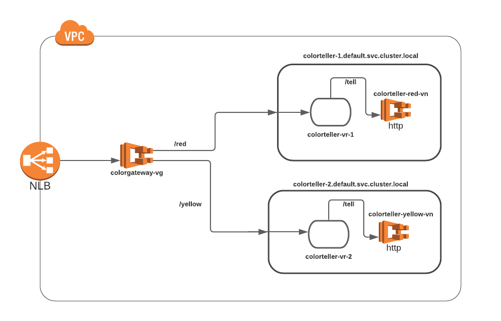

# Walkthrough of matches and rewrites in Virtual Gateway

## Concepts

In this walkthrough we'll be using the following set up to demo Header/Hostname Matching and Path/Prefix Rewrites.




- **GatewayRoute:** Gateway Routes allows specifying routing conditions that match the incoming request and determines the Virtual Service to redirect the request to. These conditions are specified as match conditions (`prefix` , `path`, `queryParameters`, `hostname` for HTTP/HTTP2 routes and `serviceName` and `hostname` for GRPC). A sample spec for the GatewayRoute is as follows:

	```json
	{
    "spec": {
        "httpRoute" : {
            "match" : {
                "prefix" : "/red",
                "queryParameters" : [{
                    "name" : "color",
                    "value" : {
                      "exact" : "red"
                    }
                 }],
                "hostname" : {
                   "exact" : "www.example.com"
                },
                "headers" : [{
                   "name" : "CACHE_CONTROL",
                   "match" :  {
                      "exact" : "no-cache" 
                   }
                }]
            },
            "action" : {
                "target" : {
                    "virtualService": {
                        "virtualServiceName": $VIRTUALSERVICE_NAME
                    }
                }
            }
        }
    }
	}
	```
	A matched request by a gateway route is rewritten to the target Virtual Service's `hostname` and the matched prefix is rewritten to `/`, by default, or when default Prefix rewrite is `Enabled`. 
	Alternatively, you can specify a custom prefix to rewrite the matched prefix to, as well as specify configuration for matching/rewriting based on paths.
	Depending on how you configure your Virtual Service, it could then rely on a Virtual Router to route the request to different virtual nodes, based on specific prefixes or headers.
	
- **Routes**: A route is associated with a virtual router. The route is used to match requests for the virtual router and to distribute traffic to its associated virtual nodes. If a route matches a request, it can distribute traffic to one or more target virtual nodes. In this walkthrough, we will look at routes matching on `path`, `prefix`, `queryParameters` and `headers` in HTTP Routes. 
 
    A sample spec for Route is:
    
    ```json
  {
  	"spec": {
  		"priority": 1,
  		"httpRoute": {
  			"action": {
  				"weightedTargets": [{
  					"virtualNode": "my-node",
  					"weight": 1
  				}]
  			},
  			"match": {
  				"headers": [{
  					"name": "color_header",
  					"match": {
  						"prefix": "redoryellow"
  					}
  				}],
  				"prefix": "/",
  				"queryParameters": [{
  					"name": "color",
  					"match": {
  						"exact": "yellow"
  					}
  				}]
  			}
  		}
  	}
  }       
    ```
 

## Setup
For the Color App setup, we'll use an NLB to forward traffic to the Virtual Gateway (running a set of Envoys). We would configure 2 Gateway Routes - red and yellow pointing to 2 Virtual Services.

Let's now jump into the example.

## Step 1: Prerequisites


1. This walkthrough makes use of the unix command line utility `jq`. If you don't already have it, you can install it from [here](https://stedolan.github.io/jq/).

2. This example uses features in the [App Mesh Preview Channel](https://docs.aws.amazon.com/app-mesh/latest/userguide/preview.html). You'll need to install the latest `appmesh-preview`      model.

   Add the Preview Channel service model to the AWS CLI version 1 with the following command:
   ```bash
       aws configure add-model \
           --service-name appmesh-preview \
           --service-model https://raw.githubusercontent.com/aws/aws-app-mesh-roadmap/main/appmesh-preview/service-model.json
   ```
   
   If you're using the AWS CLI version 2, add the service model with the following commands:
   ```bash
       curl -o service-model.json https://raw.githubusercontent.com/aws/aws-app-mesh-roadmap/main/appmesh-preview/service-model.json
       aws configure add-model --service-name appmesh-preview --service-model file://service-model.json
   ```

3. Install Docker. It is needed to build the demo application images.

4. You'll need a keypair stored in AWS to access a bastion host. You can create a keypair using the command below if you don't have one. See [Amazon EC2 Key Pairs](https://docs.aws.amazon.com/AWSEC2/latest/UserGuide/ec2-key-pairs.html).

```bash
aws ec2 create-key-pair --key-name color-app-ingress | jq -r .KeyMaterial > ~/.ssh/color-app-ingress.pem
chmod go-r ~/.ssh/color-app-ingress.pem
```

This command creates an Amazon EC2 Key Pair with name `color-app-ingress` and saves the private key at
`~/.ssh/color-app-ingress.pem`.

## Step 2: Set Environment Variables
We need to set a few environment variables before provisioning the
infrastructure. Please change the value for `AWS_ACCOUNT_ID`, `KEY_PAIR_NAME`, and `ENVOY_IMAGE` below.

```bash
export AWS_ACCOUNT_ID=<your account id>
export ENVOY_IMAGE=<get the latest from https://docs.aws.amazon.com/app-mesh/latest/userguide/envoy.html>
export KEY_PAIR_NAME=<color-app-ingress or your-keypair-name>
```

Set the following environment variables specific to the walkthrough:

```bash
export AWS_DEFAULT_REGION=us-west-2
export ENVIRONMENT_NAME=AppMeshIngressExample
export MESH_NAME=ColorApp-Ingress
export SERVICES_DOMAIN="default.svc.cluster.local"
export COLOR_TELLER_IMAGE_NAME="howto-ingress/colorteller"
```

These variables are also stored in `vars.env` and you can easily set them by setting the appropriate values in `vars.env` and then running `source ./vars.env`!

## Step 3: Create Color App Infrastructure

We'll start by setting up the basic infrastructure for our services. All commands will be provided as if run from the same directory as this README.

First, create the VPC.

```bash
./infrastructure/vpc.sh
```

Next, create the ECS cluster and ECR repositories.

```bash
./infrastructure/ecs-cluster.sh
./infrastructure/ecr-repositories.sh
```

Finally, build and deploy the colorteller image.

```bash
./src/colorteller/deploy.sh
```
Note that the example app uses go modules. If you have trouble accessing https://proxy.golang.org during the deployment you can override the GOPROXY by setting `GO_PROXY=direct`

```bash
GO_PROXY=direct ./src/colorteller/deploy.sh
```

## Step 4: Create a Mesh

This mesh is a variation of the original Color App Example, so we have two colorteller services all returning different colors (red and yellow). These VirtualNodes will be target for two VirtualServices which will be exposed to clients outside the mesh via colorgateway which is a VirtualGateway. Both the virtualServices will be routed from virtualGateway using two gatewayRoutes matching on different conditions. 

The spec for the VirtualGateway looks like this:

```json
{
  "spec": {
    "listeners": [
      {
        "portMapping": {
          "port": 9080,
          "protocol": "http"
        }
      }
    ]
  }
}
```
There are two HTTP GatewayRoutes attached to this VirtualGateway one for each VirtualService backend. One of the gatewayRoute will match on prefix `/red` and other will match on prefix `/yellow`. The spec for one of the GatewayRoutes is follows:

```json
{
"spec": {
    "httpRoute" : {
        "match" : {
            "prefix" : "/red"
        },
        "action" : {
            "target" : {
                "virtualService": {
                    "virtualServiceName": "colorteller-1.${SERVICES_DOMAIN}"
                }
            }
        }
    }
}
}
```
Both the VirtualServices are provided by a VirtualRouter each which has a route each that routes the traffic matching on prefix `/tell` to target VirtualNodes. The spec for one of the service route is as follows:

```json
{
    "spec": {
        "httpRoute": {
            "action": {
                "weightedTargets": [
                    {
                        "virtualNode": "colorteller-red-vn",
                        "weight": 1
                    }
                ]
            },
            "match": {
                "prefix": "/tell"
            }
        }
    }
}
```
This route routes 100% of the traffic to `colorteller-red-vn` when it is matched on `/tell` prefix.

Let's create the mesh.

```bash
./mesh/mesh.sh up
```

## Step 5: Deploy the ECS Service

```bash
./infrastructure/ecs-service.sh
```

1. After a few minutes, the applications should be deployed and you will see an output such as:

	```bash
	Successfully created/updated stack - ${ENVIRONMENT_NAME}-ecs-service
	Bastion endpoint:
	12.345.6.789
	ColorApp endpoint:
	http://howto-Publi-55555555.us-west-2.elb.amazonaws.com
	```
 
	```bash
	export COLORAPP_ENDPOINT=<your_http_colorApp_endpoint e.g. http://howto-Publi-55555555.us-west-2.elb.amazonaws.com>
	```
	And export the bastion endpoint for use later.

	```bash
	export BASTION_IP=<your_bastion_endpoint e.g. 12.245.6.189>
	```

Your demo application is now set up and ready to use. 

Try 
```bash
curl "${COLORAPP_ENDPOINT}/red/tell"
```
 and see if the service correctly gives you a color back. 

## Step 6: Test out Matching and Rewrite at Ingress Configuration


### Hostname Matching


Here we will set up the mesh with an example to demo matching on Hostnames in Gateway Routes. 

The Gateway Route specification that will be using is:

```json
{
    "spec": {
        "httpRoute" : {
            "match" : {
                "prefix" : "/red",
                "hostname" : {
                    "exact" : "www.example.com"
                }
            },
            "action" : {
                "target" : {
                    "virtualService": {
                        "virtualServiceName": $VIRTUALSERVICE_NAME
                    }
                }
            }
        }
    }
}
```

1. Update the mesh to match on the hostname `www.example.com`
   ```bash
   ./mesh/mesh.sh configure-hostname-match
   ```

2. Curl the appropriate endpoint with the hostname specified and ensure you reach the `red` ColorTeller Service

   ```bash
   curl "${COLORAPP_ENDPOINT}/red/tell" -H "Host: www.example.com"
   ```
You should get `red` as the response back from the service.


### Disable Default Prefix Rewrites

Currently, by default, the matched prefix on a Gateway Route is being rewritten to the default prefix `"/"`. 
So, currently a request that looks like `"/red/tell"` with the Gateway Route matching on `"/red"` will be rewritten to `"/tell"` after the Default Prefix Rewrite. 
Here, we will modify the Gateway Route to disable rewriting prefixes by default. We will also modify the route appropriately to match on the correct prefix.

The Gateway Route specification that we will be using is:

```json
{
    "spec": {
        "httpRoute" : {
            "match" : {
                "prefix" : "/red/"
            },
            "action" : {
                "target" : {
                    "virtualService": {
                        "virtualServiceName": $VIRTUALSERVICE_NAME
                    }
                },
                "rewrite" : {
                    "prefix" : {
                        "defaultPrefix": "DISABLED"
                    }
                }
            }
        }
    }
}
```

1. Update the mesh to disable Default Prefix Rewrites
   ```bash
   ./mesh/mesh.sh disable-default-prefix-rewrite
   ```

2. Curl the appropriate endpoint and ensure you reach the `red` ColorTeller Service

   ```bash
   curl "${COLORAPP_ENDPOINT}/red/tell"
   ```

You should get `red` as the response back from the service.


### Custom Prefix Rewrites

In this example, we will be first setting up the ability 
to match on query parameters that are present in the URL. 
To enable this, we configure an exact query parameter match on `"fishes=nemo"`. 

We will also demo configuring custom prefix rewrites on the gateway route. Here we will rewrite 
the prefix `"/maroon/"` to `/red/` and we will modify the match on the appropriate Route Resource to match on `/red/tell` since we are disabling default prefix rewrites.

The Gateway Route specification that we will be using is:

```json
{
    "spec": {
        "httpRoute" : {
            "match" : {
                "prefix" : "/maroon/",
                "queryParameters" : [{
                    "name" : "fishes",
                    "match" : {
                        "exact" : "nemo"
                    }
                }]
            },
            "action" : {
                "target" : {
                    "virtualService": {
                        "virtualServiceName": $VIRTUALSERVICE_NAME
                    }
                },
                "rewrite" : {
                    "prefix" : {
                        "prefix" : "/red/"
                    }
                }
            }
        }
    }
}
```

1. Update the mesh to support Query Parameter matching and Custom Prefix Rewrites
   ```bash
   ./mesh/mesh.sh configure-query-parameter-match-rewrite
   ```

2. Curl the appropriate endpoint and ensure you reach the `red` ColorTeller Service

   ```bash
   curl "${COLORAPP_ENDPOINT}/maroon/tell?fishes=nemo"
   ```

You should get `red` as the response back from the service.


## Step 7: Clean Up

Run the following commands to clean up and tear down the resources that we’ve created.

Delete the CloudFormation stacks:

```bash
aws cloudformation delete-stack --stack-name $ENVIRONMENT_NAME-ecs-service
aws cloudformation delete-stack --stack-name $ENVIRONMENT_NAME-ecs-cluster
aws ecr delete-repository --force --repository-name $COLOR_TELLER_IMAGE_NAME
aws cloudformation delete-stack --stack-name $ENVIRONMENT_NAME-ecr-repositories
aws cloudformation delete-stack --stack-name $ENVIRONMENT_NAME-vpc
```
Delete the Mesh:

```bash
./mesh/mesh.sh down
```
