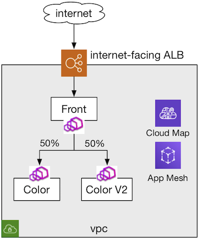
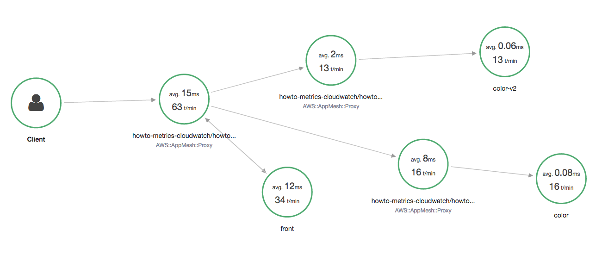
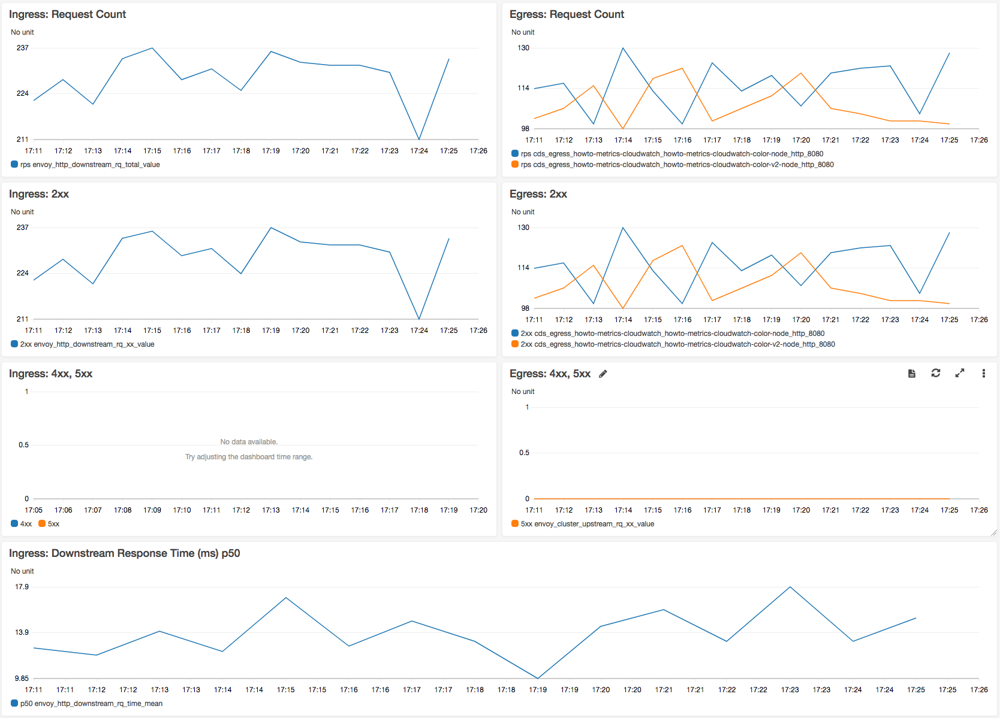
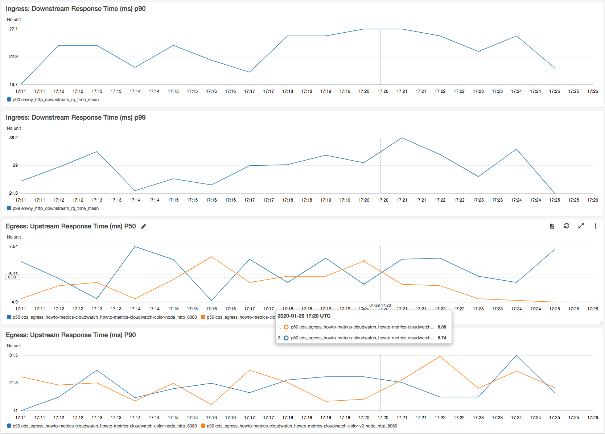
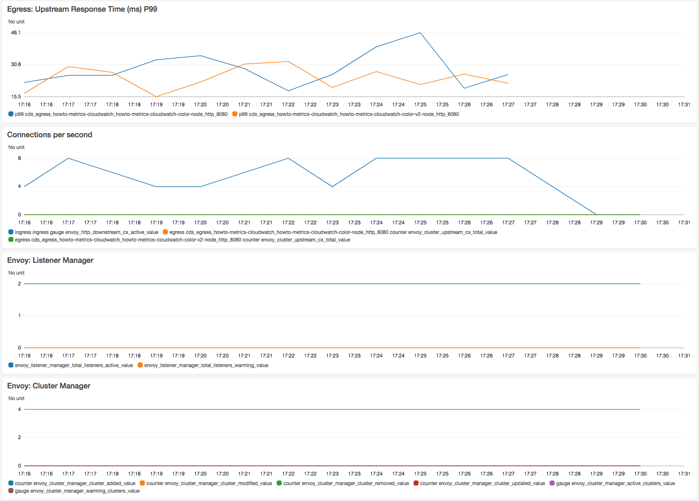

## Overview
This tutorial provides a walkthrough of using App Mesh and publishing metrics to AWS CloudWatch. Following is the system being setup with this walkthrough.



## Bootstrap

1. Clone this repository and navigate to the walkthrough/howto-basics folder, all commands will be ran from this location
2. **Your** account id:
    ```
    export AWS_ACCOUNT_ID=<your_account_id>
    ```
3. **Region** e.g. us-west-2
    ```
    export AWS_DEFAULT_REGION=us-west-2
    ```
4. **ENVOY_IMAGE** environment variable is not set to App Mesh Envoy, see https://docs.aws.amazon.com/app-mesh/latest/userguide/envoy.html
    ```
    export ENVOY_IMAGE=...
    ```

## Deploy

To setup this, run the following command.

```
$ ./deploy.sh
deploy images
...
Deploying stack appmesh-howto-metrics-cloudwatch, this may take a few minutes...
Waiting for changeset to be created..
Waiting for stack create/update to complete
Successfully created/updated stack - appmesh-howto-metrics-cloudwatch
Public endpoint:
http://appme-.....us-west-2.elb.amazonaws.com/color
```

Now generate Cloud Watch dashboard using the following.

```
$ ./deploy-cw-dashboards.sh
```

- Now go to AWS X-Ray Console and navigate to 'Service Map'. You should see a service map like below. 

- Now go to AWS Cloud Watch Console and navigate to 'Dashboards'. Click 'howto-metrics-cloudwatch-howto-metrics-cloudwatch-front-node'.





## Teardown
When you are done with the example you can delete everything we created by running:

```
./deploy.sh delete
```
