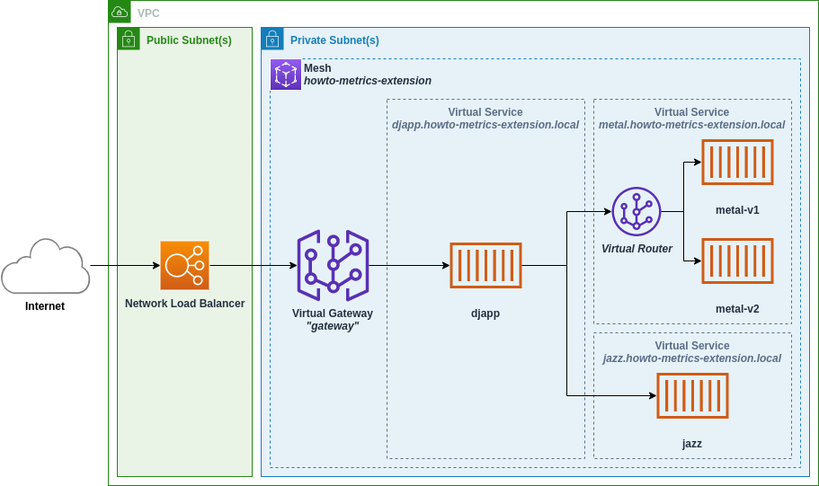
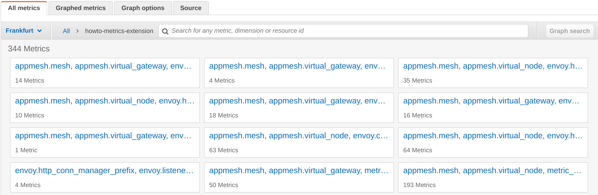
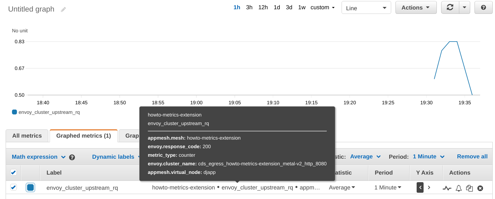
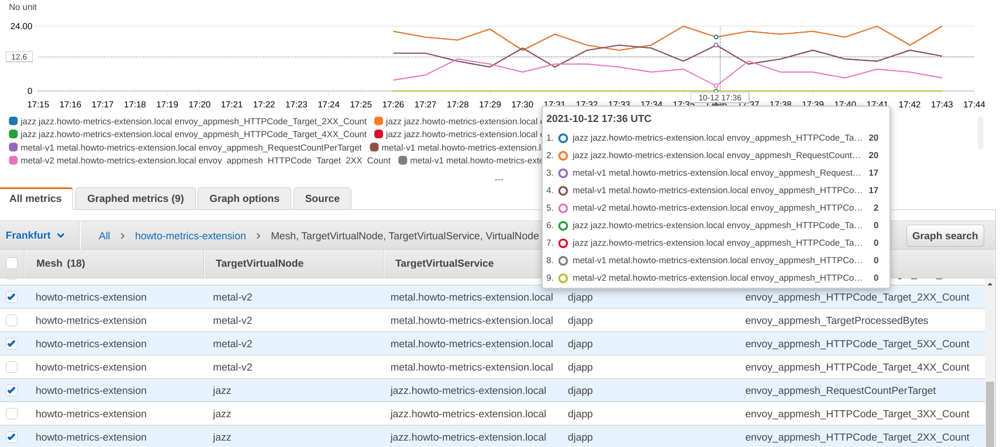
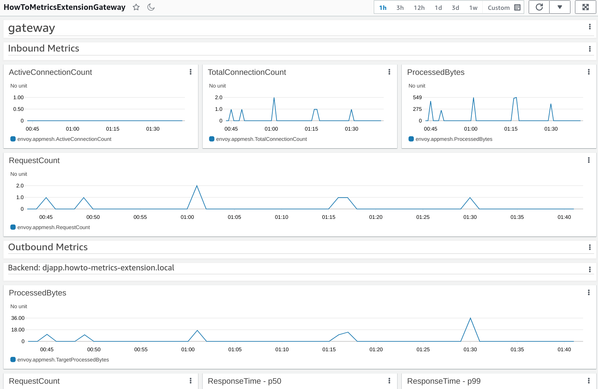

## Overview

This walkthrough provides a demonstration of App Mesh's metrics extension on ECS.
The App Mesh metrics extesion enhances Envoy proxies running in your mesh, allowing them
to emit *additional* metrics that are aware of the resources you define in App Mesh.

Metrics will include new dimensions such as `TargetVirtualService`, allowing you to now aggregate
and filter metrics by the virtual service your virtual nodes communicate with. *More details on
the new metrics and dimensions below.*

By using this walkthrough you will:

1. Deploy an application that leverages all the top-level App Mesh resources (virtual nodes, virtual gateways, virtual routers, etc).
1. Observe in CloudWatch the kinds of metrics provided by Envoy without the metrics extension.
1. Enable the metrics extension add more mesh-aware metrics.
1. See different ways to selectively filter metrics produced by Envoy using the CloudWatch agent or the AWS Distro for OpenTelemetry.
1. Use the metrics extension-provided metrics to easily generate CloudWatch dashboards.

At any time, you can delete everything generated by this walkthrough by following the `Cleaning Up` section
at the bottom of this page.

## Prerequsites

* git (Or a way to download the files in this repository. Only the files in this directory are needed.)
* curl (Or a way to make repeated HTTP requests from your terminal.)
* The [AWS CLI](https://aws.amazon.com/cli/).
* [Docker](https://docs.docker.com/get-docker/). You will use Docker to generate the application images used in this walkthrough.

## Initial Configuration

1. Clone this repository and naviate to the `walkthroughs/howto-metrics-extension-ecs` directory.
1. Export your account id:
  ```sh
  export AWS_ACCOUNT_ID=<your AWS account id>
  ```
1. Export the AWS region you will deploy this application in:
  ```sh
  export AWS_DEFAULT_REGION=<an AWS region, e.g. us-west-2>
  ```
1. Export the Envoy proxy image you will use. For the latest image see https://docs.aws.amazon.com/app-mesh/latest/userguide/envoy.html
  ```sh
  export ENVOY_IMAGE=<envoy image>
  ```
  *Note: The metrics extension requires the App Mesh Envoy image with a minimum version of `v1.19.1.1`*

## Application Overview

In this walkthrough you will be deploying a simple ECS-based application called "The DJ App":



The application is composed of a network load balancer, a virtual gateway, and four microservices:

1. `djapp` The frontend service that handles requests from the gateway. It is the only member
   of the `djapp.howto-metrics-extension.local` virtual service.
1. `metal-v1` A member of the `metal.howto-metrics-extension.local` virtual service.
1. `metal-v2` The other member of the `metal.howto-metrics-extension.local` virtual service.
1. `jazz` The sole member of the `jazz.howto-metrics-extension.local` virtual service.

Traffic comes into the application via a Network Load Balancer that forwards traffic to the
virtual gateway (named `gateway`). `gateway` acts as an ingress to our mesh and in-turn
forwards traffic to `djapp.howto-metrics-extension.local`.

The `djapp` requests artist lists randomly from the `metal.howto-metrics-extension.local` and
`jazz.howto-metrics-extension.local` virtual services and returns them to its callers.

* `jazz` will return jazz artists such as *Miles Davis* or *Astrud Gilberto*.
* `metal-v1` will return metal artists such as *Judas Priest* or *Megadeth*.
* `metal-v2` will return metal artists as well, but also includes the city where
the artists come from. The two members of the `metal.howto-metrics-extension.local`
virtual service simulate a canary deployment or A/B test where there are multiple versions
of service deployed at the same time.

> The `metal.howto-metrics-extension.local` virtual service distributes traffic 60/40 to
  `metal-v1` and `metal-v2` using a virtual router with a single route:
  ```yaml
  MetalRoute:
    Type: AWS::AppMesh::Route
    Properties:
      MeshName: !GetAtt Mesh.MeshName
      VirtualRouterName: !GetAtt MetalVirtualRouter.VirtualRouterName
      RouteName: metal
      Spec:
        HttpRoute:
          Match:
            Prefix: /
          Action:
            WeightedTargets:
              - VirtualNode: !GetAtt MetalV1VirtualNode.VirtualNodeName
                Weight: 60
              - VirtualNode: !GetAtt MetalV2VirtualNode.VirtualNodeName
                Weight: 40
  ```

Lastly, all metrics generated by the Envoy proxies will be sent to CloudWatch under the
`howto-metrics-extension` namespace.

## Deploy the DJ App

To deploy the DJ App, run the deploy script:
```sh
./deploy.sh deploy djapp-v1
```

This will deploy the couldformation template `djapp-v1.yaml` located in the `deploy/` folder.
The template contains the entirety of the DJ App outlined above.

If everything was successful, the script should output a line you can run in your
shell to save the public address of the Network Load Balancer. It will look like:
```sh
export PUBLIC_ENDPOINT=...
```

Export the endpoint so you can easily make requests to the DJ App.

## Default Envoy Metrics

To see the service metrics generated by Envoy you'll want to drive some traffic to the DJ App.
This loop will make a request to the DJ App every second and print an artist name:
```sh
while true; do
    curl $PUBLIC_ENDPOINT;
    sleep 1;
    echo;
done
```

After sending traffic to DJ App for a few minutes, you can navigate to the CloudWatch console.



Here you'll see **hundreds** of metrics being generated by Envoy broken down by a few different dimensions,
including a few that give some insight as to which virtual node or virtual gateway generated them:

* `appmesh.mesh`
* `appmesh.virtual_node`
* `appmesh.virtual_gateway`

As an example, you can search for the metric `envoy_cluster_upstream_rq` in CloudWatch to see the number of requests
made by Envoy to each of its upstream *clusters* (upstream clusters usually being other virtual nodes in your mesh).

Alternatively, you can use the `metric.sh` script to get a snapshot of the metric for the last 15 minutes:
```sh
./metric.sh -m envoy_cluster_upstream_rq -x Sum -q "appmesh.mesh=howto-metrics-extension appmesh.virtual_node=djapp"
```

*Note: You can run `./metric.sh -h` for help on using the script.*



In the above CloudWatch screenshot this metric has the dimension `envoy.cluster_name` with a value of
`cds_egress_howto-metrics-extension_metal-v2_http_8080`.

This metric is for the `djapp` virtual node, showing the number of requests from `djapp` to `metal-v2`.
Each backend virtual node will result in a unique metric value being emitted, though none of these metrics
indicate the virtual service the backend represents. App Mesh only includes the source and destination
virtual node names in the metric names it generates.

> To learn more about Envoy metrics and how they are named in App Mesh, see the Envoy metrics topic in
  the App Mesh User Guide: https://docs.aws.amazon.com/app-mesh/latest/userguide/envoy-metrics.html

## Enabling the Metrics Extension

Above, you saw that Envoy generates a large number of metrics with high-cardinality. The metrics are
also not straightforward to relate back to App Mesh resources, and in the case of virtual services, there
is no mechanism to know for sure which virtual service a given virtual node or virtual gateway is communicating with.

The goal of the metrics extension is to provide a small but still useful set of metrics that will give you
insight into the behavior of your mesh in terms of the resources you define in App Mesh.

At the time of writing, App Mesh will have made available the first version (version `1`) of the metrics extension.
Over time, new metrics and features of will be made available. You can opt into these additional metrics by
adding an environment variable to your ECS tasks:

```sh
APPMESH_METRIC_EXTENSION_VERSION=1
```

The existing DJ App tasks look like this:

```yaml
DJAppTaskDef:
  Type: AWS::ECS::TaskDefinition
  Properties:
    ContainerDefinitions:
      - Name: envoy
        Environment:
          - Name: ENVOY_LOG_LEVEL
            Value: debug
          - Name: ENABLE_ENVOY_DOG_STATSD
            Value: 1
          - Name: ENABLE_ENVOY_STATS_TAGS
            Value: 1
          - Name: APPMESH_RESOURCE_ARN
            Value: !Ref DJAppVirtualNode
  # (...)
```

You'll next deploy an update to DJ App that replaces `ENABLE_ENVOY_STATS_TAGS` with `APPMESH_METRIC_EXTENSION_VERSION`.
The new option makes `ENABLE_ENVOY_STATS_TAGS` redundant as the metrics extension will implicitly add App Mesh dimensions
to Envoy's metrics:

```yaml
DJAppTaskDef:
  Type: AWS::ECS::TaskDefinition
  Properties:
    ContainerDefinitions:
      - Name: envoy
        Environment:
          - Name: ENVOY_LOG_LEVEL
            Value: debug
          - Name: ENABLE_ENVOY_DOG_STATSD
            Value: 1
          - Name: APPMESH_METRIC_EXTENSION_VERSION
            Value: 1
          - Name: APPMESH_RESOURCE_ARN
            Value: !Ref DJAppVirtualNode
  # (...)
```

That is the only difference between `deploy/djapp-v1.yaml` and `deploy/djapp-v2.yaml`. Deploy it with the deploy script:

```sh
# Here we can set SKIP_IMAGES=1 to skip re-deploying our application images since they won't change
SKIP_IMAGES=1 ./deploy.sh deploy djapp-v2
```

Once the update is complete, you'll want to send traffic to the DJ App again:
```sh
while true; do
    curl $PUBLIC_ENDPOINT;
    sleep 1;
    echo;
done
```

In CloudWatch you should now see new metrics starting to appear. The metrics provided by the metrics extension resemble
those provided by Elastic Load Balancing:

*Note: Metrics exported to CloudWatch will have a prefix of `envoy.appmesh.` (or `envoy_appmesh_` depending on the metrics
format you are using to export to CloudWatch). Sections below will cover ways to configure this.*

### Metrics Related to Inbound/Ingress Traffic

| Metric                | Description                                                   | Dimensions                                 |
| --------------------- | ------------------------------------------------------------- | ------------------------------------------ |
| ActiveConnectionCount | Number of active TCP connections.                             | Mesh, VirtualNode<br/>Mesh, VirtualGateway |
| NewConnectionCount    | Number of TCP connections created.                            | Mesh, VirtualNode<br/>Mesh, VirtualGateway |
| ProcessedBytes        | Total TCP bytes sent to and received from downstream clients. | Mesh, VirtualNode<br/>Mesh, VirtualGateway | 
| RequestCount          | The number of processed HTTP requests.                        | Mesh, VirtualNode<br/>Mesh, VirtualGateway | 
| GrpcRequestCount      | The number of processed gPRC requests.                        | Mesh, VirtualNode<br/>Mesh, VirtualGateway |

### Metrics Related to Outbound/Egress Traffic

| Metric                    | Description                                                                                               | Dimensions                                                                                                                   |
| ------------------------- | --------------------------------------------------------------------------------------------------------- | ---------------------------------------------------------------------------------------------------------------------------- |
| TargetProcessedBytes      | Total TCP bytes sent to and received from upstream targets.                                               | Mesh, VirtualNode, TargetVirtualService, TargetVirtualNode<br/>Mesh, VirtualGateway, TargetVirtualService, TargetVirtualNode |
| HTTPCode_Target_2XX_Count | The number of HTTP requests to an upstream target that resulted in a 2xx HTTP response.                   | Mesh, VirtualNode, TargetVirtualService, TargetVirtualNode<br/>Mesh, VirtualGateway, TargetVirtualService, TargetVirtualNode |
| HTTPCode_Target_3XX_Count | The number of HTTP requests to an upstream target that resulted in a 3xx HTTP response.                   | Mesh, VirtualNode, TargetVirtualService, TargetVirtualNode<br/>Mesh, VirtualGateway, TargetVirtualService, TargetVirtualNode |
| HTTPCode_Target_4XX_Count | The number of HTTP requests to an upstream target that resulted in a 4xx HTTP response.                   | Mesh, VirtualNode, TargetVirtualService, TargetVirtualNode<br/>Mesh, VirtualGateway, TargetVirtualService, TargetVirtualNode |
| HTTPCode_Target_5XX_Count | The number of HTTP requests to an upstream target that resulted in a 5xx HTTP response.                   | Mesh, VirtualNode, TargetVirtualService, TargetVirtualNode<br/>Mesh, VirtualGateway, TargetVirtualService, TargetVirtualNode |
| RequestCountPerTarget     | The number of requests sent to an upstream target.                                                        | Mesh, VirtualNode, TargetVirtualService, TargetVirtualNode<br/>Mesh, VirtualGateway, TargetVirtualService, TargetVirtualNode |
| TargetResponseTime        | The time elapsed from when a request is made to an upstream target to when the full response is received. | Mesh, VirtualNode, TargetVirtualService, TargetVirtualNode<br/>Mesh, VirtualGateway, TargetVirtualService, TargetVirtualNode |



In the above screenshot, metrics for the `djapp` virtual node now include the metrics listed above. All of Envoy's built-in metrics will
also now include the `Mesh`, `VirtualNode`, and `VirtualGateway` dimensions.

You can use the `metric.sh` script included in this walkthough to get snapshot images of the metrics in this mesh.

To see the number of requests handled by the gateway, run:
```sh
./metric.sh -t VirtualGateway -n gateway -m envoy_appmesh_RequestCount -x Sum -q "metric_type=counter"
```

To see the distribution of requests from the `djapp` to the different virtual nodes of `metal.howto-metrics-extension.local`, run:
```sh
./metric.sh -t VirtualNode -n djapp -m envoy_appmesh_RequestCountPerTarget -x Sum -q "TargetVirtualService=metal.howto-metrics-extension.local metric_type=counter"
```

Or to see the latency betwen `djapp` and the `jazz`, run:
```sh
./metric.sh -t VirtualNode -n djapp -m envoy_appmesh_TargetResponseTime -x Average -q "TargetVirtualNode=jazz metric_type=timing"
```

## Filtering Metrics with the CloudWatch Agent

In the previous section you observed that the App Mesh metrics extension provides a subset of useful
metrics that help you see things such as traffic, latency, and error rates in the DJ App. However, these
new metrics make some of Envoy's default metrics redundant. And many of Envoy's default metrics are likely
not of use to the DJ App. Fortunately, there are ways to filter metrics locally in our services before
sending them to CloudWatch. Here you will see a way of doing metric filtering using the CloudWatch agent.

> Note: Envoy has built-in support for filtering the metrics it emits but this feature can lead to unwanted
  behavior, unfortunately including irrecoverable dead-lock preventing App Mesh from pushing new configuration
  to Envoy. You can track the status of this issue on Envoy's side here: https://github.com/envoyproxy/envoy/issues/8771
  Or you can watch our tracking issue here: https://github.com/aws/aws-app-mesh-roadmap/issues/283 in the mean
  time, metric filtering is best done by a metrics daemon or sidecar.

Most App Mesh users that use the CloudWatch agent leverage the [StatsD](https://github.com/statsd/statsd)
(or DogStatsD) protocol to send metrics from Envoy to the agent and ultimately to CloudWatch.
While this integration is simple, it provides no mechanism today to filter metrics before sending them to CloudWatch.
The CloudWatch agent does however support scraping [Prometheus](https://prometheus.io/) metrics.

Prometheus scrapers can be provided a *scrape configuration* that allows you to select the metrics you want to
pull from Envoy and ultimately send to CloudWatch.

Right now the task definitions for all of the services in the DJ App are configured to use StatsD
and send their metrics to a CloudWatch agent sidecar:

```yaml
DJAppTaskDef:
  Type: AWS::ECS::TaskDefinition
  Properties:
    ContainerDefinitions:
      - Name: envoy
        Environment:
          - Name: ENVOY_LOG_LEVEL
            Value: debug
          - Name: ENABLE_ENVOY_DOG_STATSD
            Value: 1
          - Name: APPMESH_METRIC_EXTENSION_VERSION
            Value: 1
          - Name: APPMESH_RESOURCE_ARN
            Value: !Ref DJAppVirtualNode
        # (...)

      - Name: cwagent
        Environment:
          - Name: CW_CONFIG_CONTENT
            Value: !Sub >
              {
                "metrics": {
                  "namespace": "${ProjectName}",
                  "metrics_collected": {
                    "statsd": {}
                  }
                }
              }
  # (...)
```

The option on the Envoy container `ENABLE_ENVOY_DOG_STATSD` tells Envoy to emit StatsD metrics.
And the `metrics_collected: { statsd: {} }` setting on the CloudWatch agent in-turn configures
the agent to consume metrics pushed from Envoy to it.

The next update to the DJ App will instead deploy a single shared CloudWatch agent to scrape and
filter Prometheus metrics from all of our services.

This agent will automatically discover ECS tasks in our cluster that have special Docker labels
that tell the agent the location of Envoy's Prometheus metrics endpoint. To do this, the agent
will need its own IAM roles that give it read-only access to ECS tasks and permission to send
the metrics it finds to CloudWatch:

```yaml
CWAgentTaskIAMRole:
  Type: AWS::IAM::Role
  # (...)

CWAgentTaskExecutionIAMRole:
  Type: AWS::IAM::Role
  # (...)
```

Then each DJ App service will be updated to remove the CloudWatch agent sidecar
and instead add Docker labels indicating Envoy's Prometheus metrics endpoint:

```yaml
DJAppTaskDef:
  Type: AWS::ECS::TaskDefinition
  Properties:
    ContainerDefinitions:
      - Name: envoy
        DockerLabels:
          ECS_PROMETHEUS_METRICS_PATH: /stats/prometheus
          ECS_PROMETHEUS_EXPORTER_PORT: 9901
        Environment:
          - Name: ENVOY_LOG_LEVEL
            Value: debug
          - Name: APPMESH_METRIC_EXTENSION_VERSION
            Value: 1
          - Name: APPMESH_RESOURCE_ARN
            Value: !Ref DJAppVirtualNode
        # (...)
```

Finally, a new ECS Service and Task for the CloudWatch agent is created:

```yaml
CWAgentTaskDef:
  Type: AWS::ECS::TaskDefinition
  Properties:
    ContainerDefinitions:
      - Name: cwagent
        Image: public.ecr.aws/cloudwatch-agent/cloudwatch-agent:latest
        Essential: true
        Environment:
          - Name: PROMETHEUS_CONFIG_CONTENT
            Value: |
              global:
                scrape_interval: 1m
                scrape_timeout: 10s
              scrape_configs:
                - job_name: cwagent-ecs-file-sd-config
                  sample_limit: 10000
                  file_sd_configs:
                    - files: [ /tmp/cwagent_ecs_auto_sd.yaml ]
                  metric_relabel_configs:
                    - source_labels: [ __name__ ]
                      regex: ^envoy_appmesh_.+$
                      action: keep
          - Name: CW_CONFIG_CONTENT
            Value: !Sub >
              {
                "logs": {
                  "force_flush_interval": 5,
                  "metrics_collected": {
                    "prometheus": {
                      "log_group_name": "${LogGroup}",
                      "prometheus_config_path": "env:PROMETHEUS_CONFIG_CONTENT",
                      "ecs_service_discovery": {
                        "sd_frequency": "1m",
                        "docker_label": {},
                        "sd_result_file": "/tmp/cwagent_ecs_auto_sd.yaml"
                      },
                      "emf_processor": {
                        "metric_namespace": "${ProjectName}",
                        "metric_declaration_dedup": true,
                        "metric_declaration": [
                          {
                            "source_labels": [ "container_name" ],
                            "label_matcher": "^envoy$",
                            "dimensions": [
                              ["Mesh", "VirtualNode"],
                              ["Mesh", "VirtualNode", "TargetVirtualNode"],
                              ["Mesh", "VirtualNode", "TargetVirtualNode", "TargetVirtualService"],
                              ["Mesh", "VirtualGateway"],
                              ["Mesh", "VirtualGateway", "TargetVirtualNode"],
                              ["Mesh", "VirtualGateway", "TargetVirtualNode", "TargetVirtualService"]
                            ],
                            "metric_selectors": [
                              "^.+$"
                            ]
                          }
                        ]
                      }
                    }
                  }
                }
              }
      # (...)
``` 

Under `PROMETHEUS_CONFIG_CONTENT` there will be a [Prometheus configuration file](https://prometheus.io/docs/prometheus/latest/configuration/configuration/).
Prometheus' scrape configuration allows one to filter and manipulate metrics before sending them to CloudWatch in
[Embedded Metrics Format](https://docs.aws.amazon.com/AmazonCloudWatch/latest/monitoring/CloudWatch_Embedded_Metric_Format_Specification.html).

In this example, all metrics that begin with `envoy_appmesh_` are collected from Envoy into the CloudWatch agent.

> It is worth noting that Prometheus automatically replaced all dot (`.`) characters in Envoy metric names and dimensions with
  underscores (`_`). The CloudWatch agent only performs this transformation on metric names.

The `metric_declaration` section in `CW_AGENT_CONFIG` is where you can select which metrics and which dimensions you want
to send to CloudWatch in Embedded Metrics Format. Here, all possible dimension combinations are selected, and all metrics names are
selected under `metrics_selectors` with a wildcard regular expression. You can remove dimensions or further restrict metric names
in this section if you choose.

> To learn more about configuring the CloudWatch agent to scrape Prometheus metrics see:
  https://docs.aws.amazon.com/AmazonCloudWatch/latest/monitoring/ContainerInsights-Prometheus-Setup-configure-ECS.html

Deploy the updated DJ App:
```sh
SKIP_IMAGES=1 ./deploy.sh deploy djapp-v3
```

When complete, generate traffic for a few minutes:
```sh
while true; do
    curl $PUBLIC_ENDPOINT;
    sleep 1;
    echo;
done
```

At this point, all of Envoy's default metrics are no longer being sent to CloudWatch. Additionally, only the metric dimensions we opted into
above are being sent.

You can verify that Envoy's metrics are no longer being sent to CloudWatch by using the `metric.sh` script again:
```sh
./metric.sh -t VirtualNode -n djapp -m envoy_cluster_upstream_cx_total -x Sum -q "envoy.cluster_name=cds_egress_howto-metrics-extension_metal-v1_http_8080 metric_type=counter"
```

This graph should show the metric `envoy_cluster_upstream_cx_total`. The number of TCP connections from `djapp` to the `metal-v1` virtual node.

## (Optional) Adding Selected Envoy Metrics

The metrics extension metrics are not intended to replace all of the useful metrics provided by Envoy. Using scrape configration, you
can always opt in to sending select Envoy metrics to CloudWatch. In this section you'll configure the CloudWatch agent to send the
metric that counts the number of TCP connections between the `djapp` and its backend virtual nodes (`envoy_cluster_upstream_cx_total`):

```yaml
CWAgentTaskDef:
  Type: AWS::ECS::TaskDefinition
  Properties:
    ContainerDefinitions:
      - Name: cwagent
        Image: public.ecr.aws/cloudwatch-agent/cloudwatch-agent:latest
        Essential: true
        Environment:
          - Name: PROMETHEUS_CONFIG_CONTENT
            Value: !Sub |
              global:
                scrape_interval: 1m
                scrape_timeout: 10s
              scrape_configs:
                - job_name: cwagent-ecs-file-sd-config
                  sample_limit: 10000
                  file_sd_configs:
                    - files: [ /tmp/cwagent_ecs_auto_sd.yaml ]
                  metric_relabel_configs:
                    - source_labels: [ __name__ ]
                      regex: ^(envoy_appmesh_.+)|(envoy_cluster_upstream_cx_total)$
                      action: keep
                    - source_labels: [ envoy_cluster_name ]
                      target_label: TargetVirtualNode
                      regex: ^cds_egress_${Mesh.MeshName}_(.+)_(.+)_[0-9]+$
                      replacement: ${!1}
      # (...)
```

In addition to keeping the `envoy_cluster_upstream_cx_total` metric, there is an additional configration that 
extracts the `TargetVirtualNode` dimension using Envoy's existing `envoy_cluster_name` dimension. This method
of extracting target virtual node names from `envoy_cluster_name` works for most Envoy metrics.

To deploy `djapp-v4` run:
```sh
SKIP_IMAGES=1 ./deploy.sh deploy djapp-v4
```

You can now observe that the Envoy metric has been restored and includes the `TargetVirtualNode` dimension:
```sh
./metric.sh -t VirtualNode -n djapp -m envoy_cluster_upstream_cx_total -x Sum -q "TargetVirtualNode=metal-v1"
```

## (Optional) Filtering Metrics with the AWS Distro for OpenTelemetry

As of the time of this writing, the CloudWatch agent does not support scraping histogram type metrics from a Prometheus client.
Histogram metrics are used in Envoy to represent time durations. As a result, the metrics extension metric: `TargetResponseTime`
or any of Envoy's built-in histogram/timing metrics will not get sent to CloudWatch.

> See: https://docs.aws.amazon.com/AmazonCloudWatch/latest/monitoring/ContainerInsights-Prometheus-metrics-conversion.html
  for current status of supported metrics types.

In this section, you will replace the CloudWatch agent with the AWS OpenTelemetry Collector from the
[AWS Distro for OpenTelemetry](https://aws.amazon.com/otel/). The OpenTelemetry collector supports many different metrics
formats and can replace multilple existing metrics agents including the CloudWatch and AWS X-Ray agents.

To migrate to the OpenTelemetry collector, you'll start from the version of the DJ App where we used the CloudWatch agent
as a sidecar on each of our services. This was the version of the DJ App in template located at `deploy/djapp-v2.yaml`.

```yaml
DJAppTaskDef:
  Type: AWS::ECS::TaskDefinition
  Properties:
    ContainerDefinitions:
      - Name: otel-collector
        Image: public.ecr.aws/aws-observability/aws-otel-collector:latest
        Essential: true
        Environment:
          - Name: AOT_CONFIG_CONTENT
            Value: !Sub |
              extensions:
                health_check:
              receivers:
                statsd:
                  endpoint: 0.0.0.0:8125
                  aggregation_interval: 60s 
              processors:
                batch/metrics:
                  timeout: 60s
                filter:
                  metrics:
                    include:
                      match_type: regexp
                      metric_names:
                        - ^envoy\.appmesh\..+$
              exporters:
                awsemf:
                  namespace: ${ProjectName}
                  log_group_name: ${LogGroup}
                  dimension_rollup_option: NoDimensionRollup
              service:
                pipelines:
                  metrics:
                    receivers: [statsd]
                    processors: [batch/metrics, filter]
                    exporters: [awsemf]
                extensions:  [health_check]
  # (...)
```

While the OpenTelemetry collector also supports scraping Prometheus metrics from Envoy, you can continue
to use StatsD metrics and filter using a `filter` processor. As in the above sections, the filter
processor will configure the OpenTelemetry collector to send only metrics that start with `envoy.appmesh.`
to CloudWatch.

> To learn more about OpenTelemetry processors see: https://opentelemetry.io/docs/collector/configuration/#processors

> To learn more about the CloudWatch EMF exporter see: https://github.com/open-telemetry/opentelemetry-collector-contrib/blob/main/exporter/awsemfexporter/README.md

To deploy `djapp-v5` using the OpenTelemetry collector run:
```sh
SKIP_IMAGES=1 ./deploy.sh deploy djapp-v5
```

Using the same loop as above, generate some traffic so the new metrics will appear in CloudWatch:
```sh
while true; do
    curl $PUBLIC_ENDPOINT;
    sleep 1;
    echo;
done
```

You can view the `TargetResponseTime` metric for calls from `djapp` to `metal.howto-metrics-extension.local`:
```sh
./metric.sh -t VirtualNode -n djapp -m envoy.appmesh.TargetResponseTime -x p50 -q "TargetVirtualService=metal.howto-metrics-extension.local"
```

## (Optional) Using the Metrics Extension to Simplify Creating CloudWatch Dashboards

The addition of the `TargetVirtualService` dimension makes creating rolled-up dashboards for different target services in a mesh
much simpler. If you ran the `metric.sh` script you likely would have seen the CloudWatch metric widgets it was generating.

For example:
```json
{
  "width": 1200,
  "height": 600,
  "period": 60,
  "start": "-PT15M",
  "end": "PT0H",
  "title": "djapp - envoy.appmesh.TargetResponseTime p50",
  "metrics": [
    [
      { "expression": "SEARCH('Namespace=\"howto-metrics-extension\" Mesh=\"howto-metrics-extension\" VirtualNode=\"djapp\" MetricName=\"envoy.appmesh.TargetResponseTime\" TargetVirtualService=metal.howto-metrics-extension.local', 'p50', 60)" }
    ]
  ]
}
```

By combining `SEARCH` expressions with different dimensions, you could create a dashboard for all of the metrics extension metrics
for every service in a mesh.

In this final section you will deploy three CloudWatch dashboards:

1. `HowtoMetricsExtensionGateway` - The dashboard for the virtual gateway named `gateway`.
1. `HowtoMetricsExtensionDJApp` - The dashboard for the `djapp` virtual node.
1. `HowtoMetricsExtensionMetal` - The dashboard for the `metal-v1` and `metal-v2` vitual nodes.

The dashboards will be auto-generated using a custom CloudFormation resource that will describe a mesh and compute a CloudWatch dashboard
for a given virtual gateway or a list of virtual nodes. The list of virtual nodes would useful for creating a dashbord for all versioned
deployments of a single service. The CloudFormation template for each dashboard is shared under `deploy/dashboard-v1.yaml`.

The dashboard generator Lambda Function is located under `src/dashboard-v1` and should already be in your account as an ECR
image if you have deployed any of the above `djapp` stacks above.

Deploy the dashboards using separate calls to `dashboard.sh`.

*Note: You can run `./dashboard.sh -h` for help on using the script.*

The CloudFormation stack `howto-metrics-extension-GatewayDashboard`:
```sh
./dashboard.sh \
  -c deploy \
  -s howto-metrics-extension-GatewayDashboard \
  -q howto-metrics-extension \
  -d HowToMetricsExtensionGateway \
  -i $AWS_ACCOUNT_ID.dkr.ecr.$AWS_DEFAULT_REGION.amazonaws.com/howto-metrics-extension/dashboard-v1:latest \
  -m howto-metrics-extension \
  -g gateway
```

The CloudFormation stack `howto-metrics-extension-DJAppDashboard`:
```
./dashboard.sh \
  -c deploy \
  -s howto-metrics-extension-DJAppDashboard \
  -q howto-metrics-extension \
  -d HowToMetricsExtensionDJApp \
  -i $AWS_ACCOUNT_ID.dkr.ecr.$AWS_DEFAULT_REGION.amazonaws.com/howto-metrics-extension/dashboard-v1:latest \
  -m howto-metrics-extension \
  -n djapp
```

The CloudFormation stack `howto-metrics-extension-MetalDashboard`:
```
./dashboard.sh \
  -c deploy \
  -s howto-metrics-extension-MetalDashboard \
  -q howto-metrics-extension \
  -d HowToMetricsExtensionMetal \
  -i $AWS_ACCOUNT_ID.dkr.ecr.$AWS_DEFAULT_REGION.amazonaws.com/howto-metrics-extension/dashboard-v1:latest \
  -m howto-metrics-extension \
  -n metal-v1,metal-v2
```



Each dashboard deployed above should demonstrate the metrics extension metrics under different conditions.
For example, the `gateway` virtual node only routes traffic to a single virtual service. The `djapp` virtual node
demonstrates multiple backends with the `TargetVirtualService` dimension roll-up.
And the combined dashboard for `metal-v1` and `metal-v2` shows metrics available when your application has no backends.

To clean up the three dashboards you created, use the `dashboard.sh` script again:

```sh
./dashboard.sh -c delete -s howto-metrics-extension-GatewayDashboard
```

```sh
./dashboard.sh -c delete -s howto-metrics-extension-DJAppDashboard
```

```sh
./dashboard.sh -c delete -s howto-metrics-extension-MetalDashboard
```

## Cleaning Up

If you used the `dashboard.sh` script to generate any additonal dashboards you can use the same script to delete them.
All it does is delete the cloudformation stack associated with the dashboard.

For example, if you created your own `HowtoMetricsExtensionJazz` dashboard in the section above run:
```sh
./dashboard.sh -c delete -s howto-metrics-extension-JazzDashboard
```

To remove everything else you created during the walkthrough, use the deploy script:
```sh
./deploy.sh delete
```
