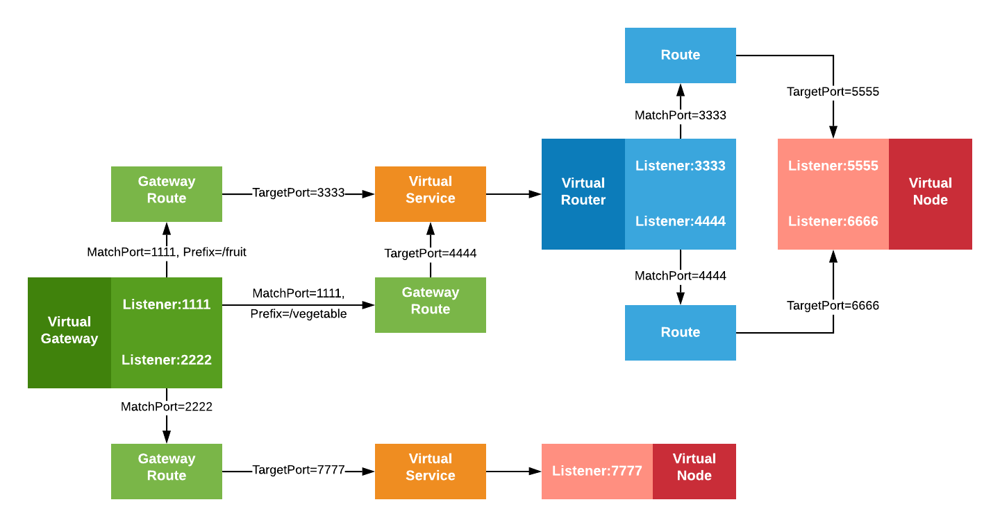

## Fruit and Color App Setup
For this walkthrough, an NLB is used to forward traffic to the Virtual Gateway (running a set of Envoys). 
We configure 3 Gateway Routes - 2 food routes and 1 color route each pointing to Virtual Services (backed by a Virtual Node each). 
Virtual Service `foodteller.default.svc.cluster.local` points to `foodteller-vn` which has 2 applications. `fruit-app` listens on `5555` and `vegetable-app` which listens on `6666`. A Virtual Router is responsible for correctly matching the ports from the Virtual Gateway to the Virtual Nodes.
The Virtual Service `colorteller.default.svc.cluster.local` points to `colorteller-vn` which listens on port `7777`.

Note: Normally customers would likely use the same port from end to end, but we're using a different port per listener to show they are each independent values.

Let's deploy a mesh with a multiple listener gateway, router and node.



## Step 1: Prerequisites

1. Download the App Mesh Preview CLI

You will need the latest version of the App Mesh Preview CLI for this walkthrough. You can download and use the latest version using the commands below.

```bash
curl https://raw.githubusercontent.com/aws/aws-app-mesh-roadmap/main/appmesh-preview/service-model.json \
        -o $HOME/appmesh-preview-model.json
aws configure add-model \
        --service-name appmesh-preview \
        --service-model file://$HOME/appmesh-preview-model.json
```

Additionally, this walkthrough makes use of the unix command line utility `jq`. If you don't already have it, [you can install it from here](https://stedolan.github.io/jq/).

2. Clone this repository and navigate to the `walkthroughs/howto-multiple-listeners` folder, all the commands henceforth are assumed to be run from the same directory as this README.

3. Make sure you have version 1.18.172 or higher of the [AWS CLI v1](https://docs.aws.amazon.com/cli/latest/userguide/install-cliv1.html) installed or you have version 2.0.62 or higher of the [AWS CLI v2](https://docs.aws.amazon.com/cli/latest/userguide/install-cliv2.html) installed.

4. You'll need a keypair stored in AWS to access a bastion host.
   If you do not already have one, you can create a keypair using the command below if you don't have one. See [Amazon EC2 Key Pairs](https://docs.aws.amazon.com/AWSEC2/latest/UserGuide/ec2-key-pairs.html).

    ```bash
    aws ec2 create-key-pair --key-name color-app | jq -r .KeyMaterial > ~/.ssh/color-app.pem
    chmod 400 ~/.ssh/color-app.pem
    ```

    This command creates an Amazon EC2 Key Pair with name `color-app` and saves the private key at `~/.ssh/color-app.pem`.

5. Install Docker. It is needed to build the demo application images.

## Step 2: Set Environment Variables
We need to set a few environment variables before provisioning the infrastructure.
Please change the value for `AWS_ACCOUNT_ID`, `KEY_PAIR_NAME`, and `ENVOY_IMAGE` below.

```bash
export AWS_ACCOUNT_ID=<your account id>
export KEY_PAIR_NAME=<color-app or your SSH key pair stored in AWS>
export AWS_DEFAULT_REGION=us-west-2
export ENVIRONMENT_NAME=MultipleListeners
export MESH_NAME=multiple-listeners-mesh
export ENVOY_IMAGE=<get the latest from https://docs.aws.amazon.com/app-mesh/latest/userguide/envoy.html>
export SERVICES_DOMAIN="default.svc.cluster.local"
export TELLER_IMAGE_NAME="howto-multiple-listeners/teller"
```

You can change these ENV variables in `vars.env` file and then apply it using: 
`source ./vars.env`


## Step 3: Deploy Color App Infrastructure

We'll start by setting up the basic infrastructure for our services.

First, create the VPC.

```bash
./infrastructure/vpc.sh
```

Next, create the ECS cluster.

```bash
./infrastructure/ecs-cluster.sh
```

And the ECR repositories.

```bash
./infrastructure/ecr-repositories.sh
```

Next, build and deploy the teller image.

```bash
./src/teller/deploy.sh
```

**_Note_** that the example app uses go modules. If you have trouble accessing https://proxy.golang.org during the deployment you can override the GOPROXY by setting `GO_PROXY=direct`

```bash
GO_PROXY=direct ./src/teller/deploy.sh
```

Finally, let's create the mesh.

```bash
./mesh/mesh.sh up
```


## Step 4: Deploy services and Verify

Our next step is to deploy the service in ECS and test it out.

```bash
./infrastructure/ecs-service.sh
```

1. After a few minutes, the applications should be deployed and you will see an output such as:

	```bash
	Successfully created/updated stack - ${ENVIRONMENT_NAME}-ecs-service
	Bastion endpoint:
	123.45.67.89
	ColorApp endpoint:
	http://howto-Publi-55555555.us-west-2.elb.amazonaws.com
	```

	Export the public endpoint to access the gateway

	```bash
	export COLORAPP_ENDPOINT=<your_https_tellerApp_endpoint e.g. https://howto-Publi-55555555.us-west-2.elb.amazonaws.com>
	```
	And export the bastion endpoint for later use.

	```bash
	export BASTION_IP=<your_bastion_endpoint e.g. 12.245.6.189>
	```

2. Let's issue a request to the color gateway with gatewayRoute prefix as `/fruit` which will set the port for the backend service route and direct the request to the fruit port.

	```bash
	curl "${COLORAPP_ENDPOINT}:1111/fruit"
	```
	If you run the above command, you should see a successful response containing `blueberry` or another fruit.

	Similarly, let's issue a request to the gateway with gatewayRoute prefix as `/vegetable`.

	```bash
	curl "${COLORAPP_ENDPOINT}:1111/vegetable"
	```
	In this case, you should receive a successful response containing `greenbean` or another vegetable

	Finally, let's issue a request to the gateway to a different listener. Since there's only 1 gatewayRoute for the port and we didn't configure a prefix we don't need to include a prefix.

	```bash
	curl "${COLORAPP_ENDPOINT}:2222"
	```
	In this case, you should receive a successful response containing `red` or another color.

## Step 5: Clean Up

If you want to keep the application running, you can do so, but this is the end of this walkthrough.
Run the following commands to clean up and tear down the resources that we’ve created.

Delete the CloudFormation stacks:

```bash
aws cloudformation delete-stack --stack-name $ENVIRONMENT_NAME-ecs-service
aws cloudformation delete-stack --stack-name $ENVIRONMENT_NAME-ecs-cluster
aws ecr delete-repository --force --repository-name $TELLER_IMAGE_NAME
aws cloudformation delete-stack --stack-name $ENVIRONMENT_NAME-ecr-repositories
aws cloudformation delete-stack --stack-name $ENVIRONMENT_NAME-vpc
```

Delete the Mesh:

```bash
./mesh/mesh.sh down
```
