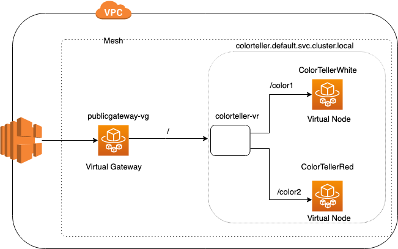

# Configuring Request Timeouts

In this walkthrough we'll set timeouts to support increasing and decreasing the default request timeout of 15 secs. This walkthrough will be a simplified version of the [Color App Example](https://github.com/aws/aws-app-mesh-examples/tree/main/examples/apps/colorapp).

## Introduction

App mesh supports specifying timeout(request and idle) at Route and Virtual Node Listener.
When set at route that timeout is applicable to all the requests passing that channel.

When set at Virtual Node listener, that timeout is applicable to all the requests originating from and arriving to the task group pointed by that Virtual Node.

By default the request timeout is 15 secs, If we wish to decrease this timeout value (< 15secs), we can set it either at the route or at virtual node listener or at both the places. 

However to increase the timeout (>15secs), it needs to be set at the route and all the participating Virtual Nodes' listener.

## Step 1: Prerequisites

1. We'll also need a keypair stored in AWS to access a bastion host. You can create a keypair using the command below if you don't have one. See [Amazon EC2 Key Pairs](https://docs.aws.amazon.com/AWSEC2/latest/UserGuide/ec2-key-pairs.html).

```bash
aws ec2 create-key-pair --key-name color-app | jq -r .KeyMaterial > ~/.ssh/color-app.pem
chmod 400 ~/.ssh/color-app.pem
```

This command creates an Amazon EC2 Key Pair with name `color-app` and saves the private key at
`~/.ssh/color-app.pem`.

3. Additionally, this walkthrough makes use of the unix command line utility jq. If you don't already have it, you can install it from [here](https://stedolan.github.io/jq/).
4. Install Docker. It is needed to build the demo application images.

## Step 2: Set Environment Variables


We need to set a few environment variables before provisioning the infrastructure. Please change the value for `AWS_ACCOUNT_ID`, `KEY_PAIR_NAME`, and `ENVOY_IMAGE` below.

```bash
export AWS_ACCOUNT_ID=<your account id>
export KEY_PAIR_NAME=<color-app or your SSH key pair stored in AWS>
export AWS_DEFAULT_REGION=us-west-2
export ENVIRONMENT_NAME=AppMeshTimeoutExample
export MESH_NAME=ColorApp-Timeout
export ENVOY_IMAGE=<get the latest from https://docs.aws.amazon.com/app-mesh/latest/userguide/envoy.html>
export SERVICES_DOMAIN="default.svc.cluster.local"
export COLOR_GATEWAY_IMAGE_NAME="colorgateway"
export COLOR_TELLER_IMAGE_NAME="colorteller"
```

## Step 3: Create Color App Infrastructure

We'll start by setting up the basic infrastructure for our services. All commands will be provided as if run from the same directory as this README.

First, create the VPC.

```bash
./infrastructure/vpc.sh
```

Next, create the ECS cluster and ECR repositories.

```bash
./infrastructure/ecs-cluster.sh
./infrastructure/ecr-repositories.sh
```

Finally, build and deploy the color app images.

```bash
./src/colorteller/deploy.sh
./src/colorgateway/deploy.sh
```
Note that the example apps use go modules. If you have trouble accessing https://proxy.golang.org during the deployment you can override the GOPROXY by setting `GO_PROXY=direct`

```bash
GO_PROXY=direct ./src/colorteller/deploy.sh
GO_PROXY=direct ./src/colorgateway/deploy.sh
```

## Step 4: Create a Mesh 


This mesh will be a simplified version of the original Color App Example, so we'll only be deploying the gateway(color gateway) and one color teller service (white).

Let's create the mesh.

```bash
./mesh/mesh.sh up
```

## Step 5: Deploy and Verify

Our next step is to deploy the service and verify it.

```bash
./infrastructure/ecs-service.sh
```

Let's issue a request to the public gateway.

```bash
COLORAPP_ENDPOINT=$(aws cloudformation describe-stacks \
    --stack-name $ENVIRONMENT_NAME-ecs-service \
    | jq -r '.Stacks[0].Outputs[] | select(.OutputKey=="ColorAppEndpoint") | .OutputValue')
curl "${COLORAPP_ENDPOINT}/color"
```
We should see a successful response with the color white.


## Step 6: Verify Timeouts

We have set up our services to receive Latency as header, and if a value is received the response is delayed for that many seconds. So below two requests will send response after 7 secs and 17 secs respectively.
Lets try sending these requests.

```bash
curl --header "Latency:7" $COLORAPP_ENDPOINT/color

curl --header "Latency:17" $COLORAPP_ENDPOINT/color
```

With latency as 7, we should see successful response, whereas with latency as 17 secs we should get a request timeout message, since the default timeout is 15sec, hence the second request is timed out.

Lets try to update the route with request timeout as 5 secs, with below input.
```json
{
  "virtualRouterName": "colorteller-vr",
  "routeName": "colorteller-route",
  "spec": {
    "priority": 1,
    "httpRoute": {
      "action": {
        "weightedTargets": [
          {
            "virtualNode": "ColorTellerWhite",
            "weight": 1
          }
        ]
      },
      "match": {
        "prefix": "/"
      },
      "timeout" : {
        "perRequest": {
          "value" : 5,
          "unit" : "s"
        }
      }

    }
  }
}
```
```bash
aws appmesh update-route --mesh-name $MESH_NAME --cli-input-json file://mesh/colorteller-route-timeout5s.json
```

Confirm that we see request timeout as 5sec in the response
```json
 "timeout": {
                "perRequest": {
                    "unit": "s",
                    "value": 5
                }
            }
```

Wait for few seconds and curl the endpoint again with latency as 7, and this time we should get a timeout response.

```bash
curl --header "Latency:7" $COLORAPP_ENDPOINT/color
```

Next we will set up the route to allow timeouts greater than 15 secs, we will set timeouts in this example as 20secs

First update the route with timeout as 20 secs

```bash
aws appmesh update-route --mesh-name $MESH_NAME --cli-input-json file://mesh/colorteller-route-timeout20s.json
```

Confirm that we see request timeout as 20sec in the response

Then update the ColorGateway Virtual Node and ColortellerWhite Virtual Node to add timeout of 20secs at the listener. The spec at ColortellerWhite Virtual Node looks like below, similar timeout is set at ColorGateway Virtual Node too.

```json
{
    "spec": {
        "listeners": [
            {
                "portMapping": {
                    "port": 80,
                    "protocol": "http"
                },
                "timeout": {
                    "http": {
                        "perRequest": {
                            "value" : 20,
                            "unit" : "s"
                        }
                    }
                }
            }
        ],
        "serviceDiscovery": {
            "dns": {
                "hostname": $DNS_HOSTNAME
            }
        },
        "backends": [
            {
                "virtualService": {
                    "virtualServiceName": $COLOR_TELLER_VS
                }
            }
        ]
    }
}
```
```bash
./mesh/mesh.sh update_colorgateway-vn mesh/colorgateway-vn-timeout20s.json
./mesh/mesh.sh update_colorteller-white-vn mesh/colorteller-vn-timeout20s.json
```
Confirm that the response contains the timeout as 20secs and wait for few seconds for envoys to receive the latest config. Then curl the endpoint again with latency as 17, and this time we should get a successful response.

```bash
curl --header "Latency:17" $COLORAPP_ENDPOINT/color
```

### Timeouts at Virtual Gateway and Gateway Routes

Timeouts at Virtual Gateways are calculated implicitly based on the timeouts of the routes present in the Virtual Service that the Gateway Route points to. Currently there is no API to define the timeouts for gateways explicitly. In case you need any such feature, please request it using [App Mesh Github roadmap](https://github.com/aws/aws-app-mesh-roadmap/issues).

Lets create a Virtual Gateway(VG) and route the requests through it (basically replacing ColorGateway Virtual Node with public gateway VG) to verify that the timeout works well with VG too.

```bash
./mesh/mesh.sh add_virtual_gateway
```

Wait for some time and curl the endpoint. Adding --header "Gateway:Virtual" will route the request through virtual Gateway (HTTP header based ALB routing)

```bash
curl --header "Gateway:Virtual" $COLORAPP_ENDPOINT/color
```

The response should be *“white”  and not  {"color":"white", "stats": {"white":1}},* the later is the response if the request routes through the color gateway (as seen before in previous steps)

Verify that the timeout set for the routes and color teller Virtual Node, works in presence of VG too.

```bash
curl --header "Gateway:Virtual" --header "Latency:17" $COLORAPP_ENDPOINT/color
```

We will be adding an additional route to show that VG route timeouts are set properly when multiple routes with different timeouts are involved.




Use below command to add a colortellerRed virtual node  colorteller-route2 and test if it is setup properly, **/color1 should return “white” and /color2 must return ”red”**

```bash
./mesh/mesh.sh add_red_node_and_routes
curl --header "Gateway:Virtual" $COLORAPP_ENDPOINT/color1
curl --header "Gateway:Virtual" $COLORAPP_ENDPOINT/color2
```

The timeouts at the publicgateway-vg are implicitly calculated as the max of the timeout set at the colorteller-route and colorteller-route2. We want to verify the various scenarios by applying different timeouts for the two routes and also changing timeout at virtual nodes accordingly.

> To increase the timeout (>15 secs) for any endpoint /color1 or /color2, timeout has to be specified at both its route and the listener of VN  it points to 

Lets set timeout for colorteller-route and ColorTellerWhite VN listener to 18s and the timeout for colorteller-route2 to 10s.

```bash
aws appmesh update-route --mesh-name $MESH_NAME \
--cli-input-json file://mesh/colorteller-route1-timeout18s.json

./mesh/mesh.sh update_colorteller-white-vn mesh/colorteller-vn-timeout18s.json

aws appmesh update-route --mesh-name $MESH_NAME \
--cli-input-json file://mesh/colorteller-route2-timeout10s.json
```
>Note: Wait for few seconds for envoy config to get updated before hitting the endpoints

Now curl the endpoints

```bash
curl --header "Gateway:Virtual" --header "Latency:17" $COLORAPP_ENDPOINT/color1
curl --header "Gateway:Virtual" --header "Latency:5" $COLORAPP_ENDPOINT/color2
```
These requests should get successful response of white and red respectively, however the below requests should timeout.

```bash
curl --header "Gateway:Virtual" --header "Latency:20" $COLORAPP_ENDPOINT/color1
curl --header "Gateway:Virtual" --header "Latency:12" $COLORAPP_ENDPOINT/color2
```
### Timeouts with Retries

App Mesh currently supports specifying retry timeouts, refer [here](https://aws.amazon.com/about-aws/whats-new/2019/09/aws-app-mesh-now-supports-retry-policies/) for more details.

The route perRequest  timeout **includes** all retries. Thus if the  timeout is set to 10s, and the first request attempt takes 7s, the retry  has 3s to complete. Hence your configuration should always have  **perRequest timeout >= maxRetries * perRetryTimeout**.

Below is a spec that defines retries for a route, since the maxRetries * perRetryTimeout is 20, we have set perRequest timeout as 20 so that all the retries get chance to complete.

```json
{
  "virtualRouterName": "colorteller-vr",
  "routeName": "colorteller-route",
  "spec": {
    "priority": 1,
    "httpRoute": {
      "action": {
        "weightedTargets": [
          {
            "virtualNode": "ColorTellerWhite",
            "weight": 1
          }
        ]
      },
      "match": {
        "prefix": "/"
      },
      "timeout" : {
        "perRequest": {
          "value" : 20,
          "unit" : "s"
        }
      },
     "retryPolicy" : {
  "maxRetries" : 10,
  "perRetryTimeout" : {
     "value" : 2,
     "unit" : "s"
  },
  "httpRetryEvents" : [
           "server-error"
         ]
      }
    }
  }
}
```

## Step 8: Clean Up 

If you want to keep the application running, you can do so, but this is the end of this walkthrough.
Run the following commands to clean up and tear down the resources that we’ve created.

Delete the CloudFormation stacks.

```bash
aws cloudformation delete-stack --stack-name $ENVIRONMENT_NAME-ecs-service
aws cloudformation delete-stack --stack-name $ENVIRONMENT_NAME-ecs-cluster
aws ecr delete-repository --force --repository-name $COLOR_TELLER_IMAGE_NAME
aws ecr delete-repository --force --repository-name $COLOR_GATEWAY_IMAGE_NAME
aws cloudformation delete-stack --stack-name $ENVIRONMENT_NAME-ecr-repositories
aws cloudformation delete-stack --stack-name $ENVIRONMENT_NAME-vpc
```

If you have created the VG , red node and route, delete them first.
```bash
./mesh/mesh.sh delete_virtual_gateway_and_red_node_and_routes
```

Finally delete the Mesh.

```bash
./mesh/mesh.sh down
```
